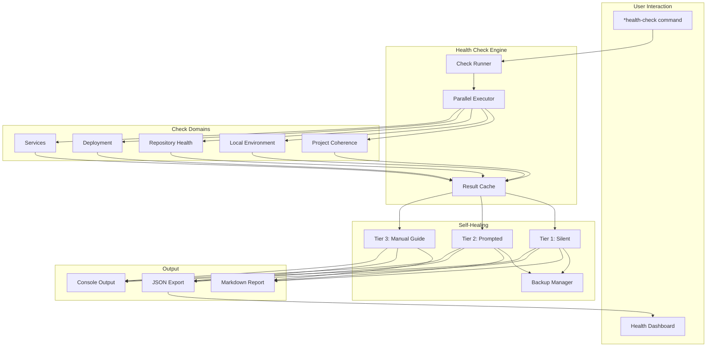
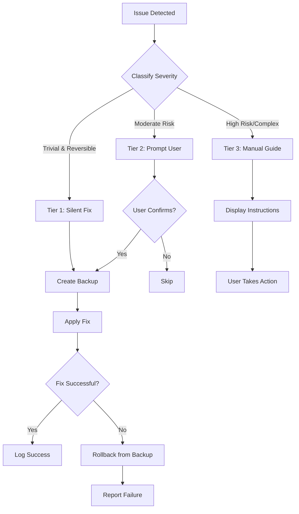
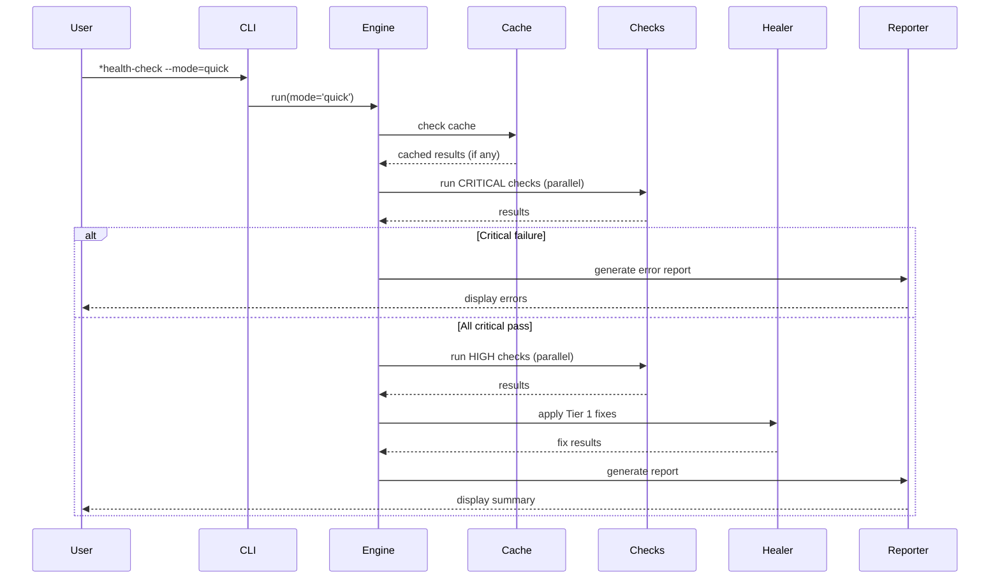

# ADR: Health Check System Architecture

**ADR ID:** ADR-HCS-001
**Status:** Proposed
**Created:** 2025-12-30
**Author:** @architect (Aria) via @dev (Dex)
**Story:** HCS-1 Investigation
**Deciders:** @architect, @po, Tech Lead

---

## Context

AIOS needs a comprehensive health check system to:

1. **Diagnose problems** in project configuration, environment, and integrations
2. **Enable self-healing** for common issues without manual intervention
3. **Track technical debt** by identifying degraded states
4. **Provide visibility** into overall project health through dashboards
5. **Integrate with CI/CD** for continuous health monitoring

### Problem Statement

Currently, developers must manually diagnose issues across multiple domains:

- Framework configuration drift
- Environment misconfigurations
- Broken MCP integrations
- Outdated dependencies with security vulnerabilities
- IDE configuration inconsistencies

This leads to:

- Wasted debugging time
- Inconsistent development environments across team
- Silent failures that manifest later as bugs
- Security vulnerabilities going unnoticed

### Requirements

1. **Execution Modes:** Manual, scheduled CI, post-merge, optional IDE background
2. **Check Domains:** Project coherence, local environment, repository, deployment, services
3. **Self-Healing:** Tiered approach (silent, prompted, manual guide)
4. **Performance:** Quick mode <10s, full mode <60s
5. **Extensibility:** Support for custom project-specific checks
6. **Integration:** Reuse Story 3.11 Quality Dashboard components

---

## Decision

We will implement a **Hybrid Health Check System** with the following architecture:

### Core Architecture Decisions

#### 1. Execution Model: Manual-First with CI Integration

**Decision:** Primary execution is manual (`*health-check` command), with secondary scheduled CI integration.

**Rationale:**

- Follows industry patterns (Flutter doctor, Homebrew doctor, WP-CLI doctor)
- Avoids workflow friction from pre-commit hooks
- Terraform pattern: Detection separate from remediation
- Kubernetes pattern: Continuous monitoring in background

**Alternatives Rejected:**

- Pre-commit hooks: Too slow (10-30s), developers bypass with `--no-verify`
- Always-on background: Complex, performance concerns
- CI-only: No immediate feedback for developers

#### 2. Check Architecture: Hybrid (Code + YAML)

**Decision:** Use code-based checks for core functionality, YAML-based checks for extensibility.

**Rationale:**

- Code provides performance and complex logic capability
- YAML provides easy project-specific customization
- WP-CLI pattern: Core checks + `doctor.yml` custom checks
- VS Code pattern: Core isolation + extension flexibility

**Structure:**

```
.aios-core/core/health-check/
├── checks/           # Core JavaScript checks (33 checks)
│   ├── project/
│   ├── local/
│   ├── repository/
│   ├── deployment/
│   └── services/
└── ...

.aios/
└── custom-checks.yaml  # Project-specific YAML checks
```

**Alternatives Rejected:**

- Pure code-based: Not extensible for project-specific needs
- Pure YAML-based: Limited for complex checks (e.g., npm audit)
- Plugin system: Over-engineered for current needs

#### 3. Self-Healing: Three-Tier Safety Model

**Decision:** Implement three tiers of self-healing with strict safety rules.

**Tiers:**

1. **Tier 1 (Silent):** Safe, reversible, framework-only operations
2. **Tier 2 (Prompted):** Moderate risk, requires user confirmation
3. **Tier 3 (Manual Guide):** High risk, provides instructions only

**Rationale:**

- Terraform pattern: Explicit separation of plan vs apply
- npm pattern: Integrity checks with user-controlled recovery
- VS Code pattern: Auto-update safe things, block dangerous things
- Git pattern: Always preserve history (reflog)

**Safety Rules:**

- Never modify user source code
- Never touch credentials/secrets
- Always create backups before modification
- Never push to remote repositories

**Alternatives Rejected:**

- Two tiers (auto/manual): Missing middle ground for moderate risks
- No auto-fix: Misses opportunity for friction-free fixes
- Aggressive auto-fix: Too risky, could cause data loss

#### 4. Dashboard Integration: Shared Components

**Decision:** Create shared component library extending Story 3.11 Quality Dashboard.

**Rationale:**

- DRY principle: Reuse existing Chart.js, Tailwind setup
- Consistent UX: Same visual language across dashboards
- Faster development: Don't rebuild common components

**Integration Structure:**

```
tools/
├── shared-dashboard/     # Shared components
│   ├── components/
│   │   ├── Card.jsx
│   │   ├── Chart.jsx
│   │   └── StatusBadge.jsx
│   ├── hooks/
│   │   ├── useMetrics.js
│   │   └── useRealTime.js
│   └── styles/
│       └── tailwind-preset.js
├── quality-dashboard/    # Story 3.11
│   └── (extends shared)
└── health-dashboard/     # HCS dashboard
    └── (extends shared)
```

**Alternatives Rejected:**

- Duplicate components: Maintenance burden, inconsistency
- Monolithic dashboard: Too complex, different update cycles
- External library: Overkill for internal tooling

#### 5. Check Prioritization: Fail-Fast Strategy

**Decision:** Run CRITICAL checks first, stop on critical failure in quick mode.

**Rationale:**

- Kubernetes probe pattern: Fail fast on liveness issues
- Performance optimization: Don't run expensive checks if basics fail
- User experience: Quick feedback on blocking issues

**Execution Order:**

1. CRITICAL checks (parallel where possible)
2. HIGH checks
3. MEDIUM checks
4. LOW checks
5. INFO checks (never fail)

**Alternatives Rejected:**

- Run all checks always: Wastes time when basics are broken
- Random order: Inconsistent experience
- Alphabetical: No logical prioritization

---

## Consequences

### Positive

1. **User Control:** Manual-first approach respects developer workflow
2. **Safety:** Three-tier healing prevents accidental damage
3. **Performance:** Parallel execution and caching meet time targets
4. **Extensibility:** YAML custom checks allow project-specific needs
5. **Maintainability:** Shared dashboard components reduce duplication
6. **Industry Alignment:** Follows proven patterns from Kubernetes, Terraform, npm

### Negative

1. **Initial Complexity:** Hybrid architecture requires more initial setup
2. **Documentation Burden:** Three tiers of healing need clear documentation
3. **Custom Check Learning Curve:** Teams need to learn YAML check format
4. **Dashboard Dependency:** Health dashboard blocked by Story 3.11 completion

### Risks

| Risk                        | Probability | Impact | Mitigation                             |
| --------------------------- | ----------- | ------ | -------------------------------------- |
| Self-healing causes damage  | Low         | High   | Strict blocklist, mandatory backups    |
| Performance targets not met | Medium      | Medium | Aggressive caching, parallel execution |
| Custom checks too complex   | Low         | Low    | Provide examples, limit check types    |
| Dashboard scope creep       | Medium      | Medium | Strict shared component boundaries     |

---

## Implementation Plan

### Phase 1: Core Engine (HCS-2, 5h)

- HealthCheckEngine with parallel execution
- 33 core checks across 5 domains
- Result aggregation and scoring

### Phase 2: Self-Healing (HCS-2, 4h)

- Backup manager
- Tier 1, 2, 3 healers
- Healing log persistence

### Phase 3: Reporting (HCS-2, 3h)

- Markdown report generator
- JSON export for dashboard
- Console summary output

### Phase 4: Dashboard (HCS-2, 4h)

- Shared component extraction from Story 3.11
- Health-specific components (DomainCard, HealthScore)
- Dashboard integration

### Phase 5: CI Integration (HCS-3, future)

- GitHub Actions workflow
- Scheduled health monitoring
- Slack/email notifications

---

## Alternatives Considered

### Alternative 1: Pre-commit Hook Based

**Description:** Run health check on every commit via pre-commit hook.

**Pros:**

- Catches issues immediately
- Enforces team-wide standards

**Cons:**

- 10-30 second delay on every commit
- Developers bypass with `--no-verify`
- Creates workflow friction

**Verdict:** ❌ Rejected - Too much friction

### Alternative 2: Pure Plugin Architecture

**Description:** All checks as loadable plugins (like ESLint rules).

**Pros:**

- Maximum extensibility
- Easy to add/remove checks
- Third-party check ecosystem

**Cons:**

- Over-engineered for current needs
- Plugin compatibility issues
- Higher maintenance burden

**Verdict:** ❌ Rejected - Over-engineering

### Alternative 3: Real-time IDE Integration Only

**Description:** Health check only runs as IDE extension/background process.

**Pros:**

- Real-time feedback
- No manual command needed

**Cons:**

- Complex to implement across IDEs
- Performance impact concerns
- No CI integration
- Not all developers use supported IDEs

**Verdict:** ❌ Rejected - Too limiting, complex

### Alternative 4: External Tool (doctor.js)

**Description:** Use existing open-source health check framework.

**Pros:**

- No development needed
- Community support

**Cons:**

- No AIOS-specific checks
- Limited self-healing capabilities
- Dependency on external project

**Verdict:** ❌ Rejected - Doesn't meet AIOS-specific requirements

---

## References

### Industry Research Sources

1. **Kubernetes Health Probes**
   - [Liveness, Readiness, and Startup Probes](https://kubernetes.io/docs/concepts/configuration/liveness-readiness-startup-probes/)
   - Key insight: Differentiate between "alive" and "ready to serve"

2. **Terraform Drift Detection**
   - [Detecting and Managing Drift](https://developer.hashicorp.com/terraform/tutorials/state/resource-drift)
   - Key insight: Separate detection from remediation

3. **VS Code Extension Health**
   - [Extension Bisect](https://code.visualstudio.com/blogs/2021/02/16/extension-bisect)
   - Key insight: Isolation prevents cascading failures

4. **npm/yarn Integrity**
   - [Lockfile Integrity](https://medium.com/node-js-cybersecurity/lockfile-poisoning-and-how-hashes-verify-integrity-in-node-js-lockfiles)
   - Key insight: Cryptographic verification with user-controlled recovery

5. **CLI Doctor Patterns**
   - [Flutter Doctor](https://quickcoder.org/flutter-doctor/)
   - [WP-CLI Doctor](https://github.com/wp-cli/doctor-command)
   - Key insight: Categorized output with actionable fixes

### Internal References

- [Story 3.11: Quality Gates Dashboard](../stories/v2.1/sprint-3/story-3.11-quality-gates-dashboard.md)
- [Story HCS-1: Investigation](../stories/epics/epic-health-check-system/story-hcs-1-investigation.md)
- [Story HCS-2: Implementation](../stories/epics/epic-health-check-system/story-hcs-2-implementation.md)
- [Coding Standards](../framework/coding-standards.md)

---

## Decision Record

| Date       | Decision                      | Author              |
| ---------- | ----------------------------- | ------------------- |
| 2025-12-30 | Initial architecture proposal | @architect via @dev |

---

## Appendix: Architecture Diagrams

### System Overview



### Self-Healing Flow



### Check Execution



---

_This ADR was created as part of Story HCS-1 Investigation_
