# MCP System Global - Architecture Diagrams

**Story:** 2.11 - MCP System Global
**Generated by:** CodeRabbit (PR #16)
**Date:** 2025-12-01

---

## MCP Setup Flow

```mermaid
sequenceDiagram
    actor User
    participant CLI as CLI<br/>(mcp setup)
    participant Mgr as Config<br/>Manager
    participant FS as Filesystem
    participant Detector as OS<br/>Detector

    User->>CLI: mcp setup [--servers]
    CLI->>Detector: getGlobalMcpDir()
    Detector-->>CLI: ~home/.aios/mcp
    CLI->>Mgr: createGlobalStructure()
    Mgr->>FS: mkdir ~/.aios/mcp/servers
    Mgr->>FS: mkdir ~/.aios/mcp/cache
    Mgr->>FS: touch .gitignore
    FS-->>Mgr: created
    CLI->>Mgr: createGlobalConfig(servers)
    Mgr->>Mgr: getServerTemplate(name)
    Mgr->>FS: write config.json
    FS-->>Mgr: success
    Mgr-->>CLI: config created
    CLI-->>User: ✓ Global MCP configured
```

---

## MCP Link Flow (with Migration)

```mermaid
sequenceDiagram
    actor User
    participant CLI as CLI<br/>(mcp link)
    participant Symlink as Symlink<br/>Manager
    participant Migrator as Config<br/>Migrator
    participant Mgr as Config<br/>Manager
    participant FS as Filesystem

    User->>CLI: mcp link [--migrate]
    CLI->>Symlink: checkLinkStatus(projectRoot)
    Symlink->>FS: check ./mcp exists
    FS-->>Symlink: not_linked
    alt --migrate flag set
        CLI->>Migrator: analyzeMigration()
        Migrator->>FS: detect ./mcp config
        FS-->>Migrator: project config found
        Migrator-->>CLI: { recommendedOption: MIGRATE }
        CLI->>Migrator: executeMigration(MIGRATE)
        Migrator->>Mgr: readGlobalConfig()
        Migrator->>Mgr: mergeServers(global, project)
        Migrator->>Mgr: writeGlobalConfig(merged)
        Mgr-->>Migrator: success
    end
    CLI->>Symlink: createLink(projectRoot)
    Symlink->>FS: create symlink/junction ./mcp → ~/.aios/mcp
    FS-->>Symlink: linked
    Symlink-->>CLI: success
    CLI-->>User: ✓ Project linked to global config
```

---

## Components Overview

### Core Modules

| Module | File | Purpose |
|--------|------|---------|
| **OS Detector** | `core/mcp/os-detector.js` | Cross-platform OS/path detection |
| **Config Manager** | `core/mcp/global-config-manager.js` | Global config CRUD and server templates |
| **Symlink Manager** | `core/mcp/symlink-manager.js` | Symlink/junction link management |
| **Config Migrator** | `core/mcp/config-migrator.js` | Project-to-global migration with merging |

### CLI Commands

| Command | File | Purpose |
|---------|------|---------|
| `mcp setup` | `cli/commands/mcp/setup.js` | Setup global config |
| `mcp link` | `cli/commands/mcp/link.js` | Link project to global |
| `mcp status` | `cli/commands/mcp/status.js` | Show config status |
| `mcp add` | `cli/commands/mcp/add.js` | Add/remove/enable servers |

---

## Complexity Analysis (CodeRabbit)

| Component | Complexity | Key Areas |
|-----------|------------|-----------|
| **config-migrator.js** | High | Multi-path migration logic, server merging, conflict resolution |
| **symlink-manager.js** | Medium | Cross-platform links (symlinks Unix, junctions Windows) |
| **global-config-manager.js** | Medium | Server template system with per-server persistence |
| **CLI orchestration** | Medium | Multi-step validation, user prompting |

**Estimated Review Effort:** 🎯 4 (Complex) | ⏱️ ~60 minutes

---

*Generated from CodeRabbit PR review - Story 2.11*
