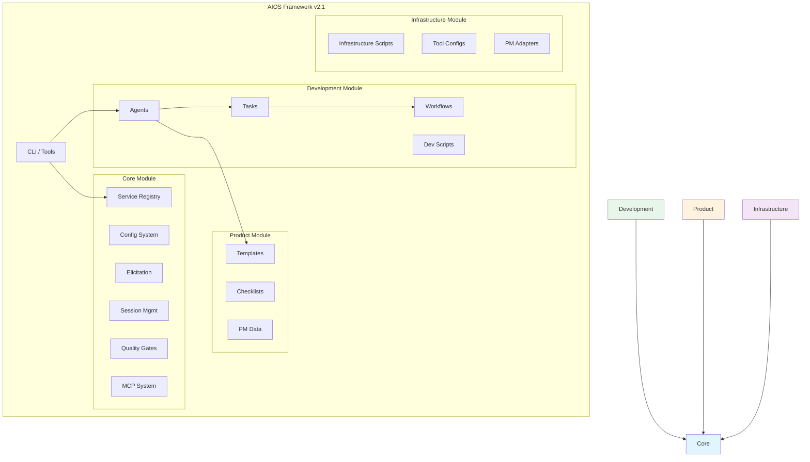
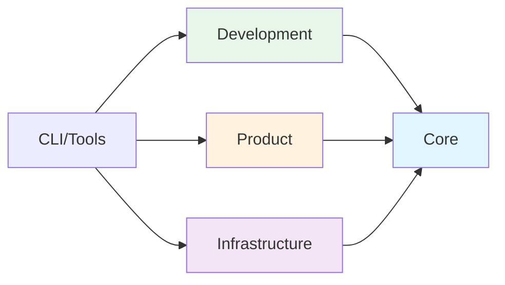

# AIOS Module System Architecture

> Comprehensive guide to the v2.1 modular architecture for Synkra AIOS.

**Version:** 2.1.0
**Last Updated:** 2025-12-01
**Story:** [2.16 - Documentation Sprint 2](../stories/v2.1/sprint-2/story-2.16-documentation.md)

---

## Overview

### Why Modular Architecture?

The v2.1 modular architecture addresses several challenges from the v2.0 flat structure:

| Challenge | v2.0 Problem | v2.1 Solution |
|-----------|--------------|---------------|
| **Discoverability** | 200+ files in mixed directories | Organized by responsibility |
| **Maintenance** | Unclear ownership | Module boundaries define ownership |
| **Dependencies** | Implicit, circular | Explicit, one-way dependencies |
| **Scalability** | All files loaded always | Lazy loading by module |
| **Testing** | Full system tests only | Module-level isolation |

### Design Principles

1. **Single Responsibility** - Each module has one clear purpose
2. **Explicit Dependencies** - Modules declare what they need
3. **Loose Coupling** - Changes in one module don't cascade
4. **High Cohesion** - Related functionality stays together
5. **Lazy Loading** - Load only what's needed

---

## Module Structure

Synkra AIOS organizes the `.aios-core/` directory into four primary modules:

```
.aios-core/
├── core/              # Framework foundations
├── development/       # Development artifacts
├── product/           # User-facing templates
└── infrastructure/    # System configuration
```

### Module Diagram



---

## Core Module

**Path:** `.aios-core/core/`
**Purpose:** Framework foundations - configuration, session, elicitation, and essential runtime components.

### Contents

| Directory | Contents | Description |
|-----------|----------|-------------|
| `config/` | `config-cache.js`, `config-loader.js` | Configuration management with TTL caching |
| `data/` | `aios-kb.md`, `workflow-patterns.yaml` | Framework knowledge base |
| `docs/` | Internal documentation | Component guides, troubleshooting |
| `elicitation/` | `elicitation-engine.js`, `session-manager.js` | Interactive prompting system |
| `session/` | `context-detector.js`, `context-loader.js` | Session context management |
| `utils/` | `output-formatter.js`, `yaml-validator.js` | Common utilities |
| `registry/` | `service-registry.json`, `registry-loader.js` | Service discovery system |
| `quality-gates/` | `quality-gate-manager.js`, layer configs | 3-layer quality gate system |
| `mcp/` | `global-config-manager.js`, `os-detector.js` | MCP global configuration |
| `manifest/` | `manifest-generator.js`, `manifest-validator.js` | Project manifest system |
| `migration/` | `migration-config.yaml`, `module-mapping.yaml` | Migration configuration |

### Key APIs

```javascript
// Configuration
const { loadAgentConfig, globalConfigCache } = require('./.aios-core/core');

// Session
const { ContextDetector, SessionContextLoader } = require('./.aios-core/core');

// Elicitation
const { ElicitationEngine, ElicitationSessionManager } = require('./.aios-core/core');

// Registry
const { getRegistry, loadRegistry } = require('./.aios-core/core/registry/registry-loader');

// Quality Gates
const QualityGateManager = require('./.aios-core/core/quality-gates/quality-gate-manager');
```

### Dependencies

- **External:** `js-yaml`, `fs-extra`
- **Internal:** None (foundation module)

---

## Development Module

**Path:** `.aios-core/development/`
**Purpose:** Agent-related assets - agent definitions, tasks, workflows, and development scripts.

### Contents

| Directory | Contents | Description |
|-----------|----------|-------------|
| `agents/` | 11 agent definitions | `dev.md`, `qa.md`, `architect.md`, etc. |
| `agent-teams/` | 5 team configurations | Pre-defined agent groups |
| `tasks/` | 115+ task definitions | Executable task workflows |
| `workflows/` | 7 workflow definitions | Multi-step development workflows |
| `scripts/` | 24 scripts | Agent support utilities |

### Agents

| Agent | ID | Responsibility |
|-------|-----|---------------|
| AIOS Master | `aios-master` | Framework orchestration |
| Developer | `dev` | Code implementation |
| QA | `qa` | Quality assurance |
| Architect | `architect` | Technical architecture |
| Product Owner | `po` | Product backlog |
| Product Manager | `pm` | Product strategy |
| Scrum Master | `sm` | Process facilitation |
| Analyst | `analyst` | Business analysis |
| Data Engineer | `data-engineer` | Data engineering |
| DevOps | `devops` | CI/CD and operations |
| UX Expert | `ux-design-expert` | User experience |

### Agent Teams

| Team | Agents | Use Case |
|------|--------|----------|
| `team-all` | All 11 agents | Full development team |
| `team-fullstack` | dev, qa, architect, devops | Full-stack projects |
| `team-ide-minimal` | dev, qa | Minimal IDE setup |
| `team-no-ui` | dev, architect, devops, data-engineer | Backend/API projects |
| `team-qa-focused` | qa, dev, architect | Quality-focused work |

### Dependencies

- **Internal:** `core/` (configuration, session, elicitation)

---

## Product Module

**Path:** `.aios-core/product/`
**Purpose:** PM/PO assets - templates, checklists, and reference data for document generation.

### Contents

| Directory | Contents | Description |
|-----------|----------|-------------|
| `templates/` | 52+ templates | PRDs, stories, architectures, IDE rules |
| `checklists/` | 11 checklists | Quality validation checklists |
| `data/` | 6 data files | PM knowledge base and reference |

### Key Templates

| Template | Purpose |
|----------|---------|
| `story-tmpl.yaml` | Story template v2.0 |
| `prd-tmpl.yaml` | Product Requirements Document |
| `architecture-tmpl.yaml` | Architecture documentation |
| `qa-gate-tmpl.yaml` | Quality gate template |
| `ide-rules/` | 9 IDE-specific rule files |

### Checklists

- `architect-checklist.md` - Architecture review
- `pm-checklist.md` - PM validation
- `po-master-checklist.md` - PO master validation
- `story-dod-checklist.md` - Story Definition of Done
- `pre-push-checklist.md` - Pre-push validation
- `release-checklist.md` - Release validation

### Dependencies

- **Internal:** `core/` (template engine, validators)
- **External:** None (static assets)

---

## Infrastructure Module

**Path:** `.aios-core/infrastructure/`
**Purpose:** System configuration - scripts, tools, and external integrations.

### Contents

| Directory | Contents | Description |
|-----------|----------|-------------|
| `scripts/` | 55+ scripts | Infrastructure utilities |
| `tools/` | Tool configurations | CLI, MCP, local tool configs |
| `integrations/` | PM adapters | ClickUp, Jira, GitHub adapters |
| `tests/` | Module tests | Infrastructure validation |

### Key Scripts

| Script | Purpose |
|--------|---------|
| `git-wrapper.js` | Git operations wrapper |
| `backup-manager.js` | Backup/restore system |
| `template-engine.js` | Template processing |
| `security-checker.js` | Security validation |
| `performance-analyzer.js` | Performance analysis |

### Tool Configurations

```
tools/
├── cli/           # CLI tool configs (gh, railway, supabase)
├── mcp/           # MCP server configs
└── local/         # Local tool configs
```

### Dependencies

- **Internal:** `core/` (configuration, utilities)
- **External:** Various tool APIs

---

## Module Boundaries

### Dependency Rules



**Rules:**
1. `core/` has no internal dependencies
2. `development/`, `product/`, `infrastructure/` depend only on `core/`
3. No circular dependencies allowed
4. CLI/tools can access any module

### Inter-Module Communication

Modules communicate through:

1. **Service Registry** - Discover available workers and services
2. **Configuration System** - Share settings and preferences
3. **Event System** - Publish/subscribe for loose coupling
4. **File System** - Shared data directories

### Module Boundaries Checklist

When adding new functionality:

- [ ] Does it belong to an existing module?
- [ ] Does it introduce new dependencies?
- [ ] Does it maintain one-way dependency flow?
- [ ] Is it cohesive with module purpose?
- [ ] Can it be tested in isolation?

---

## File Organization

### Naming Conventions

| Type | Convention | Example |
|------|------------|---------|
| Scripts | `kebab-case.js` | `config-loader.js` |
| Agents | `agent-id.md` | `dev.md`, `qa.md` |
| Tasks | `agent-prefix-task-name.md` | `dev-develop-story.md` |
| Templates | `name-tmpl.yaml` | `story-tmpl.yaml` |
| Checklists | `name-checklist.md` | `pre-push-checklist.md` |

### Adding New Files

| File Type | Location | Module |
|-----------|----------|--------|
| Agent definition | `development/agents/` | Development |
| Task definition | `development/tasks/` | Development |
| Workflow | `development/workflows/` | Development |
| Template | `product/templates/` | Product |
| Checklist | `product/checklists/` | Product |
| Utility script | `infrastructure/scripts/` | Infrastructure |
| Config loader | `core/config/` | Core |
| Registry | `core/registry/` | Core |

---

## Migration from v2.0

For projects upgrading from v2.0 flat structure:

```bash
# Dry run to preview changes
aios migrate --dry-run

# Execute migration
aios migrate --from=2.0 --to=2.1

# Validate migration
aios migrate --validate
```

See [Migration Guide](../migration/v2.0-to-v2.1.md) for detailed instructions.

---

## Related Documentation

- [Service Discovery Guide](../guides/service-discovery.md)
- [Quality Gates Guide](../guides/quality-gates.md)
- [MCP Global Setup Guide](../guides/mcp-global-setup.md)
- [Migration Guide](../migration/v2.0-to-v2.1.md)
- [ADR-002: Modular Architecture](decisions/ADR-002-migration-map.md)

---

*Synkra AIOS v2.1 Module System Architecture*
