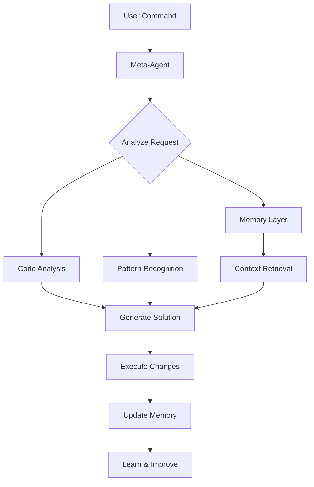

# Getting Started with Synkra AIOS

Welcome to Synkra AIOS! This guide will walk you through your first steps with the AI-powered self-modifying development framework.

## Table of Contents

1. [Installation](#installation)
2. [Your First Project](#your-first-project)
3. [Understanding the Meta-Agent](#understanding-the-meta-agent)
4. [Basic Commands](#basic-commands)
5. [Creating Your First Agent](#creating-your-first-agent)
6. [Working with Tasks](#working-with-tasks)
7. [Memory Layer Basics](#memory-layer-basics)
8. [Best Practices](#best-practices)
9. [Common Patterns](#common-patterns)
10. [Next Steps](#next-steps)

## Installation

### Prerequisites

Before installing Synkra AIOS, ensure you have:

- **Node.js** version 14.0.0 or higher
- **npm** version 6.0.0 or higher
- **Git** (optional, but recommended)
- At least **1GB** of free disk space

### Quick Installation

The fastest way to get started is using npx:

```bash
# Create a new project
npx @synkra/aios-core init my-first-project

# Navigate to your project
cd my-first-project

# Start the meta-agent
npx @synkra/aios-core
```

### Installation Options

Synkra AIOS offers flexible installation options:

```bash
# 1. Create new project with custom template
npx @synkra/aios-core init my-project --template enterprise

# 2. Install in existing project
cd existing-project
npx @synkra/aios-core install

# 3. Force installation in non-empty directory
npx @synkra/aios-core init my-project --force

# 4. Skip dependency installation (manual install later)
npx @synkra/aios-core init my-project --skip-install
```

## Your First Project

### Project Structure

After installation, your project will have this structure:

```
my-first-project/
├── .aios/                    # Framework configuration
│   ├── config.json          # Main configuration file
│   ├── memory-config.json   # Memory layer settings
│   ├── cache/              # Performance cache
│   └── logs/               # System logs
├── agents/                  # AI agents directory
│   └── sample-agent.yaml   # Example agent
├── components/             # Application components
├── workflows/              # Automated workflows
├── tasks/                  # Reusable tasks
├── tests/                  # Test suites
├── .env                    # Environment variables
└── package.json           # Project dependencies
```

### Configuration

The main configuration file (`.aios/config.json`) contains:

```json
{
  "version": "1.0.0",
  "projectName": "my-first-project",
  "features": [
    "meta-agent",
    "memory-layer",
    "self-modification",
    "telemetry"
  ],
  "ai": {
    "provider": "openai",
    "model": "gpt-4"
  },
  "environment": "development"
}
```

### Environment Setup

Configure your AI provider in the `.env` file:

```env
# AI Provider Configuration
OPENAI_API_KEY=your-openai-api-key
# or
ANTHROPIC_API_KEY=your-anthropic-api-key

# Framework Settings
NODE_ENV=development
AIOS_TELEMETRY=enabled
```

## Understanding the Meta-Agent

The meta-agent is the core of Synkra AIOS - an AI that understands and can modify its own codebase.

### Key Capabilities

1. **Self-Analysis**: Examines its own code structure
2. **Code Generation**: Creates optimized components
3. **Pattern Learning**: Learns from your development style
4. **Auto-Evolution**: Improves based on usage
5. **Smart Refactoring**: Suggests and implements improvements

### How It Works



## Basic Commands

### Starting the Meta-Agent

```bash
# Start in current directory
npx @synkra/aios-core

# Or use the shorthand
npx aios
```

### Essential Commands

Once the meta-agent is running, use these commands:

```bash
# Help and Information
*help                    # Show all available commands
*status                  # Display system status
*config                  # View current configuration

# Agent Management
*list-agents             # Show all available agents
*activate <agent-name>   # Activate specific agent
*deactivate <agent-name> # Deactivate agent

# Basic Operations
*analyze                 # Analyze current codebase
*suggest                 # Get improvement suggestions
*learn                   # Learn from recent changes
```

## Creating Your First Agent

### Step 1: Use the Creation Command

```bash
*create-agent my-helper
```

The meta-agent will guide you through the creation process:

1. **Name**: Choose a descriptive name
2. **Type**: Select agent type (assistant, analyzer, generator)
3. **Capabilities**: Define what the agent can do
4. **Instructions**: Provide behavioral guidelines

### Step 2: Agent Definition

The meta-agent will create a YAML file like this:

```yaml
# agents/my-helper.yaml
name: my-helper
version: 1.0.0
description: A helpful assistant for daily tasks
type: assistant

capabilities:
  - name: summarize
    description: Summarize text content
    parameters:
      - name: text
        type: string
        required: true
      - name: maxLength
        type: number
        required: false
        default: 100

  - name: translate
    description: Translate text between languages
    parameters:
      - name: text
        type: string
        required: true
      - name: targetLanguage
        type: string
        required: true

instructions: |
  You are a helpful assistant that summarizes and translates text.
  Be concise, accurate, and maintain the original meaning.
  
examples:
  - input: "*my-helper summarize 'Long text here...'"
    output: "Summary: Key points from the text"
  
  - input: "*my-helper translate 'Hello' --targetLanguage spanish"
    output: "Translation: Hola"
```

### Step 3: Test Your Agent

```bash
# Activate the agent
*activate my-helper

# Test summarization
*my-helper summarize "This is a long text that needs summarization..."

# Test translation
*my-helper translate "Hello world" --targetLanguage french
```

## Working with Tasks

Tasks are reusable operations that agents can perform.

### Creating a Task

```bash
*create-task data-processor
```

This creates a task template:

```markdown
# tasks/data-processor.md

## Purpose
Process and transform data according to specifications

## Command Pattern
```
*data-processor <input> [options]
```

## Parameters
- `input`: Data to process
- `--format`: Output format (json, csv, xml)
- `--transform`: Transformation type

## Implementation
```javascript
class DataProcessor {
  async execute(params) {
    const { input, format = 'json', transform } = params;
    
    // Processing logic here
    let processed = this.transform(input, transform);
    
    return this.format(processed, format);
  }
}
```
```

### Using Tasks in Workflows

```yaml
# workflows/data-pipeline.yaml
name: data-pipeline
description: Automated data processing pipeline

triggers:
  - type: schedule
    cron: "0 */6 * * *"  # Every 6 hours

steps:
  - task: fetch-data
    params:
      source: "api/endpoint"
  
  - task: data-processor
    params:
      transform: "normalize"
      format: "json"
  
  - task: save-results
    params:
      destination: "processed/data"
```

## Memory Layer Basics

The memory layer powered by LlamaIndex provides intelligent context management.

### How Memory Works

1. **Indexing**: All code and documentation is indexed
2. **Semantic Search**: Find code by meaning, not just keywords
3. **Context Building**: Relevant context is retrieved for each operation
4. **Learning**: Patterns and preferences are remembered

### Memory Commands

```bash
# Memory operations
*memory status          # Check memory layer status
*memory search <query>  # Search semantic memory
*memory clear-cache     # Clear memory cache
*memory rebuild         # Rebuild memory index
```

### Example: Semantic Search

```bash
# Traditional search (keyword-based)
*search "getUserData"

# Semantic search (meaning-based)
*memory search "function that retrieves user information from database"
```

## Best Practices

### 1. Start Small

Begin with simple tasks and agents before creating complex systems:

```bash
# Good: Start with focused agents
*create-agent code-formatter
*create-agent test-generator

# Avoid: Overly complex initial agents
*create-agent do-everything-ai
```

### 2. Use Descriptive Names

Choose clear, descriptive names for agents and tasks:

```bash
# Good naming
*create-agent api-endpoint-validator
*create-task validate-user-input

# Poor naming
*create-agent helper1
*create-task task123
```

### 3. Leverage the Memory Layer

Let the meta-agent learn from your patterns:

```bash
# After making changes
*learn --from recent-changes

# Before starting new feature
*suggest --based-on similar-features
```

### 4. Regular Analysis

Periodically analyze your codebase:

```bash
# Weekly analysis
*analyze-framework --depth full

# Quick daily check
*analyze-framework --depth surface
```

### 5. Document Your Agents

Always provide clear instructions and examples:

```yaml
# Good agent documentation
instructions: |
  This agent validates API responses against OpenAPI schemas.
  It checks for:
  - Required fields presence
  - Data type correctness
  - Format compliance
  - Business rule validation

examples:
  - input: "*validate-api POST /users response"
    output: "✓ All validations passed"
```

## Common Patterns

### Pattern 1: Component Generation

```bash
# Generate a new React component
*create-component Dashboard --type react --features "charts,filters,export"

# The meta-agent will:
# 1. Analyze existing components
# 2. Apply consistent patterns
# 3. Generate optimized code
# 4. Create tests
# 5. Update documentation
```

### Pattern 2: Code Quality Improvement

```bash
# Improve specific file
*improve-code-quality src/services/api.js

# Improve entire module
*improve-code-quality src/services/ --recursive

# Get suggestions first
*suggest-improvements src/services/api.js
```

### Pattern 3: Test Generation

```bash
# Generate tests for a component
*generate-tests src/components/UserProfile.js

# Generate integration tests
*generate-tests src/api/ --type integration

# Generate based on usage patterns
*generate-tests --from-usage-analysis
```

### Pattern 4: Documentation

```bash
# Document a module
*document src/utils/

# Generate API documentation
*generate-api-docs src/api/

# Create user guide
*create-documentation --type user-guide
```

## Next Steps

### Immediate Actions

1. **Configure AI Provider**: Set up your API keys in `.env`
2. **Run First Analysis**: Execute `*analyze-framework`
3. **Create Custom Agent**: Design an agent for your specific needs
4. **Explore Examples**: Check the `examples/` directory

### Learning Resources

- **[Meta-Agent Commands Reference](./meta-agent-commands.md)**: Complete command list
- **[Architecture Overview](./architecture.md)**: Technical deep dive
- **[Troubleshooting Guide](./troubleshooting.md)**: Common issues and solutions
- **[Video Tutorials](https://@synkra/aios-core.dev/tutorials)**: Visual learning

### Advanced Topics

Once comfortable with basics, explore:

1. **Custom Workflows**: Automate complex processes
2. **Plugin Development**: Extend framework capabilities
3. **Performance Optimization**: Tune for your use case
4. **Team Collaboration**: Multi-developer workflows

### Community

Join our community for support and updates:

- **Discord**: [Join our server](https://discord.gg/gk8jAdXWmj)
- **GitHub Discussions**: Share ideas and get help
- **Twitter**: Follow [@aiosfullstack](https://twitter.com/aiosfullstack)

## Troubleshooting Quick Reference

### Common Issues

**Meta-agent won't start**
```bash
# Check Node.js version
node --version  # Should be >= 14.0.0

# Verify installation
npx @synkra/aios-core doctor

# Fix common issues
npx @synkra/aios-core doctor --fix
```

**API Key errors**
```bash
# Verify .env file exists
ls -la .env

# Check key format
# Should be: OPENAI_API_KEY=sk-...
```

**Memory layer issues**
```bash
# Rebuild index
*memory rebuild

# Check status
*memory status

# Clear and rebuild
*memory clear-cache && *memory rebuild
```

---

**Ready to build something amazing?** The meta-agent is waiting to help you create, improve, and evolve your code. Start with `*help` and explore the possibilities!

Remember: Synkra AIOS learns and improves with use. The more you interact with it, the better it understands your development style and needs.

Happy coding with Synkra AIOS! 🚀