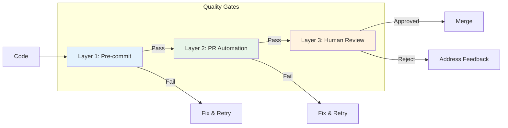

# AIOS Quality Gate System Guide

> Comprehensive guide to the 3-layer quality gate system for Synkra AIOS.

**Version:** 2.1.0
**Last Updated:** 2025-12-01
**Story:** [2.16 - Documentation Sprint 2](../stories/v2.1/sprint-2/story-2.16-documentation.md)

---

## Overview

The AIOS Quality Gate System provides automated quality assurance through three progressive layers of validation. Each layer catches different types of issues at the appropriate stage of development.

### The 3-Layer Architecture



| Layer | Type | Speed | Purpose |
|-------|------|-------|---------|
| **Layer 1** | Automated | ~30s | Catch syntax, linting, type errors |
| **Layer 2** | AI-Assisted | ~5m | Catch logic, security, patterns |
| **Layer 3** | Human | Variable | Strategic review, sign-off |

---

## Layer 1: Pre-commit Checks

### Purpose
Fast, local checks that run before code is committed. Catches obvious issues immediately.

### Checks Included

| Check | Tool | Timeout | Description |
|-------|------|---------|-------------|
| **Lint** | ESLint | 60s | Code style and best practices |
| **Test** | Jest | 5m | Unit tests with coverage |
| **TypeCheck** | TypeScript | 2m | Static type validation |

### Configuration

```yaml
# .aios-core/core/quality-gates/quality-gate-config.yaml
layer1:
  enabled: true
  failFast: true  # Stop on first failure
  checks:
    lint:
      enabled: true
      command: "npm run lint"
      failOn: "error"  # error | warning
      timeout: 60000   # 1 minute
    test:
      enabled: true
      command: "npm test"
      timeout: 300000  # 5 minutes
      coverage:
        enabled: true
        minimum: 80
    typecheck:
      enabled: true
      command: "npm run typecheck"
      timeout: 120000  # 2 minutes
```

### Running Layer 1

```bash
# Run all Layer 1 checks
aios qa run --layer=1

# Run specific check
aios qa run --layer=1 --check=lint
aios qa run --layer=1 --check=test
aios qa run --layer=1 --check=typecheck

# Run with verbose output
aios qa run --layer=1 --verbose
```

### Expected Output

```
Layer 1: Pre-commit Checks
==========================

[1/3] Lint Check
  Running: npm run lint
  ✓ Passed (12.3s)
  No warnings or errors

[2/3] Test Check
  Running: npm test
  ✓ Passed (45.2s)
  Coverage: 87.3% (minimum: 80%)

[3/3] TypeCheck
  Running: npm run typecheck
  ✓ Passed (28.1s)
  0 errors

LAYER 1 PASSED (85.6s)
```

---

## Layer 2: PR Automation

### Purpose
AI-assisted code review that runs on pull requests. Catches deeper issues like logic errors, security vulnerabilities, and architectural problems.

### Tools Integrated

| Tool | Purpose | Blocking Severity |
|------|---------|-------------------|
| **CodeRabbit** | AI code review | CRITICAL |
| **Quinn (@qa)** | Automated QA review | CRITICAL |

### Configuration

```yaml
# .aios-core/core/quality-gates/quality-gate-config.yaml
layer2:
  enabled: true
  coderabbit:
    enabled: true
    command: "coderabbit --prompt-only -t uncommitted"
    timeout: 900000  # 15 minutes
    blockOn:
      - CRITICAL
    warnOn:
      - HIGH
    documentOn:
      - MEDIUM
    ignoreOn:
      - LOW
  quinn:
    enabled: true
    autoReview: true
    agentPath: ".claude/commands/AIOS/agents/qa.md"
    severity:
      block: ["CRITICAL"]
      warn: ["HIGH", "MEDIUM"]
```

### Running Layer 2

```bash
# Run all Layer 2 checks
aios qa run --layer=2

# Run CodeRabbit only
aios qa run --layer=2 --tool=coderabbit

# Run Quinn (@qa) review
aios qa run --layer=2 --tool=quinn
```

### Severity Levels

| Severity | Action | Description |
|----------|--------|-------------|
| **CRITICAL** | Block | Security vulnerability, data loss risk, breaking change |
| **HIGH** | Warn + Document | Performance issue, missing validation, anti-pattern |
| **MEDIUM** | Document | Code smell, improvement suggestion, minor risk |
| **LOW** | Ignore | Style preference, minor optimization |

### CodeRabbit Integration

CodeRabbit performs AI-powered code review with these focus areas:

- Security vulnerabilities
- Performance issues
- Code quality and maintainability
- Best practices violations
- Documentation completeness

```bash
# Manual CodeRabbit run
coderabbit --prompt-only -t uncommitted

# With specific paths
coderabbit --files "src/**/*.js" --prompt-only
```

### Quinn (@qa) Integration

The QA agent performs automated review focused on:

- Test coverage adequacy
- Edge case handling
- Error handling completeness
- Acceptance criteria validation

```javascript
// Programmatic Quinn invocation
const QualityGateManager = require('./.aios-core/core/quality-gates/quality-gate-manager');
const manager = new QualityGateManager();
const result = await manager.runQuinnReview(pullRequestId);
```

---

## Layer 3: Human Review

### Purpose
Strategic human review for final sign-off. Ensures business requirements are met and architectural decisions are sound.

### Configuration

```yaml
# .aios-core/core/quality-gates/quality-gate-config.yaml
layer3:
  enabled: true
  requireSignoff: true
  assignmentStrategy: "auto"  # auto | manual | round-robin
  defaultReviewer: "@architect"
  checklist:
    enabled: true
    template: "strategic-review-checklist"
    minItems: 5
  signoff:
    required: true
    expiry: 86400000  # 24 hours in ms
```

### Assignment Strategies

| Strategy | Description |
|----------|-------------|
| **auto** | Assign based on file ownership and expertise |
| **manual** | Manually assign reviewer |
| **round-robin** | Rotate through team members |

### Review Checklist

The strategic review checklist ensures reviewers cover key areas:

```markdown
## Strategic Review Checklist

### Architecture
- [ ] Changes align with system architecture
- [ ] No unauthorized dependencies introduced
- [ ] Backwards compatibility maintained

### Security
- [ ] No sensitive data exposed
- [ ] Input validation present
- [ ] Authentication/authorization correct

### Quality
- [ ] Code is maintainable and readable
- [ ] Tests are comprehensive
- [ ] Documentation updated

### Business
- [ ] Acceptance criteria met
- [ ] User experience considered
- [ ] Performance acceptable
```

### Sign-off Process

```bash
# Request human review
aios qa request-review --pr=123

# Sign off on review
aios qa signoff --pr=123 --reviewer="@architect"

# Check sign-off status
aios qa signoff-status --pr=123
```

---

## CLI Commands

### `aios qa run`

Run quality gate checks.

```bash
# Run all layers sequentially
aios qa run

# Run specific layer
aios qa run --layer=1
aios qa run --layer=2
aios qa run --layer=3

# Run with options
aios qa run --verbose          # Detailed output
aios qa run --fail-fast        # Stop on first failure
aios qa run --continue-on-fail # Continue despite failures
```

### `aios qa status`

Check current quality gate status.

```bash
# Get overall status
aios qa status

# Get status for specific layer
aios qa status --layer=1

# Get status for PR
aios qa status --pr=123
```

**Output:**
```
Quality Gate Status
===================

Layer 1: Pre-commit
  Lint:      ✓ Passed
  Test:      ✓ Passed (87.3% coverage)
  TypeCheck: ✓ Passed

Layer 2: PR Automation
  CodeRabbit: ✓ Passed (0 critical, 2 medium)
  Quinn:      ✓ Passed

Layer 3: Human Review
  Status:    Pending
  Assigned:  @architect
  Expires:   2025-12-02 12:00:00

Overall: PENDING REVIEW
```

### `aios qa report`

Generate quality gate report.

```bash
# Generate report
aios qa report

# Export to file
aios qa report --output=qa-report.json
aios qa report --format=markdown --output=qa-report.md
```

### `aios qa configure`

Configure quality gate settings.

```bash
# Interactive configuration
aios qa configure

# Set specific options
aios qa configure --layer1.coverage.minimum=90
aios qa configure --layer2.coderabbit.enabled=false
aios qa configure --layer3.requireSignoff=true
```

---

## CI/CD Integration

### GitHub Actions

```yaml
# .github/workflows/quality-gate.yml
name: Quality Gate

on:
  pull_request:
    branches: [main, develop]

jobs:
  layer1:
    name: Layer 1 - Pre-commit
    runs-on: ubuntu-latest
    steps:
      - uses: actions/checkout@v4
      - uses: actions/setup-node@v4
        with:
          node-version: '18'
      - run: npm ci
      - run: aios qa run --layer=1

  layer2:
    name: Layer 2 - PR Automation
    needs: layer1
    runs-on: ubuntu-latest
    steps:
      - uses: actions/checkout@v4
      - uses: actions/setup-node@v4
        with:
          node-version: '18'
      - run: npm ci
      - run: aios qa run --layer=2
        env:
          CODERABBIT_API_KEY: ${{ secrets.CODERABBIT_API_KEY }}

  layer3:
    name: Layer 3 - Human Review
    needs: layer2
    runs-on: ubuntu-latest
    steps:
      - uses: actions/checkout@v4
      - run: aios qa request-review --pr=${{ github.event.pull_request.number }}
```

### GitLab CI

```yaml
# .gitlab-ci.yml
stages:
  - layer1
  - layer2
  - layer3

layer1:
  stage: layer1
  script:
    - npm ci
    - aios qa run --layer=1

layer2:
  stage: layer2
  script:
    - npm ci
    - aios qa run --layer=2
  needs:
    - layer1

layer3:
  stage: layer3
  script:
    - aios qa request-review
  needs:
    - layer2
  when: manual
```

### Pre-commit Hook

```bash
# .husky/pre-commit
#!/bin/sh
. "$(dirname "$0")/_/husky.sh"

aios qa run --layer=1 --fail-fast
```

---

## Configuration Reference

### Full Configuration Example

```yaml
# quality-gate-config.yaml
version: "1.0"

# Layer 1: Pre-commit checks
layer1:
  enabled: true
  failFast: true
  checks:
    lint:
      enabled: true
      command: "npm run lint"
      failOn: "error"
      timeout: 60000
    test:
      enabled: true
      command: "npm test"
      timeout: 300000
      coverage:
        enabled: true
        minimum: 80
    typecheck:
      enabled: true
      command: "npm run typecheck"
      timeout: 120000

# Layer 2: PR Automation
layer2:
  enabled: true
  coderabbit:
    enabled: true
    command: "coderabbit --prompt-only -t uncommitted"
    timeout: 900000
    blockOn: [CRITICAL]
    warnOn: [HIGH]
    documentOn: [MEDIUM]
    ignoreOn: [LOW]
  quinn:
    enabled: true
    autoReview: true
    agentPath: ".claude/commands/AIOS/agents/qa.md"
    severity:
      block: [CRITICAL]
      warn: [HIGH, MEDIUM]

# Layer 3: Human Review
layer3:
  enabled: true
  requireSignoff: true
  assignmentStrategy: "auto"
  defaultReviewer: "@architect"
  checklist:
    enabled: true
    template: "strategic-review-checklist"
    minItems: 5
  signoff:
    required: true
    expiry: 86400000

# Reports
reports:
  location: ".aios/qa-reports"
  format: "json"
  retention: 30
  includeMetrics: true

# Status persistence
status:
  location: ".aios/qa-status.json"
  updateOnChange: true

# Verbose output
verbose:
  enabled: false
  showCommands: true
  showOutput: true
  showTimings: true
```

---

## Troubleshooting

### Layer 1 Failures

| Issue | Solution |
|-------|----------|
| Lint errors | Run `npm run lint -- --fix` to auto-fix |
| Test failures | Check test output, update tests or fix code |
| TypeCheck errors | Review type annotations, fix type mismatches |
| Timeout | Increase timeout in config or optimize tests |

### Layer 2 Failures

| Issue | Solution |
|-------|----------|
| CodeRabbit critical | Address security/breaking change issues |
| CodeRabbit timeout | Check network, try manual run |
| Quinn blocked | Review @qa feedback, update code |

### Layer 3 Issues

| Issue | Solution |
|-------|----------|
| No reviewer assigned | Set defaultReviewer in config |
| Sign-off expired | Request new review |
| Checklist incomplete | Complete all required items |

---

## Related Documentation

- [Module System Architecture](../architecture/module-system.md)
- [Service Discovery Guide](./service-discovery.md)
- [Story 2.10: Quality Gate Manager](../stories/v2.1/sprint-2/story-2.10-quality-gate-manager.md)

---

*Synkra AIOS v2.1 Quality Gate System Guide*
