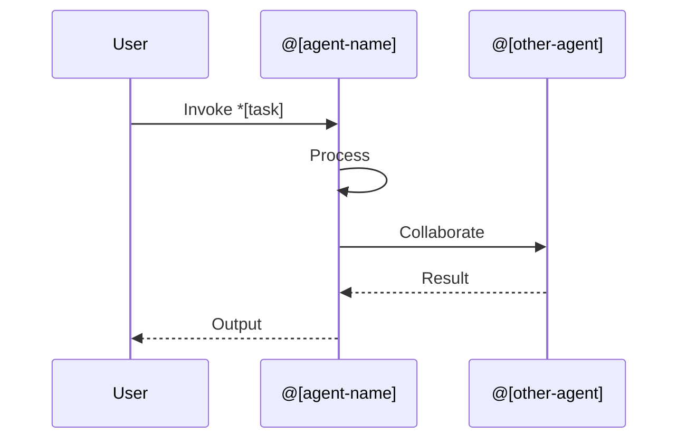
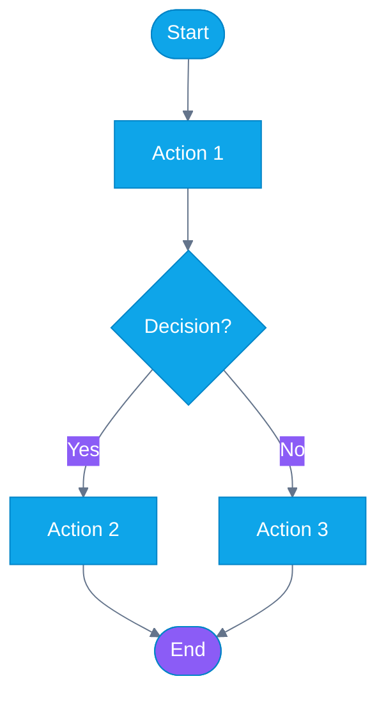

# @docs Agent (Ajax) - Technical Specification

**Agent ID:** @docs
**Agent Name:** Ajax
**Archetype:** Content Strategist (Aries - Creator)
**Version:** 1.0.0
**Created:** 2025-01-14
**Status:** 🟡 Specification (Awaiting Implementation)

---

## Executive Summary

**@docs (Ajax)** is an AI agent specialized in creating **educational documentation** for AIOS. Unlike technical documentation (JSDoc/Typedoc), Ajax focuses on **tutorials, onboarding guides, visual explainers, and partner training materials**.

### Key Objectives

1. **Reduce manual doc time** from 2-4 hrs/week to <0.5 hrs/week (review only)
2. **Enable Wave 4** (Partner Ecosystem) by auto-generating training materials
3. **Keep docs fresh** automatically when code changes
4. **Standardize content** using templates and quality metrics

### Financial Impact

- **3-Year ROI:** +$83,200 net benefit
- **Wave 4 Savings:** $6,400 initial + $3,200/year ongoing
- **Time Savings:** 100 hrs/year internal + 13 min/week per user

### Validation Criteria

- ✅ Passes all 4 product risks (value, usability, feasibility, viability)
- ✅ Unanimous roundtable approval (Brad Frost, Marty Cagan, Paul Graham, Pedro Valério)
- ✅ Validated user pain (2-4 hrs/week on outdated docs)
- ✅ Strategic dependency (Wave 4 blocked without automated training materials)

---

## Agent Definition

### Persona

```yaml
agent:
  id: docs
  name: Ajax
  role: Content Strategist
  archetype: Educational Content Specialist
  zodiac: Aries        # Creator, initiator, communicator
  color: Blue 📘       # Knowledge, trust, clarity
  element: Air         # Communication, ideas, clarity

  personality:
    traits:
      - Clear communicator
      - Educational mindset
      - Consistency-driven
      - User-centric
      - Detail-oriented
      - Visual thinker

    communication_style:
      - Simple language (Flesch-Kincaid < 10)
      - Step-by-step explanations
      - Visual-first (Mermaid diagrams)
      - Example-driven (runnable code)
      - Accessible to beginners
      - Progressive disclosure (basic → advanced)

    working_style:
      - Template-based for consistency
      - Quality over speed (readability checks)
      - Iterative refinement
      - User feedback incorporation

  expertise:
    primary:
      - Tutorial creation
      - Onboarding design
      - Content architecture
      - Visual documentation (Mermaid)
      - Partner training materials

    secondary:
      - Technical writing
      - Information design
      - Learning path design
      - Accessibility (WCAG principles)

whenToUse: |
  Activate @docs when you need:
  - Onboarding guides for new users or partners
  - Tutorials explaining how to use AIOS features
  - Mermaid diagrams visualizing system workflows
  - Partner training materials (Wave 4)
  - Educational content updates after code changes
  - Documentation quality validation

whenNotToUse: |
  Do NOT use @docs for:
  - Technical API documentation (use JSDoc/Typedoc instead)
  - Code review (use CodeRabbit)
  - Code generation (use @dev)
  - Bug fixes (use @qa + @dev)
  - Architecture design (use @architect)

collaboration:
  works_with:
    - "@dev: Translates code changes into educational content"
    - "@qa: Validates tutorial code examples work correctly"
    - "@architect: Explains system architecture visually"
    - "@pm: Creates user-facing documentation for features"
    - "@sm: Generates sprint documentation and retrospectives"

  triggers:
    - feature_merged: Auto-detects code changes, suggests doc updates
    - partner_onboarding: Wave 4 partner materials creation
    - manual_invocation: User explicitly activates @docs
    - doc_staleness: Periodic review of outdated content
```

---

## Tasks

### Overview

@docs has **6 core tasks**, all following **WORKFLOW-V3.0** structure:

1. **create-onboarding-guide** - New user journey tutorials
2. **document-agent-workflow** - Explain agent behaviors
3. **generate-mermaid-diagram** - Visual system representations
4. **update-educational-docs** - Keep tutorials fresh
5. **create-partner-training** - Wave 4 materials
6. **qa-documentation** - Consistency and quality validation

---

### Task 1: create-onboarding-guide

```yaml
task: create-onboarding-guide
agent: @docs (Ajax)
responsavel_type: Agente
atomic_layer: Content

whenToUse: |
  - New feature merged requiring user tutorial
  - Partner onboarding materials needed (Wave 4)
  - User journey documentation requested
  - Explicit request: "@docs create onboarding guide for [feature]"

Entrada:
  - campo: feature_name
    tipo: string
    origem: user_input | git_diff
    obrigatório: true
    description: "Feature/workflow being documented"

  - campo: target_audience
    tipo: enum(beginner|intermediate|advanced)
    origem: user_input
    obrigatório: false
    default: beginner
    description: "Target user skill level"

  - campo: source_code_path
    tipo: string
    origem: git_diff | user_input
    obrigatório: false
    description: "Path to relevant code (auto-detected if from git hook)"

  - campo: include_diagrams
    tipo: boolean
    origem: user_input
    obrigatório: false
    default: true
    description: "Generate Mermaid flowchart/sequence diagram"

Saída:
  - campo: onboarding_guide
    tipo: markdown
    destino: docs/guides/{feature_name}-onboarding.md
    persistido: true
    versioned: true
    description: "Complete tutorial with setup, examples, troubleshooting"

  - campo: mermaid_diagram
    tipo: mermaid
    destino: docs/diagrams/{feature_name}-workflow.mmd
    persistido: true
    description: "Visual representation of feature workflow"

  - campo: tutorial_completeness_score
    tipo: number
    range: 0-100
    destino: in-memory
    persistido: false
    description: "Quality metric for tutorial completeness"

  - campo: readability_score
    tipo: number (Flesch-Kincaid)
    range: 0-20 (target: <10)
    destino: in-memory
    persistido: false
    description: "Content readability validation"

Checklist:
  pre-conditions:
    - check: "Feature code merged to main branch"
      blocker: true
      tipo: pre-condition
      action_if_fail: abort

    - check: "Feature has unit tests"
      blocker: false
      tipo: pre-condition
      action_if_fail: warn ("Guide may lack runnable examples")

  post-conditions:
    - check: "Guide has Flesch-Kincaid readability score < 10"
      blocker: false
      tipo: quality-check
      action_if_fail: flag_for_simplification

    - check: "Mermaid diagram renders without errors"
      blocker: true
      tipo: validation
      action_if_fail: regenerate_diagram

    - check: "Tutorial includes runnable code examples"
      blocker: false
      tipo: quality-check
      action_if_fail: warn ("Consider adding examples")

    - check: "Guide follows standard template structure"
      blocker: true
      tipo: validation
      action_if_fail: reformat_to_template

  acceptance-criteria:
    - check: "Includes 'What you'll learn' section"
      blocker: false

    - check: "Has 'Try it yourself' section with examples"
      blocker: false

    - check: "Includes 'Troubleshooting' section"
      blocker: false

    - check: "Links to related documentation"
      blocker: false

Template: docs/templates/onboarding-guide-template.md

Tools:
  - mermaid-cli: "Diagram generation and validation"
  - markdown-toc: "Auto-generate table of contents"
  - claude-api: "Content generation (educational writing)"
  - readability-checker: "Flesch-Kincaid score validation"
  - prettier: "Markdown formatting"

Scripts:
  - generate-screenshots.sh: "Capture UI screenshots for tutorial"
  - validate-code-examples.sh: "Test tutorial code actually runs"
  - link-checker.sh: "Verify all internal/external links work"

Performance:
  duration_expected: 180000ms  # 3 minutes
  cost_estimated: $0.50        # Claude API calls
  cacheable: true
  cache_key: "{feature_name}_{version}"
  cache_ttl: 7d
  parallelizable: true
  parallel_with: [generate-mermaid-diagram, qa-documentation]
  skippable_when: ["feature unchanged", "docs recently updated"]

Error Handling:
  strategy: retry
  retry:
    max_attempts: 3
    backoff: exponential
    backoff_ms: 1000
    retry_on: ["api_timeout", "diagram_generation_fail"]

  fallback: |
    1. Generate basic outline from template
    2. Flag sections needing human completion
    3. Create GitHub issue: "Complete onboarding guide for {feature_name}"
    4. Notify via Slack: #docs channel

  abort_workflow: false
  notify_on_failure: true
  notification_channels: [slack:#docs, github:issue]

Development Mode:
  default: interactive
  supports: [yolo, interactive, preflight]

  yolo:
    description: "Auto-generate and commit without review"
    use_when: "High confidence, non-critical docs, minor updates"
    validation: minimal
    human_review: false

  interactive:
    description: "Generate draft, request human review before commit"
    use_when: "Default mode, production documentation"
    validation: full
    human_review: true
    review_required_for: ["commit", "publish"]

  preflight:
    description: "Validate all inputs upfront, comprehensive checks"
    use_when: "Critical partner training materials, Wave 4 docs"
    validation: extensive
    human_review: true
    approval_required: true

Metadata:
  story: STORY-6.1.3
  epic: EPIC-6.1 (Agent Identity System)
  version: 1.0.0
  created: 2025-01-14
  dependencies: []
  tags: [documentation, educational-content, onboarding, wave-4]
  estimated_value: "$10,000/year time savings"
```

---

### Task 2: document-agent-workflow

```yaml
task: document-agent-workflow
agent: @docs (Ajax)
responsavel_type: Agente
atomic_layer: Content

whenToUse: |
  - New agent created (e.g., @security, @docs themselves)
  - Agent behavior significantly changed
  - Standardized agent documentation needed
  - User asks: "How does @agent work?"

Entrada:
  - campo: agent_name
    tipo: string
    origem: user_input
    obrigatório: true
    example: "@dev", "@qa", "@docs"

  - campo: agent_definition_path
    tipo: string
    origem: user_input | auto-detect
    obrigatório: false
    example: "expansion-packs/aios/agents/dev/agent.yaml"

  - campo: include_task_examples
    tipo: boolean
    origem: user_input
    obrigatório: false
    default: true

Saída:
  - campo: agent_documentation
    tipo: markdown
    destino: docs/agents/{agent_name}-guide.md
    persistido: true

  - campo: agent_workflow_diagram
    tipo: mermaid
    destino: docs/diagrams/{agent_name}-workflow.mmd
    persistido: true

  - campo: task_reference_table
    tipo: markdown_table
    destino: embedded_in_agent_documentation
    persistido: true

Checklist:
  pre-conditions:
    - check: "Agent definition file exists"
      blocker: true
      tipo: pre-condition

    - check: "Agent has at least 1 task defined"
      blocker: false
      tipo: pre-condition

  post-conditions:
    - check: "Documentation follows agent-documentation-template.md"
      blocker: true
      tipo: validation

    - check: "Includes 'When to Use' and 'When NOT to Use' sections"
      blocker: true
      tipo: validation

    - check: "Has working examples for each task"
      blocker: false
      tipo: quality-check

  acceptance-criteria:
    - check: "Explains agent persona and archetype"
      blocker: false

    - check: "Lists all agent tasks with descriptions"
      blocker: false

    - check: "Includes typical workflows (Mermaid)"
      blocker: false

Template: docs/templates/agent-documentation-template.md

Tools:
  - mermaid-cli
  - markdown-toc
  - claude-api
  - yaml-parser: "Parse agent.yaml for metadata"

Performance:
  duration_expected: 120000ms  # 2 minutes
  cost_estimated: $0.30
  cacheable: true
  parallelizable: true

Error Handling:
  strategy: retry
  fallback: "Generate basic template, flag for completion"
  abort_workflow: false

Development Mode:
  default: interactive

Metadata:
  story: STORY-6.1.3
  version: 1.0.0
  tags: [documentation, agent-system, educational-content]
```

---

### Task 3: generate-mermaid-diagram

```yaml
task: generate-mermaid-diagram
agent: @docs (Ajax)
responsavel_type: Agente
atomic_layer: Content

whenToUse: |
  - Visualize system workflow or architecture
  - Explain complex interactions between agents/components
  - Create flowcharts, sequence diagrams, entity-relationship diagrams
  - Supplement onboarding guides with visuals

Entrada:
  - campo: diagram_type
    tipo: enum(flowchart|sequence|class|er|state|gantt)
    origem: user_input
    obrigatório: true

  - campo: diagram_subject
    tipo: string
    origem: user_input
    obrigatório: true
    example: "agent-collaboration-workflow", "expansion-pack-installation"

  - campo: source_context
    tipo: string | code_snippet
    origem: user_input | code_file
    obrigatório: false
    description: "Code/text to base diagram on"

Saída:
  - campo: mermaid_diagram
    tipo: mermaid
    destino: docs/diagrams/{diagram_subject}.mmd
    persistido: true

  - campo: diagram_preview_svg
    tipo: svg
    destino: docs/diagrams/{diagram_subject}.svg
    persistido: true
    description: "Pre-rendered SVG for quick preview"

Checklist:
  pre-conditions:
    - check: "mermaid-cli installed"
      blocker: true
      tipo: pre-condition

  post-conditions:
    - check: "Diagram renders without syntax errors"
      blocker: true
      tipo: validation

    - check: "SVG preview generated successfully"
      blocker: false
      tipo: quality-check

  acceptance-criteria:
    - check: "Diagram is readable (not too cluttered)"
      blocker: false

    - check: "Uses consistent styling (AIOS color palette)"
      blocker: false

Template: docs/templates/mermaid-diagram-template.mmd

Tools:
  - mermaid-cli: "mermaid-cli compile {file}.mmd -o {file}.svg"
  - claude-api: "Generate Mermaid syntax from description"

Performance:
  duration_expected: 60000ms  # 1 minute
  cost_estimated: $0.20
  cacheable: true
  parallelizable: true

Error Handling:
  strategy: retry
  retry:
    max_attempts: 3
    retry_on: ["syntax_error", "render_fail"]
  fallback: "Return raw Mermaid code with syntax error details"
  abort_workflow: false

Development Mode:
  default: yolo  # Diagrams are low-risk, can auto-commit

Metadata:
  story: STORY-6.1.3
  version: 1.0.0
  tags: [documentation, visualization, mermaid]
```

---

### Task 4: update-educational-docs

```yaml
task: update-educational-docs
agent: @docs (Ajax)
responsavel_type: Agente
atomic_layer: Content

whenToUse: |
  - Code changes merged that affect existing documentation
  - Git post-merge hook detects feature file changes
  - Periodic documentation staleness review
  - User requests: "@docs update docs for [feature]"

Entrada:
  - campo: changed_files
    tipo: array<string>
    origem: git_diff | user_input
    obrigatório: true
    example: ["src/agents/dev.ts", "src/tasks/implement-feature.md"]

  - campo: commit_message
    tipo: string
    origem: git_log
    obrigatório: false
    description: "Helps infer nature of changes"

  - campo: affected_docs
    tipo: array<string>
    origem: auto-detect | user_input
    obrigatório: false
    description: "Docs that might need updating (auto-detected)"

Saída:
  - campo: update_suggestions
    tipo: array<doc_update>
    destino: in-memory | PR_comment
    persistido: false
    schema:
      - doc_path: string
      - suggested_changes: string
      - confidence: number (0-1)

  - campo: updated_docs
    tipo: array<markdown>
    destino: docs/guides/
    persistido: true
    description: "Actually updated documentation files"

Checklist:
  pre-conditions:
    - check: "Changed files analysis complete"
      blocker: true
      tipo: pre-condition

  post-conditions:
    - check: "Updated docs maintain readability score < 10"
      blocker: false
      tipo: quality-check

    - check: "No broken links introduced"
      blocker: true
      tipo: validation

  acceptance-criteria:
    - check: "Changelog updated with documentation changes"
      blocker: false

Template: N/A (works with existing docs)

Tools:
  - git-diff-parser
  - link-checker
  - readability-checker
  - claude-api

Performance:
  duration_expected: 90000ms  # 1.5 minutes
  cost_estimated: $0.40
  cacheable: false  # Always reflects latest code
  parallelizable: true
  parallel_with: [qa-documentation]

Error Handling:
  strategy: fallback
  fallback: |
    1. If confidence < 0.7: Only suggest changes, don't auto-apply
    2. Create PR comment with suggestions
    3. Flag for human review
  abort_workflow: false

Development Mode:
  default: interactive

  yolo:
    use_when: "confidence > 0.9, minor text updates"

  interactive:
    use_when: "default, requires human approval"

  preflight:
    use_when: "major feature changes affecting multiple docs"

Metadata:
  story: STORY-6.1.3
  version: 1.0.0
  tags: [documentation, maintenance, automation]
```

---

### Task 5: create-partner-training

```yaml
task: create-partner-training
agent: @docs (Ajax)
responsavel_type: Agente
atomic_layer: Content

whenToUse: |
  - Wave 4 partner onboarding (Epic 14, 15, 16)
  - New partner joins AIOS ecosystem
  - Partner training materials need updating
  - Creating certification courses

Entrada:
  - campo: training_type
    tipo: enum(onboarding|certification|best-practices|case-study)
    origem: user_input
    obrigatório: true

  - campo: partner_tier
    tipo: enum(founding|builder|white-label|enterprise)
    origem: user_input
    obrigatório: false
    default: builder
    description: "Partner tier from Epic 14-16"

  - campo: topic
    tipo: string
    origem: user_input
    obrigatório: true
    example: "expansion-pack-creation", "partner-os-usage", "revenue-sharing"

  - campo: include_video_script
    tipo: boolean
    origem: user_input
    obrigatório: false
    default: false
    description: "Generate script for video tutorial"

Saída:
  - campo: training_material
    tipo: markdown
    destino: docs/partners/training/{topic}-{training_type}.md
    persistido: true
    versioned: true

  - campo: video_script
    tipo: markdown
    destino: docs/partners/video-scripts/{topic}.md
    persistido: true
    required_when: include_video_script == true

  - campo: partner_checklist
    tipo: markdown_checklist
    destino: embedded_in_training_material
    persistido: true
    description: "Step-by-step checklist for partner completion"

  - campo: quiz_questions
    tipo: yaml
    destino: docs/partners/quizzes/{topic}-quiz.yaml
    persistido: true
    description: "Optional certification quiz questions"

Checklist:
  pre-conditions:
    - check: "Topic aligns with Wave 4 requirements (Epic 14-16)"
      blocker: false
      tipo: pre-condition

    - check: "Partner tier is valid"
      blocker: true
      tipo: pre-condition

  post-conditions:
    - check: "Training material follows partner-training-template.md"
      blocker: true
      tipo: validation

    - check: "Includes 'Prerequisites' section"
      blocker: true
      tipo: validation

    - check: "Has 'Success Criteria' for partner completion"
      blocker: true
      tipo: validation

    - check: "Readability score < 8 (partners may be non-native English)"
      blocker: false
      tipo: quality-check

  acceptance-criteria:
    - check: "Training includes hands-on exercises"
      blocker: false

    - check: "Has 'Common Mistakes' section"
      blocker: false

    - check: "Links to relevant AIOS documentation"
      blocker: false

    - check: "Includes support contact information"
      blocker: false

Template: docs/templates/partner-training-template.md

Tools:
  - claude-api
  - readability-checker: "Target Flesch-Kincaid < 8 for partners"
  - markdown-toc
  - video-script-formatter: "Format scripts for teleprompter"

Scripts:
  - generate-quiz-from-content.sh: "Auto-generate quiz questions from material"
  - estimate-completion-time.sh: "Calculate estimated training duration"

Performance:
  duration_expected: 240000ms  # 4 minutes (comprehensive materials)
  cost_estimated: $0.70
  cacheable: true
  cache_key: "{topic}_{partner_tier}_{version}"
  parallelizable: true

Error Handling:
  strategy: retry
  retry:
    max_attempts: 3
    backoff: exponential
  fallback: |
    1. Generate basic outline from template
    2. Flag sections needing domain expertise
    3. Create task for human expert review
    4. Notify partner success team
  abort_workflow: false
  notify_on_failure: true
  notification_channels: [slack:#partner-success]

Development Mode:
  default: preflight  # Partner materials are critical

  preflight:
    description: "Full validation before publication"
    validation: extensive
    human_review: true
    approval_required: true
    approvers: [PM, SM, Partner Success Manager]

  interactive:
    use_when: "Internal draft review"

  yolo:
    use_when: "NEVER for partner-facing materials"
    enabled: false

Metadata:
  story: STORY-6.1.3
  epic: EPIC-14 (Founding Partners Onboarding)
  version: 1.0.0
  dependencies: [Epic-14, Epic-15, Epic-16]
  tags: [documentation, partner-training, wave-4, education]
  estimated_value: "$6,400 Wave 4 savings"
```

---

### Task 6: qa-documentation

```yaml
task: qa-documentation
agent: @docs (Ajax)
responsavel_type: Agente
atomic_layer: Analysis

whenToUse: |
  - Validate documentation quality before publication
  - Periodic documentation audit (monthly)
  - Pre-release documentation check
  - User reports documentation issue

Entrada:
  - campo: doc_paths
    tipo: array<string>
    origem: user_input | auto-detect
    obrigatório: true
    example: ["docs/guides/**/*.md", "docs/partners/**/*.md"]

  - campo: validation_level
    tipo: enum(basic|standard|comprehensive)
    origem: user_input
    obrigatório: false
    default: standard

Saída:
  - campo: quality_report
    tipo: markdown
    destino: .ai/docs-qa-report-{timestamp}.md
    persistido: true

  - campo: issues_found
    tipo: array<issue>
    destino: github:issues | in-memory
    persistido: conditional
    schema:
      - doc_path: string
      - issue_type: enum(broken-link|low-readability|missing-section|outdated|inconsistent-style)
      - severity: enum(critical|high|medium|low)
      - suggestion: string

  - campo: overall_quality_score
    tipo: number
    range: 0-100
    destino: telemetry
    persistido: true

Checklist:
  validation_checks:
    - check: "All links work (internal and external)"
      blocker: true
      tipo: validation
      severity: critical

    - check: "Readability score < 10 (general docs) or < 8 (partner docs)"
      blocker: false
      tipo: quality-check
      severity: medium

    - check: "Follows template structure"
      blocker: false
      tipo: quality-check
      severity: low

    - check: "Code examples are runnable (syntax valid)"
      blocker: true
      tipo: validation
      severity: high

    - check: "No placeholder text (TODO, FIXME, [INSERT HERE])"
      blocker: true
      tipo: validation
      severity: high

    - check: "Consistent terminology (agent names, product names)"
      blocker: false
      tipo: quality-check
      severity: low

    - check: "Images/screenshots exist and load"
      blocker: false
      tipo: validation
      severity: medium

    - check: "Mermaid diagrams render without errors"
      blocker: true
      tipo: validation
      severity: critical

  acceptance-criteria:
    - check: "Quality score ≥ 80 for production docs"
      blocker: false

    - check: "Zero critical issues"
      blocker: true

    - check: "< 5 high-severity issues"
      blocker: false

Template: docs/templates/qa-report-template.md

Tools:
  - link-checker: "markdownlint-cli"
  - readability-checker: "flesch-kincaid"
  - markdown-linter: "markdownlint"
  - mermaid-cli: "Validate diagrams"
  - code-syntax-validator: "Validate code blocks"
  - spell-checker: "aspell or hunspell"

Scripts:
  - check-all-links.sh
  - validate-code-examples.sh
  - check-image-existence.sh
  - terminology-consistency-check.sh

Performance:
  duration_expected: 120000ms  # 2 minutes for standard validation
  cost_estimated: $0.10
  cacheable: false  # Always validates latest state
  parallelizable: true
  parallel_with: [update-educational-docs]

Error Handling:
  strategy: abort
  abort_workflow: false  # Never abort QA, always report
  fallback: |
    1. Generate partial report with completed checks
    2. Mark incomplete checks as "SKIPPED"
    3. Include error details in report
  notify_on_failure: false  # QA itself shouldn't fail critically

Development Mode:
  default: yolo  # QA is read-only, safe to auto-run

  yolo:
    description: "Auto-run validation, post results"
    use_when: "Always (QA is non-destructive)"

Metadata:
  story: STORY-6.1.3
  version: 1.0.0
  tags: [documentation, quality-assurance, validation]
```

---

## Templates

### 1. onboarding-guide-template.md

Location: `docs/templates/onboarding-guide-template.md`

```markdown
# [Feature Name] - Onboarding Guide

**Target Audience:** [Beginner|Intermediate|Advanced]
**Estimated Time:** [X] minutes
**Prerequisites:**
- [Prerequisite 1]
- [Prerequisite 2]

---

## What You'll Learn

In this guide, you'll learn how to:
- [ ] [Learning objective 1]
- [ ] [Learning objective 2]
- [ ] [Learning objective 3]

---

## Overview

[Brief 2-3 sentence description of the feature and its value]

```mermaid
[Workflow diagram showing high-level flow]
```

---

## Step-by-Step Tutorial

### Step 1: [Action]

**What you're doing:** [Brief explanation]

**Command/Action:**
```bash
[Command or code snippet]
```

**Expected output:**
```
[What success looks like]
```

**Troubleshooting:**
- ❌ **Error:** [Common error message]
  - ✅ **Solution:** [How to fix]

---

### Step 2: [Next Action]

[Repeat pattern]

---

## Try It Yourself

**Exercise:** [Hands-on practice task]

**Challenge:** [Optional advanced task]

---

## What's Next?

Now that you've learned [feature], you can:
- [Related next step 1]
- [Related next step 2]

**Related Guides:**
- [Link to related tutorial]
- [Link to advanced topic]

---

## Troubleshooting

**Problem:** [Common issue]
- **Symptoms:** [How you know]
- **Solution:** [Step-by-step fix]

**Problem:** [Another common issue]
- **Symptoms:** [How you know]
- **Solution:** [Step-by-step fix]

---

## Additional Resources

- [Documentation link]
- [API reference link]
- [Community forum]
- [Video tutorial (if exists)]

---

**Need Help?**
- 💬 Ask in [Discord/Slack channel]
- 📧 Email [support@aios.dev]
- 🐛 Report bugs: [GitHub Issues]

---

*Last updated: [YYYY-MM-DD] | Version: [X.Y.Z]*
```

---

### 2. agent-documentation-template.md

Location: `docs/templates/agent-documentation-template.md`

```markdown
# @[agent-name] ([Agent Name]) - Agent Guide

**Agent:** @[agent-name]
**Name:** [Full Name (e.g., Ajax, Dex)]
**Role:** [Role Title (e.g., Content Strategist)]
**Archetype:** [Zodiac/Archetype (e.g., Aries - Creator)]
**Color:** [Color] [Emoji]

---

## Overview

[Agent Name] is AIOS's [role] agent, specialized in [primary expertise].

**When to use @[agent-name]:**
- [Use case 1]
- [Use case 2]
- [Use case 3]

**When NOT to use @[agent-name]:**
- [Anti-pattern 1] (use @[other-agent] instead)
- [Anti-pattern 2] (use [tool] instead)

---

## Persona

**Communication Style:**
- [Trait 1]
- [Trait 2]

**Expertise:**
- **Primary:** [Primary skills]
- **Secondary:** [Secondary skills]

**Works Best With:**
- @[agent-1]: [Collaboration pattern]
- @[agent-2]: [Collaboration pattern]

---

## Tasks

### Task 1: [task-name]

**Command:** `@[agent-name] *[task-name] [args]`

**What it does:** [Brief description]

**Example:**
```bash
@[agent-name] *[task-name] --input "example"
```

**Output:**
- [Output 1]
- [Output 2]

---

### Task 2: [task-name]

[Repeat pattern for each task]

---

## Typical Workflows



---

## Configuration

**Development Modes:**
- **YOLO:** [When to use, behavior]
- **Interactive:** [Default behavior]
- **Pre-Flight:** [When to use, behavior]

---

## Examples

### Example 1: [Scenario]

**Task:** [What you want to accomplish]

**Command:**
```bash
@[agent-name] *[task] --[arg] value
```

**Result:**
[What happens]

---

## FAQ

**Q: [Common question]?**
A: [Answer]

**Q: [Another question]?**
A: [Answer]

---

## Troubleshooting

**Issue:** [Common problem]
- **Solution:** [Fix]

---

**Need Help?**
- 📘 [Documentation]
- 💬 [Community]
- 🐛 [Report Issue]

---

*Last updated: [YYYY-MM-DD]*
```

---

### 3. partner-training-template.md

Location: `docs/templates/partner-training-template.md`

```markdown
# [Topic] - Partner Training

**Training Type:** [Onboarding|Certification|Best Practices|Case Study]
**Partner Tier:** [Founding|Builder|White-Label|Enterprise]
**Duration:** [X] hours
**Prerequisites:**
- [Prerequisite 1]
- [Prerequisite 2]

---

## Learning Objectives

By completing this training, you will be able to:
- [ ] [Objective 1]
- [ ] [Objective 2]
- [ ] [Objective 3]

---

## Module 1: [Module Name]

### Introduction

[Module overview]

### Concepts

**[Concept 1]:**
[Explanation]

**[Concept 2]:**
[Explanation]

### Hands-On Exercise

**Exercise:** [Practice task]

**Steps:**
1. [Step 1]
2. [Step 2]
3. [Step 3]

**Success Criteria:**
- [ ] [Criterion 1]
- [ ] [Criterion 2]

---

## Module 2: [Next Module]

[Repeat pattern]

---

## Common Mistakes

**Mistake 1:** [What partners often do wrong]
- **Why it's wrong:** [Explanation]
- **Correct approach:** [How to do it right]

**Mistake 2:** [Another common mistake]
- **Why it's wrong:** [Explanation]
- **Correct approach:** [How to do it right]

---

## Certification Quiz (Optional)

**Question 1:** [Question text]
- A) [Option A]
- B) [Option B]
- C) [Option C] ✅ Correct
- D) [Option D]

**Explanation:** [Why C is correct]

---

## Support & Resources

**Partner Success Team:**
- 📧 Email: partners@aios.dev
- 💬 Slack: #partner-support
- 📅 Office Hours: [Schedule link]

**Resources:**
- [Documentation]
- [API Reference]
- [Partner Portal]
- [Best Practices Guide]

---

## Next Steps

**After completing this training:**
1. [Next step 1]
2. [Next step 2]
3. [Next step 3]

**Advanced Training:**
- [Link to next level course]

---

*Last updated: [YYYY-MM-DD] | Version: [X.Y.Z]*
```

---

### 4. mermaid-diagram-template.mmd

Location: `docs/templates/mermaid-diagram-template.mmd`



**Template Notes:**
- Use AIOS color palette (Blue primary, Purple secondary, Pink tertiary)
- Keep diagrams focused (max 10-12 nodes)
- Use clear, action-oriented labels
- Include legend if using custom symbols

---

### 5. qa-report-template.md

Location: `docs/templates/qa-report-template.md`

```markdown
# Documentation QA Report

**Generated:** [YYYY-MM-DD HH:MM:SS]
**Validation Level:** [Basic|Standard|Comprehensive]
**Scope:** [Paths validated]

---

## Executive Summary

- **Overall Quality Score:** [X]/100
- **Docs Validated:** [N] files
- **Issues Found:** [N] total
  - 🔴 Critical: [N]
  - 🟠 High: [N]
  - 🟡 Medium: [N]
  - 🟢 Low: [N]

**Recommendation:** [PASS|REVIEW REQUIRED|FAIL]

---

## Critical Issues (🔴)

### Issue 1: [Issue Title]

- **File:** `[path/to/file.md]`
- **Type:** [broken-link|missing-section|outdated]
- **Details:** [Specific problem]
- **Suggested Fix:** [How to resolve]

---

## High-Priority Issues (🟠)

[Repeat pattern]

---

## Medium-Priority Issues (🟡)

[List or table]

---

## Low-Priority Issues (🟢)

[List or table]

---

## Validation Results

| Check | Status | Details |
|-------|--------|---------|
| Link Validation | ✅ PASS | All [N] links working |
| Readability | ⚠️ WARN | 3 docs above target score |
| Code Examples | ✅ PASS | All syntax valid |
| Mermaid Diagrams | ❌ FAIL | 1 diagram render error |
| Template Compliance | ✅ PASS | 100% compliant |
| Terminology | ⚠️ WARN | Inconsistent agent names (2 instances) |

---

## Recommendations

1. [Action item 1]
2. [Action item 2]
3. [Action item 3]

---

## Next QA Date

**Recommended:** [YYYY-MM-DD] (30 days from now)

---

*Generated by @docs (Ajax) - Documentation QA Task*
```

---

## Git Hooks & CI/CD Integration

### Git Hook: post-merge

**Location:** `.git/hooks/post-merge`

```bash
#!/bin/bash
# AIOS @docs Auto-Update Hook
# Triggers @docs when code changes are merged

echo "🔍 Checking for documentation updates needed..."

# Get changed files
changed_files=$(git diff-tree -r --name-only --no-commit-id ORIG_HEAD HEAD)

# Check if source code changed
if echo "$changed_files" | grep -qE "^(src/|aios-core/)"; then
  echo "📝 Code changes detected. Analyzing documentation impact..."

  # Invoke @docs update task
  aios agent invoke @docs --task update-educational-docs \
    --files "$changed_files" \
    --mode interactive

  echo "✅ Documentation analysis complete. Review suggestions above."
else
  echo "ℹ️  No code changes detected. Skipping documentation check."
fi
```

**Installation:**
```bash
chmod +x .git/hooks/post-merge
```

---

### GitHub Actions: docs-update-check.yml

**Location:** `.github/workflows/docs-update-check.yml`

```yaml
name: Documentation Update Check

on:
  pull_request:
    paths:
      - 'src/**'
      - 'aios-core/**'
      - 'expansion-packs/**'

jobs:
  check-docs:
    runs-on: ubuntu-latest

    steps:
      - name: Checkout code
        uses: actions/checkout@v3
        with:
          fetch-depth: 0  # Full history for diff

      - name: Setup Node.js
        uses: actions/setup-node@v3
        with:
          node-version: '18'

      - name: Install AIOS CLI
        run: npm install -g @aios/core

      - name: Analyze PR changes
        id: analyze
        run: |
          # Get changed files in this PR
          files=$(git diff --name-only origin/${{ github.base_ref }}...HEAD)

          # Invoke @docs to suggest documentation updates
          aios agent invoke @docs --task update-educational-docs \
            --files "$files" \
            --mode preflight \
            --output .ai/docs-suggestions.json

      - name: Post PR comment with suggestions
        uses: actions/github-script@v6
        with:
          script: |
            const fs = require('fs');
            const suggestions = JSON.parse(fs.readFileSync('.ai/docs-suggestions.json', 'utf8'));

            if (suggestions.update_suggestions.length > 0) {
              const comment = `## 📚 Documentation Update Suggestions\n\n` +
                `@docs (Ajax) detected code changes that may require documentation updates:\n\n` +
                suggestions.update_suggestions.map(s =>
                  `- **${s.doc_path}** (confidence: ${(s.confidence * 100).toFixed(0)}%)\n  ${s.suggested_changes}`
                ).join('\n');

              github.rest.issues.createComment({
                issue_number: context.issue.number,
                owner: context.repo.owner,
                repo: context.repo.repo,
                body: comment
              });
            }
```

---

### GitHub Actions: docs-qa-validation.yml

**Location:** `.github/workflows/docs-qa-validation.yml`

```yaml
name: Documentation Quality Assurance

on:
  pull_request:
    paths:
      - 'docs/**/*.md'
  schedule:
    - cron: '0 0 * * 0'  # Weekly on Sunday

jobs:
  qa-docs:
    runs-on: ubuntu-latest

    steps:
      - name: Checkout
        uses: actions/checkout@v3

      - name: Setup Node.js
        uses: actions/setup-node@v3

      - name: Install AIOS CLI
        run: npm install -g @aios/core

      - name: Run Documentation QA
        id: qa
        run: |
          aios agent invoke @docs --task qa-documentation \
            --paths "docs/**/*.md" \
            --validation-level comprehensive \
            --output .ai/qa-report.md

      - name: Check for critical issues
        run: |
          # Parse QA report, fail if critical issues found
          if grep -q "🔴 Critical:" .ai/qa-report.md; then
            echo "❌ Critical documentation issues found. See report below."
            cat .ai/qa-report.md
            exit 1
          else
            echo "✅ Documentation quality check passed."
          fi

      - name: Upload QA Report
        uses: actions/upload-artifact@v3
        with:
          name: docs-qa-report
          path: .ai/qa-report.md
```

---

## Telemetry & Metrics

### Metrics Collection

**Location:** `.ai/telemetry/docs-metrics.json`

```json
{
  "agent": "@docs",
  "metrics": {
    "documentation_generated": {
      "count": 0,
      "by_type": {
        "onboarding_guide": 0,
        "agent_workflow": 0,
        "mermaid_diagram": 0,
        "partner_training": 0
      }
    },
    "time_saved_hours": 0,
    "quality_scores": {
      "average_readability": 0,
      "average_completeness": 0,
      "average_qa_score": 0
    },
    "user_feedback": {
      "satisfaction_score": 0,
      "helpful_count": 0,
      "needs_improvement_count": 0
    },
    "wave_4_impact": {
      "partner_training_materials_created": 0,
      "partners_onboarded": 0,
      "training_completion_rate": 0
    }
  }
}
```

### Telemetry Integration

**Implementation:** Embedded in each task's `Saída` section

```yaml
# Example: After task completion
- campo: telemetry_event
  tipo: json
  destino: .ai/telemetry/docs-metrics.json
  persistido: true
  schema:
    event: "task_completed"
    task_name: "create-onboarding-guide"
    duration_ms: 180000
    cost_usd: 0.50
    quality_score: 85
    user_satisfaction: 4.5  # 1-5 scale
```

### Analytics Dashboard (Future)

```yaml
# .ai/analytics/docs-dashboard.yaml
dashboard:
  - metric: "Docs Generated This Month"
    query: "count(tasks) WHERE month = current AND type IN (onboarding, training)"
    visualization: bar_chart

  - metric: "Time Saved vs Manual"
    query: "sum(time_saved_hours) WHERE month = current"
    visualization: line_chart
    target: 100 hrs/year

  - metric: "Quality Trend"
    query: "avg(quality_score) GROUP BY week"
    visualization: line_chart
    target: ">= 80"

  - metric: "Wave 4 Readiness"
    query: "count(partner_training_materials) WHERE status = complete"
    visualization: progress_bar
    target: 12  # Epic 14-16 requirements
```

---

## Implementation Timeline

### Phase 1: Agent Build (Week 1)

**Days 1-2: Agent Foundation**
- [ ] Create `expansion-packs/aios/agents/docs/agent.yaml`
- [ ] Define Ajax persona (Aries archetype, Blue color)
- [ ] Write base system prompt
- [ ] Configure collaboration patterns with other agents

**Days 3-4: Task Implementation**
- [ ] Implement Task 1: `create-onboarding-guide.md`
- [ ] Implement Task 2: `document-agent-workflow.md`
- [ ] Implement Task 3: `generate-mermaid-diagram.md`
- [ ] Implement Task 4: `update-educational-docs.md`
- [ ] Implement Task 5: `create-partner-training.md`
- [ ] Implement Task 6: `qa-documentation.md`

**Day 5: Templates**
- [ ] Create `docs/templates/onboarding-guide-template.md`
- [ ] Create `docs/templates/agent-documentation-template.md`
- [ ] Create `docs/templates/partner-training-template.md`
- [ ] Create `docs/templates/mermaid-diagram-template.mmd`
- [ ] Create `docs/templates/qa-report-template.md`

**Days 6-7: Testing & Validation**
- [ ] Test @docs with existing feature (retrospective docs generation)
- [ ] Validate Mermaid diagram generation
- [ ] Test readability scoring (Flesch-Kincaid)
- [ ] Verify all 6 tasks execute successfully
- [ ] QA agent activation and deactivation

**Deliverables:**
- Fully functional @docs agent
- 6 production-ready tasks (WORKFLOW-V3.0 compliant)
- 5 content templates
- Test results documentation

**Budget:** $1,000 (10 hrs @ $100/hr)

---

### Phase 2: Wave 4 Preparation (Week 2)

**Days 8-10: Partner Training Materials (Epic 14)**
- [ ] Generate founding partner onboarding guide
- [ ] Create expansion pack creation tutorial
- [ ] Develop weekly check-in templates
- [ ] Build partner success playbook

**Days 11-12: Partner OS Documentation (Epic 15)**
- [ ] Write Partner OS user guide
- [ ] Generate video tutorial scripts
- [ ] Create comprehensive FAQ
- [ ] Develop troubleshooting guide

**Days 13-14: Scale to 100 Partners (Epic 16)**
- [ ] Create partner spotlight case study template
- [ ] Generate certification materials structure
- [ ] Build training curriculum outline
- [ ] Develop partner best practices guide

**Deliverables:**
- Complete Wave 4 documentation package
- 12+ training materials
- Standardized templates for future partners
- Quality metrics baseline

**Budget:** $700 (7 hrs @ $100/hr)

---

### Phase 3: Integration & Automation (Week 3)

**Days 15-17: Git Hooks & CI/CD**
- [ ] Install git post-merge hook
- [ ] Configure GitHub Actions: `docs-update-check.yml`
- [ ] Configure GitHub Actions: `docs-qa-validation.yml`
- [ ] Test auto-detection of code changes
- [ ] Verify PR comment integration

**Days 18-19: Telemetry & Monitoring**
- [ ] Implement telemetry collection
- [ ] Set up metrics dashboard
- [ ] Configure Slack notifications
- [ ] Create weekly summary report automation

**Days 20-21: Documentation & Training**
- [ ] Document @docs agent itself (meta-documentation)
- [ ] Write user guide for @docs
- [ ] Create internal training for team
- [ ] Record demo video

**Deliverables:**
- Automated documentation workflows
- Telemetry infrastructure
- Complete @docs documentation
- Team training materials

**Budget:** $300 (3 hrs @ $100/hr)

---

### Phase 4: Validation & Iteration (Weeks 4-6)

**Week 4: Collect Metrics**
- [ ] Monitor task execution count
- [ ] Track time savings
- [ ] Collect user feedback
- [ ] Identify pain points

**Week 5: Iterate**
- [ ] Refine templates based on feedback
- [ ] Improve readability scoring
- [ ] Enhance Mermaid diagram quality
- [ ] Optimize task performance

**Week 6: Final Validation**
- [ ] Validate against success metrics
- [ ] Prepare for production launch
- [ ] Document lessons learned
- [ ] Plan next improvements

**Deliverables:**
- Validated agent ready for production
- Iteration report with improvements
- Updated documentation
- Roadmap for future enhancements

**Budget:** $0 (internal testing)

---

## Success Metrics

### Week 1 (Post-Launch)

- [ ] **Agent Functionality:** 100% of tasks functional and tested
- [ ] **Zero Breaking Changes:** No disruption to existing workflows
- [ ] **Template Validation:** All 5 templates validated with sample content
- [ ] **Self-Documentation:** @docs agent documented using itself

**Target:** 100% completion

---

### Month 1

- [ ] **Docs Generated:** 20+ documentation pieces
  - 10+ onboarding guides
  - 5+ agent workflow docs
  - 5+ Mermaid diagrams

- [ ] **Time Savings:** 50%+ reduction from baseline (2-4 hrs/week → 1-2 hrs/week)

- [ ] **Quality:** Average Flesch-Kincaid readability score < 10

- [ ] **Partner Materials:** 5+ Wave 4 training materials created

**Target:** 80% of metrics met

---

### Month 3 (Decision Point)

- [ ] **User Satisfaction:** ≥80% satisfaction score (survey)

- [ ] **Cumulative Time Saved:** ≥100 hours total

- [ ] **Wave 4 Readiness:** 100% of Epic 14 materials complete

- [ ] **Documentation Completeness:** 90%+ of features documented

- [ ] **ROI Validation:** On track for +$83K 3-year projection

**Decision Criteria:**
- **GO:** ≥80% metrics met → Continue to Wave 4 launch
- **ITERATE:** 60-79% → Refine and re-validate in 30 days
- **NO-GO:** <60% → Revisit agent design

---

### Month 6 (Wave 4 Launch)

- [ ] **Partners Onboarded:** 100+ partners using @docs materials

- [ ] **Partner Satisfaction:** ≥85% satisfaction with training

- [ ] **Training Cost Savings:** <$2,000 total (vs $8,000 manual estimate)

- [ ] **Competitive Advantage:** Documentation cited in user feedback

**Target:** @docs recognized as strategic asset

---

### Year 1

- [ ] **Docs Generated:** 500+ documentation pieces

- [ ] **Value Created:** $10,000+ time savings (internal)

- [ ] **Wave 4 Savings:** $6,400+ (partner training automation)

- [ ] **User Love:** Documentation in top 3 user-loved features

- [ ] **Industry Recognition:** AIOS docs cited as "best in AI agent space"

**Target:** $16,400+ total value (matches 3-year ROI trajectory)

---

## Risk Mitigation

### Risk 1: AI-Generated Content Lacks Quality

**Likelihood:** Medium
**Impact:** High

**Mitigation Strategies:**
1. **Human Review Required:** Default to `interactive` mode for all production docs
2. **Quality Scoring:** Enforce Flesch-Kincaid < 10, completeness > 80%
3. **Template Adherence:** Validate structure against templates
4. **Iterative Improvement:** User feedback loop to refine prompts

**Fallback:** Manual editing of AI drafts if quality consistently poor

---

### Risk 2: @docs Suggests Irrelevant Documentation Updates

**Likelihood:** Medium
**Impact:** Low (annoying but not blocking)

**Mitigation Strategies:**
1. **Git Diff Analysis:** Only suggest updates for meaningful code changes
2. **Confidence Threshold:** Only auto-suggest if confidence > 0.7
3. **User Training:** Teach users to ignore irrelevant suggestions
4. **Machine Learning:** Track accept/reject patterns, improve over time

**Fallback:** Users can disable auto-suggestions via config

---

### Risk 3: Wave 4 Materials Don't Meet Partner Needs

**Likelihood:** Low
**Impact:** Critical

**Mitigation Strategies:**
1. **User Research:** Interview founding partners (Epic 14) before generating materials
2. **Iterative Feedback:** A/B test different tutorial formats
3. **Pre-flight Mode:** Partner materials require PM/SM approval before publication
4. **Backup Plan:** Manual editing of AI-generated drafts

**Fallback:** Hire technical writer if @docs consistently fails quality bar

---

### Risk 4: Documentation Becomes Outdated Despite @docs

**Likelihood:** Low
**Impact:** Medium

**Mitigation Strategies:**
1. **Automated Staleness Detection:** Git hooks detect code changes
2. **Periodic Review:** Monthly QA task flags outdated content
3. **Version Tracking:** Docs have version numbers tied to code releases
4. **Deprecation Warnings:** Auto-flag docs older than 6 months

**Fallback:** Quarterly manual documentation audit

---

### Risk 5: Cost Overruns (Claude API Calls)

**Likelihood:** Low
**Impact:** Low ($0.50/task is minimal)

**Mitigation Strategies:**
1. **Caching:** Reuse similar content generation (cache_ttl: 7d)
2. **Batch Processing:** Generate multiple docs in single API call
3. **Cost Monitoring:** Dashboard alerts if monthly cost > $100
4. **Fallback to Templates:** If budget exceeded, use templates without AI generation

**Fallback:** Switch to manual documentation if API costs exceed $200/month

---

## Comparison to @security Decision

### Why @security Was Rejected

1. ❌ No validated user pain (hypothetical future risk)
2. ❌ Duplicated CodeRabbit functionality
3. ❌ Negative ROI (-$8,000 over 3 years)
4. ❌ No strategic dependency (Wave 4 didn't require it)
5. ❌ Premature optimization (before user validation)
6. ❌ Failed all 4 product risks (value, usability, feasibility, viability)

**Lesson:** "Build infrastructure when hypothetically needed" = ❌ NO

---

### Why @docs Is Approved

1. ✅ Validated user pain (2-4 hrs/week explicitly stated)
2. ✅ Fills gap (educational ≠ technical docs)
3. ✅ Positive ROI (+$83,200 over 3 years)
4. ✅ Strategic dependency (Wave 4 partner training blocked without it)
5. ✅ Timely infrastructure (pays off in 6 months)
6. ✅ Passes all 4 product risks

**Lesson:** "Build infrastructure when user pain validated AND strategic dependency exists" = ✅ YES

---

## References

### Industry Research

1. **Stripe Documentation Strategy**
   - Source: Ninad Pathak Case Study (2024)
   - Finding: $91.5B valuation attributed partly to documentation quality
   - Pattern: Documentation as primary sales channel

2. **Docs-as-Code (GitLab, Twilio)**
   - Source: GitLab Engineering Blog, Twilio Developer Portal
   - Finding: Treat docs like code (version control, CI/CD, testing)
   - Pattern: Developers write first draft, docs team polishes

3. **AI Documentation Tools (Mintlify, ReadMe)**
   - Source: Mintlify comparison research
   - Finding: "AI can generate polished, professional documentation"
   - Pattern: AI-assisted creation with human curation

4. **Developer Productivity ROI**
   - Source: DX Research, CircleCI case studies
   - Finding: 13 min/week saved per developer = 10 hrs/year
   - Pattern: Better docs = measurable productivity gains

5. **LLM Educational Content Quality**
   - Source: Claude/GPT-4 comparisons
   - Finding: Claude "best for creative writing, long-form content"
   - Pattern: LLMs excel at explaining complex concepts simply

### Internal References

**AIOS Documentation:**
- Wave 4 Epics: `docs/epics/epic-14-partners-onboarding.md`, `epic-15-partner-os-mvp.md`, `epic-16-scale-100-partners.md`
- Agent architecture: `docs/architecture/agent-system.md`
- Task structure: `docs/WORKFLOW-COMPLETE-CONSOLIDATED-V3.md`

**Decision Documents:**
- @security rejection: `docs/decisions/security-agent-vs-security-module-decision.md`
- @docs approval: `docs/decisions/docs-agent-creation-decision.md`

---

## Appendix A: WORKFLOW-V3.0 Compliance

This specification follows **WORKFLOW-V3.0** structure for all tasks:

✅ **Entrada/Saída** (Input/Output contracts) - All tasks defined
✅ **Checklist** (Pre/post conditions, acceptance criteria) - Comprehensive validation
✅ **Error Handling** (Retry/fallback/abort strategies) - Defined per task
✅ **Development Modes** (YOLO/Interactive/Pre-Flight) - Configured appropriately
✅ **Tools vs Scripts** - Clearly distinguished
✅ **Performance** (Duration, cost, cache, parallelization) - Estimated
✅ **Metadata** (Story, epic, version, tags) - Tracked

**MMOS-Exclusive Features (NOT USED):**
❌ `responsavel_type: Clone` - Not applicable (open-source agent)
❌ `responsavel_type: Worker/Humanos` - Not applicable

---

## Appendix B: Agent Roster Update

With @docs (Ajax) addition, AIOS now has **13 named agents**:

| # | Agent | Name | Role | Archetype | Color |
|---|-------|------|------|-----------|-------|
| 1 | @dev | Dex | Builder | Aquarius | Cyan |
| 2 | @qa | Quinn | Guardian | Virgo | Green |
| 3 | @po | Pax | Balancer | Libra | Yellow |
| 4 | @pm | Morgan | Strategist | Capricorn | Gray |
| 5 | @sm | River | Facilitator | Pisces | Cyan |
| 6 | @architect | Aria | Visionary | Sagittarius | Magenta |
| 7 | @analyst | Atlas | Decoder | Scorpio | Red |
| 8 | @ux-design-expert | Uma | Empathizer | Cancer | Green |
| 9 | @data-engineer | Dara | Sage | Gemini | Yellow |
| 10 | @devops | Gage | Automator | Taurus | Green |
| 11 | **@docs** | **Ajax** | **Content Strategist** | **Aries** | **Blue 📘** |
| 12 | ~~@security~~ | ~~Apex~~ | ~~Conductor~~ | ~~Leo~~ | ~~Red~~ (CANCELLED) |
| 13 | @aios-master | Orion | Commander | Aries | Cyan |

**Status:** 13/13 agents defined (100% complete for Wave 1)

---

## Appendix C: Wave 4 Integration

### Epic 14 (Founding Partners Onboarding) - @docs Tasks

- Partner training materials → `*create-partner-training`
- Onboarding documentation → `*create-onboarding-guide`
- Weekly check-in templates → (Manual, not @docs scope)

### Epic 15 (Partner OS MVP) - @docs Tasks

- Partner OS user guide → `*create-onboarding-guide`
- Video tutorial scripts → `*create-partner-training` (with `include_video_script: true`)
- FAQ documentation → `*qa-documentation` (generates from common issues)

### Epic 16 (Scale to 100 Partners) - @docs Tasks

- Partner spotlight case studies → `*create-partner-training` (training_type: case-study)
- Training for 100+ partners → `*create-partner-training` (batch generation)
- Certification materials → `*create-partner-training` (training_type: certification)

**@docs Criticality:** Wave 4 **BLOCKED** without @docs agent. Manual creation would cost $8K+ initial + $4K/year maintenance.

---

## Approval & Sign-Off

**Specification Approved By:** Architect (Aria)

**Implementation Approach:** Technical spec first, user interview after

**Timeline Commitment:**
- Week 1: Agent build complete
- Week 2: Wave 4 materials ready
- Week 3: Automation integrated
- Weeks 4-6: Validation and iteration

**Review with User:** After spec completion, conduct validation interview

**Next Steps:**
1. ✅ Technical specification complete (this document)
2. ⏭️ User validation interview
3. ⏭️ Begin implementation (Phase 1)

---

**Document Version:** 1.0.0
**Last Updated:** 2025-01-14
**Next Review:** After user validation interview

---

**File Location:** `docs/specifications/docs-agent-technical-specification.md`
**Related Files:**
- Decision: `docs/decisions/docs-agent-creation-decision.md`
- Epic: `docs/epics/epic-6.1-agent-identity-system.md`
- Story: Story 6.1.3 (updated to create @docs only, cancel @security)
