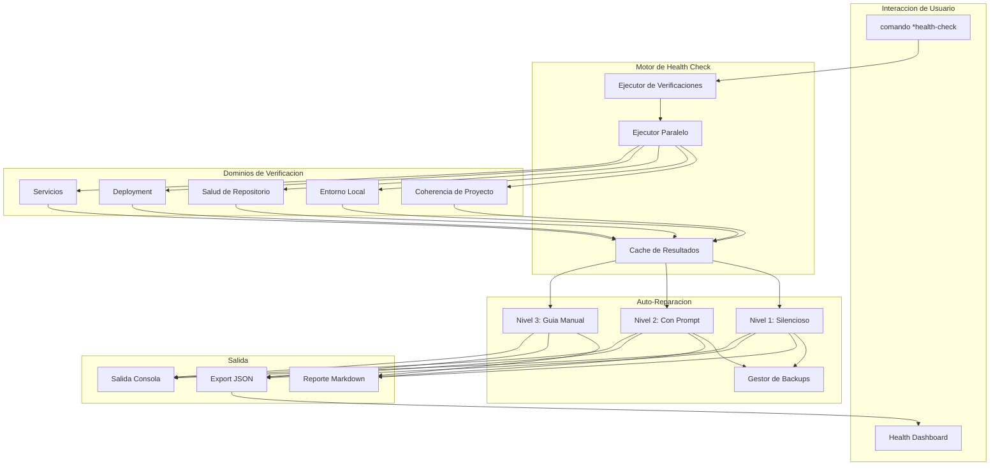
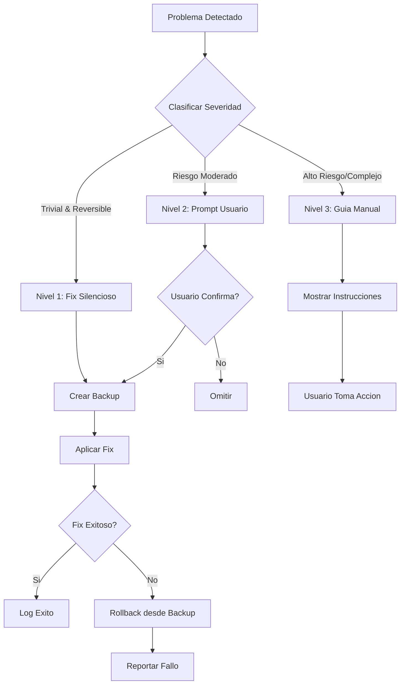
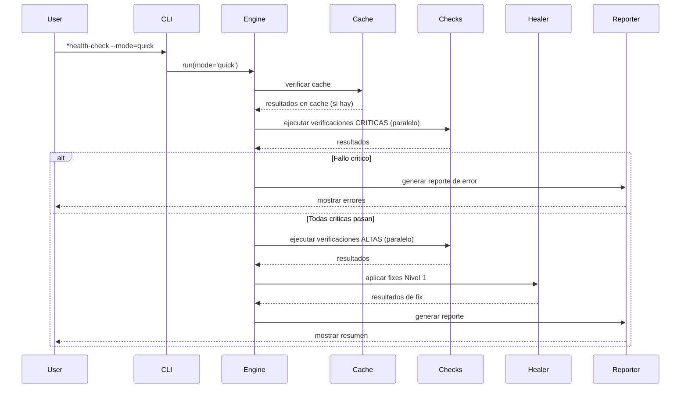

<!-- Traduccion: ES | Original: /docs/en/architecture/adr/adr-hcs-health-check-system.md | Sincronizacion: 2026-01-26 -->

# ADR: Arquitectura del Sistema de Health Check

**ID ADR:** ADR-HCS-001
**Estado:** Propuesto
**Creado:** 2025-12-30
**Autor:** @architect (Aria) via @dev (Dex)
**Historia:** Investigacion HCS-1
**Decisores:** @architect, @po, Tech Lead

---

## Contexto

AIOS necesita un sistema de health check integral para:

1. **Diagnosticar problemas** en configuracion de proyecto, entorno e integraciones
2. **Habilitar auto-reparacion** para problemas comunes sin intervencion manual
3. **Rastrear deuda tecnica** identificando estados degradados
4. **Proporcionar visibilidad** de la salud general del proyecto a traves de dashboards
5. **Integrar con CI/CD** para monitoreo continuo de salud

### Declaracion del Problema

Actualmente, los desarrolladores deben diagnosticar manualmente problemas en multiples dominios:

- Drift de configuracion del framework
- Configuraciones incorrectas de entorno
- Integraciones MCP rotas
- Dependencias desactualizadas con vulnerabilidades de seguridad
- Inconsistencias de configuracion de IDE

Esto lleva a:

- Tiempo de debugging desperdiciado
- Entornos de desarrollo inconsistentes en el equipo
- Fallos silenciosos que se manifiestan luego como bugs
- Vulnerabilidades de seguridad que pasan desapercibidas

### Requisitos

1. **Modos de Ejecucion:** Manual, CI programado, post-merge, background de IDE opcional
2. **Dominios de Verificacion:** Coherencia de proyecto, entorno local, repositorio, deployment, servicios
3. **Auto-Reparacion:** Enfoque escalonado (silencioso, con prompt, guia manual)
4. **Rendimiento:** Modo rapido <10s, modo completo <60s
5. **Extensibilidad:** Soporte para verificaciones personalizadas especificas del proyecto
6. **Integracion:** Reutilizar componentes del Dashboard de Calidad de Story 3.11

---

## Decision

Implementaremos un **Sistema de Health Check Hibrido** con la siguiente arquitectura:

### Decisiones de Arquitectura Core

#### 1. Modelo de Ejecucion: Manual-Primero con Integracion CI

**Decision:** La ejecucion principal es manual (comando `*health-check`), con integracion CI programada secundaria.

**Justificacion:**

- Sigue patrones de la industria (Flutter doctor, Homebrew doctor, WP-CLI doctor)
- Evita friccion de flujo de trabajo de pre-commit hooks
- Patron Terraform: Deteccion separada de remediacion
- Patron Kubernetes: Monitoreo continuo en background

**Alternativas Rechazadas:**

- Pre-commit hooks: Muy lentos (10-30s), desarrolladores evitan con `--no-verify`
- Always-on background: Complejo, preocupaciones de rendimiento
- Solo CI: Sin feedback inmediato para desarrolladores

#### 2. Arquitectura de Verificaciones: Hibrida (Codigo + YAML)

**Decision:** Usar verificaciones basadas en codigo para funcionalidad core, verificaciones basadas en YAML para extensibilidad.

**Justificacion:**

- El codigo proporciona rendimiento y capacidad de logica compleja
- YAML proporciona personalizacion facil especifica del proyecto
- Patron WP-CLI: Verificaciones core + `doctor.yml` verificaciones personalizadas
- Patron VS Code: Aislamiento core + flexibilidad de extension

**Estructura:**

```
.aios-core/core/health-check/
├── checks/           # Verificaciones JavaScript core (33 verificaciones)
│   ├── project/
│   ├── local/
│   ├── repository/
│   ├── deployment/
│   └── services/
└── ...

.aios/
└── custom-checks.yaml  # Verificaciones YAML especificas del proyecto
```

**Alternativas Rechazadas:**

- Puramente basado en codigo: No extensible para necesidades especificas del proyecto
- Puramente basado en YAML: Limitado para verificaciones complejas (ej. npm audit)
- Sistema de plugins: Sobre-ingenieria para necesidades actuales

#### 3. Auto-Reparacion: Modelo de Seguridad de Tres Niveles

**Decision:** Implementar tres niveles de auto-reparacion con reglas de seguridad estrictas.

**Niveles:**

1. **Nivel 1 (Silencioso):** Operaciones seguras, reversibles, solo del framework
2. **Nivel 2 (Con Prompt):** Riesgo moderado, requiere confirmacion del usuario
3. **Nivel 3 (Guia Manual):** Alto riesgo, proporciona instrucciones solamente

**Justificacion:**

- Patron Terraform: Separacion explicita de plan vs apply
- Patron npm: Verificaciones de integridad con recuperacion controlada por usuario
- Patron VS Code: Auto-actualizar cosas seguras, bloquear cosas peligrosas
- Patron Git: Siempre preservar historial (reflog)

**Reglas de Seguridad:**

- Nunca modificar codigo fuente del usuario
- Nunca tocar credenciales/secretos
- Siempre crear backups antes de modificacion
- Nunca push a repositorios remotos

**Alternativas Rechazadas:**

- Dos niveles (auto/manual): Falta punto medio para riesgos moderados
- Sin auto-fix: Pierde oportunidad de correcciones sin friccion
- Auto-fix agresivo: Muy riesgoso, podria causar perdida de datos

#### 4. Integracion de Dashboard: Componentes Compartidos

**Decision:** Crear biblioteca de componentes compartidos extendiendo el Dashboard de Calidad de Story 3.11.

**Justificacion:**

- Principio DRY: Reutilizar configuracion existente de Chart.js, Tailwind
- UX Consistente: Mismo lenguaje visual entre dashboards
- Desarrollo mas rapido: No reconstruir componentes comunes

**Estructura de Integracion:**

```
tools/
├── shared-dashboard/     # Componentes compartidos
│   ├── components/
│   │   ├── Card.jsx
│   │   ├── Chart.jsx
│   │   └── StatusBadge.jsx
│   ├── hooks/
│   │   ├── useMetrics.js
│   │   └── useRealTime.js
│   └── styles/
│       └── tailwind-preset.js
├── quality-dashboard/    # Story 3.11
│   └── (extiende shared)
└── health-dashboard/     # Dashboard HCS
    └── (extiende shared)
```

**Alternativas Rechazadas:**

- Componentes duplicados: Carga de mantenimiento, inconsistencia
- Dashboard monolitico: Muy complejo, ciclos de actualizacion diferentes
- Biblioteca externa: Excesivo para herramientas internas

#### 5. Priorizacion de Verificaciones: Estrategia Fail-Fast

**Decision:** Ejecutar verificaciones CRITICAS primero, detener en fallo critico en modo rapido.

**Justificacion:**

- Patron de probes Kubernetes: Fallar rapido en problemas de liveness
- Optimizacion de rendimiento: No ejecutar verificaciones costosas si lo basico falla
- Experiencia de usuario: Feedback rapido sobre problemas bloqueantes

**Orden de Ejecucion:**

1. Verificaciones CRITICAS (paralelas donde sea posible)
2. Verificaciones ALTAS
3. Verificaciones MEDIAS
4. Verificaciones BAJAS
5. Verificaciones INFO (nunca fallan)

**Alternativas Rechazadas:**

- Ejecutar todas siempre: Desperdicia tiempo cuando lo basico esta roto
- Orden aleatorio: Experiencia inconsistente
- Alfabetico: Sin priorizacion logica

---

## Consecuencias

### Positivas

1. **Control del Usuario:** Enfoque manual-primero respeta flujo de trabajo del desarrollador
2. **Seguridad:** Auto-reparacion de tres niveles previene dano accidental
3. **Rendimiento:** Ejecucion paralela y caching cumplen objetivos de tiempo
4. **Extensibilidad:** Verificaciones YAML personalizadas permiten necesidades especificas del proyecto
5. **Mantenibilidad:** Componentes de dashboard compartidos reducen duplicacion
6. **Alineacion con Industria:** Sigue patrones probados de Kubernetes, Terraform, npm

### Negativas

1. **Complejidad Inicial:** Arquitectura hibrida requiere mas configuracion inicial
2. **Carga de Documentacion:** Tres niveles de auto-reparacion necesitan documentacion clara
3. **Curva de Aprendizaje de Verificaciones Personalizadas:** Equipos necesitan aprender formato de verificaciones YAML
4. **Dependencia de Dashboard:** Dashboard de salud bloqueado por completar Story 3.11

### Riesgos

| Riesgo                           | Probabilidad | Impacto | Mitigacion                              |
| -------------------------------- | ------------ | ------- | --------------------------------------- |
| Auto-reparacion causa dano       | Bajo         | Alto    | Blocklist estricta, backups obligatorios |
| Objetivos de rendimiento no cumplidos | Medio    | Medio   | Caching agresivo, ejecucion paralela    |
| Verificaciones personalizadas muy complejas | Bajo | Bajo  | Proporcionar ejemplos, limitar tipos de verificacion |
| Scope creep de dashboard         | Medio        | Medio   | Limites estrictos de componentes compartidos |

---

## Plan de Implementacion

### Fase 1: Motor Core (HCS-2, 5h)

- HealthCheckEngine con ejecucion paralela
- 33 verificaciones core en 5 dominios
- Agregacion de resultados y puntuacion

### Fase 2: Auto-Reparacion (HCS-2, 4h)

- Gestor de backups
- Sanadores Nivel 1, 2, 3
- Persistencia de log de sanacion

### Fase 3: Reportes (HCS-2, 3h)

- Generador de reportes Markdown
- Export JSON para dashboard
- Salida de resumen en consola

### Fase 4: Dashboard (HCS-2, 4h)

- Extraccion de componentes compartidos de Story 3.11
- Componentes especificos de salud (DomainCard, HealthScore)
- Integracion de dashboard

### Fase 5: Integracion CI (HCS-3, futuro)

- Workflow de GitHub Actions
- Monitoreo de salud programado
- Notificaciones Slack/email

---

## Alternativas Consideradas

### Alternativa 1: Basada en Pre-commit Hook

**Descripcion:** Ejecutar health check en cada commit via pre-commit hook.

**Pros:**

- Captura problemas inmediatamente
- Aplica estandares en todo el equipo

**Contras:**

- 10-30 segundos de delay en cada commit
- Desarrolladores evitan con `--no-verify`
- Crea friccion de flujo de trabajo

**Veredicto:** ❌ Rechazado - Demasiada friccion

### Alternativa 2: Arquitectura de Plugins Pura

**Descripcion:** Todas las verificaciones como plugins cargables (como reglas ESLint).

**Pros:**

- Maxima extensibilidad
- Facil agregar/remover verificaciones
- Ecosistema de verificaciones de terceros

**Contras:**

- Sobre-ingenieria para necesidades actuales
- Problemas de compatibilidad de plugins
- Mayor carga de mantenimiento

**Veredicto:** ❌ Rechazado - Sobre-ingenieria

### Alternativa 3: Solo Integracion IDE Real-time

**Descripcion:** Health check solo ejecuta como extension/proceso background de IDE.

**Pros:**

- Feedback en tiempo real
- Sin comando manual necesario

**Contras:**

- Complejo implementar en multiples IDEs
- Preocupaciones de impacto en rendimiento
- Sin integracion CI
- No todos los desarrolladores usan IDEs soportados

**Veredicto:** ❌ Rechazado - Muy limitante, complejo

### Alternativa 4: Herramienta Externa (doctor.js)

**Descripcion:** Usar framework de health check open-source existente.

**Pros:**

- Sin desarrollo necesario
- Soporte de comunidad

**Contras:**

- Sin verificaciones especificas de AIOS
- Capacidades de auto-reparacion limitadas
- Dependencia de proyecto externo

**Veredicto:** ❌ Rechazado - No cumple requisitos especificos de AIOS

---

## Referencias

### Fuentes de Investigacion de Industria

1. **Kubernetes Health Probes**
   - [Liveness, Readiness, and Startup Probes](https://kubernetes.io/docs/concepts/configuration/liveness-readiness-startup-probes/)
   - Insight clave: Diferenciar entre "vivo" y "listo para servir"

2. **Terraform Drift Detection**
   - [Detecting and Managing Drift](https://developer.hashicorp.com/terraform/tutorials/state/resource-drift)
   - Insight clave: Separar deteccion de remediacion

3. **VS Code Extension Health**
   - [Extension Bisect](https://code.visualstudio.com/blogs/2021/02/16/extension-bisect)
   - Insight clave: Aislamiento previene fallos en cascada

4. **npm/yarn Integrity**
   - [Lockfile Integrity](https://medium.com/node-js-cybersecurity/lockfile-poisoning-and-how-hashes-verify-integrity-in-node-js-lockfiles)
   - Insight clave: Verificacion criptografica con recuperacion controlada por usuario

5. **Patrones CLI Doctor**
   - [Flutter Doctor](https://quickcoder.org/flutter-doctor/)
   - [WP-CLI Doctor](https://github.com/wp-cli/doctor-command)
   - Insight clave: Salida categorizada con correcciones accionables

### Referencias Internas

- [Story 3.11: Quality Gates Dashboard](../stories/v2.1/sprint-3/story-3.11-quality-gates-dashboard.md)
- [Story HCS-1: Investigacion](../stories/epics/epic-health-check-system/story-hcs-1-investigation.md)
- [Story HCS-2: Implementacion](../stories/epics/epic-health-check-system/story-hcs-2-implementation.md)
- [Estandares de Codigo](../framework/coding-standards.md)

---

## Registro de Decisiones

| Fecha       | Decision                          | Autor               |
| ----------- | --------------------------------- | ------------------- |
| 2025-12-30  | Propuesta inicial de arquitectura | @architect via @dev |

---

## Apendice: Diagramas de Arquitectura

### Vision General del Sistema



### Flujo de Auto-Reparacion



### Ejecucion de Verificaciones



---

_Este ADR fue creado como parte de la Investigacion de Story HCS-1_
