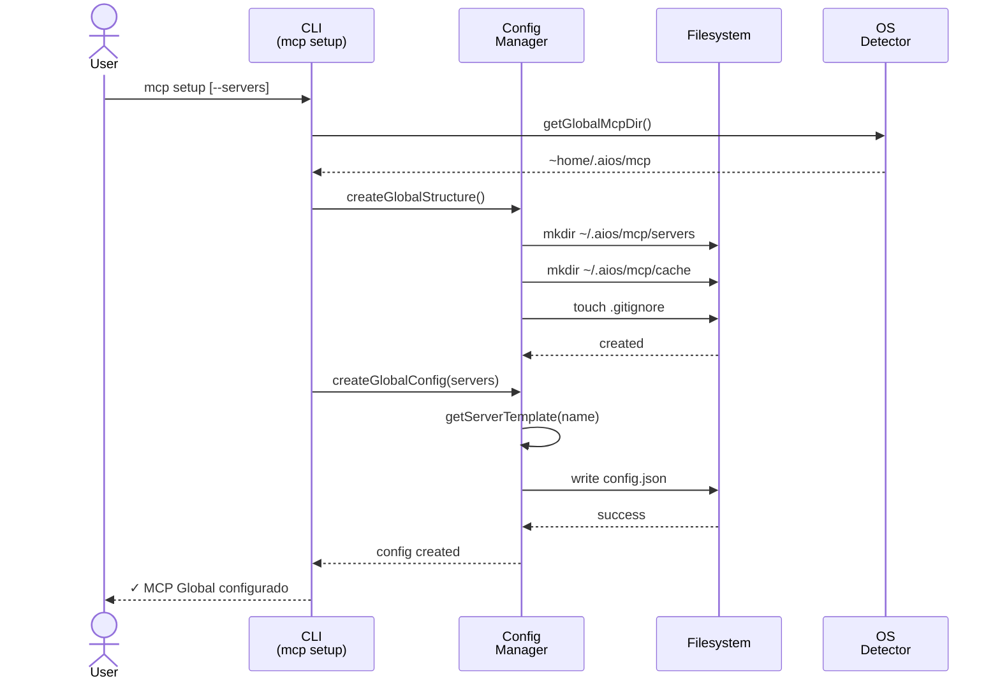
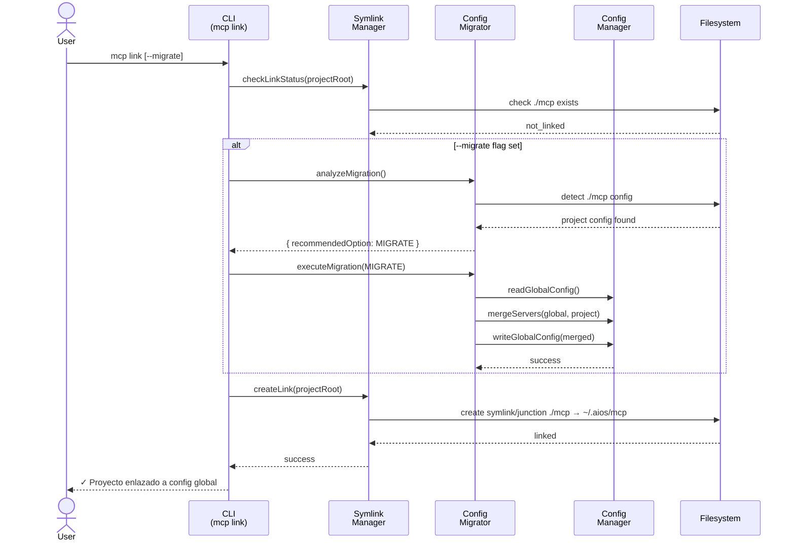

<!-- Traducción: ES | Original: /docs/en/architecture/mcp-system-diagrams.md | Sincronización: 2026-01-26 -->

# MCP System Global - Diagramas de Arquitectura

**Historia:** 2.11 - MCP System Global
**Generado por:** CodeRabbit (PR #16)
**Fecha:** 2025-12-01

---

## Flujo de Configuración MCP

---

## Flujo de Enlace MCP (con Migración)

---

## Descripción General de Componentes

### Módulos Principales

| Módulo | Archivo | Propósito |
|--------|---------|-----------|
| **OS Detector** | `core/mcp/os-detector.js` | Detección multiplataforma de SO/rutas |
| **Config Manager** | `core/mcp/global-config-manager.js` | CRUD de configuración global y plantillas de servidor |
| **Symlink Manager** | `core/mcp/symlink-manager.js` | Gestión de enlaces symlink/junction |
| **Config Migrator** | `core/mcp/config-migrator.js` | Migración de proyecto a global con fusión |

### Comandos CLI

| Comando | Archivo | Propósito |
|---------|---------|-----------|
| `mcp setup` | `cli/commands/mcp/setup.js` | Configurar config global |
| `mcp link` | `cli/commands/mcp/link.js` | Enlazar proyecto a global |
| `mcp status` | `cli/commands/mcp/status.js` | Mostrar estado de config |
| `mcp add` | `cli/commands/mcp/add.js` | Agregar/eliminar/habilitar servidores |

---

## Análisis de Complejidad (CodeRabbit)

| Componente | Complejidad | Áreas Clave |
|------------|-------------|-------------|
| **config-migrator.js** | Alta | Lógica de migración multi-ruta, fusión de servidores, resolución de conflictos |
| **symlink-manager.js** | Media | Enlaces multiplataforma (symlinks Unix, junctions Windows) |
| **global-config-manager.js** | Media | Sistema de plantillas de servidor con persistencia por servidor |
| **Orquestación CLI** | Media | Validación multi-paso, solicitud al usuario |

**Esfuerzo de Revisión Estimado:** 🎯 4 (Complejo) | ⏱️ ~60 minutos

---

*Generado desde revisión de PR de CodeRabbit - Historia 2.11*
