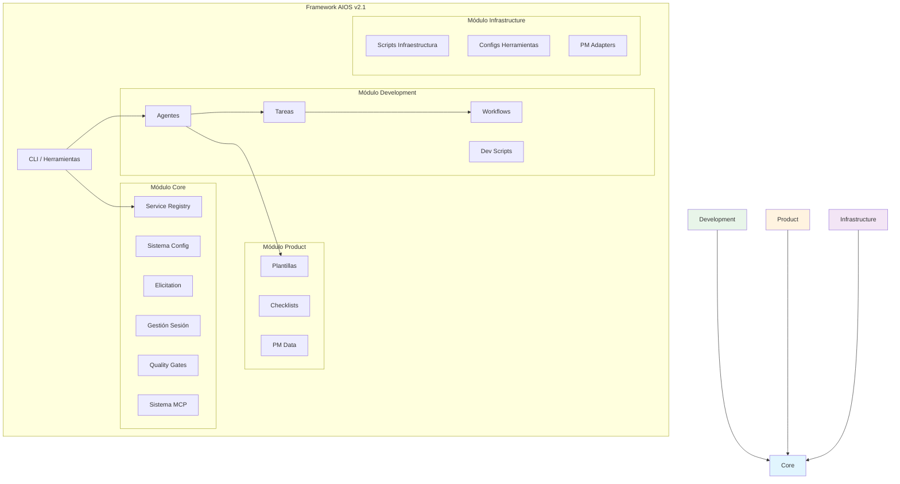
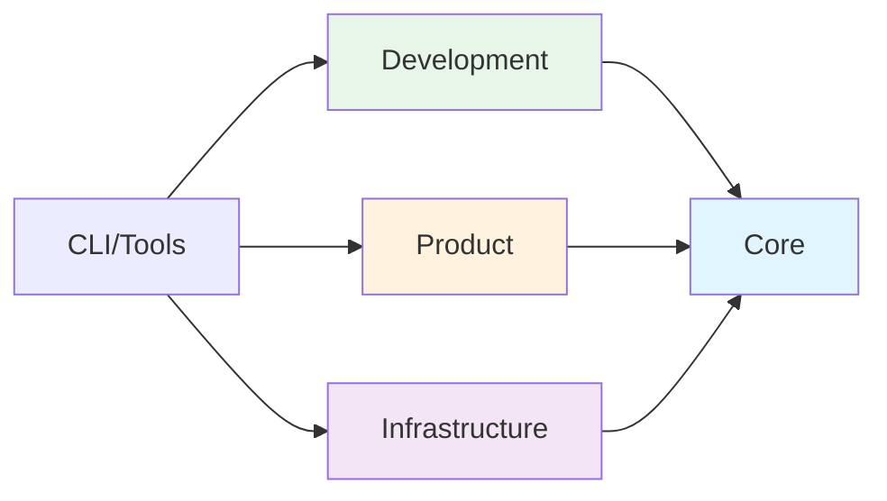

<!-- Traducción: ES | Original: /docs/en/architecture/module-system.md | Sincronización: 2026-01-26 -->

# Arquitectura del Sistema de Módulos AIOS

> Guía completa de la arquitectura modular v2.1 para Synkra AIOS.

**Versión:** 2.1.0
**Última Actualización:** 2025-12-01
**Story:** [2.16 - Documentation Sprint 2](../stories/v2.1/sprint-2/story-2.16-documentation.md)

---

## Visión General

### ¿Por qué Arquitectura Modular?

La arquitectura modular v2.1 aborda varios desafíos de la estructura plana v2.0:

| Desafío | Problema v2.0 | Solución v2.1 |
|-----------|--------------|---------------|
| **Descubribilidad** | 200+ archivos en directorios mezclados | Organizado por responsabilidad |
| **Mantenimiento** | Propiedad poco clara | Los límites de módulos definen propiedad |
| **Dependencias** | Implícitas, circulares | Explícitas, unidireccionales |
| **Escalabilidad** | Todos los archivos cargados siempre | Carga lazy por módulo |
| **Testing** | Solo tests de sistema completo | Aislamiento a nivel de módulo |

### Principios de Diseño

1. **Responsabilidad Única** - Cada módulo tiene un propósito claro
2. **Dependencias Explícitas** - Los módulos declaran lo que necesitan
3. **Acoplamiento Débil** - Los cambios en un módulo no se propagan en cascada
4. **Alta Cohesión** - La funcionalidad relacionada permanece junta
5. **Carga Lazy** - Cargar solo lo necesario

---

## Estructura de Módulos

Synkra AIOS organiza el directorio `.aios-core/` en cuatro módulos principales:

```
.aios-core/
├── core/              # Fundamentos del framework
├── development/       # Artefactos de desarrollo
├── product/           # Plantillas orientadas al usuario
└── infrastructure/    # Configuración del sistema
```

### Diagrama de Módulos



---

## Módulo Core

**Ruta:** `.aios-core/core/`
**Propósito:** Fundamentos del framework - configuración, sesión, elicitation y componentes esenciales de runtime.

### Contenidos

| Directorio | Contenidos | Descripción |
|-----------|----------|-------------|
| `config/` | `config-cache.js`, `config-loader.js` | Gestión de configuración con caché TTL |
| `data/` | `aios-kb.md`, `workflow-patterns.yaml` | Base de conocimiento del framework |
| `docs/` | Documentación interna | Guías de componentes, troubleshooting |
| `elicitation/` | `elicitation-engine.js`, `session-manager.js` | Sistema de prompting interactivo |
| `session/` | `context-detector.js`, `context-loader.js` | Gestión de contexto de sesión |
| `utils/` | `output-formatter.js`, `yaml-validator.js` | Utilidades comunes |
| `registry/` | `service-registry.json`, `registry-loader.js` | Sistema de service discovery |
| `quality-gates/` | `quality-gate-manager.js`, layer configs | Sistema de quality gate de 3 capas |
| `mcp/` | `global-config-manager.js`, `os-detector.js` | Configuración global MCP |
| `manifest/` | `manifest-generator.js`, `manifest-validator.js` | Sistema de manifiesto de proyecto |
| `migration/` | `migration-config.yaml`, `module-mapping.yaml` | Configuración de migración |

### APIs Clave

```javascript
// Configuración
const { loadAgentConfig, globalConfigCache } = require('./.aios-core/core');

// Sesión
const { ContextDetector, SessionContextLoader } = require('./.aios-core/core');

// Elicitation
const { ElicitationEngine, ElicitationSessionManager } = require('./.aios-core/core');

// Registry
const { getRegistry, loadRegistry } = require('./.aios-core/core/registry/registry-loader');

// Quality Gates
const QualityGateManager = require('./.aios-core/core/quality-gates/quality-gate-manager');
```

### Dependencias

- **Externas:** `js-yaml`, `fs-extra`
- **Internas:** Ninguna (módulo de fundación)

---

## Módulo Development

**Ruta:** `.aios-core/development/`
**Propósito:** Assets relacionados con agentes - definiciones de agentes, tareas, workflows y scripts de desarrollo.

### Contenidos

| Directorio | Contenidos | Descripción |
|-----------|----------|-------------|
| `agents/` | 11 definiciones de agentes | `dev.md`, `qa.md`, `architect.md`, etc. |
| `agent-teams/` | 5 configuraciones de equipo | Grupos de agentes predefinidos |
| `tasks/` | 115+ definiciones de tareas | Workflows de tareas ejecutables |
| `workflows/` | 7 definiciones de workflows | Workflows de desarrollo multi-paso |
| `scripts/` | 24 scripts | Utilidades de soporte para agentes |

### Agentes

| Agente | ID | Responsabilidad |
|-------|-----|---------------|
| AIOS Master | `aios-master` | Orquestación del framework |
| Developer | `dev` | Implementación de código |
| QA | `qa` | Aseguramiento de calidad |
| Architect | `architect` | Arquitectura técnica |
| Product Owner | `po` | Backlog de producto |
| Product Manager | `pm` | Estrategia de producto |
| Scrum Master | `sm` | Facilitación de procesos |
| Analyst | `analyst` | Análisis de negocio |
| Data Engineer | `data-engineer` | Ingeniería de datos |
| DevOps | `devops` | CI/CD y operaciones |
| UX Expert | `ux-design-expert` | Experiencia de usuario |

### Equipos de Agentes

| Equipo | Agentes | Caso de Uso |
|------|--------|----------|
| `team-all` | Los 11 agentes | Equipo de desarrollo completo |
| `team-fullstack` | dev, qa, architect, devops | Proyectos full-stack |
| `team-ide-minimal` | dev, qa | Setup IDE mínimo |
| `team-no-ui` | dev, architect, devops, data-engineer | Proyectos Backend/API |
| `team-qa-focused` | qa, dev, architect | Trabajo enfocado en calidad |

### Dependencias

- **Internas:** `core/` (configuración, sesión, elicitation)

---

## Módulo Product

**Ruta:** `.aios-core/product/`
**Propósito:** Assets PM/PO - plantillas, checklists y datos de referencia para generación de documentos.

### Contenidos

| Directorio | Contenidos | Descripción |
|-----------|----------|-------------|
| `templates/` | 52+ plantillas | PRDs, stories, arquitecturas, reglas IDE |
| `checklists/` | 11 checklists | Checklists de validación de calidad |
| `data/` | 6 archivos de datos | Base de conocimiento PM y referencia |

### Plantillas Clave

| Plantilla | Propósito |
|----------|---------|
| `story-tmpl.yaml` | Template de story v2.0 |
| `prd-tmpl.yaml` | Documento de Requisitos de Producto |
| `architecture-tmpl.yaml` | Documentación de arquitectura |
| `qa-gate-tmpl.yaml` | Template de quality gate |
| `ide-rules/` | 9 archivos de reglas específicas por IDE |

### Checklists

- `architect-checklist.md` - Revisión de arquitectura
- `pm-checklist.md` - Validación PM
- `po-master-checklist.md` - Validación maestra PO
- `story-dod-checklist.md` - Definition of Done de Story
- `pre-push-checklist.md` - Validación pre-push
- `release-checklist.md` - Validación de release

### Dependencias

- **Internas:** `core/` (motor de plantillas, validadores)
- **Externas:** Ninguna (assets estáticos)

---

## Módulo Infrastructure

**Ruta:** `.aios-core/infrastructure/`
**Propósito:** Configuración del sistema - scripts, herramientas e integraciones externas.

### Contenidos

| Directorio | Contenidos | Descripción |
|-----------|----------|-------------|
| `scripts/` | 55+ scripts | Utilidades de infraestructura |
| `tools/` | Configuraciones de herramientas | CLI, MCP, configs de herramientas locales |
| `integrations/` | PM adapters | Adapters ClickUp, Jira, GitHub |
| `tests/` | Tests de módulo | Validación de infraestructura |

### Scripts Clave

| Script | Propósito |
|--------|---------|
| `git-wrapper.js` | Wrapper de operaciones Git |
| `backup-manager.js` | Sistema de backup/restore |
| `template-engine.js` | Procesamiento de plantillas |
| `security-checker.js` | Validación de seguridad |
| `performance-analyzer.js` | Análisis de rendimiento |

### Configuraciones de Herramientas

```
tools/
├── cli/           # Configs herramientas CLI (gh, railway, supabase)
├── mcp/           # Configs servidores MCP
└── local/         # Configs herramientas locales
```

### Dependencias

- **Internas:** `core/` (configuración, utilidades)
- **Externas:** Varias APIs de herramientas

---

## Límites de Módulos

### Reglas de Dependencia



**Reglas:**
1. `core/` no tiene dependencias internas
2. `development/`, `product/`, `infrastructure/` dependen solo de `core/`
3. No se permiten dependencias circulares
4. CLI/tools puede acceder a cualquier módulo

### Comunicación Inter-Módulos

Los módulos se comunican a través de:

1. **Service Registry** - Descubrir workers y servicios disponibles
2. **Sistema de Configuración** - Compartir ajustes y preferencias
3. **Sistema de Eventos** - Publish/subscribe para acoplamiento débil
4. **Sistema de Archivos** - Directorios de datos compartidos

### Checklist de Límites de Módulos

Al agregar nueva funcionalidad:

- [ ] ¿Pertenece a un módulo existente?
- [ ] ¿Introduce nuevas dependencias?
- [ ] ¿Mantiene el flujo de dependencias unidireccional?
- [ ] ¿Es cohesivo con el propósito del módulo?
- [ ] ¿Puede testearse en aislamiento?

---

## Organización de Archivos

### Convenciones de Nomenclatura

| Tipo | Convención | Ejemplo |
|------|------------|---------|
| Scripts | `kebab-case.js` | `config-loader.js` |
| Agentes | `agent-id.md` | `dev.md`, `qa.md` |
| Tareas | `agent-prefix-task-name.md` | `dev-develop-story.md` |
| Plantillas | `name-tmpl.yaml` | `story-tmpl.yaml` |
| Checklists | `name-checklist.md` | `pre-push-checklist.md` |

### Agregando Nuevos Archivos

| Tipo de Archivo | Ubicación | Módulo |
|-----------|----------|--------|
| Definición de agente | `development/agents/` | Development |
| Definición de tarea | `development/tasks/` | Development |
| Workflow | `development/workflows/` | Development |
| Plantilla | `product/templates/` | Product |
| Checklist | `product/checklists/` | Product |
| Script utilitario | `infrastructure/scripts/` | Infrastructure |
| Config loader | `core/config/` | Core |
| Registry | `core/registry/` | Core |

---

## Migración desde v2.0

Para proyectos actualizando desde la estructura plana v2.0:

```bash
# Dry run para previsualizar cambios
aios migrate --dry-run

# Ejecutar migración
aios migrate --from=2.0 --to=2.1

# Validar migración
aios migrate --validate
```

Ver [Guía de Migración](../migration/v2.0-to-v2.1.md) para instrucciones detalladas.

---

## Documentación Relacionada

- [Guía de Service Discovery](../guides/service-discovery.md)
- [Guía de Quality Gates](../guides/quality-gates.md)
- [Guía de Setup Global MCP](../guides/mcp-global-setup.md)
- [Guía de Migración](../migration/v2.0-to-v2.1.md)
- [ADR-002: Arquitectura Modular](decisions/ADR-002-migration-map.md)

---

*Arquitectura del Sistema de Módulos Synkra AIOS v2.1*
