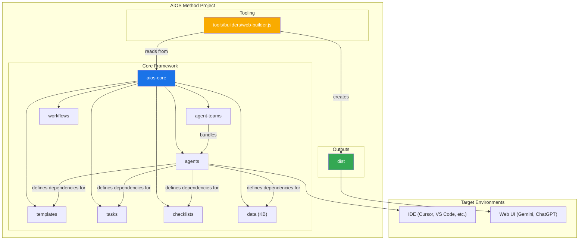
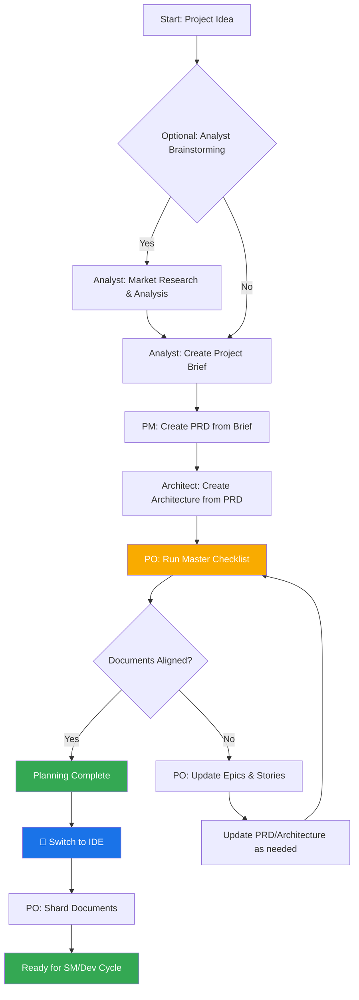
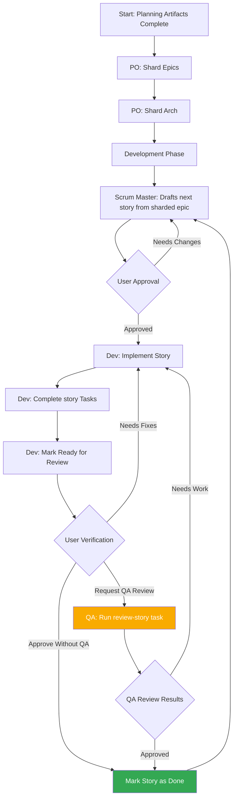

<!--
  Traducción: ES
  Original: /docs/en/core-architecture.md
  Última sincronización: 2026-01-26
-->

# Método AIOS: Arquitectura Central

## 1. Descripción General

El Método AIOS está diseñado para proporcionar modos agénticos, tareas y plantillas que permiten flujos de trabajo repetibles y útiles, ya sea para desarrollo ágil con agentes o expansión hacia dominios muy diferentes. El propósito central del proyecto es proporcionar un conjunto estructurado pero flexible de prompts, plantillas y flujos de trabajo que los usuarios pueden emplear para guiar agentes de IA (como Gemini, Claude o ChatGPT) para realizar tareas complejas, discusiones guiadas u otros flujos específicos de dominio de manera predecible y de alta calidad.

El módulo central del sistema facilita un ciclo de vida de desarrollo completo adaptado a los desafíos de las herramientas modernas de IA agéntica:

1. **Ideación y Planificación**: Lluvia de ideas, investigación de mercado y creación de briefs de proyecto.
2. **Arquitectura y Diseño**: Definición de arquitectura del sistema y especificaciones de UI/UX.
3. **Ejecución del Desarrollo**: Un flujo de trabajo cíclico donde un agente Scrum Master (SM) redacta historias con contexto extremadamente específico y un agente Desarrollador (Dev) las implementa una a la vez. Este proceso funciona tanto para proyectos nuevos (Greenfield) como existentes (Brownfield).

## 2. Diagrama de Arquitectura del Sistema

Todo el ecosistema del Método AIOS está diseñado alrededor del directorio `aios-core` instalado, que actúa como el cerebro de la operación. El directorio `tools` proporciona los medios para procesar y empaquetar este cerebro para diferentes entornos.

## 3. Componentes Centrales

El directorio `aios-core` contiene todas las definiciones y recursos que dan a los agentes sus capacidades.

### 3.1. Agentes (`aios-core/agents/`)

- **Propósito**: Estos son los bloques de construcción fundamentales del sistema. Cada archivo markdown (por ejemplo, `aios-master.md`, `pm.md`, `dev.md`) define la persona, capacidades y dependencias de un único agente de IA.
- **Estructura**: Un archivo de agente contiene un encabezado YAML que especifica su rol, persona, dependencias e instrucciones de inicio. Estas dependencias son listas de tareas, plantillas, checklists y archivos de datos que el agente tiene permitido usar.
- **Instrucciones de Inicio**: Los agentes pueden incluir secuencias de inicio que cargan documentación específica del proyecto desde la carpeta `docs/`, como estándares de código, especificaciones de API o documentos de estructura del proyecto. Esto proporciona contexto inmediato del proyecto al momento de la activación.
- **Integración de Documentos**: Los agentes pueden referenciar y cargar documentos desde la carpeta `docs/` del proyecto como parte de tareas, flujos de trabajo o secuencias de inicio. Los usuarios también pueden arrastrar documentos directamente a las interfaces de chat para proporcionar contexto adicional.
- **Ejemplo**: El agente `aios-master` lista sus dependencias, lo que indica a la herramienta de construcción qué archivos incluir en un paquete web e informa al agente de sus propias capacidades.

### 3.2. Equipos de Agentes (`aios-core/agent-teams/`)

- **Propósito**: Los archivos de equipo (por ejemplo, `team-all.yaml`) definen colecciones de agentes y flujos de trabajo que se empaquetan juntos para un propósito específico, como "desarrollo full-stack" o "solo backend". Esto crea un contexto pre-empaquetado más grande para entornos de UI web.
- **Estructura**: Un archivo de equipo lista los agentes a incluir. Puede usar comodines, como `"*"` para incluir todos los agentes. Esto permite la creación de paquetes completos como `team-all`.

### 3.3. Flujos de Trabajo (`aios-core/workflows/`)

- **Propósito**: Los flujos de trabajo son archivos YAML (por ejemplo, `greenfield-fullstack.yaml`) que definen una secuencia prescrita de pasos e interacciones de agentes para un tipo de proyecto específico. Actúan como una guía estratégica para el usuario y el agente `aios-orchestrator`.
- **Estructura**: Un flujo de trabajo define secuencias tanto para proyectos complejos como simples, lista los agentes involucrados en cada paso, los artefactos que crean y las condiciones para pasar de un paso al siguiente. A menudo incluye un diagrama Mermaid para visualización.

### 3.4. Recursos Reutilizables (`templates`, `tasks`, `checklists`, `data`)

- **Propósito**: Estas carpetas albergan los componentes modulares que son cargados dinámicamente por los agentes según sus dependencias.
  - **`templates/`**: Contiene plantillas markdown para documentos comunes como PRDs, especificaciones de arquitectura e historias de usuario.
  - **`tasks/`**: Define las instrucciones para llevar a cabo acciones específicas y repetibles como "shard-doc" o "create-next-story".
  - **`checklists/`**: Proporciona checklists de aseguramiento de calidad para agentes como el Product Owner (`po`) o Arquitecto.
  - **`data/`**: Contiene la base de conocimientos central (`aios-kb.md`), preferencias técnicas (`technical-preferences.md`) y otros archivos de datos clave.

#### 3.4.1. Sistema de Procesamiento de Plantillas

Un principio arquitectónico clave de AIOS es que las plantillas son autónomas e interactivas - incorporan tanto la salida de documento deseada como las instrucciones LLM necesarias para trabajar con los usuarios. Esto significa que en muchos casos, no se necesita una tarea separada para la creación de documentos, ya que la plantilla misma contiene toda la lógica de procesamiento.

El framework AIOS emplea un sistema sofisticado de procesamiento de plantillas orquestado por tres componentes clave:

- **`template-format.md`** (`aios-core/utils/`): Define el lenguaje de marcado fundamental usado en todas las plantillas de AIOS. Esta especificación establece reglas de sintaxis para sustitución de variables (`{{placeholders}}`), directivas de procesamiento solo para IA (`[[LLM: instructions]]`) y bloques de lógica condicional. Las plantillas siguen este formato para asegurar un procesamiento consistente en todo el sistema.

- **`create-doc.md`** (`aios-core/tasks/`): Actúa como el motor de orquestación que gestiona todo el flujo de trabajo de generación de documentos. Esta tarea coordina la selección de plantillas, gestiona los modos de interacción del usuario (generación incremental vs. rápida), aplica las reglas de procesamiento de template-format y maneja la validación. Sirve como la interfaz principal entre usuarios y el sistema de plantillas.

- **`advanced-elicitation.md`** (`aios-core/tasks/`): Proporciona una capa de refinamiento interactivo que puede ser incorporada dentro de plantillas a través de bloques `[[LLM: instructions]]`. Este componente ofrece 10 acciones estructuradas de lluvia de ideas, capacidades de revisión sección por sección y flujos de trabajo de mejora iterativa para mejorar la calidad del contenido.

El sistema mantiene una clara separación de responsabilidades: el marcado de plantillas es procesado internamente por agentes de IA pero nunca se expone a los usuarios, mientras proporciona capacidades sofisticadas de procesamiento de IA a través de inteligencia incorporada dentro de las propias plantillas.

#### 3.4.2. Sistema de Preferencias Técnicas

AIOS incluye una capa de personalización a través del archivo `technical-preferences.md` en `aios-core/data/`. Este archivo sirve como un perfil técnico persistente que influye en el comportamiento de los agentes en todos los proyectos.

**Propósito y Beneficios:**

- **Consistencia**: Asegura que todos los agentes referencien las mismas preferencias técnicas
- **Eficiencia**: Elimina la necesidad de especificar repetidamente las tecnologías preferidas
- **Personalización**: Los agentes proporcionan recomendaciones alineadas con las preferencias del usuario
- **Aprendizaje**: Captura lecciones aprendidas y preferencias que evolucionan con el tiempo

**Estructura del Contenido:**
El archivo típicamente incluye stacks tecnológicos preferidos, patrones de diseño, servicios externos, estándares de código y anti-patrones a evitar. Los agentes referencian automáticamente este archivo durante la planificación y desarrollo para proporcionar sugerencias contextualmente apropiadas.

**Puntos de Integración:**

- Las plantillas pueden referenciar preferencias técnicas durante la generación de documentos
- Los agentes sugieren tecnologías preferidas cuando son apropiadas para los requisitos del proyecto
- Cuando las preferencias no se ajustan a las necesidades del proyecto, los agentes explican alternativas
- Los paquetes web pueden incluir contenido de preferencias para comportamiento consistente en todas las plataformas

**Evolución en el Tiempo:**
Se anima a los usuarios a actualizar continuamente este archivo con descubrimientos de proyectos, agregando tanto preferencias positivas como tecnologías a evitar, creando una base de conocimientos personalizada que mejora las recomendaciones de los agentes con el tiempo.

## 4. El Proceso de Construcción y Entrega

El framework está diseñado para dos entornos principales: IDEs locales e interfaces de chat de IA basadas en web. El script `web-builder.js` es la clave para soportar este último.

### 4.1. Web Builder (`tools/builders/web-builder.js`)

- **Propósito**: Este script Node.js es responsable de crear los paquetes `.txt` encontrados en `dist`.
- **Proceso**:
  1. **Resuelve Dependencias**: Para un agente o equipo dado, el script lee su archivo de definición.
  2. Encuentra recursivamente todos los recursos dependientes (tareas, plantillas, etc.) que el agente/equipo necesita.
  3. **Empaqueta Contenido**: Lee el contenido de todos estos archivos y los concatena en un único archivo de texto grande, con separadores claros indicando la ruta original de cada sección.
  4. **Genera Paquete**: El archivo `.txt` final se guarda en el directorio `dist`, listo para ser subido a una UI web.

### 4.2. Uso Específico por Entorno

- **Para IDEs**: Los usuarios interactúan con los agentes directamente a través de sus archivos markdown en `aios-core/agents/`. La integración del IDE (para Cursor, Claude Code, etc.) sabe cómo llamar a estos agentes.
- **Para UIs Web**: Los usuarios suben un paquete pre-construido desde `dist`. Este único archivo proporciona a la IA el contexto de todo el equipo y todas sus herramientas y conocimientos requeridos.

## 5. Flujos de Trabajo de AIOS

### 5.1. El Flujo de Trabajo de Planificación

Antes de que comience el desarrollo, AIOS sigue un flujo de trabajo de planificación estructurado que establece la base para la ejecución exitosa del proyecto:

**Fases Clave de Planificación:**

1. **Análisis Opcional**: El Analista realiza investigación de mercado y análisis competitivo
2. **Brief del Proyecto**: Documento base creado por el Analista o el usuario
3. **Creación del PRD**: El PM transforma el brief en requisitos de producto completos
4. **Diseño de Arquitectura**: El Arquitecto crea la base técnica basada en el PRD
5. **Validación y Alineación**: El PO asegura que todos los documentos sean consistentes y completos
6. **Refinamiento**: Actualizaciones a épicas, historias y documentos según sea necesario
7. **Transición de Entorno**: Cambio crítico desde UI web hacia IDE para el flujo de desarrollo
8. **Preparación de Documentos**: El PO fragmenta documentos grandes para consumo del desarrollo

**Orquestación del Flujo de Trabajo**: El agente `aios-orchestrator` usa estas definiciones de flujo de trabajo para guiar a los usuarios a través del proceso completo, asegurando transiciones apropiadas entre las fases de planificación (UI web) y desarrollo (IDE).

### 5.2. El Ciclo Central de Desarrollo

Una vez que las fases iniciales de planificación y arquitectura están completas, el proyecto pasa a un flujo de trabajo de desarrollo cíclico, como se detalla en `aios-kb.md`. Esto asegura un proceso de implementación constante, secuencial y con control de calidad.

Este ciclo continúa, con los agentes Scrum Master, Desarrollador y opcionalmente QA trabajando juntos. El agente QA proporciona capacidades de revisión de desarrollador senior a través de la tarea `review-story`, ofreciendo refactorización de código, mejoras de calidad y transferencia de conocimiento. Esto asegura alta calidad de código mientras se mantiene la velocidad de desarrollo.
