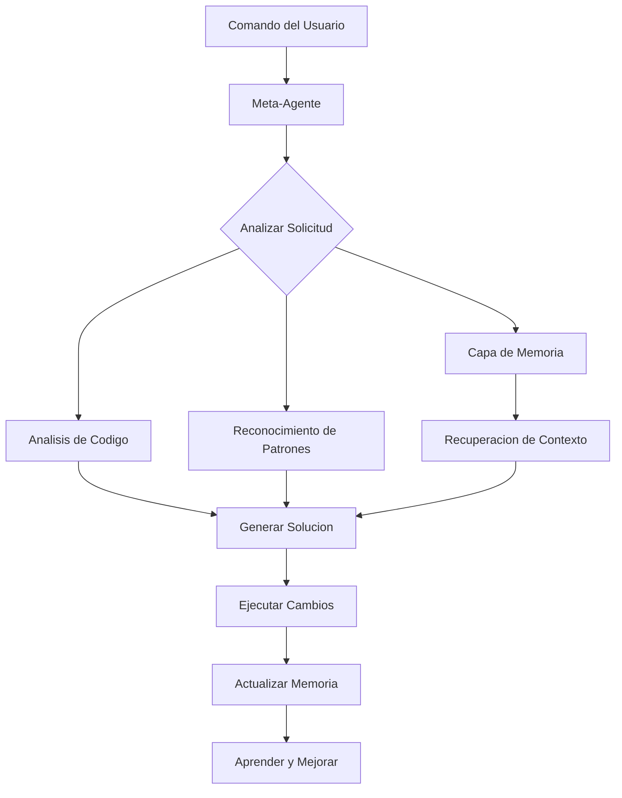

<!--
  Traduccion: ES
  Original: /docs/en/getting-started.md
  Ultima sincronizacion: 2026-01-26
-->

# Primeros Pasos con Synkra AIOS

Bienvenido a Synkra AIOS! Esta guia te llevara a traves de tus primeros pasos con el framework de desarrollo auto-modificable impulsado por IA.

## Tabla de Contenidos

1. [Instalacion](#instalacion)
2. [Tu Primer Proyecto](#tu-primer-proyecto)
3. [Entendiendo el Meta-Agente](#entendiendo-el-meta-agente)
4. [Comandos Basicos](#comandos-basicos)
5. [Creando Tu Primer Agente](#creando-tu-primer-agente)
6. [Trabajando con Tareas](#trabajando-con-tareas)
7. [Fundamentos de la Capa de Memoria](#fundamentos-de-la-capa-de-memoria)
8. [Mejores Practicas](#mejores-practicas)
9. [Patrones Comunes](#patrones-comunes)
10. [Siguientes Pasos](#siguientes-pasos)

## Instalacion

### Prerrequisitos

Antes de instalar Synkra AIOS, asegurate de tener:

- **Node.js** version 14.0.0 o superior
- **npm** version 6.0.0 o superior
- **Git** (opcional, pero recomendado)
- Al menos **1GB** de espacio libre en disco

### Instalacion Rapida

La forma mas rapida de comenzar es usando npx:

```bash
# Crear un nuevo proyecto
npx @synkra/aios-core init my-first-project

# Navegar a tu proyecto
cd my-first-project

# Iniciar el meta-agente
npx @synkra/aios-core
```

### Opciones de Instalacion

Synkra AIOS ofrece opciones de instalacion flexibles:

```bash
# 1. Crear nuevo proyecto con plantilla personalizada
npx @synkra/aios-core init my-project --template enterprise

# 2. Instalar en proyecto existente
cd existing-project
npx @synkra/aios-core install

# 3. Forzar instalacion en directorio no vacio
npx @synkra/aios-core init my-project --force

# 4. Omitir instalacion de dependencias (instalar manualmente despues)
npx @synkra/aios-core init my-project --skip-install
```

## Tu Primer Proyecto

### Estructura del Proyecto

Despues de la instalacion, tu proyecto tendra esta estructura:

```
my-first-project/
├── .aios/                    # Configuracion del framework
│   ├── config.json          # Archivo de configuracion principal
│   ├── memory-config.json   # Configuracion de capa de memoria
│   ├── cache/              # Cache de rendimiento
│   └── logs/               # Logs del sistema
├── agents/                  # Directorio de agentes IA
│   └── sample-agent.yaml   # Agente de ejemplo
├── components/             # Componentes de la aplicacion
├── workflows/              # Workflows automatizados
├── tasks/                  # Tareas reutilizables
├── tests/                  # Suites de pruebas
├── .env                    # Variables de entorno
└── package.json           # Dependencias del proyecto
```

### Configuracion

El archivo de configuracion principal (`.aios/config.json`) contiene:

```json
{
  "version": "1.0.0",
  "projectName": "my-first-project",
  "features": [
    "meta-agent",
    "memory-layer",
    "self-modification",
    "telemetry"
  ],
  "ai": {
    "provider": "openai",
    "model": "gpt-4"
  },
  "environment": "development"
}
```

### Configuracion del Entorno

Configura tu proveedor de IA en el archivo `.env`:

```env
# Configuracion del Proveedor de IA
OPENAI_API_KEY=your-openai-api-key
# o
ANTHROPIC_API_KEY=your-anthropic-api-key

# Configuracion del Framework
NODE_ENV=development
AIOS_TELEMETRY=enabled
```

## Entendiendo el Meta-Agente

El meta-agente es el nucleo de Synkra AIOS - una IA que entiende y puede modificar su propia base de codigo.

### Capacidades Principales

1. **Auto-Analisis**: Examina su propia estructura de codigo
2. **Generacion de Codigo**: Crea componentes optimizados
3. **Aprendizaje de Patrones**: Aprende de tu estilo de desarrollo
4. **Auto-Evolucion**: Mejora basandose en el uso
5. **Refactorizacion Inteligente**: Sugiere e implementa mejoras

### Como Funciona



## Comandos Basicos

### Iniciando el Meta-Agente

```bash
# Iniciar en directorio actual
npx @synkra/aios-core

# O usar el atajo
npx aios
```

### Comandos Esenciales

Una vez que el meta-agente esta ejecutandose, usa estos comandos:

```bash
# Ayuda e Informacion
*help                    # Mostrar todos los comandos disponibles
*status                  # Mostrar estado del sistema
*config                  # Ver configuracion actual

# Gestion de Agentes
*list-agents             # Mostrar todos los agentes disponibles
*activate <agent-name>   # Activar agente especifico
*deactivate <agent-name> # Desactivar agente

# Operaciones Basicas
*analyze                 # Analizar base de codigo actual
*suggest                 # Obtener sugerencias de mejora
*learn                   # Aprender de cambios recientes
```

## Creando Tu Primer Agente

### Paso 1: Usar el Comando de Creacion

```bash
*create-agent my-helper
```

El meta-agente te guiara a traves del proceso de creacion:

1. **Nombre**: Elige un nombre descriptivo
2. **Tipo**: Selecciona tipo de agente (assistant, analyzer, generator)
3. **Capacidades**: Define lo que el agente puede hacer
4. **Instrucciones**: Proporciona directrices de comportamiento

### Paso 2: Definicion del Agente

El meta-agente creara un archivo YAML como este:

```yaml
# agents/my-helper.yaml
name: my-helper
version: 1.0.0
description: Un asistente util para tareas diarias
type: assistant

capabilities:
  - name: summarize
    description: Resumir contenido de texto
    parameters:
      - name: text
        type: string
        required: true
      - name: maxLength
        type: number
        required: false
        default: 100

  - name: translate
    description: Traducir texto entre idiomas
    parameters:
      - name: text
        type: string
        required: true
      - name: targetLanguage
        type: string
        required: true

instructions: |
  Eres un asistente util que resume y traduce texto.
  Se conciso, preciso y mantiene el significado original.

examples:
  - input: "*my-helper summarize 'Texto largo aqui...'"
    output: "Resumen: Puntos clave del texto"

  - input: "*my-helper translate 'Hello' --targetLanguage spanish"
    output: "Traduccion: Hola"
```

### Paso 3: Probar Tu Agente

```bash
# Activar el agente
*activate my-helper

# Probar resumen
*my-helper summarize "Este es un texto largo que necesita ser resumido..."

# Probar traduccion
*my-helper translate "Hello world" --targetLanguage french
```

## Trabajando con Tareas

Las tareas son operaciones reutilizables que los agentes pueden realizar.

### Creando una Tarea

```bash
*create-task data-processor
```

Esto crea una plantilla de tarea:

```markdown
# tasks/data-processor.md

## Proposito
Procesar y transformar datos segun especificaciones

## Patron de Comando
```
*data-processor <input> [options]
```

## Parametros
- `input`: Datos a procesar
- `--format`: Formato de salida (json, csv, xml)
- `--transform`: Tipo de transformacion

## Implementacion
```javascript
class DataProcessor {
  async execute(params) {
    const { input, format = 'json', transform } = params;

    // Logica de procesamiento aqui
    let processed = this.transform(input, transform);

    return this.format(processed, format);
  }
}
```
```

### Usando Tareas en Workflows

```yaml
# workflows/data-pipeline.yaml
name: data-pipeline
description: Pipeline de procesamiento de datos automatizado

triggers:
  - type: schedule
    cron: "0 */6 * * *"  # Cada 6 horas

steps:
  - task: fetch-data
    params:
      source: "api/endpoint"

  - task: data-processor
    params:
      transform: "normalize"
      format: "json"

  - task: save-results
    params:
      destination: "processed/data"
```

## Fundamentos de la Capa de Memoria

La capa de memoria impulsada por LlamaIndex proporciona gestion inteligente de contexto.

### Como Funciona la Memoria

1. **Indexacion**: Todo el codigo y documentacion es indexado
2. **Busqueda Semantica**: Encuentra codigo por significado, no solo por palabras clave
3. **Construccion de Contexto**: El contexto relevante se recupera para cada operacion
4. **Aprendizaje**: Los patrones y preferencias son recordados

### Comandos de Memoria

```bash
# Operaciones de memoria
*memory status          # Verificar estado de capa de memoria
*memory search <query>  # Buscar en memoria semantica
*memory clear-cache     # Limpiar cache de memoria
*memory rebuild         # Reconstruir indice de memoria
```

### Ejemplo: Busqueda Semantica

```bash
# Busqueda tradicional (basada en palabras clave)
*search "getUserData"

# Busqueda semantica (basada en significado)
*memory search "funcion que recupera informacion del usuario de la base de datos"
```

## Mejores Practicas

### 1. Comienza Pequeno

Comienza con tareas y agentes simples antes de crear sistemas complejos:

```bash
# Bueno: Comenzar con agentes enfocados
*create-agent code-formatter
*create-agent test-generator

# Evitar: Agentes iniciales demasiado complejos
*create-agent do-everything-ai
```

### 2. Usa Nombres Descriptivos

Elige nombres claros y descriptivos para agentes y tareas:

```bash
# Buenos nombres
*create-agent api-endpoint-validator
*create-task validate-user-input

# Nombres pobres
*create-agent helper1
*create-task task123
```

### 3. Aprovecha la Capa de Memoria

Permite que el meta-agente aprenda de tus patrones:

```bash
# Despues de hacer cambios
*learn --from recent-changes

# Antes de comenzar nueva funcionalidad
*suggest --based-on similar-features
```

### 4. Analisis Regular

Analiza periodicamente tu base de codigo:

```bash
# Analisis semanal
*analyze-framework --depth full

# Verificacion diaria rapida
*analyze-framework --depth surface
```

### 5. Documenta Tus Agentes

Siempre proporciona instrucciones y ejemplos claros:

```yaml
# Buena documentacion de agente
instructions: |
  Este agente valida respuestas de API contra esquemas OpenAPI.
  Verifica:
  - Presencia de campos requeridos
  - Correccion de tipos de datos
  - Cumplimiento de formato
  - Validacion de reglas de negocio

examples:
  - input: "*validate-api POST /users response"
    output: "Todas las validaciones pasaron"
```

## Patrones Comunes

### Patron 1: Generacion de Componentes

```bash
# Generar un nuevo componente React
*create-component Dashboard --type react --features "charts,filters,export"

# El meta-agente:
# 1. Analiza componentes existentes
# 2. Aplica patrones consistentes
# 3. Genera codigo optimizado
# 4. Crea pruebas
# 5. Actualiza documentacion
```

### Patron 2: Mejora de Calidad de Codigo

```bash
# Mejorar archivo especifico
*improve-code-quality src/services/api.js

# Mejorar modulo completo
*improve-code-quality src/services/ --recursive

# Obtener sugerencias primero
*suggest-improvements src/services/api.js
```

### Patron 3: Generacion de Pruebas

```bash
# Generar pruebas para un componente
*generate-tests src/components/UserProfile.js

# Generar pruebas de integracion
*generate-tests src/api/ --type integration

# Generar basado en patrones de uso
*generate-tests --from-usage-analysis
```

### Patron 4: Documentacion

```bash
# Documentar un modulo
*document src/utils/

# Generar documentacion de API
*generate-api-docs src/api/

# Crear guia de usuario
*create-documentation --type user-guide
```

## Siguientes Pasos

### Acciones Inmediatas

1. **Configura el Proveedor de IA**: Configura tus API keys en `.env`
2. **Ejecuta el Primer Analisis**: Ejecuta `*analyze-framework`
3. **Crea un Agente Personalizado**: Disena un agente para tus necesidades especificas
4. **Explora Ejemplos**: Revisa el directorio `examples/`

### Recursos de Aprendizaje

- **[Referencia de Comandos del Meta-Agente](./meta-agent-commands.md)**: Lista completa de comandos
- **[Vision General de Arquitectura](./architecture.md)**: Profundizacion tecnica
- **[Guia de Solucion de Problemas](./troubleshooting.md)**: Problemas comunes y soluciones
- **[Tutoriales en Video](https://@synkra/aios-core.dev/tutorials)**: Aprendizaje visual

### Temas Avanzados

Una vez comodo con lo basico, explora:

1. **Workflows Personalizados**: Automatiza procesos complejos
2. **Desarrollo de Plugins**: Extiende capacidades del framework
3. **Optimizacion de Rendimiento**: Ajusta para tu caso de uso
4. **Colaboracion en Equipo**: Workflows multi-desarrollador

### Comunidad

Unete a nuestra comunidad para soporte y actualizaciones:

- **Discord**: [Unete a nuestro servidor](https://discord.gg/gk8jAdXWmj)
- **GitHub Discussions**: Comparte ideas y obtiene ayuda
- **Twitter**: Sigue [@aiosfullstack](https://twitter.com/aiosfullstack)

## Referencia Rapida de Solucion de Problemas

### Problemas Comunes

**El meta-agente no inicia**
```bash
# Verificar version de Node.js
node --version  # Deberia ser >= 14.0.0

# Verificar instalacion
npx @synkra/aios-core doctor

# Corregir problemas comunes
npx @synkra/aios-core doctor --fix
```

**Errores de API Key**
```bash
# Verificar que el archivo .env existe
ls -la .env

# Verificar formato de la clave
# Deberia ser: OPENAI_API_KEY=sk-...
```

**Problemas con la capa de memoria**
```bash
# Reconstruir indice
*memory rebuild

# Verificar estado
*memory status

# Limpiar y reconstruir
*memory clear-cache && *memory rebuild
```

---

**Listo para construir algo increible?** El meta-agente esta esperando para ayudarte a crear, mejorar y evolucionar tu codigo. Comienza con `*help` y explora las posibilidades!

Recuerda: Synkra AIOS aprende y mejora con el uso. Cuanto mas interactues con el, mejor entendera tu estilo de desarrollo y necesidades.

Feliz programacion con Synkra AIOS!
