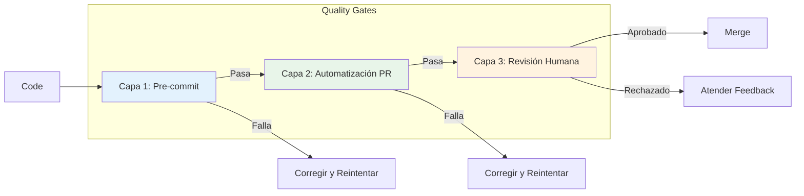

<!--
  Traducción: ES
  Original: /docs/en/guides/quality-gates.md
  Última sincronización: 2026-01-26
-->

# Guía del Sistema de Quality Gates de AIOS

> Guía completa del sistema de quality gates de 3 capas para Synkra AIOS.

**Versión:** 2.1.0
**Última Actualización:** 2025-12-01
**Story:** [2.16 - Documentation Sprint 2](../stories/v2.1/sprint-2/story-2.16-documentation.md)

---

## Resumen

El Sistema de Quality Gates de AIOS proporciona aseguramiento de calidad automatizado a través de tres capas progresivas de validación. Cada capa detecta diferentes tipos de problemas en la etapa apropiada del desarrollo.

### La Arquitectura de 3 Capas



| Capa | Tipo | Velocidad | Propósito |
|------|------|-----------|-----------|
| **Capa 1** | Automatizada | ~30s | Detectar errores de sintaxis, linting, tipos |
| **Capa 2** | Asistida por IA | ~5m | Detectar errores de lógica, seguridad, patrones |
| **Capa 3** | Humana | Variable | Revisión estratégica, aprobación final |

---

## Capa 1: Verificaciones Pre-commit

### Propósito
Verificaciones rápidas y locales que se ejecutan antes de que el código sea comprometido. Detecta problemas obvios inmediatamente.

### Verificaciones Incluidas

| Verificación | Herramienta | Timeout | Descripción |
|--------------|-------------|---------|-------------|
| **Lint** | ESLint | 60s | Estilo de código y mejores prácticas |
| **Test** | Jest | 5m | Pruebas unitarias con cobertura |
| **TypeCheck** | TypeScript | 2m | Validación de tipos estáticos |

### Configuración

```yaml
# .aios-core/core/quality-gates/quality-gate-config.yaml
layer1:
  enabled: true
  failFast: true  # Detener en la primera falla
  checks:
    lint:
      enabled: true
      command: "npm run lint"
      failOn: "error"  # error | warning
      timeout: 60000   # 1 minuto
    test:
      enabled: true
      command: "npm test"
      timeout: 300000  # 5 minutos
      coverage:
        enabled: true
        minimum: 80
    typecheck:
      enabled: true
      command: "npm run typecheck"
      timeout: 120000  # 2 minutos
```

### Ejecutando Capa 1

```bash
# Ejecutar todas las verificaciones de Capa 1
aios qa run --layer=1

# Ejecutar verificación específica
aios qa run --layer=1 --check=lint
aios qa run --layer=1 --check=test
aios qa run --layer=1 --check=typecheck

# Ejecutar con salida detallada
aios qa run --layer=1 --verbose
```

### Salida Esperada

```
Capa 1: Verificaciones Pre-commit
=================================

[1/3] Verificación de Lint
  Ejecutando: npm run lint
  ✓ Pasó (12.3s)
  Sin advertencias ni errores

[2/3] Verificación de Test
  Ejecutando: npm test
  ✓ Pasó (45.2s)
  Cobertura: 87.3% (mínimo: 80%)

[3/3] TypeCheck
  Ejecutando: npm run typecheck
  ✓ Pasó (28.1s)
  0 errores

CAPA 1 APROBADA (85.6s)
```

---

## Capa 2: Automatización de PR

### Propósito
Revisión de código asistida por IA que se ejecuta en pull requests. Detecta problemas más profundos como errores de lógica, vulnerabilidades de seguridad y problemas arquitectónicos.

### Herramientas Integradas

| Herramienta | Propósito | Severidad Bloqueante |
|-------------|-----------|----------------------|
| **CodeRabbit** | Revisión de código con IA | CRÍTICO |
| **Quinn (@qa)** | Revisión de QA automatizada | CRÍTICO |

### Configuración

```yaml
# .aios-core/core/quality-gates/quality-gate-config.yaml
layer2:
  enabled: true
  coderabbit:
    enabled: true
    command: "coderabbit --prompt-only -t uncommitted"
    timeout: 900000  # 15 minutos
    blockOn:
      - CRITICAL
    warnOn:
      - HIGH
    documentOn:
      - MEDIUM
    ignoreOn:
      - LOW
  quinn:
    enabled: true
    autoReview: true
    agentPath: ".claude/commands/AIOS/agents/qa.md"
    severity:
      block: ["CRITICAL"]
      warn: ["HIGH", "MEDIUM"]
```

### Ejecutando Capa 2

```bash
# Ejecutar todas las verificaciones de Capa 2
aios qa run --layer=2

# Ejecutar solo CodeRabbit
aios qa run --layer=2 --tool=coderabbit

# Ejecutar revisión de Quinn (@qa)
aios qa run --layer=2 --tool=quinn
```

### Niveles de Severidad

| Severidad | Acción | Descripción |
|-----------|--------|-------------|
| **CRÍTICO** | Bloquear | Vulnerabilidad de seguridad, riesgo de pérdida de datos, cambio disruptivo |
| **ALTO** | Advertir + Documentar | Problema de rendimiento, validación faltante, anti-patrón |
| **MEDIO** | Documentar | Code smell, sugerencia de mejora, riesgo menor |
| **BAJO** | Ignorar | Preferencia de estilo, optimización menor |

### Integración con CodeRabbit

CodeRabbit realiza revisión de código impulsada por IA con estos enfoques:

- Vulnerabilidades de seguridad
- Problemas de rendimiento
- Calidad y mantenibilidad del código
- Violaciones de mejores prácticas
- Completitud de documentación

```bash
# Ejecución manual de CodeRabbit
coderabbit --prompt-only -t uncommitted

# Con rutas específicas
coderabbit --files "src/**/*.js" --prompt-only
```

### Integración con Quinn (@qa)

El agente de QA realiza revisión automatizada enfocada en:

- Adecuación de cobertura de pruebas
- Manejo de casos límite
- Completitud de manejo de errores
- Validación de criterios de aceptación

```javascript
// Invocación programática de Quinn
const QualityGateManager = require('./.aios-core/core/quality-gates/quality-gate-manager');
const manager = new QualityGateManager();
const result = await manager.runQuinnReview(pullRequestId);
```

---

## Capa 3: Revisión Humana

### Propósito
Revisión humana estratégica para aprobación final. Asegura que los requisitos de negocio se cumplan y las decisiones arquitectónicas sean sólidas.

### Configuración

```yaml
# .aios-core/core/quality-gates/quality-gate-config.yaml
layer3:
  enabled: true
  requireSignoff: true
  assignmentStrategy: "auto"  # auto | manual | round-robin
  defaultReviewer: "@architect"
  checklist:
    enabled: true
    template: "strategic-review-checklist"
    minItems: 5
  signoff:
    required: true
    expiry: 86400000  # 24 horas en ms
```

### Estrategias de Asignación

| Estrategia | Descripción |
|------------|-------------|
| **auto** | Asignar basado en propiedad de archivos y experiencia |
| **manual** | Asignar revisor manualmente |
| **round-robin** | Rotar entre miembros del equipo |

### Lista de Verificación de Revisión

La lista de verificación de revisión estratégica asegura que los revisores cubran áreas clave:

```markdown
## Lista de Verificación de Revisión Estratégica

### Arquitectura
- [ ] Los cambios se alinean con la arquitectura del sistema
- [ ] No se introdujeron dependencias no autorizadas
- [ ] Se mantiene compatibilidad hacia atrás

### Seguridad
- [ ] No se exponen datos sensibles
- [ ] Validación de entrada presente
- [ ] Autenticación/autorización correcta

### Calidad
- [ ] El código es mantenible y legible
- [ ] Las pruebas son exhaustivas
- [ ] Documentación actualizada

### Negocio
- [ ] Criterios de aceptación cumplidos
- [ ] Experiencia de usuario considerada
- [ ] Rendimiento aceptable
```

### Proceso de Aprobación

```bash
# Solicitar revisión humana
aios qa request-review --pr=123

# Aprobar la revisión
aios qa signoff --pr=123 --reviewer="@architect"

# Verificar estado de aprobación
aios qa signoff-status --pr=123
```

---

## Comandos CLI

### `aios qa run`

Ejecutar verificaciones de quality gate.

```bash
# Ejecutar todas las capas secuencialmente
aios qa run

# Ejecutar capa específica
aios qa run --layer=1
aios qa run --layer=2
aios qa run --layer=3

# Ejecutar con opciones
aios qa run --verbose          # Salida detallada
aios qa run --fail-fast        # Detener en primera falla
aios qa run --continue-on-fail # Continuar a pesar de fallas
```

### `aios qa status`

Verificar estado actual de quality gate.

```bash
# Obtener estado general
aios qa status

# Obtener estado para capa específica
aios qa status --layer=1

# Obtener estado para PR
aios qa status --pr=123
```

**Salida:**
```
Estado de Quality Gate
======================

Capa 1: Pre-commit
  Lint:      ✓ Pasó
  Test:      ✓ Pasó (87.3% cobertura)
  TypeCheck: ✓ Pasó

Capa 2: Automatización PR
  CodeRabbit: ✓ Pasó (0 críticos, 2 medios)
  Quinn:      ✓ Pasó

Capa 3: Revisión Humana
  Estado:    Pendiente
  Asignado:  @architect
  Expira:    2025-12-02 12:00:00

General: PENDIENTE DE REVISIÓN
```

### `aios qa report`

Generar reporte de quality gate.

```bash
# Generar reporte
aios qa report

# Exportar a archivo
aios qa report --output=qa-report.json
aios qa report --format=markdown --output=qa-report.md
```

### `aios qa configure`

Configurar ajustes de quality gate.

```bash
# Configuración interactiva
aios qa configure

# Establecer opciones específicas
aios qa configure --layer1.coverage.minimum=90
aios qa configure --layer2.coderabbit.enabled=false
aios qa configure --layer3.requireSignoff=true
```

---

## Integración CI/CD

### GitHub Actions

```yaml
# .github/workflows/quality-gate.yml
name: Quality Gate

on:
  pull_request:
    branches: [main, develop]

jobs:
  layer1:
    name: Capa 1 - Pre-commit
    runs-on: ubuntu-latest
    steps:
      - uses: actions/checkout@v4
      - uses: actions/setup-node@v4
        with:
          node-version: '18'
      - run: npm ci
      - run: aios qa run --layer=1

  layer2:
    name: Capa 2 - Automatización PR
    needs: layer1
    runs-on: ubuntu-latest
    steps:
      - uses: actions/checkout@v4
      - uses: actions/setup-node@v4
        with:
          node-version: '18'
      - run: npm ci
      - run: aios qa run --layer=2
        env:
          CODERABBIT_API_KEY: ${{ secrets.CODERABBIT_API_KEY }}

  layer3:
    name: Capa 3 - Revisión Humana
    needs: layer2
    runs-on: ubuntu-latest
    steps:
      - uses: actions/checkout@v4
      - run: aios qa request-review --pr=${{ github.event.pull_request.number }}
```

### GitLab CI

```yaml
# .gitlab-ci.yml
stages:
  - layer1
  - layer2
  - layer3

layer1:
  stage: layer1
  script:
    - npm ci
    - aios qa run --layer=1

layer2:
  stage: layer2
  script:
    - npm ci
    - aios qa run --layer=2
  needs:
    - layer1

layer3:
  stage: layer3
  script:
    - aios qa request-review
  needs:
    - layer2
  when: manual
```

### Hook Pre-commit

```bash
# .husky/pre-commit
#!/bin/sh
. "$(dirname "$0")/_/husky.sh"

aios qa run --layer=1 --fail-fast
```

---

## Referencia de Configuración

### Ejemplo de Configuración Completa

```yaml
# quality-gate-config.yaml
version: "1.0"

# Capa 1: Verificaciones pre-commit
layer1:
  enabled: true
  failFast: true
  checks:
    lint:
      enabled: true
      command: "npm run lint"
      failOn: "error"
      timeout: 60000
    test:
      enabled: true
      command: "npm test"
      timeout: 300000
      coverage:
        enabled: true
        minimum: 80
    typecheck:
      enabled: true
      command: "npm run typecheck"
      timeout: 120000

# Capa 2: Automatización PR
layer2:
  enabled: true
  coderabbit:
    enabled: true
    command: "coderabbit --prompt-only -t uncommitted"
    timeout: 900000
    blockOn: [CRITICAL]
    warnOn: [HIGH]
    documentOn: [MEDIUM]
    ignoreOn: [LOW]
  quinn:
    enabled: true
    autoReview: true
    agentPath: ".claude/commands/AIOS/agents/qa.md"
    severity:
      block: [CRITICAL]
      warn: [HIGH, MEDIUM]

# Capa 3: Revisión Humana
layer3:
  enabled: true
  requireSignoff: true
  assignmentStrategy: "auto"
  defaultReviewer: "@architect"
  checklist:
    enabled: true
    template: "strategic-review-checklist"
    minItems: 5
  signoff:
    required: true
    expiry: 86400000

# Reportes
reports:
  location: ".aios/qa-reports"
  format: "json"
  retention: 30
  includeMetrics: true

# Persistencia de estado
status:
  location: ".aios/qa-status.json"
  updateOnChange: true

# Salida detallada
verbose:
  enabled: false
  showCommands: true
  showOutput: true
  showTimings: true
```

---

## Solución de Problemas

### Fallas de Capa 1

| Problema | Solución |
|----------|----------|
| Errores de lint | Ejecutar `npm run lint -- --fix` para auto-corregir |
| Fallas de pruebas | Verificar salida de pruebas, actualizar pruebas o corregir código |
| Errores de TypeCheck | Revisar anotaciones de tipo, corregir incompatibilidades de tipos |
| Timeout | Aumentar timeout en configuración u optimizar pruebas |

### Fallas de Capa 2

| Problema | Solución |
|----------|----------|
| CodeRabbit crítico | Atender problemas de seguridad/cambios disruptivos |
| Timeout de CodeRabbit | Verificar red, intentar ejecución manual |
| Quinn bloqueó | Revisar feedback de @qa, actualizar código |

### Problemas de Capa 3

| Problema | Solución |
|----------|----------|
| Sin revisor asignado | Establecer defaultReviewer en configuración |
| Aprobación expirada | Solicitar nueva revisión |
| Lista de verificación incompleta | Completar todos los elementos requeridos |

---

## Documentación Relacionada

- [Arquitectura del Sistema de Módulos](../architecture/module-system.md)
- [Guía de Descubrimiento de Servicios](./service-discovery.md)
- [Story 2.10: Quality Gate Manager](../stories/v2.1/sprint-2/story-2.10-quality-gate-manager.md)

---

*Guía del Sistema de Quality Gates de Synkra AIOS v2.1*
