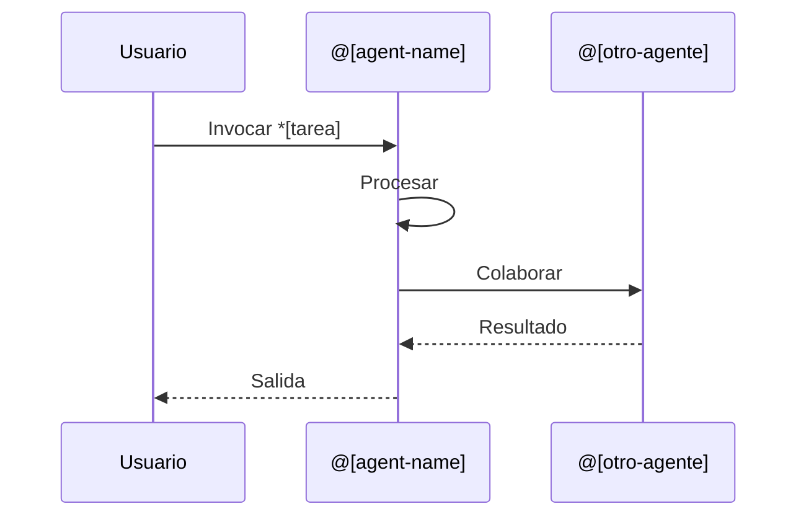
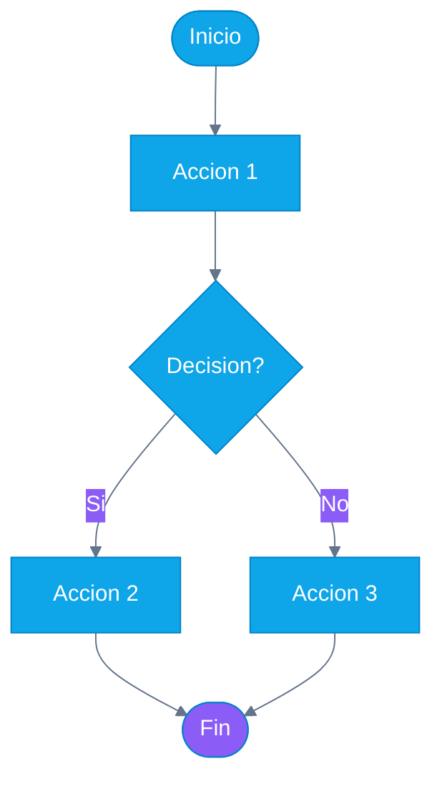

<!-- Traduccion: ES | Original: /docs/en/specifications/docs-agent-technical-specification.md | Sincronizacion: 2026-01-26 -->

# Agente @docs (Ajax) - Especificacion Tecnica

**ID del Agente:** @docs
**Nombre del Agente:** Ajax
**Arquetipo:** Estratega de Contenido (Aries - Creador)
**Version:** 1.0.0
**Creado:** 2025-01-14
**Estado:** Especificacion (Pendiente de Implementacion)

---

## Resumen Ejecutivo

**@docs (Ajax)** es un agente de IA especializado en crear **documentacion educativa** para AIOS. A diferencia de la documentacion tecnica (JSDoc/Typedoc), Ajax se enfoca en **tutoriales, guias de incorporacion, explicadores visuales y materiales de capacitacion para socios**.

### Objetivos Principales

1. **Reducir tiempo manual de documentacion** de 2-4 hrs/semana a <0.5 hrs/semana (solo revision)
2. **Habilitar Wave 4** (Ecosistema de Socios) generando automaticamente materiales de capacitacion
3. **Mantener documentacion actualizada** automaticamente cuando cambia el codigo
4. **Estandarizar contenido** usando plantillas y metricas de calidad

### Impacto Financiero

- **ROI a 3 Anos:** +$83,200 beneficio neto
- **Ahorros Wave 4:** $6,400 inicial + $3,200/ano continuo
- **Ahorro de Tiempo:** 100 hrs/ano interno + 13 min/semana por usuario

### Criterios de Validacion

- Pasa los 4 riesgos de producto (valor, usabilidad, factibilidad, viabilidad)
- Aprobacion unanime de mesa redonda (Brad Frost, Marty Cagan, Paul Graham, Pedro Valerio)
- Dolor de usuario validado (2-4 hrs/semana en documentacion desactualizada)
- Dependencia estrategica (Wave 4 bloqueado sin materiales de capacitacion automatizados)

---

## Definicion del Agente

### Persona

```yaml
agent:
  id: docs
  name: Ajax
  role: Estratega de Contenido
  archetype: Especialista en Contenido Educativo
  zodiac: Aries        # Creador, iniciador, comunicador
  color: Azul          # Conocimiento, confianza, claridad
  element: Aire        # Comunicacion, ideas, claridad

  personality:
    traits:
      - Comunicador claro
      - Mentalidad educativa
      - Orientado a la consistencia
      - Centrado en el usuario
      - Orientado al detalle
      - Pensador visual

    communication_style:
      - Lenguaje simple (Flesch-Kincaid < 10)
      - Explicaciones paso a paso
      - Visual primero (diagramas Mermaid)
      - Basado en ejemplos (codigo ejecutable)
      - Accesible para principiantes
      - Revelacion progresiva (basico → avanzado)

    working_style:
      - Basado en plantillas para consistencia
      - Calidad sobre velocidad (verificaciones de legibilidad)
      - Refinamiento iterativo
      - Incorporacion de retroalimentacion del usuario

  expertise:
    primary:
      - Creacion de tutoriales
      - Diseno de incorporacion
      - Arquitectura de contenido
      - Documentacion visual (Mermaid)
      - Materiales de capacitacion para socios

    secondary:
      - Escritura tecnica
      - Diseno de informacion
      - Diseno de rutas de aprendizaje
      - Accesibilidad (principios WCAG)

whenToUse: |
  Activa @docs cuando necesites:
  - Guias de incorporacion para nuevos usuarios o socios
  - Tutoriales explicando como usar funciones de AIOS
  - Diagramas Mermaid visualizando flujos del sistema
  - Materiales de capacitacion para socios (Wave 4)
  - Actualizaciones de contenido educativo despues de cambios de codigo
  - Validacion de calidad de documentacion

whenNotToUse: |
  NO uses @docs para:
  - Documentacion tecnica de API (usa JSDoc/Typedoc en su lugar)
  - Revision de codigo (usa CodeRabbit)
  - Generacion de codigo (usa @dev)
  - Correccion de errores (usa @qa + @dev)
  - Diseno de arquitectura (usa @architect)

collaboration:
  works_with:
    - "@dev: Traduce cambios de codigo a contenido educativo"
    - "@qa: Valida que los ejemplos de codigo del tutorial funcionen correctamente"
    - "@architect: Explica la arquitectura del sistema visualmente"
    - "@pm: Crea documentacion orientada al usuario para funciones"
    - "@sm: Genera documentacion de sprint y retrospectivas"

  triggers:
    - feature_merged: Auto-detecta cambios de codigo, sugiere actualizaciones de docs
    - partner_onboarding: Creacion de materiales Wave 4 para socios
    - manual_invocation: Usuario activa @docs explicitamente
    - doc_staleness: Revision periodica de contenido desactualizado
```

---

## Tareas

### Vision General

@docs tiene **6 tareas principales**, todas siguiendo la estructura **WORKFLOW-V3.0**:

1. **create-onboarding-guide** - Tutoriales de recorrido para nuevos usuarios
2. **document-agent-workflow** - Explicar comportamientos de agentes
3. **generate-mermaid-diagram** - Representaciones visuales del sistema
4. **update-educational-docs** - Mantener tutoriales actualizados
5. **create-partner-training** - Materiales Wave 4
6. **qa-documentation** - Validacion de consistencia y calidad

---

### Tarea 1: create-onboarding-guide

```yaml
task: create-onboarding-guide
agent: @docs (Ajax)
responsavel_type: Agente
atomic_layer: Content

whenToUse: |
  - Nueva funcion fusionada que requiere tutorial de usuario
  - Materiales de incorporacion de socios necesarios (Wave 4)
  - Documentacion de recorrido de usuario solicitada
  - Solicitud explicita: "@docs crear guia de incorporacion para [funcion]"

Entrada:
  - campo: feature_name
    tipo: string
    origen: user_input | git_diff
    obligatorio: true
    description: "Funcion/flujo de trabajo que se esta documentando"

  - campo: target_audience
    tipo: enum(beginner|intermediate|advanced)
    origen: user_input
    obligatorio: false
    default: beginner
    description: "Nivel de habilidad del usuario objetivo"

  - campo: source_code_path
    tipo: string
    origen: git_diff | user_input
    obligatorio: false
    description: "Ruta al codigo relevante (auto-detectado si viene de hook git)"

  - campo: include_diagrams
    tipo: boolean
    origen: user_input
    obligatorio: false
    default: true
    description: "Generar diagrama de flujo/secuencia Mermaid"

Salida:
  - campo: onboarding_guide
    tipo: markdown
    destino: docs/guides/{feature_name}-onboarding.md
    persistido: true
    versioned: true
    description: "Tutorial completo con configuracion, ejemplos, solucion de problemas"

  - campo: mermaid_diagram
    tipo: mermaid
    destino: docs/diagrams/{feature_name}-workflow.mmd
    persistido: true
    description: "Representacion visual del flujo de trabajo de la funcion"

  - campo: tutorial_completeness_score
    tipo: number
    range: 0-100
    destino: in-memory
    persistido: false
    description: "Metrica de calidad para completitud del tutorial"

  - campo: readability_score
    tipo: number (Flesch-Kincaid)
    range: 0-20 (objetivo: <10)
    destino: in-memory
    persistido: false
    description: "Validacion de legibilidad del contenido"

Checklist:
  pre-conditions:
    - check: "Codigo de la funcion fusionado a rama main"
      blocker: true
      tipo: pre-condition
      action_if_fail: abort

    - check: "La funcion tiene pruebas unitarias"
      blocker: false
      tipo: pre-condition
      action_if_fail: warn ("La guia puede carecer de ejemplos ejecutables")

  post-conditions:
    - check: "La guia tiene puntuacion de legibilidad Flesch-Kincaid < 10"
      blocker: false
      tipo: quality-check
      action_if_fail: flag_for_simplification

    - check: "El diagrama Mermaid se renderiza sin errores"
      blocker: true
      tipo: validation
      action_if_fail: regenerate_diagram

    - check: "El tutorial incluye ejemplos de codigo ejecutables"
      blocker: false
      tipo: quality-check
      action_if_fail: warn ("Considerar agregar ejemplos")

    - check: "La guia sigue la estructura de plantilla estandar"
      blocker: true
      tipo: validation
      action_if_fail: reformat_to_template

  acceptance-criteria:
    - check: "Incluye seccion 'Lo que aprenderas'"
      blocker: false

    - check: "Tiene seccion 'Pruebalo tu mismo' con ejemplos"
      blocker: false

    - check: "Incluye seccion 'Solucion de problemas'"
      blocker: false

    - check: "Enlaces a documentacion relacionada"
      blocker: false

Template: docs/templates/onboarding-guide-template.md

Tools:
  - mermaid-cli: "Generacion y validacion de diagramas"
  - markdown-toc: "Auto-generar tabla de contenidos"
  - claude-api: "Generacion de contenido (escritura educativa)"
  - readability-checker: "Validacion de puntuacion Flesch-Kincaid"
  - prettier: "Formateo de Markdown"

Scripts:
  - generate-screenshots.sh: "Capturar capturas de pantalla de UI para tutorial"
  - validate-code-examples.sh: "Probar que el codigo del tutorial realmente se ejecuta"
  - link-checker.sh: "Verificar que todos los enlaces internos/externos funcionen"

Performance:
  duration_expected: 180000ms  # 3 minutos
  cost_estimated: $0.50        # Llamadas API Claude
  cacheable: true
  cache_key: "{feature_name}_{version}"
  cache_ttl: 7d
  parallelizable: true
  parallel_with: [generate-mermaid-diagram, qa-documentation]
  skippable_when: ["funcion sin cambios", "docs recientemente actualizados"]

Error Handling:
  strategy: retry
  retry:
    max_attempts: 3
    backoff: exponential
    backoff_ms: 1000
    retry_on: ["api_timeout", "diagram_generation_fail"]

  fallback: |
    1. Generar esquema basico desde plantilla
    2. Marcar secciones que necesitan completarse por humano
    3. Crear issue en GitHub: "Completar guia de incorporacion para {feature_name}"
    4. Notificar via Slack: canal #docs

  abort_workflow: false
  notify_on_failure: true
  notification_channels: [slack:#docs, github:issue]

Development Mode:
  default: interactive
  supports: [yolo, interactive, preflight]

  yolo:
    description: "Auto-generar y hacer commit sin revision"
    use_when: "Alta confianza, docs no criticos, actualizaciones menores"
    validation: minimal
    human_review: false

  interactive:
    description: "Generar borrador, solicitar revision humana antes de commit"
    use_when: "Modo por defecto, documentacion de produccion"
    validation: full
    human_review: true
    review_required_for: ["commit", "publish"]

  preflight:
    description: "Validar todas las entradas por adelantado, verificaciones exhaustivas"
    use_when: "Materiales criticos de capacitacion de socios, docs Wave 4"
    validation: extensive
    human_review: true
    approval_required: true

Metadata:
  story: STORY-6.1.3
  epic: EPIC-6.1 (Sistema de Identidad de Agentes)
  version: 1.0.0
  created: 2025-01-14
  dependencies: []
  tags: [documentacion, contenido-educativo, incorporacion, wave-4]
  estimated_value: "$10,000/ano ahorro de tiempo"
```

---

### Tarea 2: document-agent-workflow

```yaml
task: document-agent-workflow
agent: @docs (Ajax)
responsavel_type: Agente
atomic_layer: Content

whenToUse: |
  - Nuevo agente creado (ej., @security, @docs mismo)
  - Comportamiento del agente cambiado significativamente
  - Documentacion estandarizada del agente necesaria
  - Usuario pregunta: "Como funciona @agent?"

Entrada:
  - campo: agent_name
    tipo: string
    origen: user_input
    obligatorio: true
    example: "@dev", "@qa", "@docs"

  - campo: agent_definition_path
    tipo: string
    origen: user_input | auto-detect
    obligatorio: false
    example: "expansion-packs/aios/agents/dev/agent.yaml"

  - campo: include_task_examples
    tipo: boolean
    origen: user_input
    obligatorio: false
    default: true

Salida:
  - campo: agent_documentation
    tipo: markdown
    destino: docs/agents/{agent_name}-guide.md
    persistido: true

  - campo: agent_workflow_diagram
    tipo: mermaid
    destino: docs/diagrams/{agent_name}-workflow.mmd
    persistido: true

  - campo: task_reference_table
    tipo: markdown_table
    destino: embedded_in_agent_documentation
    persistido: true

Checklist:
  pre-conditions:
    - check: "El archivo de definicion del agente existe"
      blocker: true
      tipo: pre-condition

    - check: "El agente tiene al menos 1 tarea definida"
      blocker: false
      tipo: pre-condition

  post-conditions:
    - check: "La documentacion sigue agent-documentation-template.md"
      blocker: true
      tipo: validation

    - check: "Incluye secciones 'Cuando usar' y 'Cuando NO usar'"
      blocker: true
      tipo: validation

    - check: "Tiene ejemplos funcionales para cada tarea"
      blocker: false
      tipo: quality-check

  acceptance-criteria:
    - check: "Explica persona y arquetipo del agente"
      blocker: false

    - check: "Lista todas las tareas del agente con descripciones"
      blocker: false

    - check: "Incluye flujos de trabajo tipicos (Mermaid)"
      blocker: false

Template: docs/templates/agent-documentation-template.md

Tools:
  - mermaid-cli
  - markdown-toc
  - claude-api
  - yaml-parser: "Parsear agent.yaml para metadatos"

Performance:
  duration_expected: 120000ms  # 2 minutos
  cost_estimated: $0.30
  cacheable: true
  parallelizable: true

Error Handling:
  strategy: retry
  fallback: "Generar plantilla basica, marcar para completar"
  abort_workflow: false

Development Mode:
  default: interactive

Metadata:
  story: STORY-6.1.3
  version: 1.0.0
  tags: [documentacion, sistema-de-agentes, contenido-educativo]
```

---

### Tarea 3: generate-mermaid-diagram

```yaml
task: generate-mermaid-diagram
agent: @docs (Ajax)
responsavel_type: Agente
atomic_layer: Content

whenToUse: |
  - Visualizar flujo de trabajo o arquitectura del sistema
  - Explicar interacciones complejas entre agentes/componentes
  - Crear diagramas de flujo, secuencia, entidad-relacion
  - Complementar guias de incorporacion con visuales

Entrada:
  - campo: diagram_type
    tipo: enum(flowchart|sequence|class|er|state|gantt)
    origen: user_input
    obligatorio: true

  - campo: diagram_subject
    tipo: string
    origen: user_input
    obligatorio: true
    example: "agent-collaboration-workflow", "expansion-pack-installation"

  - campo: source_context
    tipo: string | code_snippet
    origen: user_input | code_file
    obligatorio: false
    description: "Codigo/texto en el que basar el diagrama"

Salida:
  - campo: mermaid_diagram
    tipo: mermaid
    destino: docs/diagrams/{diagram_subject}.mmd
    persistido: true

  - campo: diagram_preview_svg
    tipo: svg
    destino: docs/diagrams/{diagram_subject}.svg
    persistido: true
    description: "SVG pre-renderizado para vista previa rapida"

Checklist:
  pre-conditions:
    - check: "mermaid-cli instalado"
      blocker: true
      tipo: pre-condition

  post-conditions:
    - check: "El diagrama se renderiza sin errores de sintaxis"
      blocker: true
      tipo: validation

    - check: "Vista previa SVG generada exitosamente"
      blocker: false
      tipo: quality-check

  acceptance-criteria:
    - check: "El diagrama es legible (no demasiado abarrotado)"
      blocker: false

    - check: "Usa estilo consistente (paleta de colores AIOS)"
      blocker: false

Template: docs/templates/mermaid-diagram-template.mmd

Tools:
  - mermaid-cli: "mermaid-cli compile {file}.mmd -o {file}.svg"
  - claude-api: "Generar sintaxis Mermaid desde descripcion"

Performance:
  duration_expected: 60000ms  # 1 minuto
  cost_estimated: $0.20
  cacheable: true
  parallelizable: true

Error Handling:
  strategy: retry
  retry:
    max_attempts: 3
    retry_on: ["syntax_error", "render_fail"]
  fallback: "Devolver codigo Mermaid crudo con detalles de error de sintaxis"
  abort_workflow: false

Development Mode:
  default: yolo  # Los diagramas son de bajo riesgo, pueden auto-commitearse

Metadata:
  story: STORY-6.1.3
  version: 1.0.0
  tags: [documentacion, visualizacion, mermaid]
```

---

### Tarea 4: update-educational-docs

```yaml
task: update-educational-docs
agent: @docs (Ajax)
responsavel_type: Agente
atomic_layer: Content

whenToUse: |
  - Cambios de codigo fusionados que afectan documentacion existente
  - Hook post-merge de Git detecta cambios en archivos de funciones
  - Revision periodica de obsolescencia de documentacion
  - Usuario solicita: "@docs actualizar docs para [funcion]"

Entrada:
  - campo: changed_files
    tipo: array<string>
    origen: git_diff | user_input
    obligatorio: true
    example: ["src/agents/dev.ts", "src/tasks/implement-feature.md"]

  - campo: commit_message
    tipo: string
    origen: git_log
    obligatorio: false
    description: "Ayuda a inferir la naturaleza de los cambios"

  - campo: affected_docs
    tipo: array<string>
    origen: auto-detect | user_input
    obligatorio: false
    description: "Docs que podrian necesitar actualizacion (auto-detectados)"

Salida:
  - campo: update_suggestions
    tipo: array<doc_update>
    destino: in-memory | PR_comment
    persistido: false
    schema:
      - doc_path: string
      - suggested_changes: string
      - confidence: number (0-1)

  - campo: updated_docs
    tipo: array<markdown>
    destino: docs/guides/
    persistido: true
    description: "Archivos de documentacion realmente actualizados"

Checklist:
  pre-conditions:
    - check: "Analisis de archivos cambiados completo"
      blocker: true
      tipo: pre-condition

  post-conditions:
    - check: "Docs actualizados mantienen puntuacion de legibilidad < 10"
      blocker: false
      tipo: quality-check

    - check: "No se introdujeron enlaces rotos"
      blocker: true
      tipo: validation

  acceptance-criteria:
    - check: "Changelog actualizado con cambios de documentacion"
      blocker: false

Template: N/A (trabaja con docs existentes)

Tools:
  - git-diff-parser
  - link-checker
  - readability-checker
  - claude-api

Performance:
  duration_expected: 90000ms  # 1.5 minutos
  cost_estimated: $0.40
  cacheable: false  # Siempre refleja el codigo mas reciente
  parallelizable: true
  parallel_with: [qa-documentation]

Error Handling:
  strategy: fallback
  fallback: |
    1. Si confianza < 0.7: Solo sugerir cambios, no auto-aplicar
    2. Crear comentario en PR con sugerencias
    3. Marcar para revision humana
  abort_workflow: false

Development Mode:
  default: interactive

  yolo:
    use_when: "confianza > 0.9, actualizaciones menores de texto"

  interactive:
    use_when: "por defecto, requiere aprobacion humana"

  preflight:
    use_when: "cambios mayores de funciones afectando multiples docs"

Metadata:
  story: STORY-6.1.3
  version: 1.0.0
  tags: [documentacion, mantenimiento, automatizacion]
```

---

### Tarea 5: create-partner-training

```yaml
task: create-partner-training
agent: @docs (Ajax)
responsavel_type: Agente
atomic_layer: Content

whenToUse: |
  - Incorporacion de socios Wave 4 (Epic 14, 15, 16)
  - Nuevo socio se une al ecosistema AIOS
  - Materiales de capacitacion de socios necesitan actualizacion
  - Creacion de cursos de certificacion

Entrada:
  - campo: training_type
    tipo: enum(onboarding|certification|best-practices|case-study)
    origen: user_input
    obligatorio: true

  - campo: partner_tier
    tipo: enum(founding|builder|white-label|enterprise)
    origen: user_input
    obligatorio: false
    default: builder
    description: "Nivel de socio de Epic 14-16"

  - campo: topic
    tipo: string
    origen: user_input
    obligatorio: true
    example: "expansion-pack-creation", "partner-os-usage", "revenue-sharing"

  - campo: include_video_script
    tipo: boolean
    origen: user_input
    obligatorio: false
    default: false
    description: "Generar guion para tutorial en video"

Salida:
  - campo: training_material
    tipo: markdown
    destino: docs/partners/training/{topic}-{training_type}.md
    persistido: true
    versioned: true

  - campo: video_script
    tipo: markdown
    destino: docs/partners/video-scripts/{topic}.md
    persistido: true
    required_when: include_video_script == true

  - campo: partner_checklist
    tipo: markdown_checklist
    destino: embedded_in_training_material
    persistido: true
    description: "Lista de verificacion paso a paso para completar el socio"

  - campo: quiz_questions
    tipo: yaml
    destino: docs/partners/quizzes/{topic}-quiz.yaml
    persistido: true
    description: "Preguntas opcionales de cuestionario de certificacion"

Checklist:
  pre-conditions:
    - check: "El tema se alinea con requisitos Wave 4 (Epic 14-16)"
      blocker: false
      tipo: pre-condition

    - check: "El nivel de socio es valido"
      blocker: true
      tipo: pre-condition

  post-conditions:
    - check: "El material de capacitacion sigue partner-training-template.md"
      blocker: true
      tipo: validation

    - check: "Incluye seccion 'Prerequisitos'"
      blocker: true
      tipo: validation

    - check: "Tiene 'Criterios de Exito' para completar el socio"
      blocker: true
      tipo: validation

    - check: "Puntuacion de legibilidad < 8 (socios pueden no ser hablantes nativos de ingles)"
      blocker: false
      tipo: quality-check

  acceptance-criteria:
    - check: "La capacitacion incluye ejercicios practicos"
      blocker: false

    - check: "Tiene seccion 'Errores Comunes'"
      blocker: false

    - check: "Enlaces a documentacion AIOS relevante"
      blocker: false

    - check: "Incluye informacion de contacto de soporte"
      blocker: false

Template: docs/templates/partner-training-template.md

Tools:
  - claude-api
  - readability-checker: "Objetivo Flesch-Kincaid < 8 para socios"
  - markdown-toc
  - video-script-formatter: "Formatear guiones para teleprompter"

Scripts:
  - generate-quiz-from-content.sh: "Auto-generar preguntas de cuestionario desde material"
  - estimate-completion-time.sh: "Calcular duracion estimada de capacitacion"

Performance:
  duration_expected: 240000ms  # 4 minutos (materiales exhaustivos)
  cost_estimated: $0.70
  cacheable: true
  cache_key: "{topic}_{partner_tier}_{version}"
  parallelizable: true

Error Handling:
  strategy: retry
  retry:
    max_attempts: 3
    backoff: exponential
  fallback: |
    1. Generar esquema basico desde plantilla
    2. Marcar secciones que necesitan experiencia de dominio
    3. Crear tarea para revision de experto humano
    4. Notificar equipo de exito de socios
  abort_workflow: false
  notify_on_failure: true
  notification_channels: [slack:#partner-success]

Development Mode:
  default: preflight  # Los materiales de socios son criticos

  preflight:
    description: "Validacion completa antes de publicacion"
    validation: extensive
    human_review: true
    approval_required: true
    approvers: [PM, SM, Gerente de Exito de Socios]

  interactive:
    use_when: "Revision de borrador interno"

  yolo:
    use_when: "NUNCA para materiales orientados a socios"
    enabled: false

Metadata:
  story: STORY-6.1.3
  epic: EPIC-14 (Incorporacion de Socios Fundadores)
  version: 1.0.0
  dependencies: [Epic-14, Epic-15, Epic-16]
  tags: [documentacion, capacitacion-socios, wave-4, educacion]
  estimated_value: "$6,400 ahorros Wave 4"
```

---

### Tarea 6: qa-documentation

```yaml
task: qa-documentation
agent: @docs (Ajax)
responsavel_type: Agente
atomic_layer: Analysis

whenToUse: |
  - Validar calidad de documentacion antes de publicacion
  - Auditoria periodica de documentacion (mensual)
  - Verificacion de documentacion pre-lanzamiento
  - Usuario reporta problema de documentacion

Entrada:
  - campo: doc_paths
    tipo: array<string>
    origen: user_input | auto-detect
    obligatorio: true
    example: ["docs/guides/**/*.md", "docs/partners/**/*.md"]

  - campo: validation_level
    tipo: enum(basic|standard|comprehensive)
    origen: user_input
    obligatorio: false
    default: standard

Salida:
  - campo: quality_report
    tipo: markdown
    destino: .ai/docs-qa-report-{timestamp}.md
    persistido: true

  - campo: issues_found
    tipo: array<issue>
    destino: github:issues | in-memory
    persistido: conditional
    schema:
      - doc_path: string
      - issue_type: enum(broken-link|low-readability|missing-section|outdated|inconsistent-style)
      - severity: enum(critical|high|medium|low)
      - suggestion: string

  - campo: overall_quality_score
    tipo: number
    range: 0-100
    destino: telemetry
    persistido: true

Checklist:
  validation_checks:
    - check: "Todos los enlaces funcionan (internos y externos)"
      blocker: true
      tipo: validation
      severity: critical

    - check: "Puntuacion de legibilidad < 10 (docs generales) o < 8 (docs de socios)"
      blocker: false
      tipo: quality-check
      severity: medium

    - check: "Sigue estructura de plantilla"
      blocker: false
      tipo: quality-check
      severity: low

    - check: "Ejemplos de codigo son ejecutables (sintaxis valida)"
      blocker: true
      tipo: validation
      severity: high

    - check: "Sin texto de marcador (TODO, FIXME, [INSERTAR AQUI])"
      blocker: true
      tipo: validation
      severity: high

    - check: "Terminologia consistente (nombres de agentes, nombres de productos)"
      blocker: false
      tipo: quality-check
      severity: low

    - check: "Imagenes/capturas de pantalla existen y cargan"
      blocker: false
      tipo: validation
      severity: medium

    - check: "Diagramas Mermaid se renderizan sin errores"
      blocker: true
      tipo: validation
      severity: critical

  acceptance-criteria:
    - check: "Puntuacion de calidad >= 80 para docs de produccion"
      blocker: false

    - check: "Cero problemas criticos"
      blocker: true

    - check: "< 5 problemas de alta severidad"
      blocker: false

Template: docs/templates/qa-report-template.md

Tools:
  - link-checker: "markdownlint-cli"
  - readability-checker: "flesch-kincaid"
  - markdown-linter: "markdownlint"
  - mermaid-cli: "Validar diagramas"
  - code-syntax-validator: "Validar bloques de codigo"
  - spell-checker: "aspell o hunspell"

Scripts:
  - check-all-links.sh
  - validate-code-examples.sh
  - check-image-existence.sh
  - terminology-consistency-check.sh

Performance:
  duration_expected: 120000ms  # 2 minutos para validacion estandar
  cost_estimated: $0.10
  cacheable: false  # Siempre valida el estado mas reciente
  parallelizable: true
  parallel_with: [update-educational-docs]

Error Handling:
  strategy: abort
  abort_workflow: false  # Nunca abortar QA, siempre reportar
  fallback: |
    1. Generar reporte parcial con verificaciones completadas
    2. Marcar verificaciones incompletas como "OMITIDO"
    3. Incluir detalles de error en reporte
  notify_on_failure: false  # QA en si mismo no deberia fallar criticamente

Development Mode:
  default: yolo  # QA es solo lectura, seguro para auto-ejecutar

  yolo:
    description: "Auto-ejecutar validacion, publicar resultados"
    use_when: "Siempre (QA es no destructivo)"

Metadata:
  story: STORY-6.1.3
  version: 1.0.0
  tags: [documentacion, aseguramiento-de-calidad, validacion]
```

---

## Plantillas

### 1. onboarding-guide-template.md

Ubicacion: `docs/templates/onboarding-guide-template.md`

```markdown
# [Nombre de Funcion] - Guia de Incorporacion

**Audiencia Objetivo:** [Principiante|Intermedio|Avanzado]
**Tiempo Estimado:** [X] minutos
**Prerequisitos:**
- [Prerequisito 1]
- [Prerequisito 2]

---

## Lo Que Aprenderas

En esta guia, aprenderas como:
- [ ] [Objetivo de aprendizaje 1]
- [ ] [Objetivo de aprendizaje 2]
- [ ] [Objetivo de aprendizaje 3]

---

## Vision General

[Descripcion breve de 2-3 oraciones de la funcion y su valor]

```mermaid
[Diagrama de flujo de trabajo mostrando flujo de alto nivel]
```

---

## Tutorial Paso a Paso

### Paso 1: [Accion]

**Lo que estas haciendo:** [Explicacion breve]

**Comando/Accion:**
```bash
[Comando o fragmento de codigo]
```

**Salida esperada:**
```
[Como se ve el exito]
```

**Solucion de problemas:**
- **Error:** [Mensaje de error comun]
  - **Solucion:** [Como arreglarlo]

---

### Paso 2: [Siguiente Accion]

[Repetir patron]

---

## Pruebalo Tu Mismo

**Ejercicio:** [Tarea de practica practica]

**Desafio:** [Tarea avanzada opcional]

---

## Que Sigue?

Ahora que has aprendido [funcion], puedes:
- [Siguiente paso relacionado 1]
- [Siguiente paso relacionado 2]

**Guias Relacionadas:**
- [Enlace a tutorial relacionado]
- [Enlace a tema avanzado]

---

## Solucion de Problemas

**Problema:** [Problema comun]
- **Sintomas:** [Como lo sabes]
- **Solucion:** [Arreglo paso a paso]

**Problema:** [Otro problema comun]
- **Sintomas:** [Como lo sabes]
- **Solucion:** [Arreglo paso a paso]

---

## Recursos Adicionales

- [Enlace de documentacion]
- [Enlace de referencia API]
- [Foro comunitario]
- [Tutorial en video (si existe)]

---

**Necesitas Ayuda?**
- Pregunta en [canal Discord/Slack]
- Email [support@aios.dev]
- Reportar errores: [GitHub Issues]

---

*Ultima actualizacion: [YYYY-MM-DD] | Version: [X.Y.Z]*
```

---

### 2. agent-documentation-template.md

Ubicacion: `docs/templates/agent-documentation-template.md`

```markdown
# @[agent-name] ([Nombre del Agente]) - Guia del Agente

**Agente:** @[agent-name]
**Nombre:** [Nombre Completo (ej., Ajax, Dex)]
**Rol:** [Titulo del Rol (ej., Estratega de Contenido)]
**Arquetipo:** [Zodiaco/Arquetipo (ej., Aries - Creador)]
**Color:** [Color] [Emoji]

---

## Vision General

[Nombre del Agente] es el agente [rol] de AIOS, especializado en [experiencia principal].

**Cuando usar @[agent-name]:**
- [Caso de uso 1]
- [Caso de uso 2]
- [Caso de uso 3]

**Cuando NO usar @[agent-name]:**
- [Anti-patron 1] (usa @[otro-agente] en su lugar)
- [Anti-patron 2] (usa [herramienta] en su lugar)

---

## Persona

**Estilo de Comunicacion:**
- [Rasgo 1]
- [Rasgo 2]

**Experiencia:**
- **Principal:** [Habilidades principales]
- **Secundaria:** [Habilidades secundarias]

**Funciona Mejor Con:**
- @[agente-1]: [Patron de colaboracion]
- @[agente-2]: [Patron de colaboracion]

---

## Tareas

### Tarea 1: [nombre-tarea]

**Comando:** `@[agent-name] *[nombre-tarea] [args]`

**Lo que hace:** [Descripcion breve]

**Ejemplo:**
```bash
@[agent-name] *[nombre-tarea] --input "ejemplo"
```

**Salida:**
- [Salida 1]
- [Salida 2]

---

### Tarea 2: [nombre-tarea]

[Repetir patron para cada tarea]

---

## Flujos de Trabajo Tipicos



---

## Configuracion

**Modos de Desarrollo:**
- **YOLO:** [Cuando usar, comportamiento]
- **Interactive:** [Comportamiento por defecto]
- **Pre-Flight:** [Cuando usar, comportamiento]

---

## Ejemplos

### Ejemplo 1: [Escenario]

**Tarea:** [Lo que quieres lograr]

**Comando:**
```bash
@[agent-name] *[tarea] --[arg] valor
```

**Resultado:**
[Lo que sucede]

---

## FAQ

**P: [Pregunta comun]?**
R: [Respuesta]

**P: [Otra pregunta]?**
R: [Respuesta]

---

## Solucion de Problemas

**Problema:** [Problema comun]
- **Solucion:** [Arreglo]

---

**Necesitas Ayuda?**
- [Documentacion]
- [Comunidad]
- [Reportar Problema]

---

*Ultima actualizacion: [YYYY-MM-DD]*
```

---

### 3. partner-training-template.md

Ubicacion: `docs/templates/partner-training-template.md`

```markdown
# [Tema] - Capacitacion de Socios

**Tipo de Capacitacion:** [Incorporacion|Certificacion|Mejores Practicas|Caso de Estudio]
**Nivel de Socio:** [Fundador|Builder|White-Label|Empresa]
**Duracion:** [X] horas
**Prerequisitos:**
- [Prerequisito 1]
- [Prerequisito 2]

---

## Objetivos de Aprendizaje

Al completar esta capacitacion, podras:
- [ ] [Objetivo 1]
- [ ] [Objetivo 2]
- [ ] [Objetivo 3]

---

## Modulo 1: [Nombre del Modulo]

### Introduccion

[Vision general del modulo]

### Conceptos

**[Concepto 1]:**
[Explicacion]

**[Concepto 2]:**
[Explicacion]

### Ejercicio Practico

**Ejercicio:** [Tarea de practica]

**Pasos:**
1. [Paso 1]
2. [Paso 2]
3. [Paso 3]

**Criterios de Exito:**
- [ ] [Criterio 1]
- [ ] [Criterio 2]

---

## Modulo 2: [Siguiente Modulo]

[Repetir patron]

---

## Errores Comunes

**Error 1:** [Lo que los socios frecuentemente hacen mal]
- **Por que esta mal:** [Explicacion]
- **Enfoque correcto:** [Como hacerlo bien]

**Error 2:** [Otro error comun]
- **Por que esta mal:** [Explicacion]
- **Enfoque correcto:** [Como hacerlo bien]

---

## Cuestionario de Certificacion (Opcional)

**Pregunta 1:** [Texto de la pregunta]
- A) [Opcion A]
- B) [Opcion B]
- C) [Opcion C] Correcta
- D) [Opcion D]

**Explicacion:** [Por que C es correcta]

---

## Soporte y Recursos

**Equipo de Exito de Socios:**
- Email: partners@aios.dev
- Slack: #partner-support
- Horario de Oficina: [Enlace de agenda]

**Recursos:**
- [Documentacion]
- [Referencia API]
- [Portal de Socios]
- [Guia de Mejores Practicas]

---

## Siguientes Pasos

**Despues de completar esta capacitacion:**
1. [Siguiente paso 1]
2. [Siguiente paso 2]
3. [Siguiente paso 3]

**Capacitacion Avanzada:**
- [Enlace al curso de siguiente nivel]

---

*Ultima actualizacion: [YYYY-MM-DD] | Version: [X.Y.Z]*
```

---

### 4. mermaid-diagram-template.mmd

Ubicacion: `docs/templates/mermaid-diagram-template.mmd`



**Notas de Plantilla:**
- Usar paleta de colores AIOS (Azul primario, Purpura secundario, Rosa terciario)
- Mantener diagramas enfocados (max 10-12 nodos)
- Usar etiquetas claras y orientadas a la accion
- Incluir leyenda si se usan simbolos personalizados

---

### 5. qa-report-template.md

Ubicacion: `docs/templates/qa-report-template.md`

```markdown
# Reporte de QA de Documentacion

**Generado:** [YYYY-MM-DD HH:MM:SS]
**Nivel de Validacion:** [Basico|Estandar|Exhaustivo]
**Alcance:** [Rutas validadas]

---

## Resumen Ejecutivo

- **Puntuacion de Calidad General:** [X]/100
- **Docs Validados:** [N] archivos
- **Problemas Encontrados:** [N] total
  - Criticos: [N]
  - Altos: [N]
  - Medios: [N]
  - Bajos: [N]

**Recomendacion:** [PASA|REQUIERE REVISION|FALLA]

---

## Problemas Criticos

### Problema 1: [Titulo del Problema]

- **Archivo:** `[ruta/al/archivo.md]`
- **Tipo:** [enlace-roto|seccion-faltante|desactualizado]
- **Detalles:** [Problema especifico]
- **Arreglo Sugerido:** [Como resolver]

---

## Problemas de Alta Prioridad

[Repetir patron]

---

## Problemas de Media Prioridad

[Lista o tabla]

---

## Problemas de Baja Prioridad

[Lista o tabla]

---

## Resultados de Validacion

| Verificacion | Estado | Detalles |
|--------------|--------|----------|
| Validacion de Enlaces | PASA | Todos los [N] enlaces funcionando |
| Legibilidad | ADVERTENCIA | 3 docs por encima de puntuacion objetivo |
| Ejemplos de Codigo | PASA | Toda sintaxis valida |
| Diagramas Mermaid | FALLA | 1 error de renderizado de diagrama |
| Cumplimiento de Plantilla | PASA | 100% cumplimiento |
| Terminologia | ADVERTENCIA | Nombres de agentes inconsistentes (2 instancias) |

---

## Recomendaciones

1. [Item de accion 1]
2. [Item de accion 2]
3. [Item de accion 3]

---

## Proxima Fecha de QA

**Recomendada:** [YYYY-MM-DD] (30 dias desde ahora)

---

*Generado por @docs (Ajax) - Tarea de QA de Documentacion*
```

---

## Integracion de Git Hooks y CI/CD

### Git Hook: post-merge

**Ubicacion:** `.git/hooks/post-merge`

```bash
#!/bin/bash
# Hook de Auto-Actualizacion AIOS @docs
# Se activa cuando se fusionan cambios de codigo

echo "Verificando actualizaciones de documentacion necesarias..."

# Obtener archivos cambiados
changed_files=$(git diff-tree -r --name-only --no-commit-id ORIG_HEAD HEAD)

# Verificar si cambio codigo fuente
if echo "$changed_files" | grep -qE "^(src/|aios-core/)"; then
  echo "Cambios de codigo detectados. Analizando impacto en documentacion..."

  # Invocar tarea de actualizacion de @docs
  aios agent invoke @docs --task update-educational-docs \
    --files "$changed_files" \
    --mode interactive

  echo "Analisis de documentacion completo. Revisa las sugerencias arriba."
else
  echo "No se detectaron cambios de codigo. Omitiendo verificacion de documentacion."
fi
```

**Instalacion:**
```bash
chmod +x .git/hooks/post-merge
```

---

### GitHub Actions: docs-update-check.yml

**Ubicacion:** `.github/workflows/docs-update-check.yml`

```yaml
name: Verificacion de Actualizacion de Documentacion

on:
  pull_request:
    paths:
      - 'src/**'
      - 'aios-core/**'
      - 'expansion-packs/**'

jobs:
  check-docs:
    runs-on: ubuntu-latest

    steps:
      - name: Checkout codigo
        uses: actions/checkout@v3
        with:
          fetch-depth: 0  # Historial completo para diff

      - name: Setup Node.js
        uses: actions/setup-node@v3
        with:
          node-version: '18'

      - name: Instalar AIOS CLI
        run: npm install -g @aios/core

      - name: Analizar cambios de PR
        id: analyze
        run: |
          # Obtener archivos cambiados en este PR
          files=$(git diff --name-only origin/${{ github.base_ref }}...HEAD)

          # Invocar @docs para sugerir actualizaciones de documentacion
          aios agent invoke @docs --task update-educational-docs \
            --files "$files" \
            --mode preflight \
            --output .ai/docs-suggestions.json

      - name: Publicar comentario en PR con sugerencias
        uses: actions/github-script@v6
        with:
          script: |
            const fs = require('fs');
            const suggestions = JSON.parse(fs.readFileSync('.ai/docs-suggestions.json', 'utf8'));

            if (suggestions.update_suggestions.length > 0) {
              const comment = `## Sugerencias de Actualizacion de Documentacion\n\n` +
                `@docs (Ajax) detecto cambios de codigo que pueden requerir actualizaciones de documentacion:\n\n` +
                suggestions.update_suggestions.map(s =>
                  `- **${s.doc_path}** (confianza: ${(s.confidence * 100).toFixed(0)}%)\n  ${s.suggested_changes}`
                ).join('\n');

              github.rest.issues.createComment({
                issue_number: context.issue.number,
                owner: context.repo.owner,
                repo: context.repo.repo,
                body: comment
              });
            }
```

---

### GitHub Actions: docs-qa-validation.yml

**Ubicacion:** `.github/workflows/docs-qa-validation.yml`

```yaml
name: Aseguramiento de Calidad de Documentacion

on:
  pull_request:
    paths:
      - 'docs/**/*.md'
  schedule:
    - cron: '0 0 * * 0'  # Semanal los domingos

jobs:
  qa-docs:
    runs-on: ubuntu-latest

    steps:
      - name: Checkout
        uses: actions/checkout@v3

      - name: Setup Node.js
        uses: actions/setup-node@v3

      - name: Instalar AIOS CLI
        run: npm install -g @aios/core

      - name: Ejecutar QA de Documentacion
        id: qa
        run: |
          aios agent invoke @docs --task qa-documentation \
            --paths "docs/**/*.md" \
            --validation-level comprehensive \
            --output .ai/qa-report.md

      - name: Verificar problemas criticos
        run: |
          # Parsear reporte QA, fallar si se encuentran problemas criticos
          if grep -q "Criticos:" .ai/qa-report.md; then
            echo "Problemas criticos de documentacion encontrados. Ver reporte abajo."
            cat .ai/qa-report.md
            exit 1
          else
            echo "Verificacion de calidad de documentacion pasada."
          fi

      - name: Subir Reporte QA
        uses: actions/upload-artifact@v3
        with:
          name: docs-qa-report
          path: .ai/qa-report.md
```

---

## Telemetria y Metricas

### Recoleccion de Metricas

**Ubicacion:** `.ai/telemetry/docs-metrics.json`

```json
{
  "agent": "@docs",
  "metrics": {
    "documentation_generated": {
      "count": 0,
      "by_type": {
        "onboarding_guide": 0,
        "agent_workflow": 0,
        "mermaid_diagram": 0,
        "partner_training": 0
      }
    },
    "time_saved_hours": 0,
    "quality_scores": {
      "average_readability": 0,
      "average_completeness": 0,
      "average_qa_score": 0
    },
    "user_feedback": {
      "satisfaction_score": 0,
      "helpful_count": 0,
      "needs_improvement_count": 0
    },
    "wave_4_impact": {
      "partner_training_materials_created": 0,
      "partners_onboarded": 0,
      "training_completion_rate": 0
    }
  }
}
```

### Integracion de Telemetria

**Implementacion:** Embebido en la seccion `Salida` de cada tarea

```yaml
# Ejemplo: Despues de completar tarea
- campo: telemetry_event
  tipo: json
  destino: .ai/telemetry/docs-metrics.json
  persistido: true
  schema:
    event: "task_completed"
    task_name: "create-onboarding-guide"
    duration_ms: 180000
    cost_usd: 0.50
    quality_score: 85
    user_satisfaction: 4.5  # escala 1-5
```

### Panel de Analiticas (Futuro)

```yaml
# .ai/analytics/docs-dashboard.yaml
dashboard:
  - metric: "Docs Generados Este Mes"
    query: "count(tasks) WHERE month = current AND type IN (onboarding, training)"
    visualization: bar_chart

  - metric: "Tiempo Ahorrado vs Manual"
    query: "sum(time_saved_hours) WHERE month = current"
    visualization: line_chart
    target: 100 hrs/ano

  - metric: "Tendencia de Calidad"
    query: "avg(quality_score) GROUP BY week"
    visualization: line_chart
    target: ">= 80"

  - metric: "Preparacion Wave 4"
    query: "count(partner_training_materials) WHERE status = complete"
    visualization: progress_bar
    target: 12  # Requisitos Epic 14-16
```

---

## Linea de Tiempo de Implementacion

### Fase 1: Construccion del Agente (Semana 1)

**Dias 1-2: Fundacion del Agente**
- [ ] Crear `expansion-packs/aios/agents/docs/agent.yaml`
- [ ] Definir persona Ajax (arquetipo Aries, color Azul)
- [ ] Escribir prompt de sistema base
- [ ] Configurar patrones de colaboracion con otros agentes

**Dias 3-4: Implementacion de Tareas**
- [ ] Implementar Tarea 1: `create-onboarding-guide.md`
- [ ] Implementar Tarea 2: `document-agent-workflow.md`
- [ ] Implementar Tarea 3: `generate-mermaid-diagram.md`
- [ ] Implementar Tarea 4: `update-educational-docs.md`
- [ ] Implementar Tarea 5: `create-partner-training.md`
- [ ] Implementar Tarea 6: `qa-documentation.md`

**Dia 5: Plantillas**
- [ ] Crear `docs/templates/onboarding-guide-template.md`
- [ ] Crear `docs/templates/agent-documentation-template.md`
- [ ] Crear `docs/templates/partner-training-template.md`
- [ ] Crear `docs/templates/mermaid-diagram-template.mmd`
- [ ] Crear `docs/templates/qa-report-template.md`

**Dias 6-7: Pruebas y Validacion**
- [ ] Probar @docs con funcion existente (generacion retrospectiva de docs)
- [ ] Validar generacion de diagramas Mermaid
- [ ] Probar puntuacion de legibilidad (Flesch-Kincaid)
- [ ] Verificar que las 6 tareas se ejecuten exitosamente
- [ ] QA de activacion y desactivacion del agente

**Entregables:**
- Agente @docs completamente funcional
- 6 tareas listas para produccion (cumplimiento WORKFLOW-V3.0)
- 5 plantillas de contenido
- Documentacion de resultados de pruebas

**Presupuesto:** $1,000 (10 hrs @ $100/hr)

---

### Fase 2: Preparacion Wave 4 (Semana 2)

**Dias 8-10: Materiales de Capacitacion de Socios (Epic 14)**
- [ ] Generar guia de incorporacion de socios fundadores
- [ ] Crear tutorial de creacion de expansion pack
- [ ] Desarrollar plantillas de check-in semanal
- [ ] Construir playbook de exito de socios

**Dias 11-12: Documentacion Partner OS (Epic 15)**
- [ ] Escribir guia de usuario de Partner OS
- [ ] Generar guiones de tutoriales en video
- [ ] Crear FAQ exhaustivo
- [ ] Desarrollar guia de solucion de problemas

**Dias 13-14: Escalar a 100 Socios (Epic 16)**
- [ ] Crear plantilla de caso de estudio de socio destacado
- [ ] Generar estructura de materiales de certificacion
- [ ] Construir esquema de curriculum de capacitacion
- [ ] Desarrollar guia de mejores practicas para socios

**Entregables:**
- Paquete de documentacion Wave 4 completo
- 12+ materiales de capacitacion
- Plantillas estandarizadas para futuros socios
- Linea base de metricas de calidad

**Presupuesto:** $700 (7 hrs @ $100/hr)

---

### Fase 3: Integracion y Automatizacion (Semana 3)

**Dias 15-17: Git Hooks y CI/CD**
- [ ] Instalar git hook post-merge
- [ ] Configurar GitHub Actions: `docs-update-check.yml`
- [ ] Configurar GitHub Actions: `docs-qa-validation.yml`
- [ ] Probar auto-deteccion de cambios de codigo
- [ ] Verificar integracion de comentarios en PR

**Dias 18-19: Telemetria y Monitoreo**
- [ ] Implementar recoleccion de telemetria
- [ ] Configurar panel de metricas
- [ ] Configurar notificaciones de Slack
- [ ] Crear automatizacion de reporte semanal

**Dias 20-21: Documentacion y Capacitacion**
- [ ] Documentar el agente @docs mismo (meta-documentacion)
- [ ] Escribir guia de usuario para @docs
- [ ] Crear capacitacion interna para equipo
- [ ] Grabar video demo

**Entregables:**
- Flujos de trabajo de documentacion automatizados
- Infraestructura de telemetria
- Documentacion completa de @docs
- Materiales de capacitacion del equipo

**Presupuesto:** $300 (3 hrs @ $100/hr)

---

### Fase 4: Validacion e Iteracion (Semanas 4-6)

**Semana 4: Recolectar Metricas**
- [ ] Monitorear conteo de ejecucion de tareas
- [ ] Rastrear ahorros de tiempo
- [ ] Recolectar retroalimentacion de usuarios
- [ ] Identificar puntos de dolor

**Semana 5: Iterar**
- [ ] Refinar plantillas basado en retroalimentacion
- [ ] Mejorar puntuacion de legibilidad
- [ ] Mejorar calidad de diagramas Mermaid
- [ ] Optimizar rendimiento de tareas

**Semana 6: Validacion Final**
- [ ] Validar contra metricas de exito
- [ ] Preparar para lanzamiento a produccion
- [ ] Documentar lecciones aprendidas
- [ ] Planear proximas mejoras

**Entregables:**
- Agente validado listo para produccion
- Reporte de iteracion con mejoras
- Documentacion actualizada
- Hoja de ruta para mejoras futuras

**Presupuesto:** $0 (pruebas internas)

---

## Metricas de Exito

### Semana 1 (Post-Lanzamiento)

- [ ] **Funcionalidad del Agente:** 100% de tareas funcionales y probadas
- [ ] **Cero Cambios Disruptivos:** Sin interrupcion a flujos de trabajo existentes
- [ ] **Validacion de Plantillas:** Las 5 plantillas validadas con contenido de muestra
- [ ] **Auto-Documentacion:** Agente @docs documentado usandose a si mismo

**Objetivo:** 100% completado

---

### Mes 1

- [ ] **Docs Generados:** 20+ piezas de documentacion
  - 10+ guias de incorporacion
  - 5+ docs de flujo de trabajo de agentes
  - 5+ diagramas Mermaid

- [ ] **Ahorro de Tiempo:** 50%+ reduccion desde linea base (2-4 hrs/semana → 1-2 hrs/semana)

- [ ] **Calidad:** Puntuacion promedio de legibilidad Flesch-Kincaid < 10

- [ ] **Materiales de Socios:** 5+ materiales de capacitacion Wave 4 creados

**Objetivo:** 80% de metricas cumplidas

---

### Mes 3 (Punto de Decision)

- [ ] **Satisfaccion de Usuario:** ≥80% puntuacion de satisfaccion (encuesta)

- [ ] **Tiempo Acumulado Ahorrado:** ≥100 horas total

- [ ] **Preparacion Wave 4:** 100% de materiales Epic 14 completos

- [ ] **Completitud de Documentacion:** 90%+ de funciones documentadas

- [ ] **Validacion ROI:** En camino para proyeccion de +$83K a 3 anos

**Criterios de Decision:**
- **ADELANTE:** ≥80% metricas cumplidas → Continuar a lanzamiento Wave 4
- **ITERAR:** 60-79% → Refinar y re-validar en 30 dias
- **NO ADELANTE:** <60% → Revisar diseno del agente

---

### Mes 6 (Lanzamiento Wave 4)

- [ ] **Socios Incorporados:** 100+ socios usando materiales de @docs

- [ ] **Satisfaccion de Socios:** ≥85% satisfaccion con capacitacion

- [ ] **Ahorro en Costos de Capacitacion:** <$2,000 total (vs $8,000 estimado manual)

- [ ] **Ventaja Competitiva:** Documentacion citada en retroalimentacion de usuarios

**Objetivo:** @docs reconocido como activo estrategico

---

### Ano 1

- [ ] **Docs Generados:** 500+ piezas de documentacion

- [ ] **Valor Creado:** $10,000+ ahorro de tiempo (interno)

- [ ] **Ahorros Wave 4:** $6,400+ (automatizacion de capacitacion de socios)

- [ ] **Amor de Usuarios:** Documentacion en top 3 funciones amadas por usuarios

- [ ] **Reconocimiento de Industria:** Docs de AIOS citados como "mejor en espacio de agentes IA"

**Objetivo:** $16,400+ valor total (coincide con trayectoria ROI a 3 anos)

---

## Mitigacion de Riesgos

### Riesgo 1: Contenido Generado por IA Carece de Calidad

**Probabilidad:** Media
**Impacto:** Alto

**Estrategias de Mitigacion:**
1. **Revision Humana Requerida:** Por defecto modo `interactive` para todos los docs de produccion
2. **Puntuacion de Calidad:** Exigir Flesch-Kincaid < 10, completitud > 80%
3. **Adherencia a Plantillas:** Validar estructura contra plantillas
4. **Mejora Iterativa:** Bucle de retroalimentacion de usuarios para refinar prompts

**Fallback:** Edicion manual de borradores IA si calidad consistentemente pobre

---

### Riesgo 2: @docs Sugiere Actualizaciones de Documentacion Irrelevantes

**Probabilidad:** Media
**Impacto:** Bajo (molesto pero no bloqueante)

**Estrategias de Mitigacion:**
1. **Analisis de Git Diff:** Solo sugerir actualizaciones para cambios de codigo significativos
2. **Umbral de Confianza:** Solo auto-sugerir si confianza > 0.7
3. **Capacitacion de Usuarios:** Ensenar a usuarios a ignorar sugerencias irrelevantes
4. **Machine Learning:** Rastrear patrones de aceptar/rechazar, mejorar con el tiempo

**Fallback:** Usuarios pueden deshabilitar auto-sugerencias via configuracion

---

### Riesgo 3: Materiales Wave 4 No Cumplen Necesidades de Socios

**Probabilidad:** Baja
**Impacto:** Critico

**Estrategias de Mitigacion:**
1. **Investigacion de Usuarios:** Entrevistar socios fundadores (Epic 14) antes de generar materiales
2. **Retroalimentacion Iterativa:** Prueba A/B de diferentes formatos de tutoriales
3. **Modo Pre-flight:** Materiales de socios requieren aprobacion PM/SM antes de publicacion
4. **Plan de Respaldo:** Edicion manual de borradores generados por IA

**Fallback:** Contratar escritor tecnico si @docs consistentemente falla barra de calidad

---

### Riesgo 4: Documentacion Se Vuelve Desactualizada A Pesar de @docs

**Probabilidad:** Baja
**Impacto:** Medio

**Estrategias de Mitigacion:**
1. **Deteccion Automatizada de Obsolescencia:** Git hooks detectan cambios de codigo
2. **Revision Periodica:** Tarea QA mensual marca contenido desactualizado
3. **Rastreo de Versiones:** Docs tienen numeros de version atados a releases de codigo
4. **Advertencias de Deprecacion:** Auto-marcar docs mas viejos de 6 meses

**Fallback:** Auditoria manual de documentacion trimestral

---

### Riesgo 5: Sobrecostos (Llamadas API Claude)

**Probabilidad:** Baja
**Impacto:** Bajo ($0.50/tarea es minimo)

**Estrategias de Mitigacion:**
1. **Caching:** Reusar generacion de contenido similar (cache_ttl: 7d)
2. **Procesamiento por Lotes:** Generar multiples docs en una sola llamada API
3. **Monitoreo de Costos:** Alertas de panel si costo mensual > $100
4. **Fallback a Plantillas:** Si presupuesto excedido, usar plantillas sin generacion IA

**Fallback:** Cambiar a documentacion manual si costos API exceden $200/mes

---

## Comparacion con Decision de @security

### Por Que @security Fue Rechazado

1. Sin dolor de usuario validado (riesgo futuro hipotetico)
2. Duplicaba funcionalidad de CodeRabbit
3. ROI negativo (-$8,000 en 3 anos)
4. Sin dependencia estrategica (Wave 4 no lo requeria)
5. Optimizacion prematura (antes de validacion de usuario)
6. Fallo los 4 riesgos de producto (valor, usabilidad, factibilidad, viabilidad)

**Leccion:** "Construir infraestructura cuando se necesita hipoteticam ente" = NO

---

### Por Que @docs Esta Aprobado

1. Dolor de usuario validado (2-4 hrs/semana explicitamente declarado)
2. Llena vacio (educativo ≠ docs tecnicos)
3. ROI positivo (+$83,200 en 3 anos)
4. Dependencia estrategica (capacitacion de socios Wave 4 bloqueada sin el)
5. Infraestructura oportuna (paga en 6 meses)
6. Pasa los 4 riesgos de producto

**Leccion:** "Construir infraestructura cuando dolor de usuario validado Y dependencia estrategica existe" = SI

---

## Referencias

### Investigacion de Industria

1. **Estrategia de Documentacion de Stripe**
   - Fuente: Caso de Estudio Ninad Pathak (2024)
   - Hallazgo: Valuacion de $91.5B atribuida parcialmente a calidad de documentacion
   - Patron: Documentacion como canal de ventas primario

2. **Docs-as-Code (GitLab, Twilio)**
   - Fuente: Blog de Ingenieria GitLab, Portal de Desarrolladores Twilio
   - Hallazgo: Tratar docs como codigo (control de versiones, CI/CD, pruebas)
   - Patron: Desarrolladores escriben primer borrador, equipo de docs pule

3. **Herramientas de Documentacion IA (Mintlify, ReadMe)**
   - Fuente: Investigacion de comparacion Mintlify
   - Hallazgo: "IA puede generar documentacion pulida y profesional"
   - Patron: Creacion asistida por IA con curacion humana

4. **ROI de Productividad de Desarrolladores**
   - Fuente: Investigacion DX, casos de estudio CircleCI
   - Hallazgo: 13 min/semana ahorrado por desarrollador = 10 hrs/ano
   - Patron: Mejores docs = ganancias de productividad medibles

5. **Calidad de Contenido Educativo LLM**
   - Fuente: Comparaciones Claude/GPT-4
   - Hallazgo: Claude "mejor para escritura creativa, contenido de formato largo"
   - Patron: LLMs sobresalen explicando conceptos complejos simplemente

### Referencias Internas

**Documentacion AIOS:**
- Epics Wave 4: `docs/epics/epic-14-partners-onboarding.md`, `epic-15-partner-os-mvp.md`, `epic-16-scale-100-partners.md`
- Arquitectura de agentes: `docs/architecture/agent-system.md`
- Estructura de tareas: `docs/WORKFLOW-COMPLETE-CONSOLIDATED-V3.md`

**Documentos de Decision:**
- Rechazo de @security: `docs/decisions/security-agent-vs-security-module-decision.md`
- Aprobacion de @docs: `docs/decisions/docs-agent-creation-decision.md`

---

## Apendice A: Cumplimiento WORKFLOW-V3.0

Esta especificacion sigue la estructura **WORKFLOW-V3.0** para todas las tareas:

- **Entrada/Salida** (Contratos de Input/Output) - Todas las tareas definidas
- **Checklist** (Pre/post condiciones, criterios de aceptacion) - Validacion exhaustiva
- **Manejo de Errores** (Estrategias de retry/fallback/abort) - Definido por tarea
- **Modos de Desarrollo** (YOLO/Interactive/Pre-Flight) - Configurado apropiadamente
- **Tools vs Scripts** - Claramente distinguidos
- **Performance** (Duracion, costo, cache, paralelizacion) - Estimado
- **Metadata** (Story, epic, version, tags) - Rastreado

**Caracteristicas Exclusivas de MMOS (NO USADAS):**
- `responsavel_type: Clone` - No aplicable (agente open-source)
- `responsavel_type: Worker/Humanos` - No aplicable

---

## Apendice B: Actualizacion de Lista de Agentes

Con la adicion de @docs (Ajax), AIOS ahora tiene **13 agentes nombrados**:

| # | Agente | Nombre | Rol | Arquetipo | Color |
|---|--------|--------|-----|-----------|-------|
| 1 | @dev | Dex | Constructor | Acuario | Cian |
| 2 | @qa | Quinn | Guardian | Virgo | Verde |
| 3 | @po | Pax | Equilibrador | Libra | Amarillo |
| 4 | @pm | Morgan | Estratega | Capricornio | Gris |
| 5 | @sm | River | Facilitador | Piscis | Cian |
| 6 | @architect | Aria | Visionario | Sagitario | Magenta |
| 7 | @analyst | Atlas | Decodificador | Escorpio | Rojo |
| 8 | @ux-design-expert | Uma | Empatizador | Cancer | Verde |
| 9 | @data-engineer | Dara | Sabio | Geminis | Amarillo |
| 10 | @devops | Gage | Automatizador | Tauro | Verde |
| 11 | **@docs** | **Ajax** | **Estratega de Contenido** | **Aries** | **Azul** |
| 12 | ~~@security~~ | ~~Apex~~ | ~~Conductor~~ | ~~Leo~~ | ~~Rojo~~ (CANCELADO) |
| 13 | @aios-master | Orion | Comandante | Aries | Cian |

**Estado:** 13/13 agentes definidos (100% completo para Wave 1)

---

## Apendice C: Integracion Wave 4

### Epic 14 (Incorporacion de Socios Fundadores) - Tareas @docs

- Materiales de capacitacion de socios → `*create-partner-training`
- Documentacion de incorporacion → `*create-onboarding-guide`
- Plantillas de check-in semanal → (Manual, no alcance de @docs)

### Epic 15 (Partner OS MVP) - Tareas @docs

- Guia de usuario de Partner OS → `*create-onboarding-guide`
- Guiones de tutoriales en video → `*create-partner-training` (con `include_video_script: true`)
- Documentacion FAQ → `*qa-documentation` (genera desde problemas comunes)

### Epic 16 (Escalar a 100 Socios) - Tareas @docs

- Casos de estudio de socios destacados → `*create-partner-training` (training_type: case-study)
- Capacitacion para 100+ socios → `*create-partner-training` (generacion por lotes)
- Materiales de certificacion → `*create-partner-training` (training_type: certification)

**Criticidad de @docs:** Wave 4 **BLOQUEADO** sin agente @docs. Creacion manual costaria $8K+ inicial + $4K/ano mantenimiento.

---

## Aprobacion y Firma

**Especificacion Aprobada Por:** Architect (Aria)

**Enfoque de Implementacion:** Especificacion tecnica primero, entrevista de usuario despues

**Compromiso de Linea de Tiempo:**
- Semana 1: Construccion del agente completa
- Semana 2: Materiales Wave 4 listos
- Semana 3: Automatizacion integrada
- Semanas 4-6: Validacion e iteracion

**Revision con Usuario:** Despues de completar especificacion, conducir entrevista de validacion

**Siguientes Pasos:**
1. Especificacion tecnica completa (este documento)
2. Entrevista de validacion con usuario
3. Comenzar implementacion (Fase 1)

---

**Version del Documento:** 1.0.0
**Ultima Actualizacion:** 2025-01-14
**Proxima Revision:** Despues de entrevista de validacion con usuario

---

**Ubicacion del Archivo:** `docs/specifications/docs-agent-technical-specification.md`
**Archivos Relacionados:**
- Decision: `docs/decisions/docs-agent-creation-decision.md`
- Epic: `docs/epics/epic-6.1-agent-identity-system.md`
- Story: Story 6.1.3 (actualizada para crear solo @docs, cancelar @security)
