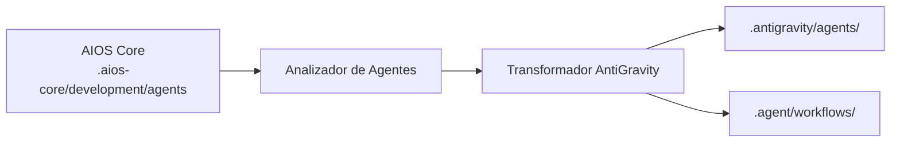

<!-- Traducción: ES | Original: /docs/platforms/en/antigravity.md | Sincronización: 2026-01-26 -->

# Guía AIOS para AntiGravity

> **Plataforma de Desarrollo Agentico de Google** - Arquitectura Basada en Flujos de Trabajo

---

## Descripción General

### ¿Qué es AntiGravity?

AntiGravity es la plataforma de desarrollo agentic de Google que permite a los desarrolladores construir y orquestar flujos de trabajo impulsados por IA. Cuenta con un enfoque único basado en flujos de trabajo para la activación de agentes y una integración profunda con los servicios de Google Cloud.

### ¿Por qué usar AIOS con AntiGravity?

AntiGravity ofrece capacidades distintivas:

- **Sistema de Flujos de Trabajo**: Orquesta interacciones complejas entre agentes
- **Integración con Google Cloud**: Firebase nativo, servicios de GCP
- **MCP Nativo**: Soporte integrado del Protocolo de Contexto de Modelo
- **Activación por @mención**: Activación estándar de agentes
- **Flujos de Trabajo Multi-Agente**: Encadena agentes juntos

### Comparación con Otras Plataformas

| Característica | AntiGravity | Claude Code | Cursor |
|---|:-:|:-:|:-:|
| Sistema de Flujos de Trabajo | Sí | Herramienta Task | Composer |
| Nativo de Google Cloud | Sí | No | No |
| Soporte MCP | Nativo | Nativo | Configuración |
| Encadenamiento de Agentes | Sí | Subagentes | No |

---

## Requisitos

### Requisitos del Sistema

| Requisito | Mínimo | Recomendado |
|---|---|---|
| **RAM** | 4GB | 8GB+ |
| **Espacio en Disco** | 1GB | 2GB+ |
| **Node.js** | 18.0+ | 20.0+ |

### Requisitos de Cuenta

- **Cuenta de Google Cloud**
- **Acceso a AntiGravity** (vía Google AI)
- **Proyecto Firebase** (opcional, para integraciones)

---

## Instalación

### Paso 1: Instalar AntiGravity

```bash
# Instalar vía npm
npm install -g @google/antigravity

# O usar el instalador de Google
curl -fsSL https://get.antigravity.dev | sh
```

### Paso 2: Autenticarse

```bash
# Iniciar sesión con cuenta de Google
antigravity auth login

# O configurar cuenta de servicio
export GOOGLE_APPLICATION_CREDENTIALS="ruta/a/credenciales.json"
```

### Paso 3: Instalar AIOS

```bash
cd tu-proyecto
npx @anthropic/aios init
# Selecciona "AntiGravity" cuando se te solicite
```

### Paso 4: Verificar Instalación

```bash
ls -la .antigravity/
ls -la .agent/
```

Estructura esperada:
```
proyecto/
├── .antigravity/
│   ├── rules.md              # Reglas principales
│   ├── antigravity.json      # Configuración
│   └── agents/               # Definiciones de agentes
└── .agent/
    └── workflows/            # Definiciones de flujos de trabajo
        ├── dev-workflow.yaml
        ├── qa-workflow.yaml
        └── ...
```

---

## Configuración

### Configuración Principal

**Ubicación:** `.antigravity/antigravity.json`

```json
{
  "version": "1.0",
  "project": "nombre-de-tu-proyecto",
  "agents": {
    "default": "dev",
    "available": ["dev", "qa", "architect", "pm", "po", "analyst"]
  },
  "workflows": {
    "directory": ".agent/workflows"
  },
  "mcp": {
    "enabled": true,
    "servers": ["filesystem", "firebase"]
  }
}
```

### Archivo de Reglas

**Ubicación:** `.antigravity/rules.md`

```markdown
# Reglas de Synkra AIOS para AntiGravity

## Sistema de Agentes
- Usa @nombre-agente o flujos de trabajo para activación
- Sigue las definiciones de flujos de trabajo para tareas complejas

## Estándares de Desarrollo
- Escribe código limpio y probado
- Sigue patrones existentes
- Incluye manejo de errores completo
```

### Definiciones de Flujos de Trabajo

**Ubicación:** `.agent/workflows/`

```yaml
# dev-workflow.yaml
name: Flujo de Trabajo del Desarrollador
trigger: "@dev"
agent: dev
steps:
  - name: analizar
    action: read_story
    input: "${story_path}"
  - name: implementar
    action: write_code
    context: "${analyze.output}"
  - name: probar
    action: run_tests
```

---

## Uso Básico

### Iniciando AntiGravity

```bash
# Iniciar en el proyecto actual
antigravity start

# Iniciar con flujo de trabajo específico
antigravity run dev-workflow
```

### Activando Agentes

**Vía @mención:**
```
@dev implementa la funcionalidad de autenticación de usuarios

@qa revisa este módulo por problemas de seguridad

@architect diseña el gateway de API
```

**Vía Flujo de Trabajo:**
```bash
antigravity workflow run dev --input "implementar funcionalidad de autenticación"
```

### Comandos de Agente

```
*help              # Mostrar comandos disponibles
*workflow list     # Listar flujos de trabajo disponibles
*workflow run X    # Ejecutar flujo de trabajo X
*exit              # Salir del agente actual
```

---

## Uso Avanzado

### Orquestación de Flujos de Trabajo

Crea flujos de trabajo complejos multi-agente:

```yaml
# feature-implementation.yaml
name: Implementación de Funcionalidad
description: Funcionalidad completa desde historia hasta despliegue

stages:
  - name: planificación
    agent: architect
    steps:
      - analyze_requirements
      - create_design_doc

  - name: implementación
    agent: dev
    depends_on: planificación
    steps:
      - implement_feature
      - write_tests

  - name: calidad
    agent: qa
    depends_on: implementación
    steps:
      - run_tests
      - security_review

  - name: documentación
    agent: dev
    depends_on: calidad
    steps:
      - update_docs
      - create_changelog
```

### Integración MCP

AntiGravity tiene soporte MCP nativo:

```json
{
  "mcp": {
    "servers": {
      "filesystem": {
        "enabled": true
      },
      "firebase": {
        "enabled": true,
        "project": "tu-proyecto-firebase"
      },
      "bigquery": {
        "enabled": true,
        "dataset": "tu-dataset"
      }
    }
  }
}
```

### Servicios de Google Cloud

Integración directa con GCP:

```
@dev Despliega esta función a Cloud Functions

@devops Configura Cloud Run para este servicio

@architect Diseña usando Firestore para almacenamiento de datos
```

### Encadenamiento de Agentes

Encadena múltiples agentes en un flujo de trabajo:

```yaml
chain:
  - agent: analyst
    task: "Analizar requisitos"
    output: requirements

  - agent: architect
    task: "Diseñar solución"
    input: "${requirements}"
    output: design

  - agent: dev
    task: "Implementar solución"
    input: "${design}"
```

---

## Características Específicas de AntiGravity

### Panel de Flujos de Trabajo

Accede al editor visual de flujos de trabajo:
```bash
antigravity dashboard
```

### Integración con Firebase

```yaml
# Usar Firebase en flujos de trabajo
firebase:
  firestore:
    collection: "projects/${project_id}/tasks"
  storage:
    bucket: "project-assets"
```

### Cloud Functions

Despliega funciones impulsadas por agentes:

```javascript
// functions/agent-handler.js
const { AntiGravity } = require('@google/antigravity');

exports.handleRequest = AntiGravity.createFunction({
  agent: 'dev',
  workflow: 'code-review'
});
```

---

## Sincronización de Agentes

### Cómo Funciona



### Comandos de Sincronización

```bash
# Sincronizar todos los agentes y flujos de trabajo
npm run sync:agents

# Sincronizar para AntiGravity
npm run sync:agents -- --ide antigravity
```

### Formato de Agente

AntiGravity usa un formato híbrido:

```yaml
# .antigravity/agents/dev.yaml
name: dev
displayName: Desarrollador
description: Desarrollador Full Stack Senior

persona:
  role: Desarrollador Full Stack
  expertise:
    - TypeScript/JavaScript
    - Node.js, React
    - Diseño de bases de datos
    - Despliegue en la nube

workflow:
  default: dev-workflow
  triggers:
    - "@dev"
    - "desarrollar"
    - "implementar"
```

---

## Limitaciones Conocidas

### Limitaciones Actuales

| Limitación | Solución Alternativa |
|---|---|
| Cuenta de Google requerida | Usar cuentas de servicio |
| Configuración compleja de flujos | Usar plantillas |
| Soporte IDE limitado | Enfocado en CLI |

### AntiGravity vs Claude Code

| Aspecto | AntiGravity | Claude Code |
|---|---|---|
| Sistema de Flujos | Nativo | Herramienta Task |
| Nativo en la Nube | Google | Cualquiera |
| MCP | Nativo | Nativo |
| CLI | Sí | Sí |

---

## Solución de Problemas

### Problemas Comunes

#### Fallo de Autenticación
```
Error: Unable to authenticate
```
**Solución:**
```bash
antigravity auth logout
antigravity auth login
```

#### Flujo de Trabajo No Encontrado
```
Error: Workflow 'xyz' not found
```
**Solución:**
```bash
# Listar flujos de trabajo disponibles
antigravity workflow list

# Verificar directorio de flujos de trabajo
ls .agent/workflows/
```

#### Agente No Reconocido
```
Error: Unknown agent '@xyz'
```
**Solución:**
```bash
# Resincronizar agentes
npm run sync:agents

# Verificar configuración de agente
cat .antigravity/antigravity.json
```

### Registros

```bash
# Ver registros de AntiGravity
antigravity logs

# Modo detallado
antigravity --verbose start
```

---

## Preguntas Frecuentes

**P: ¿Necesito Google Cloud?**
R: Las funciones básicas funcionan sin él, pero la integración completa requiere una cuenta de GCP.

**P: ¿Puedo usar modelos que no sean de Google?**
R: AntiGravity usa principalmente los modelos de Google, pero algunas configuraciones permiten modelos externos.

**P: ¿Cuál es la diferencia entre agentes y flujos de trabajo?**
R: Los agentes son personas con experiencia; los flujos de trabajo orquestan acciones de agentes en secuencias.

---

## Migración

### De Claude Code a AntiGravity

1. Tus agentes en `.aios-core/` son portables
2. Inicializa AntiGravity:
   ```bash
   npx @anthropic/aios init --ide antigravity
   ```
3. Los archivos de flujo de trabajo se generan automáticamente

### De AntiGravity a Otros IDEs

1. Los agentes de AIOS permanecen en `.aios-core/`
2. Inicializa para el IDE destino
3. Las configuraciones específicas de la plataforma se generan

---

## Recursos Adicionales

- [Documentación de AntiGravity](https://cloud.google.com/antigravity/docs)
- [Google Cloud AI](https://cloud.google.com/ai)
- [Integración con Firebase](https://firebase.google.com)

---

*Synkra AIOS - Guía de Plataforma AntiGravity v1.0*
