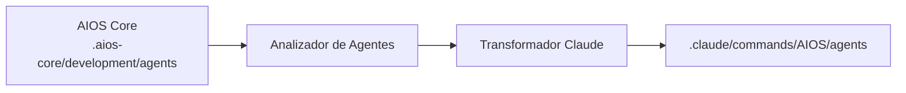

<!-- Traducción: ES | Original: /docs/platforms/en/claude-code.md | Sincronización: 2026-01-26 -->

# Guía AIOS para Claude Code

> **CLI Oficial de Anthropic** - Plataforma Recomendada para AIOS

---

## Descripción General

### ¿Qué es Claude Code?

Claude Code es la interfaz de línea de comandos oficial de Anthropic para Claude, diseñada para desarrolladores que desean acceso directo y poderoso a las capacidades de Claude en su terminal y flujo de trabajo de desarrollo.

### ¿Por qué usar AIOS con Claude Code?

Claude Code ofrece la **mejor integración** con AIOS debido a:

- **Soporte MCP Nativo**: Protocolo de Contexto de Modelo integrado para extensiones de herramientas
- **Herramienta de Tareas**: Genera subagentos para operaciones complejas de múltiples pasos
- **Sistema de Hooks**: Hooks de pre y post-ejecución para automatización
- **Habilidades/Comandos**: Soporte nativo de comandos slash para activación de agentes
- **Persistencia de Memoria**: Preservación del contexto de sesión
- **Acceso Directo a Archivos**: Lee, escribe y edita archivos de forma nativa

### Comparación con Otras Plataformas

| Característica | Claude Code | Cursor | Windsurf |
|---|:-:|:-:|:-:|
| Soporte MCP | Nativo | Configuración | Configuración |
| Tareas de Subagentos | Sí | No | No |
| Sistema de Hooks | Sí | No | No |
| Habilidades | Nativas | No | No |
| Basado en CLI | Sí | No | No |

---

## Requisitos

### Requisitos del Sistema

| Requisito | Mínimo | Recomendado |
|---|---|---|
| **Node.js** | 18.0+ | 20.0+ |
| **npm** | 9.0+ | 10.0+ |
| **Git** | 2.30+ | Última versión |
| **SO** | macOS, Linux, Windows (WSL) | macOS, Linux |

### Requisitos de API

- **Clave API de Anthropic** o **suscripción Claude Pro/Team**
- Acceso de API habilitado para Claude Code

### Herramientas Recomendadas

- GitHub CLI (`gh`) para operaciones de repositorio
- Un emulador de terminal moderno (iTerm2, Warp, Alacritty)

---

## Instalación

### Paso 1: Instalar Claude Code

**Instalación Nativa (Recomendado):**

```bash
# macOS, Linux, WSL
curl -fsSL https://claude.ai/install.sh | bash

# Windows PowerShell
irm https://claude.ai/install.ps1 | iex
```

**Métodos Alternativos:**

```bash
# Homebrew (macOS)
brew install --cask claude-code

# WinGet (Windows)
winget install Anthropic.ClaudeCode
```

> **Nota:** La instalación por NPM (`npm install -g @anthropic-ai/claude-code`) está deprecada. Usa la instalación nativa para actualizaciones automáticas.

### Paso 2: Autenticar

```bash
# Inicia sesión con tu cuenta de Anthropic
claude login

# O establece la clave API directamente
export ANTHROPIC_API_KEY="tu-clave-api"
```

### Paso 3: Instalar AIOS

```bash
# Navega a tu proyecto
cd tu-proyecto

# Inicializa AIOS
npx @anthropic/aios init

# Selecciona "Claude Code" cuando se te solicite el IDE
```

### Paso 4: Verificar Instalación

```bash
# Verifica el tipo de instalación y versión
claude doctor

# Verifica que los archivos AIOS fueron creados
ls -la .claude/
```

Estructura esperada:
```
.claude/
├── commands/
│   └── AIOS/
│       └── agents/        # Agentes sincronizados
├── settings.json          # Configuración local
└── settings.local.json    # Anulaciones locales

~/.claude/                 # Directorio de configuración global
~/.claude.json             # Configuración MCP global
```

---

## Configuración

### Archivo de Configuración Principal

**Ubicación:** `.claude/CLAUDE.md`

Este archivo contiene:
- Contexto del proyecto y reglas
- Instrucciones de activación de agentes
- Metodología de desarrollo
- Comprensión del marco AIOS

### Variables de Entorno

```bash
# Requeridas
export ANTHROPIC_API_KEY="sk-ant-..."

# Opcionales
export CLAUDE_MODEL="claude-sonnet-4-20250514"  # Modelo por defecto
export CLAUDE_MAX_TOKENS="8192"                 # Tokens máximos de respuesta
export AIOS_DEBUG="true"                        # Habilitar registro de depuración
```

### Archivo de Configuración

**Ubicación:** `.claude/settings.json`

```json
{
  "model": "claude-sonnet-4-20250514",
  "maxTokens": 8192,
  "permissions": {
    "allowedTools": ["Read", "Write", "Edit", "Bash", "Glob", "Grep"],
    "blockedCommands": ["rm -rf /", "sudo rm"]
  }
}
```

### Configuración MCP

**Ubicación:** `~/.claude.json` (global) o `.claude/mcp.json` (proyecto)

```json
{
  "mcpServers": {
    "filesystem": {
      "command": "npx",
      "args": ["-y", "@modelcontextprotocol/server-filesystem", "/ruta/permitida"]
    },
    "github": {
      "command": "npx",
      "args": ["-y", "@modelcontextprotocol/server-github"],
      "env": {
        "GITHUB_TOKEN": "ghp_..."
      }
    }
  }
}
```

---

## Uso Básico

### Iniciando Claude Code

```bash
# Inicia en el directorio actual
claude

# Inicia con contexto específico
claude --context "Trabajando en la característica X"

# Inicia con un archivo específico
claude --file src/main.ts
```

### Activando Agentes AIOS

Los agentes se activan usando comandos slash:

```
/dev         # Agente Desarrollador
/qa          # Agente Ingeniero de QA
/architect   # Agente Arquitecto de Software
/pm          # Agente Gestor de Proyecto
/po          # Agente Propietario de Producto
/sm          # Agente Scrum Master
/analyst     # Agente Analista de Negocios
/devops      # Agente Ingeniero DevOps
```

### Sintaxis de Comando de Agente

```
/nombre-agente [descripción de tarea]

# Ejemplos
/dev implementa la característica de inicio de sesión siguiendo la historia
/qa revisa el módulo de autenticación en busca de problemas de seguridad
/architect diseña el esquema de base de datos para gestión de usuarios
```

### Flujos de Trabajo Comunes

#### Desarrollo de Características
```
1. /pm para revisar los requisitos de la historia
2. /architect para diseñar la solución
3. /dev para implementar la característica
4. /qa para probar la implementación
5. /dev para corregir problemas
```

#### Revisión de Código
```
1. /qa revisa este PR en busca de mejores prácticas
2. /dev aborda los comentarios de revisión
```

#### Investigación de Errores
```
1. /analyst investiga el reporte de error
2. /dev reproduce y corrige el problema
3. /qa verifica la corrección
```

---

## Uso Avanzado

### Servidores MCP

Claude Code soporta MCP (Protocolo de Contexto de Modelo) para capacidades extendidas:

#### Herramientas MCP Disponibles

| Servidor MCP | Propósito |
|---|---|
| `filesystem` | Operaciones del sistema de archivos |
| `github` | Acceso a API de GitHub |
| `playwright` | Automatización de navegador |
| `postgres` | Consultas de base de datos |

#### Añadiendo Servidores MCP

```bash
# A través del agente DevOps
/devops
*add-mcp playwright
```

### Herramienta de Tareas para Subagentos

Claude Code puede generar subagentos para operaciones complejas:

```
# Generación automática de subagentos
/dev implementa esta característica

# Claude puede generar:
# - Agente Explorador para análisis de código base
# - Agente Plan para decisiones de arquitectura
# - Agente Bash para ejecución de comandos
```

### Sistema de Hooks

Crear hooks de pre y post-ejecución:

**Ubicación:** `.claude/hooks/`

```javascript
// .claude/hooks/pre-commit.js
module.exports = {
  name: 'pre-commit',
  trigger: 'before:commit',
  execute: async (context) => {
    // Ejecutar linting antes de commit
    await context.bash('npm run lint');
    await context.bash('npm test');
  }
};
```

### Habilidades Personalizadas

Crear habilidades/comandos reutilizables:

**Ubicación:** `.claude/commands/`

```markdown
<!-- .claude/commands/deploy.md -->
# Habilidad de Despliegue

## Descripción
Desplegar la aplicación a producción

## Pasos
1. Ejecutar pruebas
2. Construir la aplicación
3. Desplegar en servidor

## Comandos
```bash
npm test
npm run build
npm run deploy
```
```

### Memoria y Contexto

Claude Code mantiene memoria de sesión:

```
# Referencia a contexto anterior
"Como discutimos anteriormente..."

# Claude recuerda:
# - Archivos en los que has trabajado
# - Decisiones tomadas
# - Cambios de código
# - Historial de conversación
```

---

## Características Específicas de Claude Code

### Acceso a Herramientas Nativas

| Herramienta | Descripción | Ejemplo |
|---|---|---|
| `Read` | Leer archivos | Leer archivos completos o líneas específicas |
| `Write` | Crear archivos | Escribir nuevos archivos con contenido |
| `Edit` | Modificar archivos | Buscar y reemplazar texto |
| `Bash` | Ejecutar comandos | Ejecutar comandos de shell |
| `Glob` | Encontrar archivos | Coincidencia de patrones para archivos |
| `Grep` | Buscar contenido | Búsqueda regex en archivos |
| `Task` | Generar agentes | Operaciones complejas de múltiples pasos |
| `WebFetch` | Solicitudes HTTP | Obtener contenido web |
| `WebSearch` | Buscar en web | Obtener información actual |

### Atajos de Teclado

| Atajo | Acción |
|---|---|
| `Ctrl+C` | Cancelar operación actual |
| `Ctrl+D` | Salir de Claude Code |
| `Ctrl+L` | Limpiar pantalla |
| `Arriba/Abajo` | Navegar historial |

### Línea de Estado

Claude Code muestra estado en tiempo real:
```
[Agent: dev] [Model: sonnet] [Tokens: 1234/8192] [Cost: $0.02]
```

---

## Sincronización de Agentes

### Cómo Funciona



### Comandos de Sincronización

```bash
# Sincronizar todos los agentes
npm run sync:agents

# Sincronizar agente específico
npm run sync:agents -- --agent dev

# Forzar resincronización
npm run sync:agents -- --force
```

### Formato de Archivo de Agente

Los agentes en Claude Code usan markdown con frontmatter YAML:

```markdown
---
name: dev
displayName: Desarrollador
description: Desarrollador Full Stack Senior
activation: /dev
---

# Agente Desarrollador

## Experiencia
- TypeScript/JavaScript
- Node.js
- React
- Diseño de base de datos

## Flujo de Trabajo
1. Comprender requisitos
2. Planificar implementación
3. Escribir código limpio
4. Probar exhaustivamente
```

### Resolución de Conflictos

Cuando ocurren conflictos:

1. Los cambios locales se respaldan en `.claude/commands/AIOS/agents/.backup/`
2. La sincronización solicita resolución
3. Elegir: mantener local, usar remoto, o combinar

---

## Limitaciones Conocidas

### Limitaciones Actuales

| Limitación | Solución Alternativa |
|---|---|
| Sin GUI | Usar terminal o integrar con IDE |
| Sin colaboración en tiempo real | Usar git para colaboración |
| Límites de velocidad de API | Configurar limitación de velocidad en configuración |
| Manejo de archivos grandes | Usar streaming para archivos grandes |

### Problemas Específicos de Plataforma

- **Windows**: Usar WSL para la mejor experiencia
- **macOS**: Asegurar que las herramientas CLI de Xcode están instaladas
- **Linux**: Puede necesitar dependencias adicionales

### Características en Desarrollo

- [ ] Colaboración en tiempo real
- [ ] Herramientas de depuración mejoradas
- [ ] Visor de diferencias visual
- [ ] Sistema de plugins

---

## Solución de Problemas

### Problemas Comunes

#### Autenticación Fallida
```
Error: Authentication failed
```
**Solución:**
```bash
# Re-autenticar
claude logout
claude login

# O verificar clave API
echo $ANTHROPIC_API_KEY
```

#### Servidor MCP No Encontrado
```
Error: MCP server 'xyz' not found
```
**Solución:**
```bash
# Listar servidores MCP disponibles
/devops
*list-mcps

# Instalar servidor faltante
*add-mcp xyz
```

#### Agente No Reconocido
```
Error: Unknown command '/xyz'
```
**Solución:**
```bash
# Resincronizar agentes
npm run sync:agents

# Verificar que el agente existe
ls .claude/commands/AIOS/agents/
```

#### Permiso de Herramienta Denegado
```
Error: Permission denied for tool 'Bash'
```
**Solución:**
Actualizar `.claude/settings.json`:
```json
{
  "permissions": {
    "allowedTools": ["Bash"]
  }
}
```

### Registros y Diagnósticos

```bash
# Habilitar modo de depuración
export AIOS_DEBUG=true

# Ver registros de Claude Code
cat ~/.claude/logs/latest.log

# Verificar registros de AIOS
cat .aios-core/logs/sync.log
```

### Restablecer Configuración

```bash
# Restablecer configuración de Claude Code
rm -rf ~/.claude/

# Reinicializar
claude login
```

---

## Preguntas Frecuentes

### Preguntas Generales

**P: ¿Puedo usar Claude Code sin conexión?**
R: No, Claude Code requiere una conexión a Internet para comunicarse con la API de Claude.

**P: ¿Cuánto cuesta Claude Code?**
R: Claude Code es gratuito, pero se aplican costos por uso de API según tu plan de Anthropic.

**P: ¿Puedo usar mis propios modelos?**
R: Claude Code solo soporta los modelos Claude de Anthropic.

### Preguntas Específicas de AIOS

**P: ¿Cómo cambio entre agentes?**
R: Simplemente usa el comando slash para el agente deseado: `/dev`, `/qa`, etc.

**P: ¿Pueden comunicarse los agentes entre sí?**
R: Sí, a través de la herramienta de Tareas que puede generar subagentos.

**P: ¿Dónde se almacenan las definiciones de agentes?**
R: En `.claude/commands/AIOS/agents/` después de la sincronización.

**P: ¿Con qué frecuencia debo sincronizar agentes?**
R: Después de actualizar AIOS o cuando los agentes se modifiquen en el núcleo.

---

## Migración

### De Cursor a Claude Code

1. Exporta tus reglas de Cursor:
   ```bash
   cp .cursor/rules.md cursor-rules-backup.md
   ```

2. Inicializa AIOS con Claude Code:
   ```bash
   npx @anthropic/aios init --ide claude-code
   ```

3. Migra reglas personalizadas:
   - Copia reglas relevantes a `.claude/CLAUDE.md`
   - Ajusta la sintaxis para el formato de Claude Code

4. Sincroniza agentes:
   ```bash
   npm run sync:agents
   ```

### De Claude Code a Otro IDE

1. Tus agentes AIOS se almacenan en `.aios-core/development/agents/`
2. Inicializa AIOS para el IDE objetivo
3. Los agentes se transformarán al nuevo formato automáticamente

---

## Recursos Adicionales

### Documentación Oficial
- [Documentación de Claude Code](https://code.claude.com/docs)
- [Guía de Configuración de Claude Code](https://code.claude.com/docs/en/setup)
- [Referencia de API de Anthropic](https://docs.anthropic.com/api)
- [Protocolo MCP](https://modelcontextprotocol.io)
- [Repositorio de GitHub](https://github.com/anthropics/claude-code)

### Comunidad
- [Discusiones de GitHub](https://github.com/anthropics/claude-code/discussions)
- [Comunidad de Discord](https://discord.gg/anthropic)

### Soporte
- [Problemas de GitHub](https://github.com/anthropics/claude-code/issues)
- [Soporte de Anthropic](https://support.anthropic.com)

---

*Synkra AIOS - Guía de Plataforma Claude Code v1.0*
