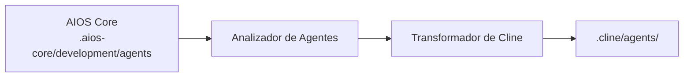

<!-- Traducción: ES | Original: /docs/platforms/en/cline.md | Sincronización: 2026-01-26 -->

# Guía AIOS para Cline

> **Asistente de Codificación IA de VS Code** - Integración Completa de VS Code

---

## Descripción General

### ¿Qué es Cline?

Cline es una potente extensión de asistente de codificación IA para VS Code que trae capacidades de codificación autónoma directamente a tu editor favorito. Puede leer, escribir y ejecutar código mientras mantiene el entorno familiar de VS Code.

### ¿Por qué usar AIOS con Cline?

Cline ofrece integración perfecta con VS Code para AIOS:

- **Integración Completa de VS Code**: Funciona dentro de tu configuración existente
- **Activación con @mention**: Activación natural de agentes
- **Operaciones de Archivos**: Lee, escribe y edita archivos directamente
- **Acceso a Terminal**: Ejecuta comandos
- **Ecosistema de Extensiones**: Compatible con extensiones de VS Code
- **Flujo de Aprobación**: Operaciones seguras con confirmación del usuario

### Comparación con Otras Plataformas

| Característica | Cline | Cursor | Claude Code |
|---------|:-----:|:------:|:-----------:|
| Extensión de VS Code | Sí | No (aplicación separada) | No |
| Activación con @mention | Sí | Sí | /comando |
| Acceso a Terminal | Sí | Sí | Sí |
| Compatibilidad MCP | Limitada | Configuración | Nativa |
| Aprobación Requerida | Sí | Opcional | Opcional |

---

## Requisitos

### Requisitos del Sistema

| Requisito | Mínimo | Recomendado |
|-------------|---------|-------------|
| **VS Code** | 1.80+ | Última versión |
| **RAM** | 4GB | 8GB+ |
| **Node.js** | 18.0+ (para AIOS) | 20.0+ |

### Requisitos de Cuenta

- **Clave de API**: OpenAI, Anthropic u otros proveedores compatibles
- **Cuenta de VS Code** (opcional, para sincronización)

---

## Instalación

### Paso 1: Instalar VS Code

Descarga desde [code.visualstudio.com](https://code.visualstudio.com) si aún no está instalado.

### Paso 2: Instalar Extensión Cline

1. Abre VS Code
2. Ve a Extensiones (`Cmd/Ctrl + Shift + X`)
3. Busca "Cline"
4. Haz clic en Instalar

O por línea de comandos:
```bash
code --install-extension saoudrizwan.claude-dev
```

### Paso 3: Configurar Cline

1. Abre la configuración de Cline
2. Añade tu clave de API (Anthropic, OpenAI, etc.)
3. Configura el modelo preferido

### Paso 4: Instalar AIOS

```bash
cd your-project
npx @anthropic/aios init
# Selecciona "Cline" cuando se te pida
```

### Paso 5: Verificar Instalación

```bash
ls -la .cline/
```

Estructura esperada:
```
.cline/
├── rules.md           # Configuración de reglas principal
├── agents/            # Definiciones de agentes
│   ├── dev.md
│   ├── qa.md
│   └── ...
└── settings.json      # Configuración local
```

---

## Configuración

### Archivo de Reglas

**Ubicación:** `.cline/rules.md`

```markdown
# Reglas Synkra AIOS para Cline

## Sistema de Agentes
- Activa agentes con @agent-name
- Sigue flujos de trabajo específicos del agente

## Estándares de Desarrollo
- Escribe código limpio y probado
- Sigue patrones existentes
- Incluye manejo de errores
```

### Archivos de Agentes

**Ubicación:** `.cline/agents/`

```markdown
# Agente Desarrollador (@dev)

## Rol
Desarrollador Full Stack Senior

## Experiencia
- TypeScript/JavaScript
- Node.js, React
- Diseño de bases de datos

## Flujo de Trabajo
1. Entender requisitos de la historia
2. Planificar el enfoque de implementación
3. Escribir código limpio y bien probado
```

### Configuración de Cline

Configura en los ajustes de VS Code o `.cline/settings.json`:

```json
{
  "cline.apiProvider": "anthropic",
  "cline.model": "claude-3-5-sonnet",
  "cline.autoApprove": {
    "read": true,
    "write": false,
    "execute": false
  }
}
```

---

## Uso Básico

### Abriendo Cline

1. Abre la Paleta de Comandos (`Cmd/Ctrl + Shift + P`)
2. Escribe "Cline: Open"
3. O usa el icono de la barra lateral

### Activando Agentes

Usa menciones @mention en el chat de Cline:

```
@dev         # Agente Desarrollador
@qa          # Agente Ingeniero de QA
@architect   # Arquitecto de Software
@pm          # Gerente de Proyecto
@po          # Propietario del Producto
@analyst     # Analista de Negocios
@devops      # Ingeniero DevOps
```

### Ejemplo de Interacciones

```
@dev Crea un endpoint de API REST para registro de usuarios

@qa Revisa el módulo de autenticación por problemas de seguridad

@architect Diseña el esquema de base de datos para el sistema de e-commerce
```

### Flujo de Aprobación

Cline pide aprobación antes de:
- Crear/modificar archivos
- Ejecutar comandos de terminal
- Realizar cambios significativos

```
[Cline quiere editar src/auth.ts]
[Permitir] [Denegar] [Permitir Todo]
```

---

## Uso Avanzado

### Operaciones de Múltiples Archivos

```
@dev Crea un módulo CRUD completo para productos:
- Modelo en src/models/
- Repositorio en src/repositories/
- Servicio en src/services/
- Controlador en src/controllers/
- Pruebas en tests/
```

### Ejecución en Terminal

Cline puede ejecutar comandos:

```
@dev Ejecuta el conjunto de pruebas y corrige cualquier fallo

@devops Configura el entorno Docker de desarrollo
```

### Revisión de Diferencias

1. Cline muestra diferencias antes de aplicar
2. Revisa cambios en la vista de diferencias familiar de VS Code
3. Acepta o rechaza cambios individuales

### Proveedores de Contexto

Añade contexto a tus solicitudes:

```
@dev Usando los patrones en src/services/userService.ts,
crea un nuevo productService.ts

@qa Basado en tests/auth.test.ts,
escribe pruebas para el módulo de pago
```

---

## Características Específicas de Cline

### Configuración de Aprobación

| Configuración | Descripción |
|---------|-------------|
| `autoApprove.read` | Aprueba automáticamente lecturas de archivos |
| `autoApprove.write` | Aprueba automáticamente escrituras de archivos |
| `autoApprove.execute` | Aprueba automáticamente comandos |

### Atajos de Teclado

| Atajo | Acción |
|----------|--------|
| `Cmd/Ctrl + Shift + P` | Paleta de Comandos |
| `Cmd/Ctrl + .` | Aprobar rápidamente |
| `Escape` | Cancelar operación |

### Historial de Tareas

Ver interacciones anteriores:
1. Abre el panel de Cline
2. Haz clic en el icono de historial
3. Reanuda o referencia tareas anteriores

### Integración MCP (Limitada)

```json
{
  "cline.mcp": {
    "enabled": true,
    "servers": ["filesystem"]
  }
}
```

---

## Sincronización de Agentes

### Cómo Funciona



### Comandos de Sincronización

```bash
# Sincroniza todos los agentes
npm run sync:agents

# Sincroniza para Cline específicamente
npm run sync:agents -- --ide cline
```

### Formato de Agente

Cline usa markdown condensado:

```markdown
# Agente Desarrollador

**Activación:** @dev

## Persona
Eres un Desarrollador Full Stack Senior con experiencia en:
- TypeScript/JavaScript
- Node.js y React
- Diseño y optimización de bases de datos

## Flujo de Trabajo
1. Lee y comprende los requisitos de la historia
2. Planifica el enfoque de implementación
3. Escribe código limpio y bien probado
4. Actualiza el progreso de la historia cuando esté completo

## Estándares
- Sigue los patrones existentes del código base
- Incluye manejo exhaustivo de errores
- Escribe pruebas unitarias para código nuevo
```

---

## Limitaciones Conocidas

### Limitaciones Actuales

| Limitación | Solución Alternativa |
|------------|------------|
| MCP Limitado | Usa servidores MCP básicos |
| Sin suagentes nativos | Cambio manual de agentes |
| La aprobación interrumpe el flujo | Configura aprobación automática |
| Solo VS Code | Sin versión independiente |

### Cline vs Claude Code

| Aspecto | Cline | Claude Code |
|--------|-------|-------------|
| Entorno | VS Code | Terminal |
| MCP | Limitado | Nativo |
| Herramienta de Tareas | No | Sí |
| Extensiones | Sí | No |

---

## Solución de Problemas

### Problemas Comunes

#### Extensión No Carga
```
Problema: Cline no aparece en VS Code
```
**Solución:**
1. Verifica la versión de VS Code (1.80+)
2. Recarga VS Code (`Cmd/Ctrl + Shift + P` > "Reload Window")
3. Reinstala la extensión

#### Clave de API Inválida
```
Problema: Falló la autenticación
```
**Solución:**
1. Abre la configuración de Cline
2. Reingresa la clave de API
3. Verifica que la clave esté activa

#### Agente No Reconocido
```
Problema: @dev no se activa
```
**Solución:**
```bash
# Resincroniza agentes
npm run sync:agents

# Verifica el archivo del agente
cat .cline/agents/dev.md
```

#### Rendimiento Lento
```
Problema: Cline responde lentamente
```
**Solución:**
1. Verifica la cuota de API
2. Usa un modelo más rápido
3. Reduce el tamaño del contexto

### Registros

```bash
# Herramientas de Desarrollador de VS Code
Help > Toggle Developer Tools > Console

# Registros de extensión
View > Output > Selecciona "Cline"
```

---

## Preguntas Frecuentes

**P: ¿Es Cline gratuito?**
R: La extensión es gratuita, pero requiere una clave de API para proveedores de IA (que pueden tener costos).

**P: ¿Puedo usar modelos locales?**
R: Sí, Cline soporta Ollama y otros proveedores de modelos locales.

**P: ¿Funciona Cline sin conexión?**
R: Solo con modelos locales configurados.

**P: ¿Cómo actualizo los agentes?**
R: Ejecuta `npm run sync:agents` después de actualizaciones de AIOS.

---

## Migración

### Desde Otras Extensiones

1. Instala AIOS para Cline:
   ```bash
   npx @anthropic/aios init --ide cline
   ```

2. Los agentes se sincronizan automáticamente

### De Cline a Claude Code

1. Tus agentes están en `.aios-core/development/agents/`
2. Inicializa para Claude Code:
   ```bash
   npx @anthropic/aios init --ide claude-code
   ```

---

## Recursos Adicionales

- [GitHub de Cline](https://github.com/cline/cline)
- [Marketplace de VS Code](https://marketplace.visualstudio.com/items?itemName=saoudrizwan.claude-dev)
- [Guía de Plataforma AIOS](../README.md)

---

*Synkra AIOS - Guía de Plataforma Cline v1.0*
