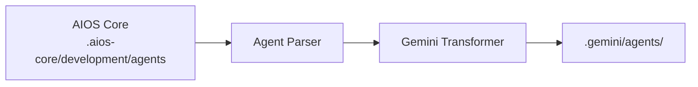

<!-- Traducción: ES | Original: /docs/platforms/en/gemini-cli.md | Sincronización: 2026-01-26 -->

# Guía de AIOS para Gemini CLI

> **Asistente CLI de Google AI** - Desarrollo de IA por Línea de Comandos

---

## Descripción General

### ¿Qué es Gemini CLI?

Gemini CLI es la interfaz de línea de comandos de Google para interactuar con los modelos de IA Gemini. Proporciona a los desarrolladores acceso directo desde la terminal a las capacidades de IA de Google, incluyendo soporte multimodal para texto, código e imágenes.

### ¿Por qué usar AIOS con Gemini CLI?

Gemini CLI ofrece capacidades únicas:

- **Flujo de Trabajo basado en CLI**: Experiencia pura en terminal
- **Modelos de Google AI**: Acceso a modelos Gemini
- **Soporte Multimodal**: Comprensión de texto, código e imágenes
- **Activación basada en Prompts**: Activación natural de agentes mediante lenguaje
- **Integración con Shell**: Funciona con tus herramientas existentes

### Comparación con Otras Plataformas

| Característica | Gemini CLI | Claude Code | Cursor |
|---|:---:|:---:|:---:|
| Basado en CLI | Sí | Sí | No |
| Multimodal | Sí | Limitado | No |
| Activación de Agentes | Prompt | /comando | @mención |
| Soporte MCP | No | Nativo | Configuración |
| Modelos de Google | Sí | No | No |

---

## Requisitos

### Requisitos del Sistema

| Requisito | Mínimo | Recomendado |
|---|---|---|
| **SO** | macOS, Linux, Windows | macOS, Linux |
| **Node.js** | 18.0+ | 20.0+ |
| **Python** | 3.9+ (opcional) | 3.11+ |

### Requisitos de Cuenta

- **Clave de API de Google AI** o **Cuenta de Google Cloud**
- **Acceso a Gemini API**

---

## Instalación

### Paso 1: Instalar Gemini CLI

```bash
# Instalar vía npm (requiere Node.js 18+)
npm install -g @google/gemini-cli

# O ejecutar sin instalación
npx @google/gemini-cli

# O vía conda
conda create -y -n gemini_env -c conda-forge nodejs
conda activate gemini_env
npm install -g @google/gemini-cli
```

### Paso 2: Autenticarse

```bash
# Inicia sesión con cuenta de Google
gemini auth login

# O establece la clave de API
export GOOGLE_AI_API_KEY="tu-clave-api"
```

### Paso 3: Instalar AIOS

```bash
cd tu-proyecto
npx @anthropic/aios init
# Selecciona "Gemini CLI" cuando se te pida
```

### Paso 4: Verificar Instalación

```bash
ls -la .gemini/
```

Estructura esperada:
```
.gemini/
├── rules.md           # Reglas principales
├── agents/            # Definiciones de agentes
│   ├── dev.md
│   ├── qa.md
│   └── ...
└── config.json        # Configuración de CLI
```

---

## Configuración

### Archivo de Reglas

**Ubicación:** `.gemini/rules.md`

```markdown
# Reglas de Synkra AIOS para Gemini CLI

## Sistema de Agentes
- Incluye contexto de agentes en tus prompts
- Usa "Como el agente [agente]..." para activación

## Estándares de Desarrollo
- Escribe código limpio y probado
- Sigue los patrones existentes
```

### Configuración de CLI

**Ubicación:** `.gemini/config.json`

```json
{
  "model": "gemini-pro",
  "temperature": 0.7,
  "maxOutputTokens": 8192,
  "agents": {
    "default": "dev",
    "available": ["dev", "qa", "architect", "pm"]
  }
}
```

### Archivos de Agentes

**Ubicación:** `.gemini/agents/`

```markdown
# Agente de Desarrollador

## Activación
Incluye "Como el agente AIOS dev" en tu prompt.

## Persona
Desarrollador Full Stack Senior con experiencia en:
- TypeScript/JavaScript
- Node.js, React
- Diseño de bases de datos

## Flujo de Trabajo
1. Leer requisitos
2. Planificar implementación
3. Escribir código limpio
4. Probar exhaustivamente
```

---

## Uso Básico

### Iniciando Gemini CLI

```bash
# Modo interactivo
gemini

# Prompt simple
gemini "Explica este código"

# Con contexto de archivo
gemini --file src/main.ts "Revisa este código"
```

### Activando Agentes de AIOS

Incluye contexto de agentes en los prompts:

```bash
# Agente de desarrollador
gemini "Como el agente AIOS dev, implementa la característica de login"

# Agente de QA
gemini "Como el agente AIOS qa, revisa este código por seguridad"

# Agente de arquitecto
gemini "Como el agente AIOS architect, diseña el esquema de base de datos"
```

### Con Archivos de Contexto

```bash
# Incluir archivo de reglas
gemini --context .gemini/rules.md "Implementa característica de autenticación"

# Incluir agente específico
gemini --context .gemini/agents/dev.md "Crea modelo de usuario"
```

### Integración con Shell

```bash
# Canalizar código para revisión
cat src/auth.ts | gemini "Como AIOS qa, revisa este código"

# Generar código
gemini "Crea un endpoint de API REST" > src/api/users.ts

# Sesión interactiva
gemini --interactive
```

---

## Uso Avanzado

### Capacidades Multimodales

```bash
# Analizar imagen
gemini --image screenshot.png "Explica este diseño de UI"

# Código + imagen
gemini --file src/component.tsx --image mockup.png \
  "Actualiza el componente para coincidir con el diseño"
```

### Gestión de Sesiones

```bash
# Iniciar sesión con nombre
gemini --session feature-dev

# Continuar sesión
gemini --session feature-dev "Ahora agrega pruebas"

# Listar sesiones
gemini sessions list
```

### Operaciones en Lote

```bash
# Procesar múltiples archivos
for file in src/*.ts; do
  gemini --file "$file" "Como AIOS qa, revisa este archivo" >> reviews.md
done
```

### Comandos Personalizados

Crea alias de shell:

```bash
# ~/.bashrc o ~/.zshrc
alias gdev='gemini --context .gemini/agents/dev.md'
alias gqa='gemini --context .gemini/agents/qa.md'
alias garch='gemini --context .gemini/agents/architect.md'
```

Uso:
```bash
gdev "Implementa autenticación de usuario"
gqa "Revisa el módulo de autenticación"
```

---

## Características Específicas de Gemini CLI

### Selección de Modelo

```bash
# Usar modelo específico
gemini --model gemini-pro "Consulta"
gemini --model gemini-pro-vision "Analiza imagen"
```

### Formatos de Salida

```bash
# Salida JSON
gemini --output json "Genera esquema de API"

# Markdown
gemini --output markdown "Documenta esta función"

# Solo código
gemini --output code "Crea una función de ordenamiento"
```

### Transmisión

```bash
# Habilitar salida de transmisión
gemini --stream "Escribe una explicación larga"
```

---

## Sincronización de Agentes

### Cómo Funciona



### Comandos de Sincronización

```bash
# Sincronizar todos los agentes
npm run sync:agents

# Sincronizar para Gemini CLI
npm run sync:agents -- --ide gemini-cli
```

### Formato de Agentes

Gemini CLI utiliza markdown optimizado para prompts:

```markdown
# Agente de Desarrollador

**Frase de Activación:** "Como el agente AIOS dev"

## Rol
Eres un Desarrollador Full Stack Senior trabajando con Synkra AIOS.

## Experiencia
- TypeScript/JavaScript
- Node.js, React
- Diseño de bases de datos
- Desarrollo de APIs

## Instrucciones
Cuando se activa:
1. Analiza la solicitud cuidadosamente
2. Considera patrones de código existentes
3. Proporciona soluciones limpias y probadas
4. Explica tu enfoque

## Formato de Respuesta
- Comienza con análisis breve
- Proporciona soluciones de código
- Incluye explicaciones
- Sugiere pruebas si es aplicable
```

---

## Limitaciones Conocidas

### Limitaciones Actuales

| Limitación | Solución Alternativa |
|---|---|
| Sin soporte MCP | Usar herramientas externas |
| Sin contexto persistente | Usar sesiones |
| Activación de agentes manual | Usar alias de shell |
| Sin GUI | Solo terminal |

### Gemini CLI vs Claude Code

| Aspecto | Gemini CLI | Claude Code |
|---|---|---|
| Proveedor | Google | Anthropic |
| MCP | No | Nativo |
| Herramienta de Tarea | No | Sí |
| Multimodal | Sí | Limitado |

---

## Solución de Problemas

### Problemas Comunes

#### Falló la Autenticación
```
Error: Unable to authenticate
```
**Solución:**
```bash
gemini auth logout
gemini auth login
# O establece la clave de API nuevamente
export GOOGLE_AI_API_KEY="clave-nueva"
```

#### Modelo No Disponible
```
Error: Model 'xyz' not found
```
**Solución:**
```bash
# Listar modelos disponibles
gemini models list

# Usar modelo disponible
gemini --model gemini-pro "Consulta"
```

#### Contexto Demasiado Largo
```
Error: Context exceeds limit
```
**Solución:**
- Dividir en fragmentos más pequeños
- Usar referencias de archivo específicas
- Resumir contexto

### Registros

```bash
# Habilitar salida detallada
gemini --verbose "Consulta"

# Modo de depuración
GEMINI_DEBUG=1 gemini "Consulta"
```

---

## Preguntas Frecuentes

**P: ¿Es Gemini CLI gratuito?**
R: Sí, tiene un nivel gratuito generoso: 60 solicitudes/minuto y 1000 solicitudes/día sin costo. Soporta modelos Gemini Pro y Gemini Flash.

**P: ¿Puedo usar modelos locales?**
R: No, Gemini CLI requiere la API de Google.

**P: ¿Funciona sin conexión?**
R: No, requiere conexión a internet.

**P: ¿Cómo cambio de agentes rápidamente?**
R: Usa alias de shell o incluye contexto de agentes en los prompts.

---

## Migración

### De Claude Code a Gemini CLI

1. Instalar AIOS para Gemini CLI:
   ```bash
   npx @anthropic/aios init --ide gemini-cli
   ```
2. Los agentes se transforman a formato basado en prompts

### De Gemini CLI a Otros IDEs

1. Los agentes de AIOS en `.aios-core/` son portátiles
2. Inicializar para IDE objetivo
3. Los agentes se transforman automáticamente

---

## Recursos Adicionales

- [Documentación Oficial de Gemini CLI](https://geminicli.com/docs/)
- [GitHub de Gemini CLI](https://github.com/google-gemini/gemini-cli)
- [Documentación de Google AI](https://ai.google.dev/docs)
- [Tutorial de Google Codelabs](https://codelabs.developers.google.com/gemini-cli-hands-on)
- [Google Cloud Gemini CLI](https://docs.cloud.google.com/gemini/docs/codeassist/gemini-cli)

---

*Synkra AIOS - Guía de Plataforma Gemini CLI v1.0*
