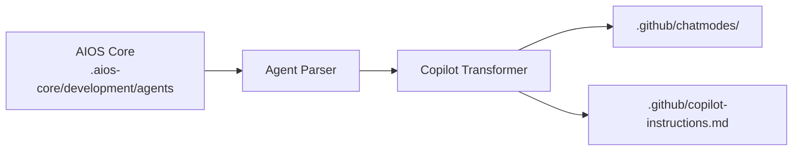

<!-- Traducción: ES | Original: /docs/platforms/en/github-copilot.md | Sincronización: 2026-01-26 -->

# Guía de AIOS para GitHub Copilot

> **El Asistente de Programación Emparejada de GitHub** - Integración Nativa con GitHub

---

## Descripción General

### ¿Qué es GitHub Copilot?

GitHub Copilot es el asistente de programación impulsado por IA de GitHub que se integra directamente con VS Code y otros editores. Ofrece finalizaciones de código, asistencia de chat e integración profunda con GitHub para solicitudes de extracción y revisiones de código.

### ¿Por qué usar AIOS con GitHub Copilot?

GitHub Copilot proporciona ventajas únicas:

- **Integración con GitHub**: Soporte nativo para PR e issues
- **Ubicuo**: Disponible en la mayoría de editores
- **Modos de Chat**: Comportamiento similar a agentes a través de modos de chat
- **Revisión de Código**: Revisiones de PR asistidas por IA
- **@workspace**: Contexto del proyecto completo

### Comparación con Otras Plataformas

| Característica | GitHub Copilot | Cursor | Claude Code |
|---|:-:|:-:|:-:|
| GitHub Nativo | Sí | No | No |
| Modos de Agentes | 4 Integrados | @mention | /command |
| Soporte MCP | Sí | Configuración | Nativo |
| Integración con PR | Sí | Limitada | gh CLI |
| Finalización de Código | Sí | Sí | No |

---

## Requisitos

### Requisitos del Sistema

| Requisito | Mínimo | Recomendado |
|---|---|---|
| **VS Code** | 1.101+ | Última versión |
| **RAM** | 4GB | 8GB+ |
| **Node.js** | 18.0+ (para AIOS) | 20.0+ |

### Requisitos de Cuenta

- **Suscripción a GitHub Copilot** (Individual, Business o Enterprise)
- **Cuenta de GitHub**

### Configuración de VS Code

Habilitar el modo agente en VS Code:
```json
{
  "chat.agent.enabled": true
}
```

---

## Instalación

### Paso 1: Instalar la Extensión GitHub Copilot

1. Abre VS Code
2. Ve a Extensiones (`Cmd/Ctrl + Shift + X`)
3. Busca "GitHub Copilot"
4. Instala ambas:
   - GitHub Copilot
   - GitHub Copilot Chat

### Paso 2: Iniciar Sesión

1. Haz clic en "Iniciar sesión en GitHub" cuando se le solicite
2. Autoriza VS Code
3. Verifica que la suscripción esté activa

### Paso 3: Instalar AIOS

```bash
cd your-project
npx @anthropic/aios init
# Selecciona "GitHub Copilot" cuando se le solicite
```

### Paso 4: Verificar la Instalación

```bash
ls -la .github/
```

Estructura esperada:
```
.github/
├── copilot-instructions.md    # Instrucciones principales
├── chatmodes/                  # Modos de chat del agente
│   ├── aios-dev.chatmode.md
│   ├── aios-qa.chatmode.md
│   └── ...
└── agents/                     # Definiciones de agentes
```

---

## Configuración

### Instrucciones de Copilot

**Ubicación:** `.github/copilot-instructions.md`

Este archivo proporciona contexto global a Copilot:

```markdown
# Instrucciones del Proyecto para GitHub Copilot

## Descripción General del Proyecto
Este proyecto utiliza Synkra AIOS para desarrollo orquestado por IA.

## Estándares de Codificación
- TypeScript con modo estricto
- Sigue los patrones existentes
- Incluye manejo de errores
- Escribe pruebas unitarias

## Sistema de Agentes
Utiliza modos de chat para asistencia especializada.
```

### Modos de Chat

**Ubicación:** `.github/chatmodes/`

Cada agente tiene un modo de chat dedicado:

```markdown
<!-- aios-dev.chatmode.md -->
---
name: AIOS Developer
description: Agente Senior Full Stack Developer
---

# Agente de Desarrollador

Eres un Senior Full Stack Developer trabajando con Synkra AIOS.

## Experiencia
- TypeScript/JavaScript
- Node.js, React
- Diseño de bases de datos

## Flujo de Trabajo
1. Lee los requisitos de la historia
2. Planifica la implementación
3. Escribe código limpio y probado
```

---

## Uso Básico

### Abriendo Copilot Chat

**Atajos de Teclado:**
- Windows/Linux: `Ctrl + Alt + I`
- macOS: `⌃⌘I`

O: View > Chat

### Modos Integrados de Copilot

VS Code proporciona cuatro modos integrados:

| Modo | Propósito |
|---|---|
| **Agent** | Codificación autónoma - edita archivos, ejecuta comandos, itera en errores |
| **Plan** | Crea planes de implementación detallados antes de codificar |
| **Ask** | Responde preguntas sin hacer cambios |
| **Edit** | Control granular sobre las ediciones propuestas |

### Activando Modos de Agentes AIOS

1. Abre la vista de Chat
2. Haz clic en el selector de modo (parte superior del chat)
3. Selecciona el modo deseado (Agent, Plan, Ask, Edit)
4. Para agentes AIOS, usa modos de chat personalizados en `.github/chatmodes/`

### Modos Personalizados AIOS

| Modo | Propósito |
|---|---|
| `aios-dev` | Desarrollo full-stack |
| `aios-qa` | Aseguramiento de calidad |
| `aios-architect` | Diseño de sistemas |
| `aios-pm` | Gestión de proyectos |

### Interacciones de Ejemplo

```
# En modo aios-dev:
Implementa la función de autenticación de usuario de la historia

# En modo aios-qa:
Revisa el módulo de auth para vulnerabilidades de seguridad

# En modo aios-architect:
Diseña la arquitectura de microservicios
```

### Usando @workspace

Referencia tu proyecto completo:

```
@workspace ¿Cómo se implementa el manejo de errores?

@workspace Explica el flujo de autenticación
```

### Finalizaciones en Línea

GitHub Copilot proporciona sugerencias en línea:
1. Comienza a escribir código
2. Espera la sugerencia gris
3. Presiona Tab para aceptar
4. Presiona Escape para descartar

---

## Uso Avanzado

### Integración con PR

Usa Copilot para solicitudes de extracción:

```
# En descripción de PR
@copilot resume los cambios en este PR

# En revisión de PR
@copilot explica este cambio de código
```

### Revisión de Código

Solicita revisiones asistidas por IA:

```
@copilot revisa este archivo para:
- Problemas de seguridad
- Problemas de rendimiento
- Mejores prácticas
```

### Contexto de Múltiples Archivos

Referencia archivos específicos:

```
@file:src/auth/login.ts Explica este flujo de autenticación

Usando patrones de @file:src/services/userService.ts,
crea un productService
```

### Integración de Terminal

```
@terminal ¿Cómo ejecuto las pruebas?

@terminal Genera un comando de git para hacer squash de commits
```

---

## Características Específicas de GitHub Copilot

### Atajos de Teclado

| Atajo | Acción |
|---|---|
| `Tab` | Aceptar sugerencia |
| `Escape` | Descartar sugerencia |
| `Alt + ]` | Siguiente sugerencia |
| `Alt + [` | Sugerencia anterior |
| `Ctrl + Alt + I` | Abrir Chat |

### Referencias de Contexto

| Referencia | Descripción |
|---|---|
| `@workspace` | Proyecto completo |
| `@file` | Archivo específico |
| `@terminal` | Contexto de terminal |
| `@vscode` | Configuración de VS Code |

### Participantes de Chat

| Participante | Propósito |
|---|---|
| `@workspace` | Consultas a nivel de proyecto |
| `@terminal` | Asistencia de comandos |
| `@vscode` | Configuración del editor |

---

## Sincronización de Agentes

### Cómo Funciona



### Comandos de Sincronización

```bash
# Sincronizar todos los agentes
npm run sync:agents

# Sincronizar para GitHub Copilot
npm run sync:agents -- --ide github-copilot
```

### Formato del Modo de Chat

```markdown
---
name: AIOS Developer
description: Asistencia en desarrollo full-stack
---

# Agente de Desarrollador

## Rol
Eres un Senior Full Stack Developer.

## Capacidades
- Desarrollo TypeScript/JavaScript
- Diseño e implementación de API
- Diseño de esquema de base de datos
- Pruebas unitarias e integración

## Directrices
1. Sigue los estándares de codificación del proyecto
2. Escribe manejo de errores integral
3. Incluye pruebas para nueva funcionalidad
4. Actualiza la documentación según sea necesario
```

---

## Limitaciones Conocidas

### Limitaciones Actuales

| Limitación | Solución Alternativa |
|---|---|
| Ventana de contexto limitada | Usar @workspace selectivamente |
| Sin generación de subagentes | Usar agentes de fondo (VS Code 1.107+) |
| Selección de modelo limitada | Usa la selección de modelo de GitHub |

### Adiciones Recientes (2025)

- **Soporte MCP**: Extiende el chat con capacidades personalizadas a través del Protocolo de Contexto de Modelo
- **Orquestación Multi-Agente**: Agent HQ para gestionar múltiples agentes (VS Code 1.107+)
- **Agentes de Fondo**: Ejecuta agentes en espacios de trabajo aislados
- **Subagentes**: Delega tareas dentro de sesiones de chat

### Copilot vs Claude Code

| Aspecto | Copilot | Claude Code |
|---|---|---|
| Herramienta de Tareas | No | Sí |
| MCP | No | Nativo |
| GitHub Nativo | Sí | gh CLI |
| Finalización en Línea | Sí | No |

---

## Solución de Problemas

### Problemas Comunes

#### Los Modos de Chat No Aparecen
```
Problema: Los modos de agentes AIOS no aparecen en el selector
```
**Solución:**
1. Asegúrate de tener VS Code 1.101+
2. Habilita `chat.agent.enabled: true`
3. Recarga VS Code
4. Verifica los archivos en `.github/chatmodes/`

#### Copilot No Sugiere
```
Problema: Sin finalizaciones en línea
```
**Solución:**
1. Verifica el estado de la suscripción
2. Verifica la conexión a internet
3. Verifica que el tipo de archivo sea compatible
4. Reinicia VS Code

#### Las Instrucciones No Se Aplican
```
Problema: Copilot ignora las reglas del proyecto
```
**Solución:**
1. Verifica que `.github/copilot-instructions.md` exista
2. Revisa la sintaxis del archivo
3. Recarga VS Code

### Registros

```bash
# Salida de VS Code
View > Output > GitHub Copilot

# Herramientas de Desarrollador
Help > Toggle Developer Tools > Console
```

---

## Preguntas Frecuentes

**P: ¿Cuánto cuesta GitHub Copilot?**
R: Individual: $10/mes, Business: $19/usuario/mes, Enterprise: precios personalizados.

**P: ¿Puedo usar otros modelos?**
R: No, Copilot utiliza exclusivamente modelos de OpenAI.

**P: ¿Funciona sin conexión a internet?**
R: No, requiere conexión a internet.

**P: ¿Cómo difieren los modos de chat de las @menciones?**
R: Los modos de chat son contextos persistentes, mientras que las @menciones son referencias por mensaje.

---

## Migración

### De Cursor a Copilot

1. Instala AIOS para Copilot:
   ```bash
   npx @anthropic/aios init --ide github-copilot
   ```

2. Los agentes se transforman en modos de chat

### De Copilot a Claude Code

1. Los agentes almacenados en `.aios-core/` son portables
2. Inicializa para Claude Code:
   ```bash
   npx @anthropic/aios init --ide claude-code
   ```

---

## Recursos Adicionales

- [Documentación de GitHub Copilot](https://docs.github.com/copilot)
- [Extensión Copilot de VS Code](https://marketplace.visualstudio.com/items?itemName=GitHub.copilot)
- [GitHub Copilot Chat](https://marketplace.visualstudio.com/items?itemName=GitHub.copilot-chat)

---

*Synkra AIOS - Guía de Plataforma GitHub Copilot v1.0*
