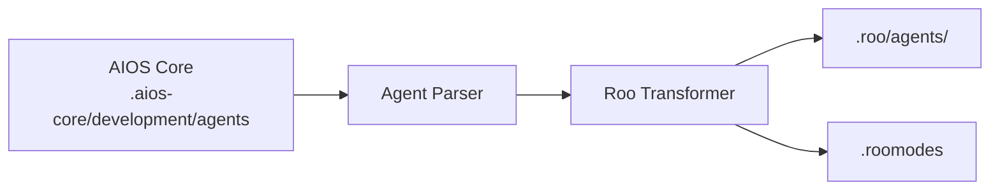

<!-- Traducción: ES | Original: /docs/platforms/en/roo-code.md | Sincronización: 2026-01-26 -->

# Guía AIOS para Roo Code

> **Extensión de VS Code Basada en Modos** - Modos de Agente Especializados

---

## Descripción General

### ¿Qué es Roo Code?

Roo Code es una extensión de VS Code que utiliza un sistema basado en modos para asistencia con IA. Cada modo proporciona contexto y capacidades especializadas, lo que facilita cambiar entre diferentes tipos de tareas.

### ¿Por qué usar AIOS con Roo Code?

Roo Code ofrece un enfoque único basado en modos:

- **Sistema de Modos**: Modos dedicados para cada tipo de agente
- **Extensión de VS Code**: Funciona en tu entorno existente
- **Cambio Rápido**: Cambios de modo rápidos a través de la barra de estado
- **Modos Personalizados**: Crear flujos de trabajo especializados
- **Conciencia de Contexto**: Los modos mantienen contexto relevante

### Comparación con Otras Plataformas

| Característica | Roo Code | Cline | Cursor |
|--------|:--------:|:-----:|:------:|
| Sistema de Modos | Sí | No | No |
| Extensión VS Code | Sí | Sí | No |
| Activación de Agentes | Selector de Modo | @mention | @mention |
| Soporte MCP | No | Limitado | Config |

---

## Requisitos

### Requisitos del Sistema

| Requisito | Mínimo | Recomendado |
|-------------|---------|-------------|
| **VS Code** | 1.80+ | Última versión |
| **RAM** | 4GB | 8GB+ |
| **Node.js** | 18.0+ (para AIOS) | 20.0+ |

### Requisitos de Cuenta

- **Clave API**: Anthropic, OpenAI u otros proveedores soportados
- **Licencia Roo Code** (si aplica)

---

## Instalación

### Paso 1: Instalar VS Code

Descarga desde [code.visualstudio.com](https://code.visualstudio.com).

### Paso 2: Instalar la Extensión Roo Code

1. Abre las Extensiones de VS Code (`Cmd/Ctrl + Shift + X`)
2. Busca "Roo Code" de RooVeterinaryInc
3. Haz clic en Instalar

O a través de la línea de comandos:
```bash
code --install-extension RooVeterinaryInc.roo-cline
```

### Paso 3: Configurar Clave API

1. Abre la configuración de Roo Code
2. Ingresa tu clave API
3. Selecciona el modelo preferido

### Paso 4: Instalar AIOS

```bash
cd your-project
npx @anthropic/aios init
# Selecciona "Roo Code" cuando se te solicite
```

### Paso 5: Verificar Instalación

```bash
ls -la .roo/
```

Estructura esperada:
```
.roo/
├── rules.md           # Reglas principales
├── agents/            # Definiciones de agentes
│   ├── dev.md
│   ├── qa.md
│   └── ...
└── .roomodes          # Definiciones de modos
```

---

## Configuración

### Archivo de Reglas

**Ubicación:** `.roo/rules.md`

```markdown
# Reglas Synkra AIOS para Roo Code

## Sistema de Agentes
- Usa el selector de modo para cambiar agentes
- Cada modo corresponde a un agente AIOS

## Estándares de Desarrollo
- Escribe código limpio y probado
- Sigue los patrones existentes
```

### Definiciones de Modos

**Ubicación:** `.roomodes`

```json
{
  "modes": [
    {
      "id": "bmad-dev",
      "name": "Developer",
      "description": "Modo de desarrollo full-stack",
      "rulesFile": ".roo/agents/dev.md"
    },
    {
      "id": "bmad-qa",
      "name": "QA Engineer",
      "description": "Modo de aseguramiento de calidad",
      "rulesFile": ".roo/agents/qa.md"
    },
    {
      "id": "bmad-architect",
      "name": "Architect",
      "description": "Modo de diseño de sistemas",
      "rulesFile": ".roo/agents/architect.md"
    }
  ]
}
```

### Archivos de Agentes

**Ubicación:** `.roo/agents/`

```markdown
# Developer Agent

## Rol
Eres un Desarrollador Full Stack Senior.

## Experiencia
- TypeScript/JavaScript
- Node.js, React
- Diseño de bases de datos
- Desarrollo de API

## Flujo de Trabajo
1. Entender requisitos
2. Planificar implementación
3. Escribir código limpio
4. Probar exhaustivamente
```

---

## Uso Básico

### Iniciar Roo Code

1. Abre VS Code con tu proyecto
2. Roo Code se carga automáticamente
3. Busca el selector de modo en la barra de estado

### Cambiar Modos

**A través de la Barra de Estado:**
1. Haz clic en el indicador de modo en la barra de estado
2. Selecciona el modo deseado de la lista
3. El contexto del modo se carga inmediatamente

**A través de la Paleta de Comandos:**
1. `Cmd/Ctrl + Shift + P`
2. Escribe "Roo: Switch Mode"
3. Selecciona modo

### Modos Integrados

Roo Code viene con varios modos integrados:

| Modo | Propósito |
|------|---------|
| **Code** | Tareas de codificación de propósito general |
| **Architect** | Planificación y liderazgo técnico |
| **Ask** | Responder preguntas y proporcionar información |
| **Debug** | Diagnóstico sistemático de problemas |
| **Orchestrator** | Coordinación de flujos de trabajo de varios pasos |

### Modos Personalizados AIOS

| Modo | Agente | Propósito |
|------|-------|---------|
| `aios-dev` | Developer | Desarrollo full-stack |
| `aios-qa` | QA | Aseguramiento de calidad |
| `aios-architect` | Architect | Diseño de sistemas |
| `aios-pm` | PM | Gestión de proyectos |
| `aios-po` | PO | Propiedad de productos |
| `aios-analyst` | Analyst | Análisis empresarial |

### Interacciones de Ejemplo

```
# En modo Developer:
Implementar la característica de autenticación de usuario

# En modo QA:
Revisar este código en busca de vulnerabilidades de seguridad

# En modo Architect:
Diseñar la arquitectura de microservicios
```

---

## Uso Avanzado

### Modos Personalizados

Crear modos especializados:

```json
{
  "modes": [
    {
      "id": "custom-api",
      "name": "API Developer",
      "description": "Desarrollo de API especializado",
      "rulesFile": ".roo/custom/api-rules.md"
    }
  ]
}
```

### Archivos de Contexto de Modo

Cada modo puede tener contexto dedicado:

```
.roo/
├── agents/
│   ├── dev.md
│   └── qa.md
└── context/
    ├── dev-context.md    # Contexto adicional de dev
    └── qa-context.md     # Contexto adicional de QA
```

### Atajos de Cambio de Modo

Configurar atajos de teclado:

```json
{
  "keybindings": [
    {
      "key": "ctrl+shift+1",
      "command": "roo.switchMode",
      "args": "bmad-dev"
    },
    {
      "key": "ctrl+shift+2",
      "command": "roo.switchMode",
      "args": "bmad-qa"
    }
  ]
}
```

### Aplicar Cambios Automáticamente

Configurar aplicación automática de cambios:

```json
{
  "roo.autoApply": {
    "enabled": true,
    "modes": ["bmad-dev"]
  }
}
```

---

## Características Específicas de Roo Code

### Indicador de Modo

La barra de estado muestra:
- Nombre del modo actual
- Icono del modo
- Acceso de cambio rápido

### Presets de Modo

Crear presets de modo para flujos de trabajo comunes:

```json
{
  "presets": {
    "feature-development": {
      "startMode": "bmad-architect",
      "sequence": ["bmad-architect", "bmad-dev", "bmad-qa"]
    }
  }
}
```

### Herencia de Contexto

Los modos pueden heredar de la base:

```json
{
  "id": "bmad-dev-react",
  "extends": "bmad-dev",
  "additionalRules": ".roo/react-rules.md"
}
```

---

## Sincronización de Agentes

### Cómo Funciona



### Comandos de Sincronización

```bash
# Sincronizar todos los agentes
npm run sync:agents

# Sincronizar para Roo Code
npm run sync:agents -- --ide roo-code
```

### Formato de Agente

Roo Code usa markdown simple:

```markdown
# Developer Agent

**Mode ID:** bmad-dev
**Activation:** Selector de modo

## Persona
Desarrollador Full Stack Senior con experiencia en tecnologías web modernas.

## Capacidades
- Desarrollo frontend (React, Vue)
- Desarrollo backend (Node.js, Python)
- Diseño de bases de datos (PostgreSQL, MongoDB)
- Desarrollo de API (REST, GraphQL)

## Flujo de Trabajo
1. Revisar requisitos y criterios de aceptación
2. Planificar enfoque de implementación
3. Escribir código limpio y probado
4. Actualizar documentación
```

---

## Limitaciones Conocidas

### Limitaciones Actuales

| Limitación | Solución |
|------------|----------|
| Sin soporte MCP | Usar otras herramientas |
| Solo VS Code | Sin versión independiente |
| Cambio de modo manual | Usar atajos |
| Ventana de contexto limitada | Contexto selectivo |

### Roo Code vs Cline

| Aspecto | Roo Code | Cline |
|--------|----------|-------|
| Sistema de Agentes | Modos | @mention |
| MCP | No | Limitado |
| Auto-aplicar | Configurable | Aprobación |

---

## Solución de Problemas

### Problemas Comunes

#### Los Modos No Se Cargan
```
Problema: Los modos personalizados no aparecen
```
**Solución:**
1. Verifica que el archivo `.roomodes` existe y es JSON válido
2. Recarga la ventana de VS Code
3. Verifica que los archivos de agentes existen

#### El Contexto del Modo No Se Aplica
```
Problema: Las reglas del modo no se están siguiendo
```
**Solución:**
1. Verifica la ruta del archivo de reglas en `.roomodes`
2. Verifica el contenido del archivo de reglas
3. Cambia de modos para actualizar

#### La Extensión No Funciona
```
Problema: Roo Code no responde
```
**Solución:**
1. Verifica que la clave API está configurada
2. Verifica que el modelo está disponible
3. Reinstala la extensión

### Logs

```bash
# Panel de salida de VS Code
View > Output > Roo Code

# Herramientas de desarrollador
Help > Toggle Developer Tools > Console
```

---

## Preguntas Frecuentes

**P: ¿Cómo difiere Roo Code de Cline?**
R: Roo Code utiliza un sistema basado en modos donde cambias contextos, mientras que Cline usa @mentions dentro de un solo contexto.

**P: ¿Puedo usar múltiples modos a la vez?**
R: No, solo un modo está activo a la vez, pero puedes cambiar entre ellos rápidamente.

**P: ¿Los modos personalizados son persistentes?**
R: Sí, los modos personalizados definidos en `.roomodes` persisten con tu proyecto.

---

## Migración

### De Cline a Roo Code

1. Instala AIOS para Roo Code:
   ```bash
   npx @anthropic/aios init --ide roo-code
   ```
2. Los agentes se convierten en modos automáticamente

### De Roo Code a Cursor

1. Los agentes AIOS en `.aios-core/` son portables
2. Inicializa para Cursor:
   ```bash
   npx @anthropic/aios init --ide cursor
   ```

---

## Recursos Adicionales

- [Documentación de Roo Code](https://docs.roocode.com/)
- [VS Code Marketplace](https://marketplace.visualstudio.com/items?itemName=RooVeterinaryInc.roo-cline)
- [Repositorio de GitHub](https://github.com/RooCodeInc/Roo-Code)
- [Comunidad Discord](https://discord.gg/roocode)
- [Guía de Plataforma AIOS](../README.md)

---

*Synkra AIOS - Guía de Plataforma Roo Code v1.0*
