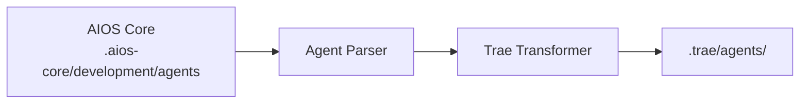

<!-- Traducción: ES | Original: /docs/platforms/en/trae.md | Sincronización: 2026-01-26 -->

# Guía de AIOS para Trae

> **Editor de Código AI de ByteDance** - Desarrollo de Iteración Rápida

---

## Descripción General

### ¿Qué es Trae?

Trae (The Real AI Engineer) es un editor de código con tecnología de IA desarrollado por ByteDance. Construido sobre la base de VS Code, combina una interfaz elegante con poderosas capacidades de IA, enfocándose en velocidad y experiencia del desarrollador. Trae integra los modelos Claude 3.7 Sonnet y GPT-4o, ambos actualmente disponibles de forma gratuita.

### ¿Por qué usar AIOS con Trae?

Trae ofrece una experiencia de desarrollo moderna:

- **IU Moderna**: Interfaz limpia y rápida
- **Activación @mention**: Activación de agentes estándar
- **Iteración Rápida**: Bucles de retroalimentación rápidos
- **Modo Constructor**: Entorno de desarrollo enfocado
- **Reglas del Proyecto**: Configuración personalizada del proyecto
- **MCP Limitado**: Extensibilidad básica

### Comparación con Otras Plataformas

| Característica | Trae | Cursor | Claude Code |
|---------|:----:|:------:|:-----------:|
| IU Moderna | Sí | Sí | No |
| Activación @mention | Sí | Sí | /comando |
| Modo Constructor | Sí | Composer | Task Tool |
| Compatibilidad MCP | Limitada | Config | Nativa |
| Enfoque de Velocidad | Sí | Moderado | Moderado |

---

## Requisitos

### Requisitos del Sistema

| Requisito | Mínimo | Recomendado |
|-------------|---------|-------------|
| **RAM** | 4GB | 8GB+ |
| **Espacio en Disco** | 500MB | 1GB+ |
| **SO** | macOS 11+, Windows 10+, Linux | Últimas versiones |
| **Node.js** | 18.0+ (para AIOS) | 20.0+ |

### Requisitos de Cuenta

- **Cuenta de Trae** (completamente gratuita)
- Acceso integrado a Claude 3.7 Sonnet y GPT-4o sin costo
- Sin claves API requeridas para uso básico

---

## Instalación

### Paso 1: Instalar Trae

1. Descargue desde [trae.ai](https://trae.ai)
2. Ejecute el instalador
3. Inicie y cree una cuenta

```bash
# macOS (si Homebrew cask está disponible)
brew install --cask trae

# O descargue desde el sitio web
```

### Paso 2: Instalar AIOS

```bash
cd your-project
npx @anthropic/aios init
# Seleccione "Trae" cuando se le solicite
```

### Paso 3: Verificar Instalación

```bash
ls -la .trae/
```

Estructura esperada:
```
.trae/
├── rules.md           # Reglas principales
├── agents/            # Definiciones de agentes
│   ├── dev.md
│   ├── qa.md
│   └── ...
└── settings.json      # Configuración local
```

---

## Configuración

### Archivo de Reglas

**Ubicación:** `.trae/rules.md`

```markdown
# Reglas de Synkra AIOS para Trae

## Sistema de Agentes
- Use @nombre-agente para activar agentes
- Siga los flujos de trabajo de agentes

## Estándares de Desarrollo
- Escriba código limpio y probado
- Siga patrones existentes
- Enfoque de iteración rápida
```

### Archivos de Agentes

**Ubicación:** `.trae/agents/`

```markdown
# Agente de Desarrollador (@dev)

## Rol
Desarrollador Full Stack Senior

## Expertise
- TypeScript/JavaScript
- Node.js, React
- Prototipado rápido
- Prácticas de código limpio

## Flujo de Trabajo
1. Comprender requisitos rápidamente
2. Prototipo de solución
3. Iterar basado en retroalimentación
4. Pulir y probar
```

### Configuración

**Ubicación:** `.trae/settings.json`

```json
{
  "ai": {
    "model": "default",
    "temperature": 0.7
  },
  "rules": {
    "enabled": true,
    "path": ".trae/rules.md"
  },
  "builder": {
    "autoSave": true,
    "previewOnSave": true
  }
}
```

---

## Uso Básico

### Iniciando Trae

1. Abra su proyecto en Trae
2. Las reglas se cargan automáticamente desde `.trae/rules.md`
3. Use el panel de IA para interacciones

### Activando Agentes

Use menciones @ en el chat:

```
@dev         # Agente de desarrollador
@qa          # Agente de Ingeniero QA
@architect   # Arquitecto de Software
@pm          # Gerente de Proyecto
@analyst     # Analista de Negocios
@devops      # Ingeniero DevOps
```

### Ejemplos de Interacciones

```
@dev quickly prototype a user login form

@qa do a quick security review of auth module

@architect sketch the API architecture
```

### Modo Constructor

Modo de desarrollo enfocado de Trae:

1. Presione `Cmd/Ctrl + B` para entrar en Constructor
2. Describa lo que desea construir
3. Itere con vista previa en tiempo real
4. Salga con cambios aplicados

```
# En modo Constructor
@dev Create a responsive navigation component
- Mobile hamburger menu
- Desktop full navigation
- Smooth transitions
```

---

## Uso Avanzado

### Flujo de Trabajo de Iteración Rápida

```
@dev Let's iterate on the checkout flow:
1. First, show me a basic form
2. Add validation
3. Connect to API
4. Add loading states
```

### Sugerencias en Línea

Trae proporciona sugerencias rápidas en línea:
1. Comience a escribir código
2. Vea sugerencias instantáneas
3. Presione Tab para aceptar
4. Continúe escribiendo para nuevas sugerencias

### Proveedores de Contexto

Agregue contexto a solicitudes:

```
@dev Looking at src/components/,
create a new Button component following the same patterns

@qa Based on existing tests,
add tests for the new Button component
```

### Integración de Reglas del Proyecto

Superponga reglas para proyectos complejos:

```
.trae/
├── rules.md              # Reglas globales
├── rules/
│   ├── frontend.md       # Específica del frontend
│   ├── backend.md        # Específica del backend
│   └── testing.md        # Reglas de prueba
└── agents/
```

---

## Características Específicas de Trae

### Modo Constructor

| Característica | Descripción |
|---------|-------------|
| **Vista Previa en Tiempo Real** | Vea cambios instantáneamente |
| **Construcción Iterativa** | Bucles de retroalimentación rápidos |
| **Enfoque de Componente** | Construya una cosa a la vez |
| **Auto-guardado** | Nunca pierda trabajo |

### Atajos de Teclado

| Atajo | Acción |
|----------|--------|
| `Cmd/Ctrl + B` | Alternar Modo Constructor |
| `Cmd/Ctrl + I` | Abrir Chat de IA |
| `Cmd/Ctrl + .` | Acciones Rápidas |
| `Tab` | Aceptar sugerencia |
| `Escape` | Cancelar/Cerrar |

### Características de Velocidad

| Característica | Descripción |
|---------|-------------|
| **Vista Previa Instantánea** | Los cambios se renderizan inmediatamente |
| **Caché Inteligente** | Operaciones rápidas repetidas |
| **Procesamiento Paralelo** | Múltiples operaciones a la vez |

---

## Sincronización de Agentes

### Cómo Funciona



### Comandos de Sincronización

```bash
# Sincronizar todos los agentes
npm run sync:agents

# Sincronizar para Trae
npm run sync:agents -- --ide trae
```

### Formato de Agente

Trae utiliza formato de reglas del proyecto:

```markdown
# Agente de Desarrollador

**Activación:** @dev

## Personaje
Desarrollador Full Stack que se mueve rápidamente enfocado en iteración rápida.

## Expertise
- TypeScript/JavaScript
- React, Vue, Svelte
- Node.js, Deno
- Prototipado rápido

## Enfoque
- Comenzar simple, iterar rápidamente
- Mostrar código funcionando rápidamente
- Refinar basado en retroalimentación
- Mantener impulso

## Estilo de Respuesta
- Explicaciones concisas
- Código funcionando primero
- Iteraciones rápidas
- Pasos claros siguientes
```

---

## Limitaciones Conocidas

### Limitaciones Actuales

| Limitación | Solución Alternativa |
|------------|------------|
| MCP Limitado | Use integraciones básicas |
| Plataforma más nueva | Conjunto de características en crecimiento |
| Comunidad más pequeña | Use documentación oficial |

### Trae vs Cursor

| Aspecto | Trae | Cursor |
|--------|------|--------|
| Enfoque | Velocidad | Características |
| IU | Moderna | Similar a VS Code |
| MCP | Limitado | Config |
| Madurez | Más nuevo | Establecido |

---

## Solución de Problemas

### Problemas Comunes

#### Las Reglas No Se Cargan
```
Problema: El agente no responde
```
**Solución:**
1. Verifique que `.trae/rules.md` existe
2. Verifique la sintaxis
3. Recargue Trae

#### Problemas del Modo Constructor
```
Problema: El constructor no vista previa
```
**Solución:**
1. Verifique que el tipo de archivo es compatible
2. Verifique que el servidor de vista previa se ejecuta
3. Reinicie el modo Constructor

#### Desempeño Lento
```
Problema: Las sugerencias toman demasiado tiempo
```
**Solución:**
1. Verifique la conexión de red
2. Reduzca el tamaño del contexto
3. Cierre paneles no utilizados

### Registros

```bash
# Ubicación de registros de Trae
# macOS: ~/Library/Application Support/Trae/logs/
# Windows: %APPDATA%\Trae\logs\
# Linux: ~/.config/Trae/logs/
```

---

## Preguntas Frecuentes

**P: ¿Qué hace que Trae sea diferente?**
R: Trae se enfoca en velocidad e iteración rápida, con una IU moderna diseñada para ciclos de desarrollo rápidos.

**P: ¿Es Trae gratuito?**
R: Sí, Trae es completamente gratuito sin costos ocultos. Incluye acceso gratuito a los modelos Claude 3.7 Sonnet y GPT-4o.

**P: ¿Puedo usar modelos externos?**
R: Soporte limitado para claves API externas.

**P: ¿Qué tan maduro es Trae?**
R: Plataforma más nueva, activamente desarrollada con características en crecimiento.

---

## Migración

### De Cursor a Trae

1. Instale AIOS para Trae:
   ```bash
   npx @anthropic/aios init --ide trae
   ```
2. Los agentes se transforman al formato Trae

### De Trae a Otros IDEs

1. Los agentes AIOS en `.aios-core/` son portátiles
2. Inicialice para el IDE objetivo
3. Los agentes se transforman automáticamente

---

## Recursos Adicionales

- [Sitio Web Oficial de Trae](https://www.trae.ai/)
- [Descarga de Trae IDE](https://traeide.com/)
- [Agente Trae (GitHub)](https://github.com/bytedance/trae-agent)
- [Guía de Plataforma AIOS](../README.md)

> **Nota:** Trae es desarrollado por ByteDance. Como un fork de VS Code, la mayoría de las extensiones de VS Code son compatibles.

---

*Synkra AIOS - Guía de Plataforma Trae v1.0*
