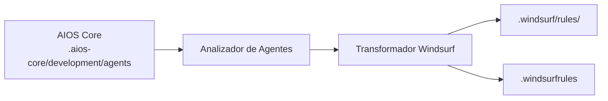

<!-- Traducción: ES | Original: /docs/platforms/en/windsurf.md | Sincronización: 2026-01-26 -->

# Guía de AIOS para Windsurf

> **Entorno de Desarrollo Impulsado por IA** - Innovación en Flujo Cascade

---

## Descripción General

### ¿Qué es Windsurf?

Windsurf es un entorno de desarrollo impulsado por IA que introduce "Cascade" - un enfoque innovador para codificación asistida por IA que mantiene contexto en múltiples interacciones y archivos. Construido para desarrolladores que desean una integración profunda de IA en su flujo de trabajo.

### ¿Por qué usar AIOS con Windsurf?

Windsurf ofrece capacidades únicas para AIOS:

- **Cascade Flow**: Mantiene contexto en operaciones complejas
- **Activación @mention**: Sintaxis natural de activación de agentes
- **Supercomplete**: Completación de código avanzada
- **Sistema de Flows**: Ejecución automatizada de flujos de trabajo
- **Soporte MCP**: Extensible mediante configuración
- **Formato Etiquetado XML**: Procesamiento estructurado de reglas

### Comparación con Otras Plataformas

| Característica | Windsurf | Cursor | Claude Code |
|---------|:--------:|:------:|:-----------:|
| Cascade Flow | Sí | No | No |
| Activación @mention | Sí | Sí | /command |
| Supercomplete | Sí | Tab | Tab |
| Soporte MCP | Config | Config | Nativo |
| Formato Reglas XML | Sí | No | No |

---

## Requisitos

### Requisitos del Sistema

| Requisito | Mínimo | Recomendado |
|-------------|---------|-------------|
| **RAM** | 4GB | 8GB+ |
| **Espacio en Disco** | 500MB | 1GB+ |
| **SO** | macOS 10.15+, Windows 10+, Linux | Más reciente |
| **Node.js** | 18.0+ (para AIOS) | 20.0+ |

### Requisitos de Cuenta

- **Cuenta Windsurf** (capa gratuita disponible)
- **Claves API** (opcional): Configurar modelos externos

---

## Instalación

### Paso 1: Instalar Windsurf

1. Descargar desde [codeium.com/windsurf](https://codeium.com/windsurf)
2. Ejecutar el instalador
3. Abrir y crear cuenta

```bash
# macOS (vía Homebrew si está disponible)
brew install --cask windsurf

# O descargar directamente
```

### Paso 2: Instalar AIOS

```bash
cd your-project
npx @anthropic/aios init
# Seleccionar "Windsurf" cuando se solicite
```

### Paso 3: Verificar Instalación

```bash
ls -la .windsurfrules
ls -la .windsurf/
```

Estructura esperada:
```
project/
├── .windsurfrules          # Archivo principal de reglas
└── .windsurf/
    └── rules/              # Reglas de agentes
        ├── dev.md
        ├── qa.md
        └── ...
```

---

## Configuración

### Archivo Principal de Reglas

**Ubicación:** `.windsurfrules` (directorio raíz)

Este archivo utiliza formato de markdown etiquetado en XML:

```markdown
<rules>
# Reglas de Desarrollo Synkra AIOS

## Integración de Agentes
- Usar @agent-name para activar agentes
- Seguir flujos de trabajo específicos de agentes

## Estándares de Desarrollo
- Escribir código limpio y probado
- Seguir convenciones del proyecto
</rules>

<context>
El contexto específico del proyecto va aquí
</context>
```

### Reglas de Agentes

**Ubicación:** `.windsurf/rules/`

Cada archivo de agente sigue el formato etiquetado en XML:

```markdown
<agent name="dev">
# Agente Desarrollador

## Experiencia
- Desarrollo full-stack
- Prácticas de código limpio

## Flujo de Trabajo
1. Entender requisitos
2. Planificar implementación
3. Escribir código probado
</agent>
```

### Configuración MCP

```json
{
  "mcpServers": {
    "filesystem": {
      "command": "npx",
      "args": ["-y", "@modelcontextprotocol/server-filesystem", "."]
    }
  }
}
```

---

## Uso Básico

### Iniciar Windsurf

1. Abrir tu proyecto en Windsurf
2. Las reglas se cargan automáticamente desde `.windsurfrules`
3. Usar el panel de IA para interacciones

### Activar Agentes

Usar @mentions en el chat de IA:

```
@dev         # Agente Desarrollador
@qa          # Agente Ingeniero QA
@architect   # Arquitecto de Software
@pm          # Gerente de Proyecto
@po          # Propietario del Producto
@sm          # Maestro Scrum
@analyst     # Analista de Negocios
@devops      # Ingeniero DevOps
```

### Ejemplo de Interacciones

```
@dev implementar la autenticación de usuario siguiendo la historia

@qa revisar este módulo por vulnerabilidades de seguridad

@architect diseñar la arquitectura del API gateway
```

### Usar Cascade

Cascade mantiene contexto en las interacciones:

```
# Primera interacción
@dev Crear un modelo de usuario con validación

# Cascade recuerda el contexto
Ahora agregar la capa de repositorio

# Continúa con el mismo contexto
Agregar pruebas unitarias para el repositorio
```

---

## Uso Avanzado

### Flujos de Trabajo Cascade

#### Implementación Multi-paso
```
@dev @cascade
1. Crear el esquema de base de datos
2. Generar migraciones
3. Implementar la capa del modelo
4. Agregar endpoints de API
5. Escribir pruebas de integración
```

#### Refactorización Compleja
```
@architect @cascade
Refactorizar el módulo de pagos:
- Extraer interfaces
- Implementar patrón de estrategia
- Actualizar todos los consumidores
- Mantener compatibilidad hacia atrás
```

### Supercomplete

Completación avanzada de Windsurf:

1. Comenzar a escribir código
2. Esperar sugerencias de Supercomplete
3. Tab para aceptar, Escape para descartar
4. Supercomplete considera el contexto del archivo completo

### Flows

Ejecución automatizada de flujos de trabajo:

```yaml
# .windsurf/flows/deploy.yaml
name: Deploy Flow
steps:
  - run: npm test
  - run: npm run build
  - run: npm run deploy
```

### Etiquetas de Contexto

Usar etiquetas XML para contexto estructurado:

```markdown
<context type="database">
Usando PostgreSQL 14 con Prisma ORM
</context>

<context type="api">
API RESTful con Express.js
</context>
```

---

## Características Específicas de Windsurf

### Panel Cascade

| Característica | Descripción |
|---------|-------------|
| **Memoria de Contexto** | Recuerda en interacciones |
| **Seguimiento de Archivos** | Rastrea archivos modificados |
| **Vista de Diff** | Muestra todos los cambios |
| **Rollback** | Deshacer cambios de cascade |

### Atajos de Teclado

| Atajo | Acción |
|----------|--------|
| `Cmd/Ctrl + I` | Abrir panel de IA |
| `Cmd/Ctrl + Shift + I` | Modo Cascade |
| `Tab` | Aceptar Supercomplete |
| `Escape` | Descartar sugerencia |
| `Cmd/Ctrl + Z` | Deshacer paso de cascade |

### Etiquetas de Reglas XML

| Etiqueta | Propósito |
|-----|---------|
| `<rules>` | Sección principal de reglas |
| `<context>` | Contexto del proyecto |
| `<agent>` | Definición de agente |
| `<patterns>` | Patrones de código |
| `<constraints>` | Limitaciones |

---

## Sincronización de Agentes

### Cómo Funciona



### Comandos de Sincronización

```bash
# Sincronizar todos los agentes
npm run sync:agents

# Sincronizar con formato Windsurf
npm run sync:agents -- --ide windsurf
```

### Formato de Agente

Los agentes de Windsurf utilizan markdown etiquetado en XML:

```markdown
<agent name="dev" activation="@dev">
# Agente Desarrollador

<role>
Desarrollador Full Stack Senior
</role>

<expertise>
- TypeScript/JavaScript
- Node.js, React
- Diseño de base de datos
</expertise>

<workflow>
1. Leer requisitos de historia
2. Planificar implementación
3. Escribir código limpio
4. Probar a fondo
</workflow>
</agent>
```

---

## Limitaciones Conocidas

### Limitaciones Actuales

| Limitación | Solución Alternativa |
|------------|------------|
| Sin CLI nativa | Usar GUI o integrar con terminal |
| Límites de contexto de Cascade | Dividir en cascadas más pequeñas |
| MCP limitado | Solo basado en configuración |

### Windsurf vs Cursor

| Aspecto | Windsurf | Cursor |
|--------|----------|--------|
| Flujo | Cascade | Composer |
| Formato | Etiquetado XML | Markdown |
| Completación | Supercomplete | Tab |

---

## Resolución de Problemas

### Problemas Comunes

#### Las Reglas No Se Cargan
```
Problema: .windsurfrules no reconocido
```
**Solución:**
1. Verificar que el archivo está en la raíz del proyecto
2. Revisar que la sintaxis XML sea válida
3. Reiniciar Windsurf

#### Cascade Pierde Contexto
```
Problema: Cascade olvida el contexto anterior
```
**Solución:**
1. Usar `@cascade` explícitamente
2. Mantener cascadas enfocadas
3. Revisar límites de contexto

#### Agente No Se Activa
```
Problema: @dev no se reconoce
```
**Solución:**
```bash
# Resincronizar agentes
npm run sync:agents

# Revisar formato
cat .windsurf/rules/dev.md
```

### Ubicación de Logs

```bash
# macOS
~/Library/Application Support/Windsurf/logs/

# Windows
%APPDATA%\Windsurf\logs\

# Linux
~/.config/Windsurf/logs/
```

---

## Preguntas Frecuentes

**P: ¿Qué es Cascade?**
R: Cascade es la característica de IA de Windsurf que mantiene contexto en múltiples interacciones, habilitando operaciones complejas de múltiples pasos.

**P: ¿Cómo es Windsurf diferente de Cursor?**
R: Windsurf usa Cascade para contexto continuo, mientras que Cursor usa Composer. Windsurf también usa formato de reglas etiquetadas en XML.

**P: ¿Puedo usar Windsurf sin conexión?**
R: La edición básica funciona sin conexión, pero las características de IA requieren internet.

---

## Migración

### De Cursor a Windsurf

1. Exportar reglas de Cursor:
   ```bash
   cp .cursor/rules.md cursor-backup.md
   ```

2. Inicializar AIOS para Windsurf:
   ```bash
   npx @anthropic/aios init --ide windsurf
   ```

3. Las reglas se convierten automáticamente a formato etiquetado en XML

### De Windsurf a Otros IDEs

1. Los agentes de AIOS en `.aios-core/` son independientes del IDE
2. Inicializar para el IDE de destino
3. Los agentes se transforman automáticamente

---

## Recursos Adicionales

- [Documentación de Windsurf](https://codeium.com/windsurf/docs)
- [Comunidad Codeium](https://discord.gg/codeium)
- [Guía de Plataforma AIOS](../README.md)

---

*Synkra AIOS - Guía de Plataforma Windsurf v1.0*
