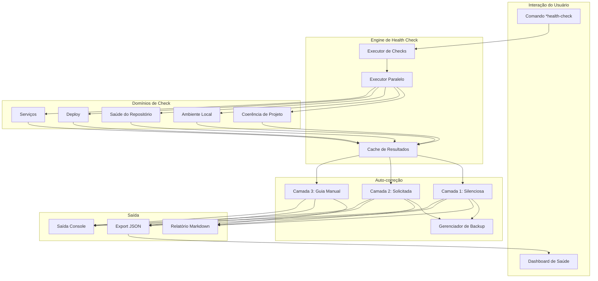
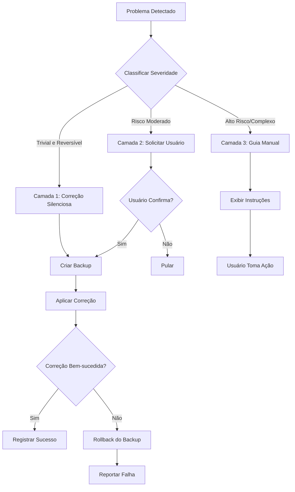
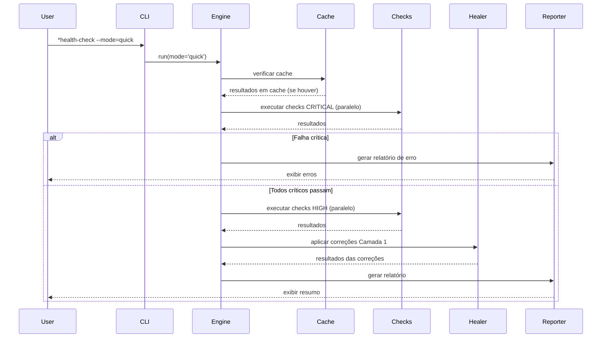

<!-- Tradução: PT-BR | Original: /docs/en/architecture/adr/adr-hcs-health-check-system.md | Sincronização: 2026-01-26 -->

# ADR: Arquitetura do Sistema de Health Check

**ID do ADR:** ADR-HCS-001
**Status:** Proposto
**Criado:** 2025-12-30
**Autor:** @architect (Aria) via @dev (Dex)
**Story:** Investigação HCS-1
**Decisores:** @architect, @po, Tech Lead

---

## Contexto

AIOS precisa de um sistema abrangente de health check para:

1. **Diagnosticar problemas** em configuração do projeto, ambiente e integrações
2. **Habilitar auto-correção** para problemas comuns sem intervenção manual
3. **Rastrear dívida técnica** identificando estados degradados
4. **Fornecer visibilidade** da saúde geral do projeto através de dashboards
5. **Integrar com CI/CD** para monitoramento contínuo de saúde

### Declaração do Problema

Atualmente, desenvolvedores precisam diagnosticar manualmente problemas em múltiplos domínios:

- Drift de configuração do framework
- Má configuração de ambiente
- Integrações MCP quebradas
- Dependências desatualizadas com vulnerabilidades de segurança
- Inconsistências de configuração de IDE

Isso leva a:

- Tempo desperdiçado em debugging
- Ambientes de desenvolvimento inconsistentes entre a equipe
- Falhas silenciosas que se manifestam posteriormente como bugs
- Vulnerabilidades de segurança passando despercebidas

### Requisitos

1. **Modos de Execução:** Manual, CI agendado, pós-merge, opcional em background na IDE
2. **Domínios de Check:** Coerência de projeto, ambiente local, repositório, deploy, serviços
3. **Auto-correção:** Abordagem em camadas (silenciosa, solicitada, guia manual)
4. **Performance:** Modo rápido <10s, modo completo <60s
5. **Extensibilidade:** Suporte para checks customizados específicos do projeto
6. **Integração:** Reutilizar componentes do Dashboard de Qualidade da Story 3.11

---

## Decisão

Implementaremos um **Sistema Híbrido de Health Check** com a seguinte arquitetura:

### Decisões Core de Arquitetura

#### 1. Modelo de Execução: Manual-First com Integração CI

**Decisão:** Execução principal é manual (comando `*health-check`), com integração secundária de CI agendado.

**Justificativa:**

- Segue padrões da indústria (Flutter doctor, Homebrew doctor, WP-CLI doctor)
- Evita fricção de workflow de pre-commit hooks
- Padrão Terraform: Detecção separada de remediação
- Padrão Kubernetes: Monitoramento contínuo em background

**Alternativas Rejeitadas:**

- Pre-commit hooks: Muito lento (10-30s), desenvolvedores ignoram com `--no-verify`
- Always-on background: Complexo, preocupações de performance
- Apenas CI: Sem feedback imediato para desenvolvedores

#### 2. Arquitetura de Checks: Híbrida (Código + YAML)

**Decisão:** Usar checks baseados em código para funcionalidade core, checks baseados em YAML para extensibilidade.

**Justificativa:**

- Código fornece performance e capacidade de lógica complexa
- YAML fornece customização fácil específica do projeto
- Padrão WP-CLI: Checks core + `doctor.yml` checks customizados
- Padrão VS Code: Isolamento core + flexibilidade de extensão

**Estrutura:**

```
.aios-core/core/health-check/
├── checks/           # Checks JavaScript core (33 checks)
│   ├── project/
│   ├── local/
│   ├── repository/
│   ├── deployment/
│   └── services/
└── ...

.aios/
└── custom-checks.yaml  # Checks YAML específicos do projeto
```

**Alternativas Rejeitadas:**

- Apenas baseado em código: Não extensível para necessidades específicas do projeto
- Apenas baseado em YAML: Limitado para checks complexos (ex: npm audit)
- Sistema de plugins: Over-engineered para necessidades atuais

#### 3. Auto-correção: Modelo de Segurança em Três Camadas

**Decisão:** Implementar três camadas de auto-correção com regras de segurança estritas.

**Camadas:**

1. **Camada 1 (Silenciosa):** Operações seguras, reversíveis, apenas no framework
2. **Camada 2 (Solicitada):** Risco moderado, requer confirmação do usuário
3. **Camada 3 (Guia Manual):** Alto risco, fornece apenas instruções

**Justificativa:**

- Padrão Terraform: Separação explícita de plan vs apply
- Padrão npm: Checks de integridade com recuperação controlada pelo usuário
- Padrão VS Code: Auto-update de coisas seguras, bloqueio de coisas perigosas
- Padrão Git: Sempre preservar histórico (reflog)

**Regras de Segurança:**

- Nunca modificar código fonte do usuário
- Nunca tocar em credenciais/secrets
- Sempre criar backups antes de modificação
- Nunca fazer push para repositórios remotos

**Alternativas Rejeitadas:**

- Duas camadas (auto/manual): Falta meio-termo para riscos moderados
- Sem auto-fix: Perde oportunidade de correções sem fricção
- Auto-fix agressivo: Muito arriscado, poderia causar perda de dados

#### 4. Integração com Dashboard: Componentes Compartilhados

**Decisão:** Criar biblioteca de componentes compartilhados estendendo o Dashboard de Qualidade da Story 3.11.

**Justificativa:**

- Princípio DRY: Reutilizar setup existente de Chart.js, Tailwind
- UX Consistente: Mesma linguagem visual entre dashboards
- Desenvolvimento mais rápido: Não reconstruir componentes comuns

**Estrutura de Integração:**

```
tools/
├── shared-dashboard/     # Componentes compartilhados
│   ├── components/
│   │   ├── Card.jsx
│   │   ├── Chart.jsx
│   │   └── StatusBadge.jsx
│   ├── hooks/
│   │   ├── useMetrics.js
│   │   └── useRealTime.js
│   └── styles/
│       └── tailwind-preset.js
├── quality-dashboard/    # Story 3.11
│   └── (estende shared)
└── health-dashboard/     # Dashboard HCS
    └── (estende shared)
```

**Alternativas Rejeitadas:**

- Duplicar componentes: Carga de manutenção, inconsistência
- Dashboard monolítico: Muito complexo, ciclos de atualização diferentes
- Biblioteca externa: Exagero para ferramentas internas

#### 5. Priorização de Checks: Estratégia Fail-Fast

**Decisão:** Executar checks CRITICAL primeiro, parar em falha crítica no modo rápido.

**Justificativa:**

- Padrão de probe Kubernetes: Falhar rápido em problemas de liveness
- Otimização de performance: Não executar checks caros se básicos falharem
- Experiência do usuário: Feedback rápido em problemas bloqueantes

**Ordem de Execução:**

1. Checks CRITICAL (paralelo onde possível)
2. Checks HIGH
3. Checks MEDIUM
4. Checks LOW
5. Checks INFO (nunca falham)

**Alternativas Rejeitadas:**

- Executar todos sempre: Desperdiça tempo quando básicos estão quebrados
- Ordem aleatória: Experiência inconsistente
- Alfabético: Sem priorização lógica

---

## Consequências

### Positivas

1. **Controle do Usuário:** Abordagem manual-first respeita workflow do desenvolvedor
2. **Segurança:** Correção em três camadas previne danos acidentais
3. **Performance:** Execução paralela e cache atendem metas de tempo
4. **Extensibilidade:** Checks YAML customizados permitem necessidades específicas do projeto
5. **Manutenibilidade:** Componentes compartilhados de dashboard reduzem duplicação
6. **Alinhamento com Indústria:** Segue padrões provados do Kubernetes, Terraform, npm

### Negativas

1. **Complexidade Inicial:** Arquitetura híbrida requer mais setup inicial
2. **Carga de Documentação:** Três camadas de correção precisam de documentação clara
3. **Curva de Aprendizado de Checks Customizados:** Times precisam aprender formato YAML de check
4. **Dependência de Dashboard:** Dashboard de saúde bloqueado pela conclusão da Story 3.11

### Riscos

| Risco                                   | Probabilidade | Impacto | Mitigação                                  |
| --------------------------------------- | ------------- | ------- | ------------------------------------------ |
| Auto-correção causa danos               | Baixa         | Alto    | Blocklist estrita, backups obrigatórios    |
| Metas de performance não atingidas      | Média         | Média   | Cache agressivo, execução paralela         |
| Checks customizados muito complexos     | Baixa         | Baixa   | Fornecer exemplos, limitar tipos de check  |
| Scope creep de dashboard                | Média         | Média   | Limites estritos de componentes compartilhados |

---

## Plano de Implementação

### Fase 1: Engine Core (HCS-2, 5h)

- HealthCheckEngine com execução paralela
- 33 checks core em 5 domínios
- Agregação de resultados e scoring

### Fase 2: Auto-correção (HCS-2, 4h)

- Gerenciador de backup
- Healers Camada 1, 2, 3
- Persistência de log de correção

### Fase 3: Relatórios (HCS-2, 3h)

- Gerador de relatório Markdown
- Export JSON para dashboard
- Saída resumida no console

### Fase 4: Dashboard (HCS-2, 4h)

- Extração de componentes compartilhados da Story 3.11
- Componentes específicos de saúde (DomainCard, HealthScore)
- Integração com dashboard

### Fase 5: Integração CI (HCS-3, futuro)

- Workflow GitHub Actions
- Monitoramento de saúde agendado
- Notificações Slack/email

---

## Alternativas Consideradas

### Alternativa 1: Baseado em Pre-commit Hook

**Descrição:** Executar health check em todo commit via pre-commit hook.

**Prós:**

- Captura problemas imediatamente
- Impõe padrões em toda a equipe

**Contras:**

- Delay de 10-30 segundos em cada commit
- Desenvolvedores ignoram com `--no-verify`
- Cria fricção de workflow

**Veredito:** ❌ Rejeitado - Muita fricção

### Alternativa 2: Arquitetura de Plugin Puro

**Descrição:** Todos os checks como plugins carregáveis (como regras ESLint).

**Prós:**

- Extensibilidade máxima
- Fácil adicionar/remover checks
- Ecossistema de checks de terceiros

**Contras:**

- Over-engineered para necessidades atuais
- Problemas de compatibilidade de plugins
- Carga de manutenção maior

**Veredito:** ❌ Rejeitado - Over-engineering

### Alternativa 3: Apenas Integração com IDE em Tempo Real

**Descrição:** Health check executa apenas como extensão de IDE/processo em background.

**Prós:**

- Feedback em tempo real
- Sem comando manual necessário

**Contras:**

- Complexo implementar entre IDEs
- Preocupações de impacto de performance
- Sem integração CI
- Nem todos desenvolvedores usam IDEs suportadas

**Veredito:** ❌ Rejeitado - Muito limitante, complexo

### Alternativa 4: Ferramenta Externa (doctor.js)

**Descrição:** Usar framework de health check open-source existente.

**Prós:**

- Sem desenvolvimento necessário
- Suporte da comunidade

**Contras:**

- Sem checks específicos do AIOS
- Capacidades limitadas de auto-correção
- Dependência de projeto externo

**Veredito:** ❌ Rejeitado - Não atende requisitos específicos do AIOS

---

## Referências

### Fontes de Pesquisa da Indústria

1. **Kubernetes Health Probes**
   - [Liveness, Readiness, and Startup Probes](https://kubernetes.io/docs/concepts/configuration/liveness-readiness-startup-probes/)
   - Insight chave: Diferenciar entre "vivo" e "pronto para servir"

2. **Terraform Drift Detection**
   - [Detecting and Managing Drift](https://developer.hashicorp.com/terraform/tutorials/state/resource-drift)
   - Insight chave: Separar detecção de remediação

3. **VS Code Extension Health**
   - [Extension Bisect](https://code.visualstudio.com/blogs/2021/02/16/extension-bisect)
   - Insight chave: Isolamento previne falhas em cascata

4. **npm/yarn Integrity**
   - [Lockfile Integrity](https://medium.com/node-js-cybersecurity/lockfile-poisoning-and-how-hashes-verify-integrity-in-node-js-lockfiles)
   - Insight chave: Verificação criptográfica com recuperação controlada pelo usuário

5. **Padrões CLI Doctor**
   - [Flutter Doctor](https://quickcoder.org/flutter-doctor/)
   - [WP-CLI Doctor](https://github.com/wp-cli/doctor-command)
   - Insight chave: Saída categorizada com correções acionáveis

### Referências Internas

- [Story 3.11: Dashboard de Quality Gates](../stories/v2.1/sprint-3/story-3.11-quality-gates-dashboard.md)
- [Story HCS-1: Investigação](../stories/epics/epic-health-check-system/story-hcs-1-investigation.md)
- [Story HCS-2: Implementação](../stories/epics/epic-health-check-system/story-hcs-2-implementation.md)
- [Padrões de Codificação](../framework/coding-standards.md)

---

## Registro de Decisão

| Data       | Decisão                               | Autor               |
| ---------- | ------------------------------------- | ------------------- |
| 2025-12-30 | Proposta inicial de arquitetura       | @architect via @dev |

---

## Apêndice: Diagramas de Arquitetura

### Visão Geral do Sistema



### Fluxo de Auto-correção



### Execução de Checks



---

_Este ADR foi criado como parte da Investigação da Story HCS-1_
