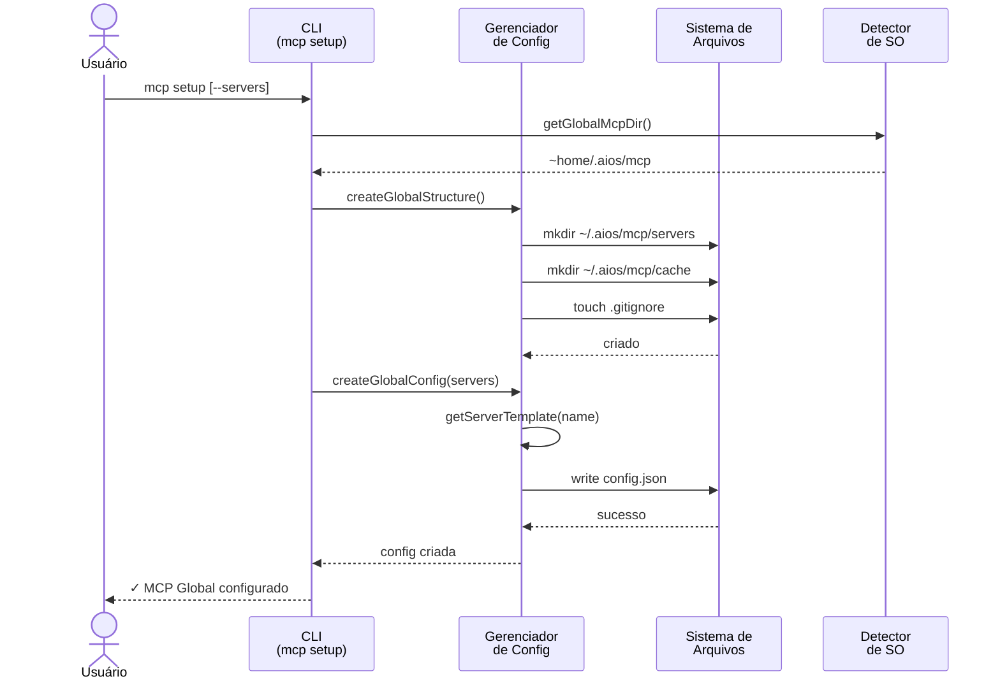
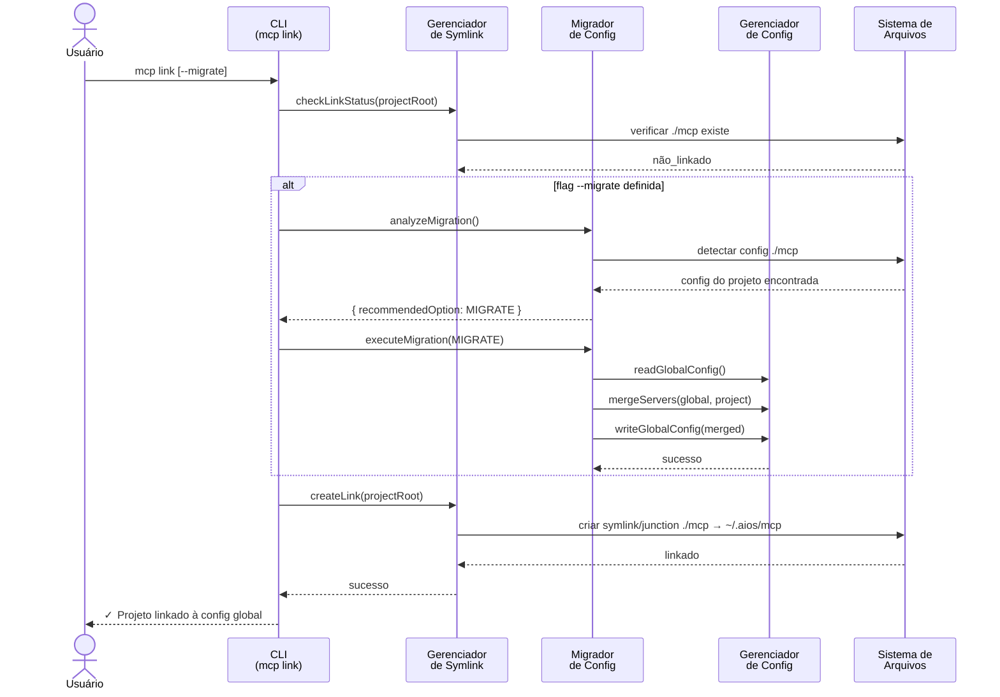

<!-- Tradução: PT-BR | Original: /docs/en/architecture/mcp-system-diagrams.md | Sincronização: 2026-01-26 -->

# Sistema MCP Global - Diagramas de Arquitetura

**Story:** 2.11 - Sistema MCP Global
**Gerado por:** CodeRabbit (PR #16)
**Data:** 2025-12-01

---

## Fluxo de Setup do MCP

---

## Fluxo de Link do MCP (com Migração)

---

## Visão Geral dos Componentes

### Módulos Core

| Módulo | Arquivo | Propósito |
|--------|---------|-----------|
| **Detector de SO** | `core/mcp/os-detector.js` | Detecção de SO/path cross-platform |
| **Gerenciador de Config** | `core/mcp/global-config-manager.js` | CRUD de config global e templates de servidor |
| **Gerenciador de Symlink** | `core/mcp/symlink-manager.js` | Gerenciamento de links symlink/junction |
| **Migrador de Config** | `core/mcp/config-migrator.js` | Migração projeto-para-global com merge |

### Comandos CLI

| Comando | Arquivo | Propósito |
|---------|---------|-----------|
| `mcp setup` | `cli/commands/mcp/setup.js` | Configurar config global |
| `mcp link` | `cli/commands/mcp/link.js` | Linkar projeto ao global |
| `mcp status` | `cli/commands/mcp/status.js` | Mostrar status da config |
| `mcp add` | `cli/commands/mcp/add.js` | Adicionar/remover/habilitar servidores |

---

## Análise de Complexidade (CodeRabbit)

| Componente | Complexidade | Áreas-Chave |
|------------|--------------|-------------|
| **config-migrator.js** | Alta | Lógica de migração multi-path, merge de servidores, resolução de conflitos |
| **symlink-manager.js** | Média | Links cross-platform (symlinks Unix, junctions Windows) |
| **global-config-manager.js** | Média | Sistema de templates de servidor com persistência por servidor |
| **Orquestração CLI** | Média | Validação multi-etapa, prompts de usuário |

**Esforço Estimado de Revisão:** 🎯 4 (Complexo) | ⏱️ ~60 minutos

---

*Gerado a partir da revisão de PR do CodeRabbit - Story 2.11*
