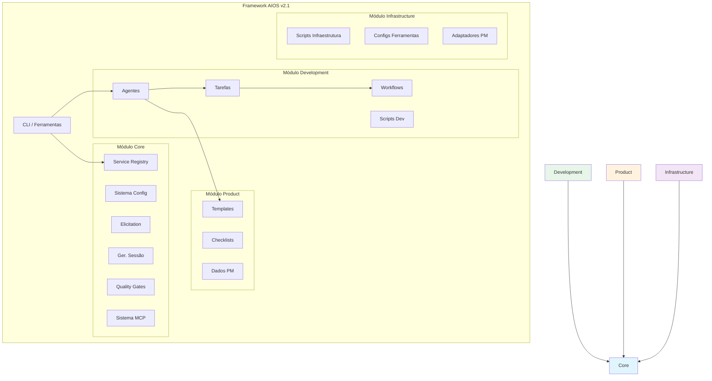
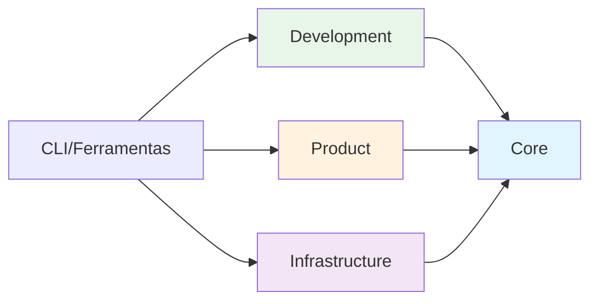

<!-- Tradução: PT-BR | Original: /docs/en/architecture/module-system.md | Sincronização: 2026-01-26 -->

# Arquitetura do Sistema de Módulos do AIOS

> Guia completo para a arquitetura modular v2.1 do Synkra AIOS.

**Versão:** 2.1.0
**Última Atualização:** 2025-12-01
**Story:** [2.16 - Documentation Sprint 2](../stories/v2.1/sprint-2/story-2.16-documentation.md)

---

## Visão Geral

### Por Que Arquitetura Modular?

A arquitetura modular v2.1 aborda vários desafios da estrutura flat da v2.0:

| Desafio | Problema v2.0 | Solução v2.1 |
|-----------|--------------|---------------|
| **Descoberta** | 200+ arquivos em diretórios mistos | Organizado por responsabilidade |
| **Manutenção** | Propriedade pouco clara | Limites de módulo definem propriedade |
| **Dependências** | Implícitas, circulares | Explícitas, unidirecionais |
| **Escalabilidade** | Todos os arquivos sempre carregados | Lazy loading por módulo |
| **Testes** | Apenas testes de sistema completo | Isolamento em nível de módulo |

### Princípios de Design

1. **Responsabilidade Única** - Cada módulo tem um propósito claro
2. **Dependências Explícitas** - Módulos declaram o que precisam
3. **Acoplamento Fraco** - Mudanças em um módulo não propagam
4. **Alta Coesão** - Funcionalidade relacionada permanece junta
5. **Lazy Loading** - Carrega apenas o necessário

---

## Estrutura de Módulos

O Synkra AIOS organiza o diretório `.aios-core/` em quatro módulos principais:

```
.aios-core/
├── core/              # Fundamentos do framework
├── development/       # Artefatos de desenvolvimento
├── product/           # Templates voltados ao usuário
└── infrastructure/    # Configuração do sistema
```

### Diagrama de Módulos



---

## Módulo Core

**Caminho:** `.aios-core/core/`
**Propósito:** Fundamentos do framework - configuração, sessão, elicitation e componentes essenciais de runtime.

### Conteúdos

| Diretório | Conteúdos | Descrição |
|-----------|----------|-------------|
| `config/` | `config-cache.js`, `config-loader.js` | Gerenciamento de configuração com cache TTL |
| `data/` | `aios-kb.md`, `workflow-patterns.yaml` | Base de conhecimento do framework |
| `docs/` | Documentação interna | Guias de componentes, troubleshooting |
| `elicitation/` | `elicitation-engine.js`, `session-manager.js` | Sistema de prompting interativo |
| `session/` | `context-detector.js`, `context-loader.js` | Gerenciamento de contexto de sessão |
| `utils/` | `output-formatter.js`, `yaml-validator.js` | Utilitários comuns |
| `registry/` | `service-registry.json`, `registry-loader.js` | Sistema de service discovery |
| `quality-gates/` | `quality-gate-manager.js`, configs de camada | Sistema de quality gate de 3 camadas |
| `mcp/` | `global-config-manager.js`, `os-detector.js` | Configuração global MCP |
| `manifest/` | `manifest-generator.js`, `manifest-validator.js` | Sistema de manifesto de projeto |
| `migration/` | `migration-config.yaml`, `module-mapping.yaml` | Configuração de migração |

### APIs Principais

```javascript
// Configuração
const { loadAgentConfig, globalConfigCache } = require('./.aios-core/core');

// Sessão
const { ContextDetector, SessionContextLoader } = require('./.aios-core/core');

// Elicitation
const { ElicitationEngine, ElicitationSessionManager } = require('./.aios-core/core');

// Registry
const { getRegistry, loadRegistry } = require('./.aios-core/core/registry/registry-loader');

// Quality Gates
const QualityGateManager = require('./.aios-core/core/quality-gates/quality-gate-manager');
```

### Dependências

- **Externas:** `js-yaml`, `fs-extra`
- **Internas:** Nenhuma (módulo de fundação)

---

## Módulo Development

**Caminho:** `.aios-core/development/`
**Propósito:** Assets relacionados a agentes - definições de agentes, tarefas, workflows e scripts de desenvolvimento.

### Conteúdos

| Diretório | Conteúdos | Descrição |
|-----------|----------|-------------|
| `agents/` | 11 definições de agentes | `dev.md`, `qa.md`, `architect.md`, etc. |
| `agent-teams/` | 5 configurações de times | Grupos de agentes pré-definidos |
| `tasks/` | 115+ definições de tarefas | Workflows de tarefas executáveis |
| `workflows/` | 7 definições de workflows | Workflows de desenvolvimento multi-step |
| `scripts/` | 24 scripts | Utilitários de suporte a agentes |

### Agentes

| Agente | ID | Responsabilidade |
|-------|-----|---------------|
| AIOS Master | `aios-master` | Orquestração do framework |
| Developer | `dev` | Implementação de código |
| QA | `qa` | Garantia de qualidade |
| Architect | `architect` | Arquitetura técnica |
| Product Owner | `po` | Backlog do produto |
| Product Manager | `pm` | Estratégia de produto |
| Scrum Master | `sm` | Facilitação de processos |
| Analyst | `analyst` | Análise de negócios |
| Data Engineer | `data-engineer` | Engenharia de dados |
| DevOps | `devops` | CI/CD e operações |
| UX Expert | `ux-design-expert` | Experiência do usuário |

### Times de Agentes

| Time | Agentes | Caso de Uso |
|------|--------|----------|
| `team-all` | Todos os 11 agentes | Time de desenvolvimento completo |
| `team-fullstack` | dev, qa, architect, devops | Projetos full-stack |
| `team-ide-minimal` | dev, qa | Setup mínimo de IDE |
| `team-no-ui` | dev, architect, devops, data-engineer | Projetos backend/API |
| `team-qa-focused` | qa, dev, architect | Trabalho focado em qualidade |

### Dependências

- **Internas:** `core/` (configuração, sessão, elicitation)

---

## Módulo Product

**Caminho:** `.aios-core/product/`
**Propósito:** Assets PM/PO - templates, checklists e dados de referência para geração de documentos.

### Conteúdos

| Diretório | Conteúdos | Descrição |
|-----------|----------|-------------|
| `templates/` | 52+ templates | PRDs, stories, arquiteturas, regras de IDE |
| `checklists/` | 11 checklists | Checklists de validação de qualidade |
| `data/` | 6 arquivos de dados | Base de conhecimento PM e referência |

### Templates Principais

| Template | Propósito |
|----------|---------|
| `story-tmpl.yaml` | Template de story v2.0 |
| `prd-tmpl.yaml` | Documento de Requisitos de Produto |
| `architecture-tmpl.yaml` | Documentação de arquitetura |
| `qa-gate-tmpl.yaml` | Template de quality gate |
| `ide-rules/` | 9 arquivos de regras específicos de IDE |

### Checklists

- `architect-checklist.md` - Revisão de arquitetura
- `pm-checklist.md` - Validação PM
- `po-master-checklist.md` - Validação master PO
- `story-dod-checklist.md` - Definition of Done de story
- `pre-push-checklist.md` - Validação pre-push
- `release-checklist.md` - Validação de release

### Dependências

- **Internas:** `core/` (engine de template, validadores)
- **Externas:** Nenhuma (assets estáticos)

---

## Módulo Infrastructure

**Caminho:** `.aios-core/infrastructure/`
**Propósito:** Configuração do sistema - scripts, ferramentas e integrações externas.

### Conteúdos

| Diretório | Conteúdos | Descrição |
|-----------|----------|-------------|
| `scripts/` | 55+ scripts | Utilitários de infraestrutura |
| `tools/` | Configurações de ferramentas | CLI, MCP, configs de ferramentas locais |
| `integrations/` | Adaptadores PM | Adaptadores ClickUp, Jira, GitHub |
| `tests/` | Testes de módulo | Validação de infraestrutura |

### Scripts Principais

| Script | Propósito |
|--------|---------|
| `git-wrapper.js` | Wrapper de operações Git |
| `backup-manager.js` | Sistema de backup/restore |
| `template-engine.js` | Processamento de templates |
| `security-checker.js` | Validação de segurança |
| `performance-analyzer.js` | Análise de performance |

### Configurações de Ferramentas

```
tools/
├── cli/           # Configs de ferramentas CLI (gh, railway, supabase)
├── mcp/           # Configs de servidores MCP
└── local/         # Configs de ferramentas locais
```

### Dependências

- **Internas:** `core/` (configuração, utilitários)
- **Externas:** Várias APIs de ferramentas

---

## Limites de Módulos

### Regras de Dependência



**Regras:**
1. `core/` não tem dependências internas
2. `development/`, `product/`, `infrastructure/` dependem apenas de `core/`
3. Dependências circulares não são permitidas
4. CLI/ferramentas podem acessar qualquer módulo

### Comunicação Inter-Módulos

Módulos se comunicam através de:

1. **Service Registry** - Descobrir workers e serviços disponíveis
2. **Sistema de Configuração** - Compartilhar settings e preferências
3. **Sistema de Eventos** - Publish/subscribe para acoplamento fraco
4. **Sistema de Arquivos** - Diretórios de dados compartilhados

### Checklist de Limites de Módulos

Ao adicionar nova funcionalidade:

- [ ] Pertence a um módulo existente?
- [ ] Introduz novas dependências?
- [ ] Mantém fluxo de dependência unidirecional?
- [ ] É coeso com o propósito do módulo?
- [ ] Pode ser testado isoladamente?

---

## Organização de Arquivos

### Convenções de Nomenclatura

| Tipo | Convenção | Exemplo |
|------|------------|---------|
| Scripts | `kebab-case.js` | `config-loader.js` |
| Agentes | `agent-id.md` | `dev.md`, `qa.md` |
| Tarefas | `agent-prefix-task-name.md` | `dev-develop-story.md` |
| Templates | `name-tmpl.yaml` | `story-tmpl.yaml` |
| Checklists | `name-checklist.md` | `pre-push-checklist.md` |

### Adicionando Novos Arquivos

| Tipo de Arquivo | Localização | Módulo |
|-----------|----------|--------|
| Definição de agente | `development/agents/` | Development |
| Definição de tarefa | `development/tasks/` | Development |
| Workflow | `development/workflows/` | Development |
| Template | `product/templates/` | Product |
| Checklist | `product/checklists/` | Product |
| Script utilitário | `infrastructure/scripts/` | Infrastructure |
| Loader de config | `core/config/` | Core |
| Registry | `core/registry/` | Core |

---

## Migração da v2.0

Para projetos atualizando da estrutura flat v2.0:

```bash
# Dry run para visualizar mudanças
aios migrate --dry-run

# Executar migração
aios migrate --from=2.0 --to=2.1

# Validar migração
aios migrate --validate
```

Veja o [Guia de Migração](../migration/v2.0-to-v2.1.md) para instruções detalhadas.

---

## Documentação Relacionada

- [Guia de Service Discovery](../guides/service-discovery.md)
- [Guia de Quality Gates](../guides/quality-gates.md)
- [Guia de Setup Global MCP](../guides/mcp-global-setup.md)
- [Guia de Migração](../migration/v2.0-to-v2.1.md)
- [ADR-002: Arquitetura Modular](decisions/ADR-002-migration-map.md)

---

*Arquitetura do Sistema de Módulos Synkra AIOS v2.1*
