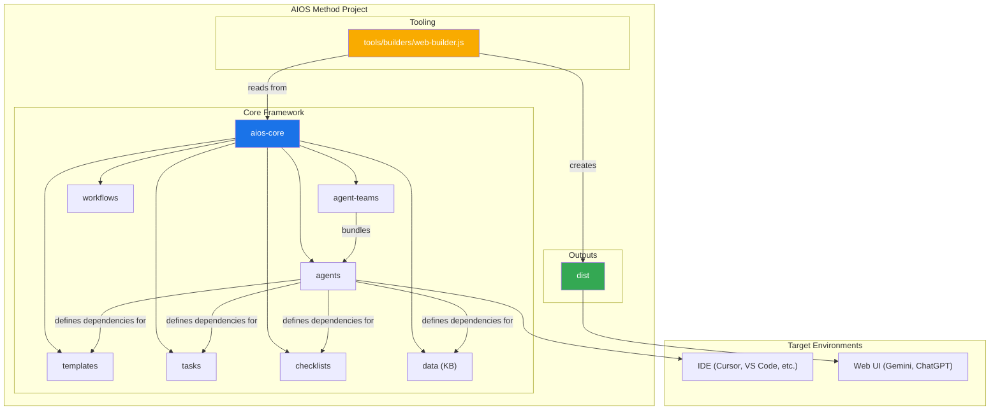
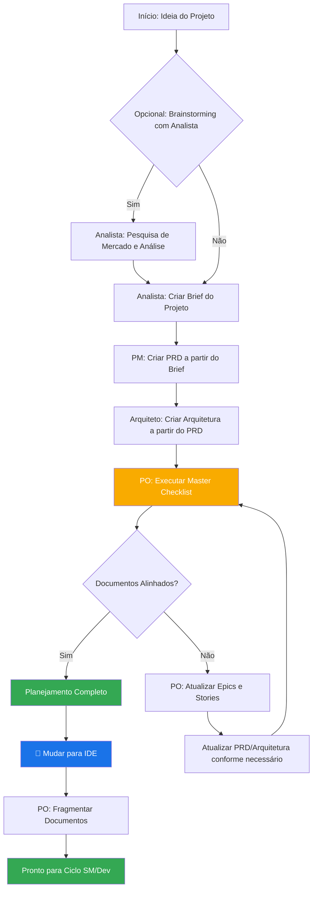
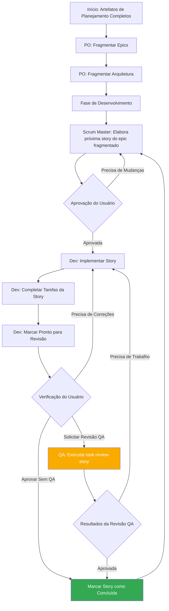

<!--
  Tradução: PT-BR
  Original: /docs/en/core-architecture.md
  Última sincronização: 2026-01-26
-->

# Método AIOS: Arquitetura Central

## 1. Visão Geral

O Método AIOS foi projetado para fornecer modos agênticos, tarefas e templates que permitem workflows úteis e repetíveis, seja para desenvolvimento ágil com agentes ou expansão para domínios vastamente diferentes. O propósito central do projeto é fornecer um conjunto estruturado, porém flexível, de prompts, templates e workflows que os usuários podem empregar para guiar agentes de IA (como Gemini, Claude ou ChatGPT) para realizar tarefas complexas, discussões guiadas ou outros fluxos significativos específicos de domínio de maneira previsível e com alta qualidade.

O módulo central do sistema facilita um ciclo de vida de desenvolvimento completo adaptado aos desafios das ferramentas modernas de IA Agêntica:

1. **Ideação e Planejamento**: Brainstorming, pesquisa de mercado e criação de briefs de projeto.
2. **Arquitetura e Design**: Definição de arquitetura de sistema e especificações de UI/UX.
3. **Execução do Desenvolvimento**: Um workflow cíclico onde um agente Scrum Master (SM) elabora stories com contexto extremamente específico e um agente Desenvolvedor (Dev) as implementa uma de cada vez. Este processo funciona tanto para projetos novos (Greenfield) quanto existentes (Brownfield).

## 2. Diagrama de Arquitetura do Sistema

Todo o ecossistema do Método AIOS é projetado em torno do diretório `aios-core` instalado, que atua como o cérebro da operação. O diretório `tools` fornece os meios para processar e empacotar este cérebro para diferentes ambientes.

## 3. Componentes Centrais

O diretório `aios-core` contém todas as definições e recursos que dão aos agentes suas capacidades.

### 3.1. Agentes (`aios-core/agents/`)

- **Propósito**: Estes são os blocos fundamentais do sistema. Cada arquivo markdown (ex: `aios-master.md`, `pm.md`, `dev.md`) define a persona, capacidades e dependências de um único agente de IA.
- **Estrutura**: Um arquivo de agente contém um cabeçalho YAML que especifica seu papel, persona, dependências e instruções de inicialização. Estas dependências são listas de tasks, templates, checklists e arquivos de dados que o agente tem permissão para usar.
- **Instruções de Inicialização**: Agentes podem incluir sequências de inicialização que carregam documentação específica do projeto da pasta `docs/`, como padrões de codificação, especificações de API ou documentos de estrutura do projeto. Isso fornece contexto imediato do projeto na ativação.
- **Integração de Documentos**: Agentes podem referenciar e carregar documentos da pasta `docs/` do projeto como parte de tasks, workflows ou sequências de inicialização. Os usuários também podem arrastar documentos diretamente para interfaces de chat para fornecer contexto adicional.
- **Exemplo**: O agente `aios-master` lista suas dependências, o que informa à ferramenta de build quais arquivos incluir em um bundle web e informa ao agente sobre suas próprias capacidades.

### 3.2. Times de Agentes (`aios-core/agent-teams/`)

- **Propósito**: Arquivos de time (ex: `team-all.yaml`) definem coleções de agentes e workflows que são agrupados para um propósito específico, como "desenvolvimento full-stack" ou "apenas backend". Isso cria um contexto maior e pré-empacotado para ambientes de UI web.
- **Estrutura**: Um arquivo de time lista os agentes a serem incluídos. Pode usar wildcards, como `"*"` para incluir todos os agentes. Isso permite a criação de bundles abrangentes como `team-all`.

### 3.3. Workflows (`aios-core/workflows/`)

- **Propósito**: Workflows são arquivos YAML (ex: `greenfield-fullstack.yaml`) que definem uma sequência prescrita de etapas e interações de agentes para um tipo específico de projeto. Eles atuam como um guia estratégico para o usuário e o agente `aios-orchestrator`.
- **Estrutura**: Um workflow define sequências para projetos complexos e simples, lista os agentes envolvidos em cada etapa, os artefatos que eles criam e as condições para passar de uma etapa para a próxima. Frequentemente inclui um diagrama Mermaid para visualização.

### 3.4. Recursos Reutilizáveis (`templates`, `tasks`, `checklists`, `data`)

- **Propósito**: Estas pastas abrigam os componentes modulares que são carregados dinamicamente pelos agentes com base em suas dependências.
  - **`templates/`**: Contém templates markdown para documentos comuns como PRDs, especificações de arquitetura e user stories.
  - **`tasks/`**: Define as instruções para executar ações específicas e repetíveis como "shard-doc" ou "create-next-story".
  - **`checklists/`**: Fornece checklists de garantia de qualidade para agentes como o Product Owner (`po`) ou Arquiteto.
  - **`data/`**: Contém a base de conhecimento central (`aios-kb.md`), preferências técnicas (`technical-preferences.md`) e outros arquivos de dados importantes.

#### 3.4.1. Sistema de Processamento de Templates

Um princípio arquitetural chave do AIOS é que templates são auto-contidos e interativos - eles incorporam tanto a saída desejada do documento quanto as instruções do LLM necessárias para trabalhar com os usuários. Isso significa que, em muitos casos, nenhuma task separada é necessária para criação de documentos, pois o próprio template contém toda a lógica de processamento.

O framework AIOS emprega um sistema sofisticado de processamento de templates orquestrado por três componentes-chave:

- **`template-format.md`** (`aios-core/utils/`): Define a linguagem de marcação fundamental usada em todos os templates do AIOS. Esta especificação estabelece regras de sintaxe para substituição de variáveis (`{{placeholders}}`), diretivas de processamento exclusivas para IA (`[[LLM: instructions]]`) e blocos de lógica condicional. Templates seguem este formato para garantir processamento consistente em todo o sistema.

- **`create-doc.md`** (`aios-core/tasks/`): Atua como o motor de orquestração que gerencia todo o workflow de geração de documentos. Esta task coordena a seleção de templates, gerencia modos de interação com o usuário (geração incremental vs. rápida), aplica regras de processamento de template-format e lida com validação. Serve como a interface principal entre usuários e o sistema de templates.

- **`advanced-elicitation.md`** (`aios-core/tasks/`): Fornece uma camada de refinamento interativo que pode ser incorporada dentro de templates através de blocos `[[LLM: instructions]]`. Este componente oferece 10 ações estruturadas de brainstorming, capacidades de revisão seção por seção e workflows de melhoria iterativa para aprimorar a qualidade do conteúdo.

O sistema mantém uma clara separação de responsabilidades: a marcação de template é processada internamente por agentes de IA mas nunca exposta aos usuários, enquanto fornece capacidades sofisticadas de processamento de IA através de inteligência incorporada nos próprios templates.

#### 3.4.2. Sistema de Preferências Técnicas

O AIOS inclui uma camada de personalização através do arquivo `technical-preferences.md` em `aios-core/data/`. Este arquivo serve como um perfil técnico persistente que influencia o comportamento dos agentes em todos os projetos.

**Propósito e Benefícios:**

- **Consistência**: Garante que todos os agentes referenciem as mesmas preferências técnicas
- **Eficiência**: Elimina a necessidade de especificar repetidamente tecnologias preferidas
- **Personalização**: Agentes fornecem recomendações alinhadas com preferências do usuário
- **Aprendizado**: Captura lições aprendidas e preferências que evoluem ao longo do tempo

**Estrutura do Conteúdo:**
O arquivo tipicamente inclui stacks de tecnologia preferidos, padrões de design, serviços externos, padrões de codificação e anti-padrões a evitar. Agentes automaticamente referenciam este arquivo durante planejamento e desenvolvimento para fornecer sugestões contextualmente apropriadas.

**Pontos de Integração:**

- Templates podem referenciar preferências técnicas durante geração de documentos
- Agentes sugerem tecnologias preferidas quando apropriado para requisitos do projeto
- Quando preferências não se encaixam nas necessidades do projeto, agentes explicam alternativas
- Bundles web podem incluir conteúdo de preferências para comportamento consistente entre plataformas

**Evolução ao Longo do Tempo:**
Usuários são encorajados a atualizar continuamente este arquivo com descobertas de projetos, adicionando tanto preferências positivas quanto tecnologias a evitar, criando uma base de conhecimento personalizada que melhora as recomendações dos agentes ao longo do tempo.

## 4. O Processo de Build e Entrega

O framework é projetado para dois ambientes principais: IDEs locais e interfaces de chat de IA baseadas na web. O script `web-builder.js` é a chave para suportar o último.

### 4.1. Web Builder (`tools/builders/web-builder.js`)

- **Propósito**: Este script Node.js é responsável por criar os bundles `.txt` encontrados em `dist`.
- **Processo**:
  1. **Resolve Dependências**: Para um dado agente ou time, o script lê seu arquivo de definição.
  2. Ele recursivamente encontra todos os recursos dependentes (tasks, templates, etc.) que o agente/time precisa.
  3. **Agrupa Conteúdo**: Ele lê o conteúdo de todos estes arquivos e os concatena em um único arquivo de texto grande, com separadores claros indicando o caminho do arquivo original de cada seção.
  4. **Gera Bundle**: O arquivo `.txt` final é salvo no diretório `dist`, pronto para ser carregado em uma UI web.

### 4.2. Uso Específico por Ambiente

- **Para IDEs**: Usuários interagem com os agentes diretamente via seus arquivos markdown em `aios-core/agents/`. A integração do IDE (para Cursor, Claude Code, etc.) sabe como chamar estes agentes.
- **Para UIs Web**: Usuários fazem upload de um bundle pré-construído de `dist`. Este único arquivo fornece à IA o contexto de todo o time e todas as suas ferramentas e conhecimento necessários.

## 5. Workflows do AIOS

### 5.1. O Workflow de Planejamento

Antes do desenvolvimento começar, o AIOS segue um workflow de planejamento estruturado que estabelece a fundação para execução bem-sucedida do projeto:

**Fases Principais do Planejamento:**

1. **Análise Opcional**: Analista conduz pesquisa de mercado e análise competitiva
2. **Brief do Projeto**: Documento fundamental criado pelo Analista ou usuário
3. **Criação do PRD**: PM transforma brief em requisitos de produto abrangentes
4. **Design de Arquitetura**: Arquiteto cria fundação técnica baseada no PRD
5. **Validação e Alinhamento**: PO garante que todos os documentos estejam consistentes e completos
6. **Refinamento**: Atualizações em epics, stories e documentos conforme necessário
7. **Transição de Ambiente**: Mudança crítica da UI web para IDE para workflow de desenvolvimento
8. **Preparação de Documentos**: PO fragmenta documentos grandes para consumo no desenvolvimento

**Orquestração de Workflow**: O agente `aios-orchestrator` usa estas definições de workflow para guiar usuários através do processo completo, garantindo transições adequadas entre fases de planejamento (UI web) e desenvolvimento (IDE).

### 5.2. O Ciclo Principal de Desenvolvimento

Uma vez que as fases iniciais de planejamento e arquitetura estejam completas, o projeto move para um workflow de desenvolvimento cíclico, conforme detalhado no `aios-kb.md`. Isso garante um processo de implementação estável, sequencial e controlado por qualidade.

Este ciclo continua, com os agentes Scrum Master, Desenvolvedor e opcionalmente QA trabalhando juntos. O agente QA fornece capacidades de revisão de desenvolvedor sênior através da task `review-story`, oferecendo refatoração de código, melhorias de qualidade e transferência de conhecimento. Isso garante alta qualidade de código enquanto mantém velocidade de desenvolvimento.
