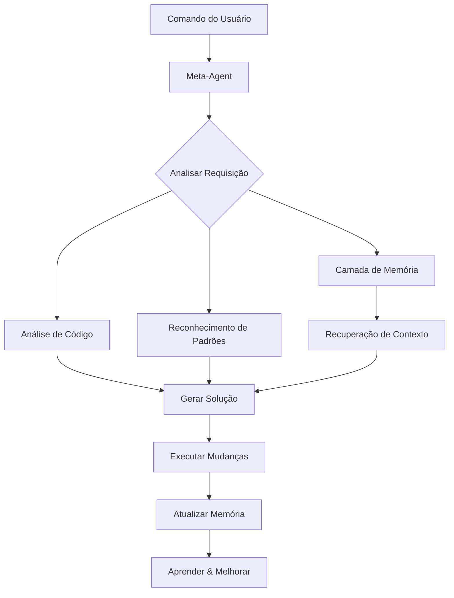

<!--
  Tradução: PT-BR
  Original: /docs/en/getting-started.md
  Última sincronização: 2026-01-26
-->

# Começando com o Synkra AIOS

Bem-vindo ao Synkra AIOS! Este guia irá orientá-lo nos seus primeiros passos com o framework de desenvolvimento auto-modificável alimentado por IA.

## Índice

1. [Instalação](#instalação)
2. [Seu Primeiro Projeto](#seu-primeiro-projeto)
3. [Entendendo o Meta-Agent](#entendendo-o-meta-agent)
4. [Comandos Básicos](#comandos-básicos)
5. [Criando Seu Primeiro Agente](#criando-seu-primeiro-agente)
6. [Trabalhando com Tasks](#trabalhando-com-tasks)
7. [Conceitos Básicos da Camada de Memória](#conceitos-básicos-da-camada-de-memória)
8. [Melhores Práticas](#melhores-práticas)
9. [Padrões Comuns](#padrões-comuns)
10. [Próximos Passos](#próximos-passos)

## Instalação

### Pré-requisitos

Antes de instalar o Synkra AIOS, certifique-se de ter:

- **Node.js** versão 14.0.0 ou superior
- **npm** versão 6.0.0 ou superior
- **Git** (opcional, mas recomendado)
- Pelo menos **1GB** de espaço livre em disco

### Instalação Rápida

A forma mais rápida de começar é usando npx:

```bash
# Criar um novo projeto
npx @synkra/aios-core init my-first-project

# Navegar até seu projeto
cd my-first-project

# Iniciar o meta-agent
npx @synkra/aios-core
```

### Opções de Instalação

O Synkra AIOS oferece opções flexíveis de instalação:

```bash
# 1. Criar novo projeto com template personalizado
npx @synkra/aios-core init my-project --template enterprise

# 2. Instalar em projeto existente
cd existing-project
npx @synkra/aios-core install

# 3. Forçar instalação em diretório não vazio
npx @synkra/aios-core init my-project --force

# 4. Pular instalação de dependências (instalar manualmente depois)
npx @synkra/aios-core init my-project --skip-install
```

## Seu Primeiro Projeto

### Estrutura do Projeto

Após a instalação, seu projeto terá esta estrutura:

```
my-first-project/
├── .aios/                    # Configuração do framework
│   ├── config.json          # Arquivo principal de configuração
│   ├── memory-config.json   # Configurações da camada de memória
│   ├── cache/              # Cache de performance
│   └── logs/               # Logs do sistema
├── agents/                  # Diretório de agentes IA
│   └── sample-agent.yaml   # Agente de exemplo
├── components/             # Componentes da aplicação
├── workflows/              # Workflows automatizados
├── tasks/                  # Tasks reutilizáveis
├── tests/                  # Suites de teste
├── .env                    # Variáveis de ambiente
└── package.json           # Dependências do projeto
```

### Configuração

O arquivo principal de configuração (`.aios/config.json`) contém:

```json
{
  "version": "1.0.0",
  "projectName": "my-first-project",
  "features": [
    "meta-agent",
    "memory-layer",
    "self-modification",
    "telemetry"
  ],
  "ai": {
    "provider": "openai",
    "model": "gpt-4"
  },
  "environment": "development"
}
```

### Configuração do Ambiente

Configure seu provedor de IA no arquivo `.env`:

```env
# Configuração do Provedor de IA
OPENAI_API_KEY=your-openai-api-key
# ou
ANTHROPIC_API_KEY=your-anthropic-api-key

# Configurações do Framework
NODE_ENV=development
AIOS_TELEMETRY=enabled
```

## Entendendo o Meta-Agent

O meta-agent é o núcleo do Synkra AIOS - uma IA que entende e pode modificar sua própria base de código.

### Capacidades Principais

1. **Auto-Análise**: Examina sua própria estrutura de código
2. **Geração de Código**: Cria componentes otimizados
3. **Aprendizado de Padrões**: Aprende com seu estilo de desenvolvimento
4. **Auto-Evolução**: Melhora com base no uso
5. **Refatoração Inteligente**: Sugere e implementa melhorias

### Como Funciona



## Comandos Básicos

### Iniciando o Meta-Agent

```bash
# Iniciar no diretório atual
npx @synkra/aios-core

# Ou usar o atalho
npx aios
```

### Comandos Essenciais

Uma vez que o meta-agent esteja rodando, use estes comandos:

```bash
# Ajuda e Informações
*help                    # Mostrar todos os comandos disponíveis
*status                  # Exibir status do sistema
*config                  # Ver configuração atual

# Gerenciamento de Agentes
*list-agents             # Mostrar todos os agentes disponíveis
*activate <agent-name>   # Ativar agente específico
*deactivate <agent-name> # Desativar agente

# Operações Básicas
*analyze                 # Analisar base de código atual
*suggest                 # Obter sugestões de melhoria
*learn                   # Aprender com mudanças recentes
```

## Criando Seu Primeiro Agente

### Passo 1: Use o Comando de Criação

```bash
*create-agent my-helper
```

O meta-agent irá guiá-lo através do processo de criação:

1. **Nome**: Escolha um nome descritivo
2. **Tipo**: Selecione o tipo do agente (assistant, analyzer, generator)
3. **Capacidades**: Defina o que o agente pode fazer
4. **Instruções**: Forneça diretrizes comportamentais

### Passo 2: Definição do Agente

O meta-agent criará um arquivo YAML assim:

```yaml
# agents/my-helper.yaml
name: my-helper
version: 1.0.0
description: Um assistente útil para tarefas diárias
type: assistant

capabilities:
  - name: summarize
    description: Resumir conteúdo de texto
    parameters:
      - name: text
        type: string
        required: true
      - name: maxLength
        type: number
        required: false
        default: 100

  - name: translate
    description: Traduzir texto entre idiomas
    parameters:
      - name: text
        type: string
        required: true
      - name: targetLanguage
        type: string
        required: true

instructions: |
  Você é um assistente útil que resume e traduz textos.
  Seja conciso, preciso e mantenha o significado original.

examples:
  - input: "*my-helper summarize 'Texto longo aqui...'"
    output: "Resumo: Pontos-chave do texto"

  - input: "*my-helper translate 'Hello' --targetLanguage spanish"
    output: "Tradução: Hola"
```

### Passo 3: Teste Seu Agente

```bash
# Ativar o agente
*activate my-helper

# Testar resumo
*my-helper summarize "Este é um texto longo que precisa de resumo..."

# Testar tradução
*my-helper translate "Hello world" --targetLanguage french
```

## Trabalhando com Tasks

Tasks são operações reutilizáveis que os agentes podem executar.

### Criando uma Task

```bash
*create-task data-processor
```

Isso cria um template de task:

```markdown
# tasks/data-processor.md

## Propósito
Processar e transformar dados de acordo com especificações

## Padrão de Comando
```
*data-processor <input> [options]
```

## Parâmetros
- `input`: Dados para processar
- `--format`: Formato de saída (json, csv, xml)
- `--transform`: Tipo de transformação

## Implementação
```javascript
class DataProcessor {
  async execute(params) {
    const { input, format = 'json', transform } = params;

    // Lógica de processamento aqui
    let processed = this.transform(input, transform);

    return this.format(processed, format);
  }
}
```
```

### Usando Tasks em Workflows

```yaml
# workflows/data-pipeline.yaml
name: data-pipeline
description: Pipeline automatizado de processamento de dados

triggers:
  - type: schedule
    cron: "0 */6 * * *"  # A cada 6 horas

steps:
  - task: fetch-data
    params:
      source: "api/endpoint"

  - task: data-processor
    params:
      transform: "normalize"
      format: "json"

  - task: save-results
    params:
      destination: "processed/data"
```

## Conceitos Básicos da Camada de Memória

A camada de memória alimentada pelo LlamaIndex fornece gerenciamento inteligente de contexto.

### Como a Memória Funciona

1. **Indexação**: Todo código e documentação é indexado
2. **Busca Semântica**: Encontre código por significado, não apenas por palavras-chave
3. **Construção de Contexto**: Contexto relevante é recuperado para cada operação
4. **Aprendizado**: Padrões e preferências são lembrados

### Comandos de Memória

```bash
# Operações de memória
*memory status          # Verificar status da camada de memória
*memory search <query>  # Buscar memória semântica
*memory clear-cache     # Limpar cache de memória
*memory rebuild         # Reconstruir índice de memória
```

### Exemplo: Busca Semântica

```bash
# Busca tradicional (baseada em palavras-chave)
*search "getUserData"

# Busca semântica (baseada em significado)
*memory search "função que recupera informações do usuário do banco de dados"
```

## Melhores Práticas

### 1. Comece Pequeno

Comece com tasks e agentes simples antes de criar sistemas complexos:

```bash
# Bom: Comece com agentes focados
*create-agent code-formatter
*create-agent test-generator

# Evite: Agentes iniciais muito complexos
*create-agent do-everything-ai
```

### 2. Use Nomes Descritivos

Escolha nomes claros e descritivos para agentes e tasks:

```bash
# Boa nomenclatura
*create-agent api-endpoint-validator
*create-task validate-user-input

# Nomenclatura ruim
*create-agent helper1
*create-task task123
```

### 3. Aproveite a Camada de Memória

Deixe o meta-agent aprender com seus padrões:

```bash
# Após fazer mudanças
*learn --from recent-changes

# Antes de começar nova funcionalidade
*suggest --based-on similar-features
```

### 4. Análise Regular

Analise periodicamente sua base de código:

```bash
# Análise semanal
*analyze-framework --depth full

# Verificação rápida diária
*analyze-framework --depth surface
```

### 5. Documente Seus Agentes

Sempre forneça instruções e exemplos claros:

```yaml
# Boa documentação de agente
instructions: |
  Este agente valida respostas de API contra schemas OpenAPI.
  Ele verifica:
  - Presença de campos obrigatórios
  - Correção de tipos de dados
  - Conformidade de formato
  - Validação de regras de negócio

examples:
  - input: "*validate-api POST /users response"
    output: "✓ Todas as validações passaram"
```

## Padrões Comuns

### Padrão 1: Geração de Componentes

```bash
# Gerar um novo componente React
*create-component Dashboard --type react --features "charts,filters,export"

# O meta-agent irá:
# 1. Analisar componentes existentes
# 2. Aplicar padrões consistentes
# 3. Gerar código otimizado
# 4. Criar testes
# 5. Atualizar documentação
```

### Padrão 2: Melhoria da Qualidade de Código

```bash
# Melhorar arquivo específico
*improve-code-quality src/services/api.js

# Melhorar módulo inteiro
*improve-code-quality src/services/ --recursive

# Obter sugestões primeiro
*suggest-improvements src/services/api.js
```

### Padrão 3: Geração de Testes

```bash
# Gerar testes para um componente
*generate-tests src/components/UserProfile.js

# Gerar testes de integração
*generate-tests src/api/ --type integration

# Gerar baseado em padrões de uso
*generate-tests --from-usage-analysis
```

### Padrão 4: Documentação

```bash
# Documentar um módulo
*document src/utils/

# Gerar documentação de API
*generate-api-docs src/api/

# Criar guia do usuário
*create-documentation --type user-guide
```

## Próximos Passos

### Ações Imediatas

1. **Configure o Provedor de IA**: Configure suas chaves de API em `.env`
2. **Execute a Primeira Análise**: Execute `*analyze-framework`
3. **Crie um Agente Personalizado**: Projete um agente para suas necessidades específicas
4. **Explore os Exemplos**: Verifique o diretório `examples/`

### Recursos de Aprendizado

- **[Referência de Comandos do Meta-Agent](./meta-agent-commands.md)**: Lista completa de comandos
- **[Visão Geral da Arquitetura](./architecture.md)**: Aprofundamento técnico
- **[Guia de Solução de Problemas](./troubleshooting.md)**: Problemas comuns e soluções
- **[Tutoriais em Vídeo](https://@synkra/aios-core.dev/tutorials)**: Aprendizado visual

### Tópicos Avançados

Uma vez confortável com o básico, explore:

1. **Workflows Personalizados**: Automatize processos complexos
2. **Desenvolvimento de Plugins**: Estenda as capacidades do framework
3. **Otimização de Performance**: Ajuste para seu caso de uso
4. **Colaboração em Equipe**: Workflows multi-desenvolvedores

### Comunidade

Junte-se à nossa comunidade para suporte e atualizações:

- **Discord**: [Entre no nosso servidor](https://discord.gg/gk8jAdXWmj)
- **GitHub Discussions**: Compartilhe ideias e obtenha ajuda
- **Twitter**: Siga [@aiosfullstack](https://twitter.com/aiosfullstack)

## Referência Rápida de Solução de Problemas

### Problemas Comuns

**Meta-agent não inicia**
```bash
# Verificar versão do Node.js
node --version  # Deve ser >= 14.0.0

# Verificar instalação
npx @synkra/aios-core doctor

# Corrigir problemas comuns
npx @synkra/aios-core doctor --fix
```

**Erros de chave de API**
```bash
# Verificar se arquivo .env existe
ls -la .env

# Verificar formato da chave
# Deve ser: OPENAI_API_KEY=sk-...
```

**Problemas com camada de memória**
```bash
# Reconstruir índice
*memory rebuild

# Verificar status
*memory status

# Limpar e reconstruir
*memory clear-cache && *memory rebuild
```

---

**Pronto para construir algo incrível?** O meta-agent está esperando para ajudá-lo a criar, melhorar e evoluir seu código. Comece com `*help` e explore as possibilidades!

Lembre-se: O Synkra AIOS aprende e melhora com o uso. Quanto mais você interagir com ele, melhor ele entenderá seu estilo e necessidades de desenvolvimento.

Bom código com o Synkra AIOS!
