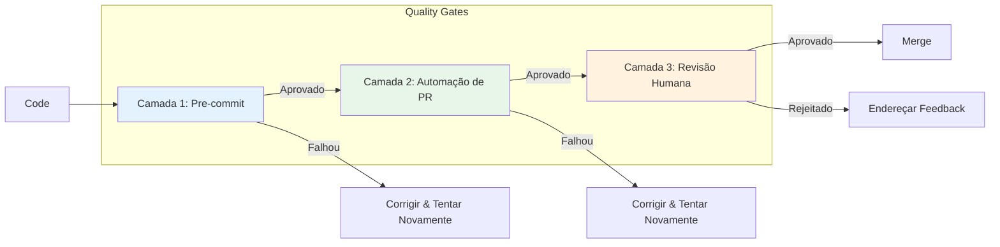

<!--
  Tradução: PT-BR
  Original: /docs/en/guides/quality-gates.md
  Última sincronização: 2026-01-26
-->

# Guia do Sistema de Quality Gates AIOS

> Guia completo para o sistema de quality gates de 3 camadas do Synkra AIOS.

**Versão:** 2.1.0
**Última Atualização:** 2025-12-01
**Story:** [2.16 - Documentation Sprint 2](../stories/v2.1/sprint-2/story-2.16-documentation.md)

---

## Visão Geral

O Sistema de Quality Gates do AIOS fornece garantia de qualidade automatizada através de três camadas progressivas de validação. Cada camada captura diferentes tipos de problemas no estágio apropriado do desenvolvimento.

### A Arquitetura de 3 Camadas



| Camada | Tipo | Velocidade | Propósito |
|--------|------|------------|-----------|
| **Camada 1** | Automatizado | ~30s | Capturar erros de sintaxe, linting, tipos |
| **Camada 2** | Assistido por IA | ~5m | Capturar lógica, segurança, padrões |
| **Camada 3** | Humano | Variável | Revisão estratégica, aprovação |

---

## Camada 1: Verificações Pre-commit

### Propósito
Verificações rápidas e locais que executam antes do código ser commitado. Captura problemas óbvios imediatamente.

### Verificações Incluídas

| Verificação | Ferramenta | Timeout | Descrição |
|-------------|------------|---------|-----------|
| **Lint** | ESLint | 60s | Estilo de código e melhores práticas |
| **Test** | Jest | 5m | Testes unitários com cobertura |
| **TypeCheck** | TypeScript | 2m | Validação estática de tipos |

### Configuração

```yaml
# .aios-core/core/quality-gates/quality-gate-config.yaml
layer1:
  enabled: true
  failFast: true  # Parar na primeira falha
  checks:
    lint:
      enabled: true
      command: "npm run lint"
      failOn: "error"  # error | warning
      timeout: 60000   # 1 minuto
    test:
      enabled: true
      command: "npm test"
      timeout: 300000  # 5 minutos
      coverage:
        enabled: true
        minimum: 80
    typecheck:
      enabled: true
      command: "npm run typecheck"
      timeout: 120000  # 2 minutos
```

### Executando a Camada 1

```bash
# Executar todas as verificações da Camada 1
aios qa run --layer=1

# Executar verificação específica
aios qa run --layer=1 --check=lint
aios qa run --layer=1 --check=test
aios qa run --layer=1 --check=typecheck

# Executar com saída detalhada
aios qa run --layer=1 --verbose
```

### Saída Esperada

```
Camada 1: Verificações Pre-commit
=================================

[1/3] Verificação de Lint
  Executando: npm run lint
  ✓ Aprovado (12.3s)
  Sem alertas ou erros

[2/3] Verificação de Test
  Executando: npm test
  ✓ Aprovado (45.2s)
  Cobertura: 87.3% (mínimo: 80%)

[3/3] TypeCheck
  Executando: npm run typecheck
  ✓ Aprovado (28.1s)
  0 erros

CAMADA 1 APROVADA (85.6s)
```

---

## Camada 2: Automação de PR

### Propósito
Code review assistido por IA que executa em pull requests. Captura problemas mais profundos como erros de lógica, vulnerabilidades de segurança e problemas arquiteturais.

### Ferramentas Integradas

| Ferramenta | Propósito | Severidade Bloqueadora |
|------------|-----------|------------------------|
| **CodeRabbit** | Code review por IA | CRITICAL |
| **Quinn (@qa)** | Revisão automatizada de QA | CRITICAL |

### Configuração

```yaml
# .aios-core/core/quality-gates/quality-gate-config.yaml
layer2:
  enabled: true
  coderabbit:
    enabled: true
    command: "coderabbit --prompt-only -t uncommitted"
    timeout: 900000  # 15 minutos
    blockOn:
      - CRITICAL
    warnOn:
      - HIGH
    documentOn:
      - MEDIUM
    ignoreOn:
      - LOW
  quinn:
    enabled: true
    autoReview: true
    agentPath: ".claude/commands/AIOS/agents/qa.md"
    severity:
      block: ["CRITICAL"]
      warn: ["HIGH", "MEDIUM"]
```

### Executando a Camada 2

```bash
# Executar todas as verificações da Camada 2
aios qa run --layer=2

# Executar apenas CodeRabbit
aios qa run --layer=2 --tool=coderabbit

# Executar revisão do Quinn (@qa)
aios qa run --layer=2 --tool=quinn
```

### Níveis de Severidade

| Severidade | Ação | Descrição |
|------------|------|-----------|
| **CRITICAL** | Bloquear | Vulnerabilidade de segurança, risco de perda de dados, mudança com quebra |
| **HIGH** | Alertar + Documentar | Problema de performance, validação ausente, anti-padrão |
| **MEDIUM** | Documentar | Code smell, sugestão de melhoria, risco menor |
| **LOW** | Ignorar | Preferência de estilo, otimização menor |

### Integração CodeRabbit

O CodeRabbit realiza code review com IA focando nestas áreas:

- Vulnerabilidades de segurança
- Problemas de performance
- Qualidade e manutenibilidade do código
- Violações de melhores práticas
- Completude da documentação

```bash
# Execução manual do CodeRabbit
coderabbit --prompt-only -t uncommitted

# Com paths específicos
coderabbit --files "src/**/*.js" --prompt-only
```

### Integração Quinn (@qa)

O agente QA realiza revisão automatizada focando em:

- Adequação da cobertura de testes
- Tratamento de casos extremos
- Completude do tratamento de erros
- Validação de critérios de aceitação

```javascript
// Invocação programática do Quinn
const QualityGateManager = require('./.aios-core/core/quality-gates/quality-gate-manager');
const manager = new QualityGateManager();
const result = await manager.runQuinnReview(pullRequestId);
```

---

## Camada 3: Revisão Humana

### Propósito
Revisão humana estratégica para aprovação final. Garante que os requisitos de negócio sejam atendidos e que as decisões arquiteturais sejam sólidas.

### Configuração

```yaml
# .aios-core/core/quality-gates/quality-gate-config.yaml
layer3:
  enabled: true
  requireSignoff: true
  assignmentStrategy: "auto"  # auto | manual | round-robin
  defaultReviewer: "@architect"
  checklist:
    enabled: true
    template: "strategic-review-checklist"
    minItems: 5
  signoff:
    required: true
    expiry: 86400000  # 24 horas em ms
```

### Estratégias de Atribuição

| Estratégia | Descrição |
|------------|-----------|
| **auto** | Atribuir baseado em propriedade de arquivo e expertise |
| **manual** | Atribuir revisor manualmente |
| **round-robin** | Rotacionar entre membros da equipe |

### Checklist de Revisão

O checklist de revisão estratégica garante que revisores cubram áreas-chave:

```markdown
## Checklist de Revisão Estratégica

### Arquitetura
- [ ] Mudanças alinhadas com a arquitetura do sistema
- [ ] Nenhuma dependência não autorizada introduzida
- [ ] Compatibilidade retroativa mantida

### Segurança
- [ ] Nenhum dado sensível exposto
- [ ] Validação de entrada presente
- [ ] Autenticação/autorização corretas

### Qualidade
- [ ] Código é manutenível e legível
- [ ] Testes são abrangentes
- [ ] Documentação atualizada

### Negócio
- [ ] Critérios de aceitação atendidos
- [ ] Experiência do usuário considerada
- [ ] Performance aceitável
```

### Processo de Aprovação

```bash
# Solicitar revisão humana
aios qa request-review --pr=123

# Aprovar revisão
aios qa signoff --pr=123 --reviewer="@architect"

# Verificar status de aprovação
aios qa signoff-status --pr=123
```

---

## Comandos CLI

### `aios qa run`

Executar verificações de quality gate.

```bash
# Executar todas as camadas sequencialmente
aios qa run

# Executar camada específica
aios qa run --layer=1
aios qa run --layer=2
aios qa run --layer=3

# Executar com opções
aios qa run --verbose          # Saída detalhada
aios qa run --fail-fast        # Parar na primeira falha
aios qa run --continue-on-fail # Continuar apesar de falhas
```

### `aios qa status`

Verificar status atual do quality gate.

```bash
# Obter status geral
aios qa status

# Obter status para camada específica
aios qa status --layer=1

# Obter status para PR
aios qa status --pr=123
```

**Saída:**
```
Status do Quality Gate
======================

Camada 1: Pre-commit
  Lint:      ✓ Aprovado
  Test:      ✓ Aprovado (87.3% cobertura)
  TypeCheck: ✓ Aprovado

Camada 2: Automação de PR
  CodeRabbit: ✓ Aprovado (0 crítico, 2 médio)
  Quinn:      ✓ Aprovado

Camada 3: Revisão Humana
  Status:    Pendente
  Atribuído: @architect
  Expira:    2025-12-02 12:00:00

Geral: AGUARDANDO REVISÃO
```

### `aios qa report`

Gerar relatório de quality gate.

```bash
# Gerar relatório
aios qa report

# Exportar para arquivo
aios qa report --output=qa-report.json
aios qa report --format=markdown --output=qa-report.md
```

### `aios qa configure`

Configurar settings do quality gate.

```bash
# Configuração interativa
aios qa configure

# Definir opções específicas
aios qa configure --layer1.coverage.minimum=90
aios qa configure --layer2.coderabbit.enabled=false
aios qa configure --layer3.requireSignoff=true
```

---

## Integração CI/CD

### GitHub Actions

```yaml
# .github/workflows/quality-gate.yml
name: Quality Gate

on:
  pull_request:
    branches: [main, develop]

jobs:
  layer1:
    name: Camada 1 - Pre-commit
    runs-on: ubuntu-latest
    steps:
      - uses: actions/checkout@v4
      - uses: actions/setup-node@v4
        with:
          node-version: '18'
      - run: npm ci
      - run: aios qa run --layer=1

  layer2:
    name: Camada 2 - Automação de PR
    needs: layer1
    runs-on: ubuntu-latest
    steps:
      - uses: actions/checkout@v4
      - uses: actions/setup-node@v4
        with:
          node-version: '18'
      - run: npm ci
      - run: aios qa run --layer=2
        env:
          CODERABBIT_API_KEY: ${{ secrets.CODERABBIT_API_KEY }}

  layer3:
    name: Camada 3 - Revisão Humana
    needs: layer2
    runs-on: ubuntu-latest
    steps:
      - uses: actions/checkout@v4
      - run: aios qa request-review --pr=${{ github.event.pull_request.number }}
```

### GitLab CI

```yaml
# .gitlab-ci.yml
stages:
  - layer1
  - layer2
  - layer3

layer1:
  stage: layer1
  script:
    - npm ci
    - aios qa run --layer=1

layer2:
  stage: layer2
  script:
    - npm ci
    - aios qa run --layer=2
  needs:
    - layer1

layer3:
  stage: layer3
  script:
    - aios qa request-review
  needs:
    - layer2
  when: manual
```

### Hook Pre-commit

```bash
# .husky/pre-commit
#!/bin/sh
. "$(dirname "$0")/_/husky.sh"

aios qa run --layer=1 --fail-fast
```

---

## Referência de Configuração

### Exemplo de Configuração Completa

```yaml
# quality-gate-config.yaml
version: "1.0"

# Camada 1: Verificações pre-commit
layer1:
  enabled: true
  failFast: true
  checks:
    lint:
      enabled: true
      command: "npm run lint"
      failOn: "error"
      timeout: 60000
    test:
      enabled: true
      command: "npm test"
      timeout: 300000
      coverage:
        enabled: true
        minimum: 80
    typecheck:
      enabled: true
      command: "npm run typecheck"
      timeout: 120000

# Camada 2: Automação de PR
layer2:
  enabled: true
  coderabbit:
    enabled: true
    command: "coderabbit --prompt-only -t uncommitted"
    timeout: 900000
    blockOn: [CRITICAL]
    warnOn: [HIGH]
    documentOn: [MEDIUM]
    ignoreOn: [LOW]
  quinn:
    enabled: true
    autoReview: true
    agentPath: ".claude/commands/AIOS/agents/qa.md"
    severity:
      block: [CRITICAL]
      warn: [HIGH, MEDIUM]

# Camada 3: Revisão Humana
layer3:
  enabled: true
  requireSignoff: true
  assignmentStrategy: "auto"
  defaultReviewer: "@architect"
  checklist:
    enabled: true
    template: "strategic-review-checklist"
    minItems: 5
  signoff:
    required: true
    expiry: 86400000

# Relatórios
reports:
  location: ".aios/qa-reports"
  format: "json"
  retention: 30
  includeMetrics: true

# Persistência de status
status:
  location: ".aios/qa-status.json"
  updateOnChange: true

# Saída detalhada
verbose:
  enabled: false
  showCommands: true
  showOutput: true
  showTimings: true
```

---

## Solução de Problemas

### Falhas na Camada 1

| Problema | Solução |
|----------|---------|
| Erros de lint | Execute `npm run lint -- --fix` para corrigir automaticamente |
| Falhas de teste | Verifique a saída do teste, atualize testes ou corrija o código |
| Erros de TypeCheck | Revise anotações de tipo, corrija incompatibilidades de tipo |
| Timeout | Aumente timeout na configuração ou otimize os testes |

### Falhas na Camada 2

| Problema | Solução |
|----------|---------|
| CodeRabbit crítico | Endereçar problemas de segurança/mudanças com quebra |
| Timeout do CodeRabbit | Verifique a rede, tente execução manual |
| Quinn bloqueado | Revise feedback do @qa, atualize o código |

### Problemas na Camada 3

| Problema | Solução |
|----------|---------|
| Nenhum revisor atribuído | Defina defaultReviewer na configuração |
| Aprovação expirada | Solicite nova revisão |
| Checklist incompleto | Complete todos os itens requeridos |

---

## Documentação Relacionada

- [Arquitetura do Sistema de Módulos](../architecture/module-system.md)
- [Guia de Service Discovery](./service-discovery.md)
- [Story 2.10: Quality Gate Manager](../stories/v2.1/sprint-2/story-2.10-quality-gate-manager.md)

---

*Guia do Sistema de Quality Gates Synkra AIOS v2.1*
