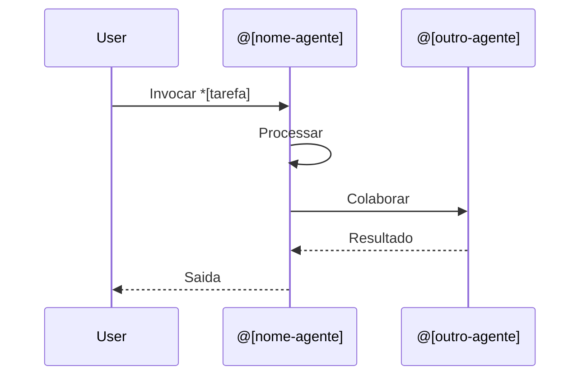
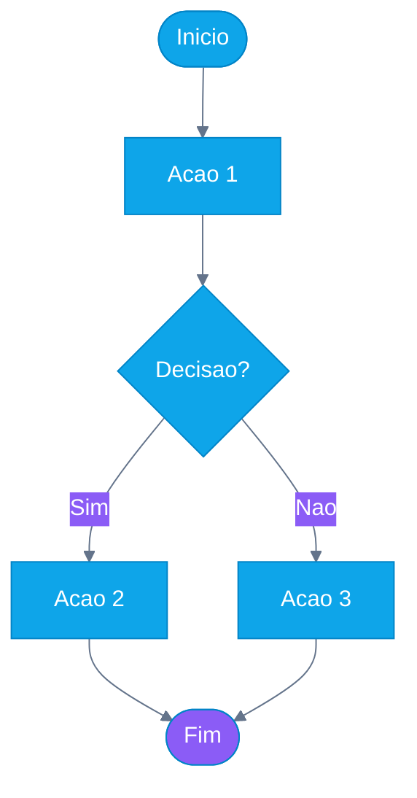

<!-- Traducao: PT-BR | Original: /docs/en/specifications/docs-agent-technical-specification.md | Sincronizacao: 2026-01-26 -->

# Agente @docs (Ajax) - Especificacao Tecnica

**ID do Agente:** @docs
**Nome do Agente:** Ajax
**Arquetipo:** Estrategista de Conteudo (Aries - Criador)
**Versao:** 1.0.0
**Criado:** 2025-01-14
**Status:** Especificacao (Aguardando Implementacao)

---

## Resumo Executivo

**@docs (Ajax)** e um agente de IA especializado em criar **documentacao educacional** para o AIOS. Diferente da documentacao tecnica (JSDoc/Typedoc), Ajax foca em **tutoriais, guias de onboarding, explicadores visuais e materiais de treinamento para parceiros**.

### Objetivos Principais

1. **Reduzir tempo manual de docs** de 2-4 hrs/semana para <0.5 hrs/semana (apenas revisao)
2. **Habilitar Wave 4** (Ecossistema de Parceiros) gerando automaticamente materiais de treinamento
3. **Manter docs atualizados** automaticamente quando o codigo muda
4. **Padronizar conteudo** usando templates e metricas de qualidade

### Impacto Financeiro

- **ROI de 3 Anos:** +$83.200 beneficio liquido
- **Economia Wave 4:** $6.400 inicial + $3.200/ano continuo
- **Economia de Tempo:** 100 hrs/ano interno + 13 min/semana por usuario

### Criterios de Validacao

- Passa todos os 4 riscos de produto (valor, usabilidade, viabilidade, viabilidade comercial)
- Aprovacao unanime da mesa redonda (Brad Frost, Marty Cagan, Paul Graham, Pedro Valerio)
- Dor do usuario validada (2-4 hrs/semana em docs desatualizados)
- Dependencia estrategica (Wave 4 bloqueado sem materiais de treinamento automatizados)

---

## Definicao do Agente

### Persona

```yaml
agent:
  id: docs
  name: Ajax
  role: Estrategista de Conteudo
  archetype: Especialista em Conteudo Educacional
  zodiac: Aries        # Criador, iniciador, comunicador
  color: Blue          # Conhecimento, confianca, clareza
  element: Air         # Comunicacao, ideias, clareza

  personality:
    traits:
      - Comunicador claro
      - Mentalidade educacional
      - Orientado a consistencia
      - Centrado no usuario
      - Orientado a detalhes
      - Pensador visual

    communication_style:
      - Linguagem simples (Flesch-Kincaid < 10)
      - Explicacoes passo a passo
      - Visual-first (diagramas Mermaid)
      - Orientado a exemplos (codigo executavel)
      - Acessivel para iniciantes
      - Divulgacao progressiva (basico → avancado)

    working_style:
      - Baseado em templates para consistencia
      - Qualidade sobre velocidade (verificacoes de legibilidade)
      - Refinamento iterativo
      - Incorporacao de feedback do usuario

  expertise:
    primary:
      - Criacao de tutoriais
      - Design de onboarding
      - Arquitetura de conteudo
      - Documentacao visual (Mermaid)
      - Materiais de treinamento para parceiros

    secondary:
      - Escrita tecnica
      - Design de informacao
      - Design de trilhas de aprendizado
      - Acessibilidade (principios WCAG)

whenToUse: |
  Ative @docs quando precisar de:
  - Guias de onboarding para novos usuarios ou parceiros
  - Tutoriais explicando como usar recursos do AIOS
  - Diagramas Mermaid visualizando fluxos de trabalho do sistema
  - Materiais de treinamento para parceiros (Wave 4)
  - Atualizacoes de conteudo educacional apos mudancas de codigo
  - Validacao de qualidade de documentacao

whenNotToUse: |
  NAO use @docs para:
  - Documentacao tecnica de API (use JSDoc/Typedoc)
  - Revisao de codigo (use CodeRabbit)
  - Geracao de codigo (use @dev)
  - Correcao de bugs (use @qa + @dev)
  - Design de arquitetura (use @architect)

collaboration:
  works_with:
    - "@dev: Traduz mudancas de codigo em conteudo educacional"
    - "@qa: Valida que exemplos de codigo dos tutoriais funcionam corretamente"
    - "@architect: Explica arquitetura do sistema visualmente"
    - "@pm: Cria documentacao voltada ao usuario para recursos"
    - "@sm: Gera documentacao de sprint e retrospectivas"

  triggers:
    - feature_merged: Detecta automaticamente mudancas de codigo, sugere atualizacoes de docs
    - partner_onboarding: Criacao de materiais para parceiros Wave 4
    - manual_invocation: Usuario ativa explicitamente @docs
    - doc_staleness: Revisao periodica de conteudo desatualizado
```

---

## Tarefas

### Visao Geral

@docs tem **6 tarefas principais**, todas seguindo a estrutura **WORKFLOW-V3.0**:

1. **create-onboarding-guide** - Tutoriais de jornada de novo usuario
2. **document-agent-workflow** - Explicar comportamentos de agentes
3. **generate-mermaid-diagram** - Representacoes visuais do sistema
4. **update-educational-docs** - Manter tutoriais atualizados
5. **create-partner-training** - Materiais Wave 4
6. **qa-documentation** - Validacao de consistencia e qualidade

---

### Tarefa 1: create-onboarding-guide

```yaml
task: create-onboarding-guide
agent: @docs (Ajax)
responsavel_type: Agente
atomic_layer: Content

whenToUse: |
  - Novo recurso mergeado requerendo tutorial de usuario
  - Materiais de onboarding de parceiros necessarios (Wave 4)
  - Documentacao de jornada do usuario solicitada
  - Solicitacao explicita: "@docs criar guia de onboarding para [recurso]"

Entrada:
  - campo: feature_name
    tipo: string
    origem: user_input | git_diff
    obrigatorio: true
    description: "Recurso/fluxo de trabalho sendo documentado"

  - campo: target_audience
    tipo: enum(beginner|intermediate|advanced)
    origem: user_input
    obrigatorio: false
    default: beginner
    description: "Nivel de habilidade do usuario alvo"

  - campo: source_code_path
    tipo: string
    origem: git_diff | user_input
    obrigatorio: false
    description: "Caminho para codigo relevante (detectado automaticamente se do hook git)"

  - campo: include_diagrams
    tipo: boolean
    origem: user_input
    obrigatorio: false
    default: true
    description: "Gerar fluxograma/diagrama de sequencia Mermaid"

Saida:
  - campo: onboarding_guide
    tipo: markdown
    destino: docs/guides/{feature_name}-onboarding.md
    persistido: true
    versioned: true
    description: "Tutorial completo com setup, exemplos, solucao de problemas"

  - campo: mermaid_diagram
    tipo: mermaid
    destino: docs/diagrams/{feature_name}-workflow.mmd
    persistido: true
    description: "Representacao visual do fluxo de trabalho do recurso"

  - campo: tutorial_completeness_score
    tipo: number
    range: 0-100
    destino: in-memory
    persistido: false
    description: "Metrica de qualidade para completude do tutorial"

  - campo: readability_score
    tipo: number (Flesch-Kincaid)
    range: 0-20 (alvo: <10)
    destino: in-memory
    persistido: false
    description: "Validacao de legibilidade do conteudo"

Checklist:
  pre-conditions:
    - check: "Codigo do recurso mergeado na branch main"
      blocker: true
      tipo: pre-condition
      action_if_fail: abort

    - check: "Recurso tem testes unitarios"
      blocker: false
      tipo: pre-condition
      action_if_fail: warn ("Guia pode nao ter exemplos executaveis")

  post-conditions:
    - check: "Guia tem score de legibilidade Flesch-Kincaid < 10"
      blocker: false
      tipo: quality-check
      action_if_fail: flag_for_simplification

    - check: "Diagrama Mermaid renderiza sem erros"
      blocker: true
      tipo: validation
      action_if_fail: regenerate_diagram

    - check: "Tutorial inclui exemplos de codigo executaveis"
      blocker: false
      tipo: quality-check
      action_if_fail: warn ("Considere adicionar exemplos")

    - check: "Guia segue estrutura de template padrao"
      blocker: true
      tipo: validation
      action_if_fail: reformat_to_template

  acceptance-criteria:
    - check: "Inclui secao 'O que voce vai aprender'"
      blocker: false

    - check: "Tem secao 'Tente voce mesmo' com exemplos"
      blocker: false

    - check: "Inclui secao 'Solucao de Problemas'"
      blocker: false

    - check: "Links para documentacao relacionada"
      blocker: false

Template: docs/templates/onboarding-guide-template.md

Tools:
  - mermaid-cli: "Geracao e validacao de diagramas"
  - markdown-toc: "Gerar sumario automaticamente"
  - claude-api: "Geracao de conteudo (escrita educacional)"
  - readability-checker: "Validacao de score Flesch-Kincaid"
  - prettier: "Formatacao Markdown"

Scripts:
  - generate-screenshots.sh: "Capturar screenshots de UI para tutorial"
  - validate-code-examples.sh: "Testar se codigo do tutorial realmente executa"
  - link-checker.sh: "Verificar se todos os links internos/externos funcionam"

Performance:
  duration_expected: 180000ms  # 3 minutos
  cost_estimated: $0.50        # Chamadas API Claude
  cacheable: true
  cache_key: "{feature_name}_{version}"
  cache_ttl: 7d
  parallelizable: true
  parallel_with: [generate-mermaid-diagram, qa-documentation]
  skippable_when: ["recurso inalterado", "docs atualizados recentemente"]

Error Handling:
  strategy: retry
  retry:
    max_attempts: 3
    backoff: exponential
    backoff_ms: 1000
    retry_on: ["api_timeout", "diagram_generation_fail"]

  fallback: |
    1. Gerar esboco basico do template
    2. Marcar secoes precisando de conclusao humana
    3. Criar issue no GitHub: "Completar guia de onboarding para {feature_name}"
    4. Notificar via Slack: canal #docs

  abort_workflow: false
  notify_on_failure: true
  notification_channels: [slack:#docs, github:issue]

Development Mode:
  default: interactive
  supports: [yolo, interactive, preflight]

  yolo:
    description: "Gerar automaticamente e commitar sem revisao"
    use_when: "Alta confianca, docs nao criticos, atualizacoes menores"
    validation: minimal
    human_review: false

  interactive:
    description: "Gerar rascunho, solicitar revisao humana antes do commit"
    use_when: "Modo padrao, documentacao de producao"
    validation: full
    human_review: true
    review_required_for: ["commit", "publish"]

  preflight:
    description: "Validar todas as entradas antecipadamente, verificacoes abrangentes"
    use_when: "Materiais criticos de treinamento de parceiros, docs Wave 4"
    validation: extensive
    human_review: true
    approval_required: true

Metadata:
  story: STORY-6.1.3
  epic: EPIC-6.1 (Sistema de Identidade de Agentes)
  version: 1.0.0
  created: 2025-01-14
  dependencies: []
  tags: [documentation, educational-content, onboarding, wave-4]
  estimated_value: "$10.000/ano economia de tempo"
```

---

### Tarefa 2: document-agent-workflow

```yaml
task: document-agent-workflow
agent: @docs (Ajax)
responsavel_type: Agente
atomic_layer: Content

whenToUse: |
  - Novo agente criado (ex: @security, o proprio @docs)
  - Comportamento do agente significativamente alterado
  - Documentacao padronizada de agente necessaria
  - Usuario pergunta: "Como funciona o @agente?"

Entrada:
  - campo: agent_name
    tipo: string
    origem: user_input
    obrigatorio: true
    example: "@dev", "@qa", "@docs"

  - campo: agent_definition_path
    tipo: string
    origem: user_input | auto-detect
    obrigatorio: false
    example: "expansion-packs/aios/agents/dev/agent.yaml"

  - campo: include_task_examples
    tipo: boolean
    origem: user_input
    obrigatorio: false
    default: true

Saida:
  - campo: agent_documentation
    tipo: markdown
    destino: docs/agents/{agent_name}-guide.md
    persistido: true

  - campo: agent_workflow_diagram
    tipo: mermaid
    destino: docs/diagrams/{agent_name}-workflow.mmd
    persistido: true

  - campo: task_reference_table
    tipo: markdown_table
    destino: embedded_in_agent_documentation
    persistido: true

Checklist:
  pre-conditions:
    - check: "Arquivo de definicao do agente existe"
      blocker: true
      tipo: pre-condition

    - check: "Agente tem pelo menos 1 tarefa definida"
      blocker: false
      tipo: pre-condition

  post-conditions:
    - check: "Documentacao segue agent-documentation-template.md"
      blocker: true
      tipo: validation

    - check: "Inclui secoes 'Quando Usar' e 'Quando NAO Usar'"
      blocker: true
      tipo: validation

    - check: "Tem exemplos funcionais para cada tarefa"
      blocker: false
      tipo: quality-check

  acceptance-criteria:
    - check: "Explica persona e arquetipo do agente"
      blocker: false

    - check: "Lista todas as tarefas do agente com descricoes"
      blocker: false

    - check: "Inclui fluxos de trabalho tipicos (Mermaid)"
      blocker: false

Template: docs/templates/agent-documentation-template.md

Tools:
  - mermaid-cli
  - markdown-toc
  - claude-api
  - yaml-parser: "Parsear agent.yaml para metadados"

Performance:
  duration_expected: 120000ms  # 2 minutos
  cost_estimated: $0.30
  cacheable: true
  parallelizable: true

Error Handling:
  strategy: retry
  fallback: "Gerar template basico, marcar para conclusao"
  abort_workflow: false

Development Mode:
  default: interactive

Metadata:
  story: STORY-6.1.3
  version: 1.0.0
  tags: [documentation, agent-system, educational-content]
```

---

### Tarefa 3: generate-mermaid-diagram

```yaml
task: generate-mermaid-diagram
agent: @docs (Ajax)
responsavel_type: Agente
atomic_layer: Content

whenToUse: |
  - Visualizar fluxo de trabalho ou arquitetura do sistema
  - Explicar interacoes complexas entre agentes/componentes
  - Criar fluxogramas, diagramas de sequencia, diagramas entidade-relacionamento
  - Complementar guias de onboarding com visuais

Entrada:
  - campo: diagram_type
    tipo: enum(flowchart|sequence|class|er|state|gantt)
    origem: user_input
    obrigatorio: true

  - campo: diagram_subject
    tipo: string
    origem: user_input
    obrigatorio: true
    example: "agent-collaboration-workflow", "expansion-pack-installation"

  - campo: source_context
    tipo: string | code_snippet
    origem: user_input | code_file
    obrigatorio: false
    description: "Codigo/texto para basear o diagrama"

Saida:
  - campo: mermaid_diagram
    tipo: mermaid
    destino: docs/diagrams/{diagram_subject}.mmd
    persistido: true

  - campo: diagram_preview_svg
    tipo: svg
    destino: docs/diagrams/{diagram_subject}.svg
    persistido: true
    description: "SVG pre-renderizado para preview rapido"

Checklist:
  pre-conditions:
    - check: "mermaid-cli instalado"
      blocker: true
      tipo: pre-condition

  post-conditions:
    - check: "Diagrama renderiza sem erros de sintaxe"
      blocker: true
      tipo: validation

    - check: "Preview SVG gerado com sucesso"
      blocker: false
      tipo: quality-check

  acceptance-criteria:
    - check: "Diagrama e legivel (nao muito poluido)"
      blocker: false

    - check: "Usa estilo consistente (paleta de cores AIOS)"
      blocker: false

Template: docs/templates/mermaid-diagram-template.mmd

Tools:
  - mermaid-cli: "mermaid-cli compile {file}.mmd -o {file}.svg"
  - claude-api: "Gerar sintaxe Mermaid a partir de descricao"

Performance:
  duration_expected: 60000ms  # 1 minuto
  cost_estimated: $0.20
  cacheable: true
  parallelizable: true

Error Handling:
  strategy: retry
  retry:
    max_attempts: 3
    retry_on: ["syntax_error", "render_fail"]
  fallback: "Retornar codigo Mermaid bruto com detalhes do erro de sintaxe"
  abort_workflow: false

Development Mode:
  default: yolo  # Diagramas sao baixo risco, pode auto-commitar

Metadata:
  story: STORY-6.1.3
  version: 1.0.0
  tags: [documentation, visualization, mermaid]
```

---

### Tarefa 4: update-educational-docs

```yaml
task: update-educational-docs
agent: @docs (Ajax)
responsavel_type: Agente
atomic_layer: Content

whenToUse: |
  - Mudancas de codigo mergeadas que afetam documentacao existente
  - Hook post-merge do Git detecta mudancas em arquivos de recursos
  - Revisao periodica de desatualizacao de documentacao
  - Usuario solicita: "@docs atualizar docs para [recurso]"

Entrada:
  - campo: changed_files
    tipo: array<string>
    origem: git_diff | user_input
    obrigatorio: true
    example: ["src/agents/dev.ts", "src/tasks/implement-feature.md"]

  - campo: commit_message
    tipo: string
    origem: git_log
    obrigatorio: false
    description: "Ajuda a inferir natureza das mudancas"

  - campo: affected_docs
    tipo: array<string>
    origem: auto-detect | user_input
    obrigatorio: false
    description: "Docs que podem precisar de atualizacao (detectados automaticamente)"

Saida:
  - campo: update_suggestions
    tipo: array<doc_update>
    destino: in-memory | PR_comment
    persistido: false
    schema:
      - doc_path: string
      - suggested_changes: string
      - confidence: number (0-1)

  - campo: updated_docs
    tipo: array<markdown>
    destino: docs/guides/
    persistido: true
    description: "Arquivos de documentacao realmente atualizados"

Checklist:
  pre-conditions:
    - check: "Analise de arquivos alterados completa"
      blocker: true
      tipo: pre-condition

  post-conditions:
    - check: "Docs atualizados mantem score de legibilidade < 10"
      blocker: false
      tipo: quality-check

    - check: "Nenhum link quebrado introduzido"
      blocker: true
      tipo: validation

  acceptance-criteria:
    - check: "Changelog atualizado com mudancas de documentacao"
      blocker: false

Template: N/A (trabalha com docs existentes)

Tools:
  - git-diff-parser
  - link-checker
  - readability-checker
  - claude-api

Performance:
  duration_expected: 90000ms  # 1.5 minutos
  cost_estimated: $0.40
  cacheable: false  # Sempre reflete codigo mais recente
  parallelizable: true
  parallel_with: [qa-documentation]

Error Handling:
  strategy: fallback
  fallback: |
    1. Se confidence < 0.7: Apenas sugerir mudancas, nao aplicar automaticamente
    2. Criar comentario no PR com sugestoes
    3. Marcar para revisao humana
  abort_workflow: false

Development Mode:
  default: interactive

  yolo:
    use_when: "confidence > 0.9, atualizacoes de texto menores"

  interactive:
    use_when: "padrao, requer aprovacao humana"

  preflight:
    use_when: "mudancas de recursos maiores afetando multiplos docs"

Metadata:
  story: STORY-6.1.3
  version: 1.0.0
  tags: [documentation, maintenance, automation]
```

---

### Tarefa 5: create-partner-training

```yaml
task: create-partner-training
agent: @docs (Ajax)
responsavel_type: Agente
atomic_layer: Content

whenToUse: |
  - Onboarding de parceiros Wave 4 (Epic 14, 15, 16)
  - Novo parceiro entra no ecossistema AIOS
  - Materiais de treinamento de parceiros precisam de atualizacao
  - Criando cursos de certificacao

Entrada:
  - campo: training_type
    tipo: enum(onboarding|certification|best-practices|case-study)
    origem: user_input
    obrigatorio: true

  - campo: partner_tier
    tipo: enum(founding|builder|white-label|enterprise)
    origem: user_input
    obrigatorio: false
    default: builder
    description: "Nivel do parceiro dos Epics 14-16"

  - campo: topic
    tipo: string
    origem: user_input
    obrigatorio: true
    example: "expansion-pack-creation", "partner-os-usage", "revenue-sharing"

  - campo: include_video_script
    tipo: boolean
    origem: user_input
    obrigatorio: false
    default: false
    description: "Gerar script para tutorial em video"

Saida:
  - campo: training_material
    tipo: markdown
    destino: docs/partners/training/{topic}-{training_type}.md
    persistido: true
    versioned: true

  - campo: video_script
    tipo: markdown
    destino: docs/partners/video-scripts/{topic}.md
    persistido: true
    required_when: include_video_script == true

  - campo: partner_checklist
    tipo: markdown_checklist
    destino: embedded_in_training_material
    persistido: true
    description: "Checklist passo a passo para conclusao pelo parceiro"

  - campo: quiz_questions
    tipo: yaml
    destino: docs/partners/quizzes/{topic}-quiz.yaml
    persistido: true
    description: "Perguntas opcionais de quiz de certificacao"

Checklist:
  pre-conditions:
    - check: "Topico alinhado com requisitos Wave 4 (Epic 14-16)"
      blocker: false
      tipo: pre-condition

    - check: "Nivel de parceiro e valido"
      blocker: true
      tipo: pre-condition

  post-conditions:
    - check: "Material de treinamento segue partner-training-template.md"
      blocker: true
      tipo: validation

    - check: "Inclui secao 'Pre-requisitos'"
      blocker: true
      tipo: validation

    - check: "Tem 'Criterios de Sucesso' para conclusao pelo parceiro"
      blocker: true
      tipo: validation

    - check: "Score de legibilidade < 8 (parceiros podem nao ter ingles nativo)"
      blocker: false
      tipo: quality-check

  acceptance-criteria:
    - check: "Treinamento inclui exercicios praticos"
      blocker: false

    - check: "Tem secao 'Erros Comuns'"
      blocker: false

    - check: "Links para documentacao AIOS relevante"
      blocker: false

    - check: "Inclui informacoes de contato de suporte"
      blocker: false

Template: docs/templates/partner-training-template.md

Tools:
  - claude-api
  - readability-checker: "Alvo Flesch-Kincaid < 8 para parceiros"
  - markdown-toc
  - video-script-formatter: "Formatar scripts para teleprompter"

Scripts:
  - generate-quiz-from-content.sh: "Gerar perguntas de quiz automaticamente do material"
  - estimate-completion-time.sh: "Calcular duracao estimada do treinamento"

Performance:
  duration_expected: 240000ms  # 4 minutos (materiais abrangentes)
  cost_estimated: $0.70
  cacheable: true
  cache_key: "{topic}_{partner_tier}_{version}"
  parallelizable: true

Error Handling:
  strategy: retry
  retry:
    max_attempts: 3
    backoff: exponential
  fallback: |
    1. Gerar esboco basico do template
    2. Marcar secoes precisando de expertise de dominio
    3. Criar tarefa para revisao de especialista humano
    4. Notificar equipe de sucesso do parceiro
  abort_workflow: false
  notify_on_failure: true
  notification_channels: [slack:#partner-success]

Development Mode:
  default: preflight  # Materiais de parceiros sao criticos

  preflight:
    description: "Validacao completa antes da publicacao"
    validation: extensive
    human_review: true
    approval_required: true
    approvers: [PM, SM, Gerente de Sucesso do Parceiro]

  interactive:
    use_when: "Revisao de rascunho interno"

  yolo:
    use_when: "NUNCA para materiais voltados a parceiros"
    enabled: false

Metadata:
  story: STORY-6.1.3
  epic: EPIC-14 (Onboarding de Parceiros Fundadores)
  version: 1.0.0
  dependencies: [Epic-14, Epic-15, Epic-16]
  tags: [documentation, partner-training, wave-4, education]
  estimated_value: "$6.400 economia Wave 4"
```

---

### Tarefa 6: qa-documentation

```yaml
task: qa-documentation
agent: @docs (Ajax)
responsavel_type: Agente
atomic_layer: Analysis

whenToUse: |
  - Validar qualidade da documentacao antes da publicacao
  - Auditoria periodica de documentacao (mensal)
  - Verificacao de documentacao pre-release
  - Usuario reporta problema de documentacao

Entrada:
  - campo: doc_paths
    tipo: array<string>
    origem: user_input | auto-detect
    obrigatorio: true
    example: ["docs/guides/**/*.md", "docs/partners/**/*.md"]

  - campo: validation_level
    tipo: enum(basic|standard|comprehensive)
    origem: user_input
    obrigatorio: false
    default: standard

Saida:
  - campo: quality_report
    tipo: markdown
    destino: .ai/docs-qa-report-{timestamp}.md
    persistido: true

  - campo: issues_found
    tipo: array<issue>
    destino: github:issues | in-memory
    persistido: conditional
    schema:
      - doc_path: string
      - issue_type: enum(broken-link|low-readability|missing-section|outdated|inconsistent-style)
      - severity: enum(critical|high|medium|low)
      - suggestion: string

  - campo: overall_quality_score
    tipo: number
    range: 0-100
    destino: telemetry
    persistido: true

Checklist:
  validation_checks:
    - check: "Todos os links funcionam (internos e externos)"
      blocker: true
      tipo: validation
      severity: critical

    - check: "Score de legibilidade < 10 (docs gerais) ou < 8 (docs de parceiros)"
      blocker: false
      tipo: quality-check
      severity: medium

    - check: "Segue estrutura de template"
      blocker: false
      tipo: quality-check
      severity: low

    - check: "Exemplos de codigo sao executaveis (sintaxe valida)"
      blocker: true
      tipo: validation
      severity: high

    - check: "Nenhum texto de placeholder (TODO, FIXME, [INSERIR AQUI])"
      blocker: true
      tipo: validation
      severity: high

    - check: "Terminologia consistente (nomes de agentes, nomes de produtos)"
      blocker: false
      tipo: quality-check
      severity: low

    - check: "Imagens/screenshots existem e carregam"
      blocker: false
      tipo: validation
      severity: medium

    - check: "Diagramas Mermaid renderizam sem erros"
      blocker: true
      tipo: validation
      severity: critical

  acceptance-criteria:
    - check: "Score de qualidade >= 80 para docs de producao"
      blocker: false

    - check: "Zero problemas criticos"
      blocker: true

    - check: "< 5 problemas de alta severidade"
      blocker: false

Template: docs/templates/qa-report-template.md

Tools:
  - link-checker: "markdownlint-cli"
  - readability-checker: "flesch-kincaid"
  - markdown-linter: "markdownlint"
  - mermaid-cli: "Validar diagramas"
  - code-syntax-validator: "Validar blocos de codigo"
  - spell-checker: "aspell ou hunspell"

Scripts:
  - check-all-links.sh
  - validate-code-examples.sh
  - check-image-existence.sh
  - terminology-consistency-check.sh

Performance:
  duration_expected: 120000ms  # 2 minutos para validacao padrao
  cost_estimated: $0.10
  cacheable: false  # Sempre valida estado mais recente
  parallelizable: true
  parallel_with: [update-educational-docs]

Error Handling:
  strategy: abort
  abort_workflow: false  # Nunca abortar QA, sempre reportar
  fallback: |
    1. Gerar relatorio parcial com verificacoes completadas
    2. Marcar verificacoes incompletas como "PULADAS"
    3. Incluir detalhes de erro no relatorio
  notify_on_failure: false  # QA em si nao deve falhar criticamente

Development Mode:
  default: yolo  # QA e somente leitura, seguro para auto-executar

  yolo:
    description: "Executar validacao automaticamente, postar resultados"
    use_when: "Sempre (QA e nao destrutivo)"

Metadata:
  story: STORY-6.1.3
  version: 1.0.0
  tags: [documentation, quality-assurance, validation]
```

---

## Templates

### 1. onboarding-guide-template.md

Localizacao: `docs/templates/onboarding-guide-template.md`

```markdown
# [Nome do Recurso] - Guia de Onboarding

**Publico Alvo:** [Iniciante|Intermediario|Avancado]
**Tempo Estimado:** [X] minutos
**Pre-requisitos:**
- [Pre-requisito 1]
- [Pre-requisito 2]

---

## O Que Voce Vai Aprender

Neste guia, voce vai aprender a:
- [ ] [Objetivo de aprendizado 1]
- [ ] [Objetivo de aprendizado 2]
- [ ] [Objetivo de aprendizado 3]

---

## Visao Geral

[Descricao breve de 2-3 frases do recurso e seu valor]

```mermaid
[Diagrama de fluxo de trabalho mostrando fluxo de alto nivel]
```

---

## Tutorial Passo a Passo

### Passo 1: [Acao]

**O que voce esta fazendo:** [Explicacao breve]

**Comando/Acao:**
```bash
[Comando ou snippet de codigo]
```

**Saida esperada:**
```
[Como e o sucesso]
```

**Solucao de Problemas:**
- **Erro:** [Mensagem de erro comum]
  - **Solucao:** [Como corrigir]

---

### Passo 2: [Proxima Acao]

[Repetir padrao]

---

## Tente Voce Mesmo

**Exercicio:** [Tarefa de pratica hands-on]

**Desafio:** [Tarefa avancada opcional]

---

## Proximos Passos

Agora que voce aprendeu [recurso], voce pode:
- [Proximo passo relacionado 1]
- [Proximo passo relacionado 2]

**Guias Relacionados:**
- [Link para tutorial relacionado]
- [Link para topico avancado]

---

## Solucao de Problemas

**Problema:** [Problema comum]
- **Sintomas:** [Como voce sabe]
- **Solucao:** [Correcao passo a passo]

**Problema:** [Outro problema comum]
- **Sintomas:** [Como voce sabe]
- **Solucao:** [Correcao passo a passo]

---

## Recursos Adicionais

- [Link de documentacao]
- [Link de referencia de API]
- [Forum da comunidade]
- [Tutorial em video (se existir)]

---

**Precisa de Ajuda?**
- Pergunte no [canal Discord/Slack]
- Email [support@aios.dev]
- Reportar bugs: [GitHub Issues]

---

*Ultima atualizacao: [YYYY-MM-DD] | Versao: [X.Y.Z]*
```

---

### 2. agent-documentation-template.md

Localizacao: `docs/templates/agent-documentation-template.md`

```markdown
# @[nome-agente] ([Nome do Agente]) - Guia do Agente

**Agente:** @[nome-agente]
**Nome:** [Nome Completo (ex: Ajax, Dex)]
**Funcao:** [Titulo da Funcao (ex: Estrategista de Conteudo)]
**Arquetipo:** [Zodiaco/Arquetipo (ex: Aries - Criador)]
**Cor:** [Cor] [Emoji]

---

## Visao Geral

[Nome do Agente] e o agente de [funcao] do AIOS, especializado em [expertise principal].

**Quando usar @[nome-agente]:**
- [Caso de uso 1]
- [Caso de uso 2]
- [Caso de uso 3]

**Quando NAO usar @[nome-agente]:**
- [Anti-padrao 1] (use @[outro-agente] em vez)
- [Anti-padrao 2] (use [ferramenta] em vez)

---

## Persona

**Estilo de Comunicacao:**
- [Caracteristica 1]
- [Caracteristica 2]

**Expertise:**
- **Primaria:** [Habilidades primarias]
- **Secundaria:** [Habilidades secundarias]

**Funciona Melhor Com:**
- @[agente-1]: [Padrao de colaboracao]
- @[agente-2]: [Padrao de colaboracao]

---

## Tarefas

### Tarefa 1: [nome-tarefa]

**Comando:** `@[nome-agente] *[nome-tarefa] [args]`

**O que faz:** [Descricao breve]

**Exemplo:**
```bash
@[nome-agente] *[nome-tarefa] --input "exemplo"
```

**Saida:**
- [Saida 1]
- [Saida 2]

---

### Tarefa 2: [nome-tarefa]

[Repetir padrao para cada tarefa]

---

## Fluxos de Trabalho Tipicos



---

## Configuracao

**Modos de Desenvolvimento:**
- **YOLO:** [Quando usar, comportamento]
- **Interactive:** [Comportamento padrao]
- **Pre-Flight:** [Quando usar, comportamento]

---

## Exemplos

### Exemplo 1: [Cenario]

**Tarefa:** [O que voce quer realizar]

**Comando:**
```bash
@[nome-agente] *[tarefa] --[arg] valor
```

**Resultado:**
[O que acontece]

---

## FAQ

**P: [Pergunta comum]?**
R: [Resposta]

**P: [Outra pergunta]?**
R: [Resposta]

---

## Solucao de Problemas

**Problema:** [Problema comum]
- **Solucao:** [Correcao]

---

**Precisa de Ajuda?**
- [Documentacao]
- [Comunidade]
- [Reportar Problema]

---

*Ultima atualizacao: [YYYY-MM-DD]*
```

---

### 3. partner-training-template.md

Localizacao: `docs/templates/partner-training-template.md`

```markdown
# [Topico] - Treinamento de Parceiros

**Tipo de Treinamento:** [Onboarding|Certificacao|Melhores Praticas|Estudo de Caso]
**Nivel de Parceiro:** [Founding|Builder|White-Label|Enterprise]
**Duracao:** [X] horas
**Pre-requisitos:**
- [Pre-requisito 1]
- [Pre-requisito 2]

---

## Objetivos de Aprendizado

Ao completar este treinamento, voce sera capaz de:
- [ ] [Objetivo 1]
- [ ] [Objetivo 2]
- [ ] [Objetivo 3]

---

## Modulo 1: [Nome do Modulo]

### Introducao

[Visao geral do modulo]

### Conceitos

**[Conceito 1]:**
[Explicacao]

**[Conceito 2]:**
[Explicacao]

### Exercicio Pratico

**Exercicio:** [Tarefa de pratica]

**Passos:**
1. [Passo 1]
2. [Passo 2]
3. [Passo 3]

**Criterios de Sucesso:**
- [ ] [Criterio 1]
- [ ] [Criterio 2]

---

## Modulo 2: [Proximo Modulo]

[Repetir padrao]

---

## Erros Comuns

**Erro 1:** [O que parceiros frequentemente fazem errado]
- **Por que esta errado:** [Explicacao]
- **Abordagem correta:** [Como fazer certo]

**Erro 2:** [Outro erro comum]
- **Por que esta errado:** [Explicacao]
- **Abordagem correta:** [Como fazer certo]

---

## Quiz de Certificacao (Opcional)

**Pergunta 1:** [Texto da pergunta]
- A) [Opcao A]
- B) [Opcao B]
- C) [Opcao C] Correta
- D) [Opcao D]

**Explicacao:** [Por que C esta correta]

---

## Suporte e Recursos

**Equipe de Sucesso do Parceiro:**
- Email: partners@aios.dev
- Slack: #partner-support
- Horario de Atendimento: [Link do agendamento]

**Recursos:**
- [Documentacao]
- [Referencia de API]
- [Portal do Parceiro]
- [Guia de Melhores Praticas]

---

## Proximos Passos

**Apos completar este treinamento:**
1. [Proximo passo 1]
2. [Proximo passo 2]
3. [Proximo passo 3]

**Treinamento Avancado:**
- [Link para curso de proximo nivel]

---

*Ultima atualizacao: [YYYY-MM-DD] | Versao: [X.Y.Z]*
```

---

### 4. mermaid-diagram-template.mmd

Localizacao: `docs/templates/mermaid-diagram-template.mmd`



**Notas do Template:**
- Use paleta de cores AIOS (Azul primario, Roxo secundario, Rosa terciario)
- Mantenha diagramas focados (max 10-12 nos)
- Use rotulos claros e orientados a acao
- Inclua legenda se usar simbolos personalizados

---

### 5. qa-report-template.md

Localizacao: `docs/templates/qa-report-template.md`

```markdown
# Relatorio de QA de Documentacao

**Gerado:** [YYYY-MM-DD HH:MM:SS]
**Nivel de Validacao:** [Basic|Standard|Comprehensive]
**Escopo:** [Caminhos validados]

---

## Resumo Executivo

- **Score de Qualidade Geral:** [X]/100
- **Docs Validados:** [N] arquivos
- **Problemas Encontrados:** [N] total
  - Critico: [N]
  - Alto: [N]
  - Medio: [N]
  - Baixo: [N]

**Recomendacao:** [APROVADO|REVISAO NECESSARIA|REPROVADO]

---

## Problemas Criticos

### Problema 1: [Titulo do Problema]

- **Arquivo:** `[caminho/para/arquivo.md]`
- **Tipo:** [broken-link|missing-section|outdated]
- **Detalhes:** [Problema especifico]
- **Correcao Sugerida:** [Como resolver]

---

## Problemas de Alta Prioridade

[Repetir padrao]

---

## Problemas de Media Prioridade

[Lista ou tabela]

---

## Problemas de Baixa Prioridade

[Lista ou tabela]

---

## Resultados da Validacao

| Verificacao | Status | Detalhes |
|-------------|--------|----------|
| Validacao de Links | APROVADO | Todos [N] links funcionando |
| Legibilidade | ATENCAO | 3 docs acima do score alvo |
| Exemplos de Codigo | APROVADO | Toda sintaxe valida |
| Diagramas Mermaid | REPROVADO | 1 erro de renderizacao |
| Conformidade com Template | APROVADO | 100% conforme |
| Terminologia | ATENCAO | Nomes de agentes inconsistentes (2 instancias) |

---

## Recomendacoes

1. [Item de acao 1]
2. [Item de acao 2]
3. [Item de acao 3]

---

## Proxima Data de QA

**Recomendada:** [YYYY-MM-DD] (30 dias a partir de agora)

---

*Gerado por @docs (Ajax) - Tarefa de QA de Documentacao*
```

---

## Integracao com Git Hooks e CI/CD

### Git Hook: post-merge

**Localizacao:** `.git/hooks/post-merge`

```bash
#!/bin/bash
# Hook de Auto-Atualizacao @docs do AIOS
# Aciona @docs quando mudancas de codigo sao mergeadas

echo "Verificando atualizacoes de documentacao necessarias..."

# Obter arquivos alterados
changed_files=$(git diff-tree -r --name-only --no-commit-id ORIG_HEAD HEAD)

# Verificar se codigo fonte mudou
if echo "$changed_files" | grep -qE "^(src/|aios-core/)"; then
  echo "Mudancas de codigo detectadas. Analisando impacto na documentacao..."

  # Invocar tarefa de atualizacao @docs
  aios agent invoke @docs --task update-educational-docs \
    --files "$changed_files" \
    --mode interactive

  echo "Analise de documentacao completa. Revise as sugestoes acima."
else
  echo "Nenhuma mudanca de codigo detectada. Pulando verificacao de documentacao."
fi
```

**Instalacao:**
```bash
chmod +x .git/hooks/post-merge
```

---

### GitHub Actions: docs-update-check.yml

**Localizacao:** `.github/workflows/docs-update-check.yml`

```yaml
name: Verificacao de Atualizacao de Documentacao

on:
  pull_request:
    paths:
      - 'src/**'
      - 'aios-core/**'
      - 'expansion-packs/**'

jobs:
  check-docs:
    runs-on: ubuntu-latest

    steps:
      - name: Checkout codigo
        uses: actions/checkout@v3
        with:
          fetch-depth: 0  # Historico completo para diff

      - name: Setup Node.js
        uses: actions/setup-node@v3
        with:
          node-version: '18'

      - name: Instalar AIOS CLI
        run: npm install -g @aios/core

      - name: Analisar mudancas do PR
        id: analyze
        run: |
          # Obter arquivos alterados neste PR
          files=$(git diff --name-only origin/${{ github.base_ref }}...HEAD)

          # Invocar @docs para sugerir atualizacoes de documentacao
          aios agent invoke @docs --task update-educational-docs \
            --files "$files" \
            --mode preflight \
            --output .ai/docs-suggestions.json

      - name: Postar comentario no PR com sugestoes
        uses: actions/github-script@v6
        with:
          script: |
            const fs = require('fs');
            const suggestions = JSON.parse(fs.readFileSync('.ai/docs-suggestions.json', 'utf8'));

            if (suggestions.update_suggestions.length > 0) {
              const comment = `## Sugestoes de Atualizacao de Documentacao\n\n` +
                `@docs (Ajax) detectou mudancas de codigo que podem requerer atualizacoes de documentacao:\n\n` +
                suggestions.update_suggestions.map(s =>
                  `- **${s.doc_path}** (confianca: ${(s.confidence * 100).toFixed(0)}%)\n  ${s.suggested_changes}`
                ).join('\n');

              github.rest.issues.createComment({
                issue_number: context.issue.number,
                owner: context.repo.owner,
                repo: context.repo.repo,
                body: comment
              });
            }
```

---

### GitHub Actions: docs-qa-validation.yml

**Localizacao:** `.github/workflows/docs-qa-validation.yml`

```yaml
name: Garantia de Qualidade de Documentacao

on:
  pull_request:
    paths:
      - 'docs/**/*.md'
  schedule:
    - cron: '0 0 * * 0'  # Semanal no Domingo

jobs:
  qa-docs:
    runs-on: ubuntu-latest

    steps:
      - name: Checkout
        uses: actions/checkout@v3

      - name: Setup Node.js
        uses: actions/setup-node@v3

      - name: Instalar AIOS CLI
        run: npm install -g @aios/core

      - name: Executar QA de Documentacao
        id: qa
        run: |
          aios agent invoke @docs --task qa-documentation \
            --paths "docs/**/*.md" \
            --validation-level comprehensive \
            --output .ai/qa-report.md

      - name: Verificar problemas criticos
        run: |
          # Parsear relatorio de QA, falhar se problemas criticos encontrados
          if grep -q "Critico:" .ai/qa-report.md; then
            echo "Problemas criticos de documentacao encontrados. Veja relatorio abaixo."
            cat .ai/qa-report.md
            exit 1
          else
            echo "Verificacao de qualidade de documentacao aprovada."
          fi

      - name: Upload Relatorio de QA
        uses: actions/upload-artifact@v3
        with:
          name: docs-qa-report
          path: .ai/qa-report.md
```

---

## Telemetria e Metricas

### Coleta de Metricas

**Localizacao:** `.ai/telemetry/docs-metrics.json`

```json
{
  "agent": "@docs",
  "metrics": {
    "documentation_generated": {
      "count": 0,
      "by_type": {
        "onboarding_guide": 0,
        "agent_workflow": 0,
        "mermaid_diagram": 0,
        "partner_training": 0
      }
    },
    "time_saved_hours": 0,
    "quality_scores": {
      "average_readability": 0,
      "average_completeness": 0,
      "average_qa_score": 0
    },
    "user_feedback": {
      "satisfaction_score": 0,
      "helpful_count": 0,
      "needs_improvement_count": 0
    },
    "wave_4_impact": {
      "partner_training_materials_created": 0,
      "partners_onboarded": 0,
      "training_completion_rate": 0
    }
  }
}
```

### Integracao de Telemetria

**Implementacao:** Embutida na secao `Saida` de cada tarefa

```yaml
# Exemplo: Apos conclusao da tarefa
- campo: telemetry_event
  tipo: json
  destino: .ai/telemetry/docs-metrics.json
  persistido: true
  schema:
    event: "task_completed"
    task_name: "create-onboarding-guide"
    duration_ms: 180000
    cost_usd: 0.50
    quality_score: 85
    user_satisfaction: 4.5  # escala 1-5
```

### Dashboard de Analiticos (Futuro)

```yaml
# .ai/analytics/docs-dashboard.yaml
dashboard:
  - metric: "Docs Gerados Este Mes"
    query: "count(tasks) WHERE month = current AND type IN (onboarding, training)"
    visualization: bar_chart

  - metric: "Tempo Economizado vs Manual"
    query: "sum(time_saved_hours) WHERE month = current"
    visualization: line_chart
    target: 100 hrs/ano

  - metric: "Tendencia de Qualidade"
    query: "avg(quality_score) GROUP BY week"
    visualization: line_chart
    target: ">= 80"

  - metric: "Prontidao Wave 4"
    query: "count(partner_training_materials) WHERE status = complete"
    visualization: progress_bar
    target: 12  # Requisitos Epic 14-16
```

---

## Cronograma de Implementacao

### Fase 1: Construcao do Agente (Semana 1)

**Dias 1-2: Fundacao do Agente**
- [ ] Criar `expansion-packs/aios/agents/docs/agent.yaml`
- [ ] Definir persona Ajax (arquetipo Aries, cor Azul)
- [ ] Escrever prompt de sistema base
- [ ] Configurar padroes de colaboracao com outros agentes

**Dias 3-4: Implementacao de Tarefas**
- [ ] Implementar Tarefa 1: `create-onboarding-guide.md`
- [ ] Implementar Tarefa 2: `document-agent-workflow.md`
- [ ] Implementar Tarefa 3: `generate-mermaid-diagram.md`
- [ ] Implementar Tarefa 4: `update-educational-docs.md`
- [ ] Implementar Tarefa 5: `create-partner-training.md`
- [ ] Implementar Tarefa 6: `qa-documentation.md`

**Dia 5: Templates**
- [ ] Criar `docs/templates/onboarding-guide-template.md`
- [ ] Criar `docs/templates/agent-documentation-template.md`
- [ ] Criar `docs/templates/partner-training-template.md`
- [ ] Criar `docs/templates/mermaid-diagram-template.mmd`
- [ ] Criar `docs/templates/qa-report-template.md`

**Dias 6-7: Testes e Validacao**
- [ ] Testar @docs com recurso existente (geracao de docs retrospectiva)
- [ ] Validar geracao de diagramas Mermaid
- [ ] Testar scoring de legibilidade (Flesch-Kincaid)
- [ ] Verificar que todas as 6 tarefas executam com sucesso
- [ ] QA de ativacao e desativacao do agente

**Entregaveis:**
- Agente @docs totalmente funcional
- 6 tarefas prontas para producao (conformes com WORKFLOW-V3.0)
- 5 templates de conteudo
- Documentacao de resultados de testes

**Orcamento:** $1.000 (10 hrs @ $100/hr)

---

### Fase 2: Preparacao Wave 4 (Semana 2)

**Dias 8-10: Materiais de Treinamento de Parceiros (Epic 14)**
- [ ] Gerar guia de onboarding de parceiro fundador
- [ ] Criar tutorial de criacao de expansion pack
- [ ] Desenvolver templates de check-in semanal
- [ ] Construir playbook de sucesso do parceiro

**Dias 11-12: Documentacao Partner OS (Epic 15)**
- [ ] Escrever guia de usuario do Partner OS
- [ ] Gerar scripts de tutorial em video
- [ ] Criar FAQ abrangente
- [ ] Desenvolver guia de solucao de problemas

**Dias 13-14: Escalar para 100 Parceiros (Epic 16)**
- [ ] Criar template de estudo de caso de destaque de parceiros
- [ ] Gerar estrutura de materiais de certificacao
- [ ] Construir esboco de curriculo de treinamento
- [ ] Desenvolver guia de melhores praticas para parceiros

**Entregaveis:**
- Pacote completo de documentacao Wave 4
- 12+ materiais de treinamento
- Templates padronizados para futuros parceiros
- Baseline de metricas de qualidade

**Orcamento:** $700 (7 hrs @ $100/hr)

---

### Fase 3: Integracao e Automacao (Semana 3)

**Dias 15-17: Git Hooks e CI/CD**
- [ ] Instalar git post-merge hook
- [ ] Configurar GitHub Actions: `docs-update-check.yml`
- [ ] Configurar GitHub Actions: `docs-qa-validation.yml`
- [ ] Testar auto-deteccao de mudancas de codigo
- [ ] Verificar integracao de comentario no PR

**Dias 18-19: Telemetria e Monitoramento**
- [ ] Implementar coleta de telemetria
- [ ] Configurar dashboard de metricas
- [ ] Configurar notificacoes Slack
- [ ] Criar automacao de relatorio de resumo semanal

**Dias 20-21: Documentacao e Treinamento**
- [ ] Documentar o proprio agente @docs (meta-documentacao)
- [ ] Escrever guia de usuario para @docs
- [ ] Criar treinamento interno para equipe
- [ ] Gravar video de demonstracao

**Entregaveis:**
- Fluxos de trabalho de documentacao automatizados
- Infraestrutura de telemetria
- Documentacao completa do @docs
- Materiais de treinamento da equipe

**Orcamento:** $300 (3 hrs @ $100/hr)

---

### Fase 4: Validacao e Iteracao (Semanas 4-6)

**Semana 4: Coletar Metricas**
- [ ] Monitorar contagem de execucao de tarefas
- [ ] Rastrear economia de tempo
- [ ] Coletar feedback de usuarios
- [ ] Identificar pontos de dor

**Semana 5: Iterar**
- [ ] Refinar templates baseado em feedback
- [ ] Melhorar scoring de legibilidade
- [ ] Aprimorar qualidade de diagramas Mermaid
- [ ] Otimizar performance de tarefas

**Semana 6: Validacao Final**
- [ ] Validar contra metricas de sucesso
- [ ] Preparar para lancamento em producao
- [ ] Documentar licoes aprendidas
- [ ] Planejar proximas melhorias

**Entregaveis:**
- Agente validado pronto para producao
- Relatorio de iteracao com melhorias
- Documentacao atualizada
- Roadmap para futuras melhorias

**Orcamento:** $0 (testes internos)

---

## Metricas de Sucesso

### Semana 1 (Pos-Lancamento)

- [ ] **Funcionalidade do Agente:** 100% das tarefas funcionais e testadas
- [ ] **Zero Breaking Changes:** Nenhuma interrupcao em fluxos de trabalho existentes
- [ ] **Validacao de Templates:** Todos os 5 templates validados com conteudo de exemplo
- [ ] **Auto-Documentacao:** Agente @docs documentado usando ele mesmo

**Meta:** 100% conclusao

---

### Mes 1

- [ ] **Docs Gerados:** 20+ pecas de documentacao
  - 10+ guias de onboarding
  - 5+ docs de fluxo de trabalho de agentes
  - 5+ diagramas Mermaid

- [ ] **Economia de Tempo:** 50%+ reducao do baseline (2-4 hrs/semana → 1-2 hrs/semana)

- [ ] **Qualidade:** Score medio de legibilidade Flesch-Kincaid < 10

- [ ] **Materiais de Parceiros:** 5+ materiais de treinamento Wave 4 criados

**Meta:** 80% das metricas atingidas

---

### Mes 3 (Ponto de Decisao)

- [ ] **Satisfacao do Usuario:** >= 80% score de satisfacao (pesquisa)

- [ ] **Tempo Economizado Acumulado:** >= 100 horas total

- [ ] **Prontidao Wave 4:** 100% dos materiais Epic 14 completos

- [ ] **Completude de Documentacao:** 90%+ dos recursos documentados

- [ ] **Validacao de ROI:** No caminho para projecao de +$83K em 3 anos

**Criterios de Decisao:**
- **SEGUIR:** >= 80% metricas atingidas → Continuar para lancamento Wave 4
- **ITERAR:** 60-79% → Refinar e revalidar em 30 dias
- **PARAR:** <60% → Revisitar design do agente

---

### Mes 6 (Lancamento Wave 4)

- [ ] **Parceiros Onboarded:** 100+ parceiros usando materiais @docs

- [ ] **Satisfacao do Parceiro:** >= 85% satisfacao com treinamento

- [ ] **Economia de Custo de Treinamento:** <$2.000 total (vs $8.000 estimativa manual)

- [ ] **Vantagem Competitiva:** Documentacao citada em feedback de usuarios

**Meta:** @docs reconhecido como ativo estrategico

---

### Ano 1

- [ ] **Docs Gerados:** 500+ pecas de documentacao

- [ ] **Valor Criado:** $10.000+ economia de tempo (interno)

- [ ] **Economia Wave 4:** $6.400+ (automacao de treinamento de parceiros)

- [ ] **Amor do Usuario:** Documentacao entre top 3 recursos mais amados

- [ ] **Reconhecimento da Industria:** Docs do AIOS citados como "melhor no espaco de agentes de IA"

**Meta:** $16.400+ valor total (combina com trajetoria de ROI de 3 anos)

---

## Mitigacao de Riscos

### Risco 1: Conteudo Gerado por IA Falta Qualidade

**Probabilidade:** Media
**Impacto:** Alto

**Estrategias de Mitigacao:**
1. **Revisao Humana Obrigatoria:** Padrao modo `interactive` para todos docs de producao
2. **Scoring de Qualidade:** Exigir Flesch-Kincaid < 10, completude > 80%
3. **Aderencia a Template:** Validar estrutura contra templates
4. **Melhoria Iterativa:** Loop de feedback de usuario para refinar prompts

**Fallback:** Edicao manual de rascunhos de IA se qualidade consistentemente ruim

---

### Risco 2: @docs Sugere Atualizacoes de Documentacao Irrelevantes

**Probabilidade:** Media
**Impacto:** Baixo (irritante mas nao bloqueador)

**Estrategias de Mitigacao:**
1. **Analise de Git Diff:** Apenas sugerir atualizacoes para mudancas de codigo significativas
2. **Limiar de Confianca:** Apenas auto-sugerir se confianca > 0.7
3. **Treinamento de Usuario:** Ensinar usuarios a ignorar sugestoes irrelevantes
4. **Machine Learning:** Rastrear padroes de aceitar/rejeitar, melhorar ao longo do tempo

**Fallback:** Usuarios podem desabilitar auto-sugestoes via config

---

### Risco 3: Materiais Wave 4 Nao Atendem Necessidades dos Parceiros

**Probabilidade:** Baixa
**Impacto:** Critico

**Estrategias de Mitigacao:**
1. **Pesquisa de Usuario:** Entrevistar parceiros fundadores (Epic 14) antes de gerar materiais
2. **Feedback Iterativo:** Teste A/B de diferentes formatos de tutorial
3. **Modo Pre-flight:** Materiais de parceiros requerem aprovacao de PM/SM antes da publicacao
4. **Plano de Backup:** Edicao manual de rascunhos gerados por IA

**Fallback:** Contratar redator tecnico se @docs consistentemente falhar no padrao de qualidade

---

### Risco 4: Documentacao Fica Desatualizada Apesar do @docs

**Probabilidade:** Baixa
**Impacto:** Medio

**Estrategias de Mitigacao:**
1. **Deteccao Automatizada de Desatualizacao:** Git hooks detectam mudancas de codigo
2. **Revisao Periodica:** Tarefa mensal de QA marca conteudo desatualizado
3. **Rastreamento de Versao:** Docs tem numeros de versao vinculados a releases de codigo
4. **Avisos de Deprecacao:** Auto-marcar docs mais antigos que 6 meses

**Fallback:** Auditoria manual trimestral de documentacao

---

### Risco 5: Estouro de Custo (Chamadas API Claude)

**Probabilidade:** Baixa
**Impacto:** Baixo ($0.50/tarefa e minimo)

**Estrategias de Mitigacao:**
1. **Cache:** Reutilizar geracao de conteudo similar (cache_ttl: 7d)
2. **Processamento em Lote:** Gerar multiplos docs em unica chamada de API
3. **Monitoramento de Custo:** Alertas de dashboard se custo mensal > $100
4. **Fallback para Templates:** Se orcamento excedido, usar templates sem geracao de IA

**Fallback:** Mudar para documentacao manual se custos de API excederem $200/mes

---

## Comparacao com Decisao do @security

### Por Que @security Foi Rejeitado

1. Sem dor de usuario validada (risco futuro hipotetico)
2. Duplicava funcionalidade do CodeRabbit
3. ROI negativo (-$8.000 em 3 anos)
4. Sem dependencia estrategica (Wave 4 nao requeria)
5. Otimizacao prematura (antes da validacao de usuario)
6. Falhou em todos os 4 riscos de produto (valor, usabilidade, viabilidade, viabilidade comercial)

**Licao:** "Construir infraestrutura quando hipoteticamente necessaria" = NAO

---

### Por Que @docs Esta Aprovado

1. Dor de usuario validada (2-4 hrs/semana explicitamente declarado)
2. Preenche lacuna (educacional ≠ docs tecnicos)
3. ROI positivo (+$83.200 em 3 anos)
4. Dependencia estrategica (treinamento de parceiros Wave 4 bloqueado sem ele)
5. Infraestrutura oportuna (retorno em 6 meses)
6. Passa todos os 4 riscos de produto

**Licao:** "Construir infraestrutura quando dor de usuario validada E dependencia estrategica existe" = SIM

---

## Referencias

### Pesquisa de Industria

1. **Estrategia de Documentacao do Stripe**
   - Fonte: Estudo de Caso Ninad Pathak (2024)
   - Descoberta: Avaliacao de $91.5B atribuida em parte a qualidade da documentacao
   - Padrao: Documentacao como canal principal de vendas

2. **Docs-as-Code (GitLab, Twilio)**
   - Fonte: Blog de Engenharia GitLab, Portal de Desenvolvedores Twilio
   - Descoberta: Tratar docs como codigo (controle de versao, CI/CD, testes)
   - Padrao: Desenvolvedores escrevem primeiro rascunho, equipe de docs refina

3. **Ferramentas de Documentacao de IA (Mintlify, ReadMe)**
   - Fonte: Pesquisa de comparacao Mintlify
   - Descoberta: "IA pode gerar documentacao polida e profissional"
   - Padrao: Criacao assistida por IA com curadoria humana

4. **ROI de Produtividade de Desenvolvedores**
   - Fonte: DX Research, estudos de caso CircleCI
   - Descoberta: 13 min/semana economizados por desenvolvedor = 10 hrs/ano
   - Padrao: Melhor docs = ganhos mensuraveis de produtividade

5. **Qualidade de Conteudo Educacional LLM**
   - Fonte: Comparacoes Claude/GPT-4
   - Descoberta: Claude "melhor para escrita criativa, conteudo de formato longo"
   - Padrao: LLMs excelentes em explicar conceitos complexos de forma simples

### Referencias Internas

**Documentacao AIOS:**
- Epics Wave 4: `docs/epics/epic-14-partners-onboarding.md`, `epic-15-partner-os-mvp.md`, `epic-16-scale-100-partners.md`
- Arquitetura de agentes: `docs/architecture/agent-system.md`
- Estrutura de tarefas: `docs/WORKFLOW-COMPLETE-CONSOLIDATED-V3.md`

**Documentos de Decisao:**
- Rejeicao @security: `docs/decisions/security-agent-vs-security-module-decision.md`
- Aprovacao @docs: `docs/decisions/docs-agent-creation-decision.md`

---

## Apendice A: Conformidade WORKFLOW-V3.0

Esta especificacao segue a estrutura **WORKFLOW-V3.0** para todas as tarefas:

- **Entrada/Saida** (Contratos de Input/Output) - Todas tarefas definidas
- **Checklist** (Pre/pos condicoes, criterios de aceitacao) - Validacao abrangente
- **Error Handling** (Estrategias retry/fallback/abort) - Definido por tarefa
- **Development Modes** (YOLO/Interactive/Pre-Flight) - Configurados apropriadamente
- **Tools vs Scripts** - Claramente distinguidos
- **Performance** (Duracao, custo, cache, paralelizacao) - Estimado
- **Metadata** (Story, epic, versao, tags) - Rastreado

**Recursos Exclusivos MMOS (NAO USADOS):**
- `responsavel_type: Clone` - Nao aplicavel (agente open-source)
- `responsavel_type: Worker/Humanos` - Nao aplicavel

---

## Apendice B: Atualizacao do Roster de Agentes

Com a adicao do @docs (Ajax), AIOS agora tem **13 agentes nomeados**:

| # | Agente | Nome | Funcao | Arquetipo | Cor |
|---|--------|------|--------|-----------|-----|
| 1 | @dev | Dex | Builder | Aquarius | Cyan |
| 2 | @qa | Quinn | Guardian | Virgo | Green |
| 3 | @po | Pax | Balancer | Libra | Yellow |
| 4 | @pm | Morgan | Strategist | Capricorn | Gray |
| 5 | @sm | River | Facilitator | Pisces | Cyan |
| 6 | @architect | Aria | Visionary | Sagittarius | Magenta |
| 7 | @analyst | Atlas | Decoder | Scorpio | Red |
| 8 | @ux-design-expert | Uma | Empathizer | Cancer | Green |
| 9 | @data-engineer | Dara | Sage | Gemini | Yellow |
| 10 | @devops | Gage | Automator | Taurus | Green |
| 11 | **@docs** | **Ajax** | **Estrategista de Conteudo** | **Aries** | **Blue** |
| 12 | ~~@security~~ | ~~Apex~~ | ~~Conductor~~ | ~~Leo~~ | ~~Red~~ (CANCELADO) |
| 13 | @aios-master | Orion | Commander | Aries | Cyan |

**Status:** 13/13 agentes definidos (100% completo para Wave 1)

---

## Apendice C: Integracao Wave 4

### Epic 14 (Onboarding de Parceiros Fundadores) - Tarefas @docs

- Materiais de treinamento de parceiros → `*create-partner-training`
- Documentacao de onboarding → `*create-onboarding-guide`
- Templates de check-in semanal → (Manual, fora do escopo @docs)

### Epic 15 (Partner OS MVP) - Tarefas @docs

- Guia de usuario Partner OS → `*create-onboarding-guide`
- Scripts de tutorial em video → `*create-partner-training` (com `include_video_script: true`)
- Documentacao de FAQ → `*qa-documentation` (gera de problemas comuns)

### Epic 16 (Escalar para 100 Parceiros) - Tarefas @docs

- Estudos de caso de destaque de parceiros → `*create-partner-training` (training_type: case-study)
- Treinamento para 100+ parceiros → `*create-partner-training` (geracao em lote)
- Materiais de certificacao → `*create-partner-training` (training_type: certification)

**Criticidade do @docs:** Wave 4 **BLOQUEADO** sem agente @docs. Criacao manual custaria $8K+ inicial + $4K/ano manutencao.

---

## Aprovacao e Assinatura

**Especificacao Aprovada Por:** Architect (Aria)

**Abordagem de Implementacao:** Especificacao tecnica primeiro, entrevista de usuario depois

**Compromisso de Cronograma:**
- Semana 1: Construcao do agente completa
- Semana 2: Materiais Wave 4 prontos
- Semana 3: Automacao integrada
- Semanas 4-6: Validacao e iteracao

**Revisao com Usuario:** Apos conclusao da especificacao, conduzir entrevista de validacao

**Proximos Passos:**
1. Especificacao tecnica completa (este documento)
2. Entrevista de validacao de usuario
3. Iniciar implementacao (Fase 1)

---

**Versao do Documento:** 1.0.0
**Ultima Atualizacao:** 2025-01-14
**Proxima Revisao:** Apos entrevista de validacao de usuario

---

**Localizacao do Arquivo:** `docs/specifications/docs-agent-technical-specification.md`
**Arquivos Relacionados:**
- Decisao: `docs/decisions/docs-agent-creation-decision.md`
- Epic: `docs/epics/epic-6.1-agent-identity-system.md`
- Story: Story 6.1.3 (atualizada para criar apenas @docs, cancelar @security)
