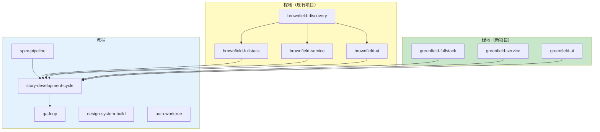
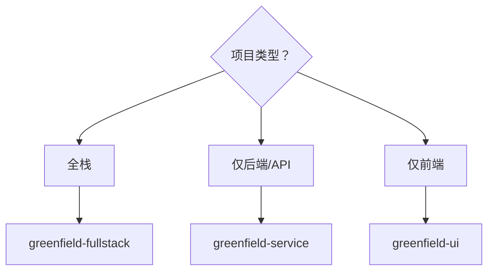
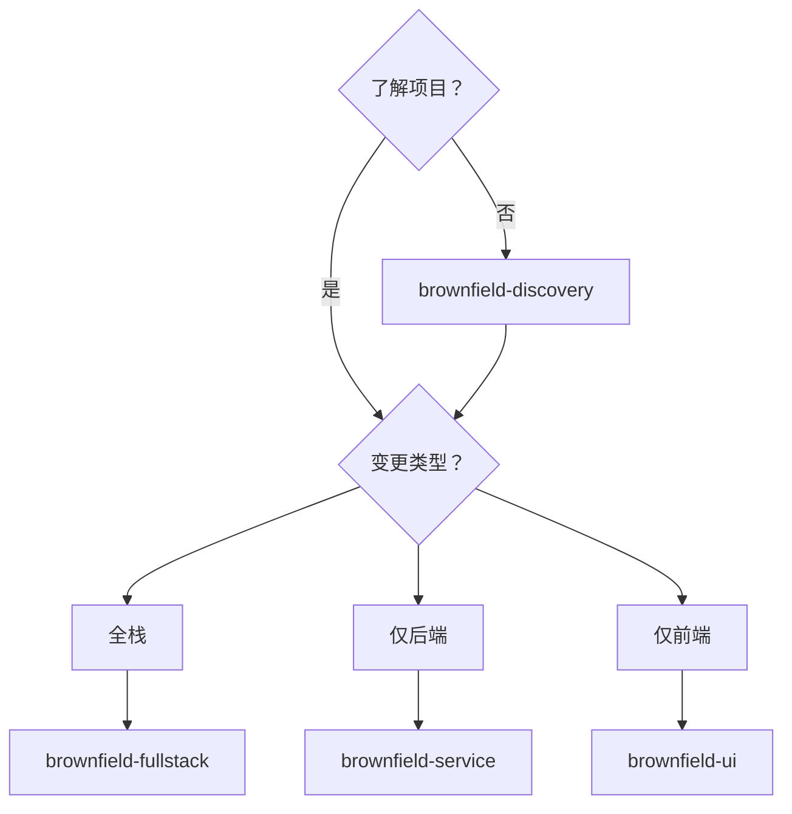

<!--
  Translation: ZH-CN (简体中文)
  Original: /docs/aios-workflows/README.md
  Last sync: 2026-02-24
-->

# AIOS 工作流 - 工作流详细文档

> 🌐 **ZH-CN** | [EN](../../en/aios-workflows/README.md) | [ES](../../es/aios-workflows/README.md) | [PT](../../aios-workflows/README.md)

---

**版本:** 1.0.0
**最后更新:** 2026-02-24
**状态:** 官方文档

---

## 概述

此文件夹包含 AIOS 所有工作流的详细文档，包括：

- 完整的 **Mermaid 图**（流程图、序列图、状态图）
- 带输入/输出的**详细步骤**
- **参与的代理**及其角色
- **决策点**和条件
- **前置条件**和配置
- **故障排除**和执行模式

---

## 已文档化的工作流

### 按项目类型

| 类型 | 工作流 | 描述 | 文档 |
| --- | --- | --- | --- |
| **绿地** | 全栈 | 从零开始的全栈应用 | [greenfield-fullstack-workflow.md](./greenfield-fullstack-workflow.md) |
| **绿地** | 服务 | 从零开始的后端/API | [greenfield-service-workflow.md](./greenfield-service-workflow.md) |
| **绿地** | UI | 从零开始的前端 | [greenfield-ui-workflow.md](./greenfield-ui-workflow.md) |
| **棕地** | 发现 | 现有项目分析 | [brownfield-discovery-workflow.md](./brownfield-discovery-workflow.md) |
| **棕地** | 全栈 | 现有全栈演进 | [brownfield-fullstack-workflow.md](./brownfield-fullstack-workflow.md) |
| **棕地** | 服务 | 现有后端演进 | [brownfield-service-workflow.md](./brownfield-service-workflow.md) |
| **棕地** | UI | 现有前端演进 | [brownfield-ui-workflow.md](./brownfield-ui-workflow.md) |

### 按流程

| 流程 | 工作流 | 描述 | 文档 |
| --- | --- | --- | --- |
| **开发** | Story 周期 | 完整的 Story 周期 | [story-development-cycle-workflow.md](./story-development-cycle-workflow.md) |
| **质量** | QA 循环 | 质量循环 | [qa-loop-workflow.md](./qa-loop-workflow.md) |
| **规范** | Spec 管道 | 规范管道 | [spec-pipeline-workflow.md](./spec-pipeline-workflow.md) |
| **设计** | 设计系统 | 设计系统构建 | [design-system-build-quality-workflow.md](./design-system-build-quality-workflow.md) |
| **Git** | 自动 Worktree | Worktree 自动管理 | [auto-worktree-workflow.md](./auto-worktree-workflow.md) |

---

## 每个文档的结构

每个工作流文档遵循此标准结构：

```
1. 概述
   - 工作流目的
   - 支持的项目类型
   - 何时使用/不使用

2. Mermaid 图
   - 主流程图
   - 状态图
   - 序列图

3. 详细步骤
   - ID、代理、动作
   - 输入和输出
   - 成功标准
   - 状态转换

4. 参与代理
   - 每个代理的角色
   - 相关命令

5. 执行的任务
   - 按阶段的任务映射
   - 任务文件

6. 前置条件
   - 所需配置
   - 前置文档
   - 集成工具

7. 输入和输出
   - 工作流输入
   - 产生的输出

8. 决策点
   - 分支条件
   - 阻塞标准

9. 执行模式
   - YOLO（自主）
   - 交互式（平衡）
   - 预检查（规划）

10. 故障排除
    - 常见问题
    - 日志和诊断

11. 更新日志
    - 版本历史
```

---

## 工作流地图



---

## 工作流选择指南

### 新项目？



### 现有项目？



---

## 工作流之间的流转

| 从 | 到 | 条件 |
| --- | --- | --- |
| `brownfield-discovery` | `brownfield-*` | 完成分析后 |
| `greenfield-*` | `story-development-cycle` | 每个 Story |
| `brownfield-*` | `story-development-cycle` | 每个 Story |
| `spec-pipeline` | `story-development-cycle` | 规范批准后 |
| `story-development-cycle` | `qa-loop` | QA 阶段 |

---

## 如何使用此文档

### 启动项目

1. 使用上面的**选择指南**选择工作流
2. 阅读所选工作流的**概述**
3. 检查**前置条件**
4. 按顺序跟随**步骤**

### 理解流程

1. 分析 **Mermaid 图**
2. 查看**参与代理**及其角色
3. 查阅**决策点**

### 调试问题

1. 转到**故障排除**部分
2. 检查**日志和诊断**
3. 查阅每个步骤的**成功标准**

---

## 与其他文档的关系

| 文档 | 位置 | 用途 |
| --- | --- | --- |
| 工作流指南 | [docs/guides/workflows-guide.md](../guides/workflows-guide.md) | 通用指南 |
| 代理流程 | [docs/aios-agent-flows/](../aios-agent-flows/) | 代理详情 |
| 代理参考 | [docs/agent-reference-guide.md](../agent-reference-guide.md) | 快速参考 |

---

## 贡献

添加或更新工作流文档：

1. 遵循上述标准结构
2. 包含完整的 Mermaid 图
3. 文档化所有输入/输出
4. 保持更新日志更新
5. 创建 EN、ES 和 ZH-CN 翻译

---

*AIOS 工作流文档 v1.0 - 开发工作流详细文档*
