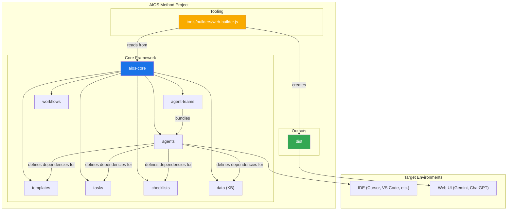
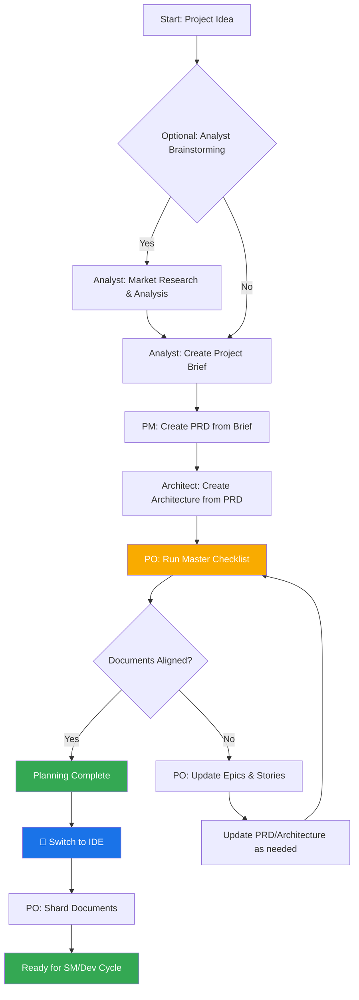
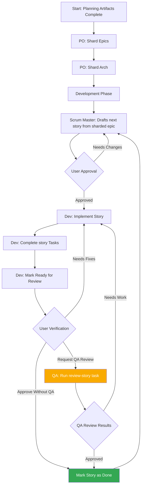

<!--
  Translation: ZH-CN (简体中文)
  Original: /docs/core-architecture.md
  Last sync: 2026-02-24
-->

# AIOS Method: 核心架构

> 🌐 **EN** | **PT** | **ES** | **ZH-CN**

---

## 1. 概述

AIOS Method 旨在提供代理模式、任务和模板，以实现可重复的有用工作流，无论是用于敏捷代理开发，还是扩展到完全不同的领域。该项目的核心目的是提供一套结构化但灵活的提示、模板和工作流，用户可以使用它们来指导 AI 代理（如 Gemini、Claude 或 ChatGPT）以可预测、高质量的方式执行复杂任务、引导讨论或其他有意义的特定领域流程。

系统核心模块促进了完整的开发生命周期，针对当前现代 AI 代理工具的挑战进行了定制：

1. **构思与规划**：头脑风暴、市场研究和创建项目简介。
2. **架构与设计**：定义系统架构和 UI/UX 规范。
3. **开发执行**：一个循环工作流，Scrum Master (SM) 代理起草具有极其具体上下文的 Story，Developer (Dev) 代理逐一实现它们。此过程适用于新项目（绿地）和现有项目（棕地）。

## 2. 系统架构图

整个 AIOS-Method 生态系统围绕安装的 `aios-core` 目录设计，它作为操作的大脑。`tools` 目录提供了在不同环境中处理和打包这个大脑的方法。

## 3. 核心组件

`aios-core` 目录包含赋予代理能力的所有定义和资源。

### 3.1. 代理 (`aios-core/agents/`)

- **目的**：这些是系统的基础构建块。每个 markdown 文件（如 `aios-master.md`、`pm.md`、`dev.md`）定义单个 AI 代理的角色、能力和依赖。
- **结构**：代理文件包含一个 YAML 头，指定其角色、角色设定、依赖和启动指令。这些依赖是代理允许使用的任务、模板、检查清单和数据文件列表。
- **启动指令**：代理可以包含从 `docs/` 文件夹加载项目特定文档的启动序列，如编码标准、API 规范或项目结构文档。这提供了激活时的即时项目上下文。
- **文档集成**：代理可以作为任务、工作流或启动序列的一部分引用和加载项目 `docs/` 文件夹中的文档。用户也可以将文档直接拖放到聊天界面以提供额外上下文。
- **示例**：`aios-master` 代理列出其依赖，这告诉构建工具在 Web 包中包含哪些文件，并通知代理其自身的能力。

### 3.2. 代理团队 (`aios-core/agent-teams/`)

- **目的**：团队文件（如 `team-all.yaml`）定义代理和工作流的集合，这些集合被打包在一起用于特定目的，如"全栈开发"或"仅后端"。这为 Web UI 环境创建了更大的预打包上下文。
- **结构**：团队文件列出要包含的代理。它可以使用通配符，如 `"*"` 来包含所有代理。这允许创建像 `team-all` 这样的综合包。

### 3.3. 工作流 (`aios-core/workflows/`)

- **目的**：工作流是 YAML 文件（如 `greenfield-fullstack.yaml`），定义特定项目类型的规定步骤序列和代理交互。它们作为用户和 `aios-orchestrator` 代理的战略指南。
- **结构**：工作流为复杂和简单项目定义序列，列出每个步骤涉及的代理、它们创建的产物以及从一个步骤移动到下一步的条件。它通常包含用于可视化的 Mermaid 图。

### 3.4. 可重用资源 (`templates`, `tasks`, `checklists`, `data`)

- **目的**：这些文件夹存放代理根据其依赖动态加载的模块化组件。
  - **`templates/`**：包含常见文档的 markdown 模板，如 PRD、架构规范和用户故事。
  - **`tasks/`**：定义执行特定可重复操作的指令，如 "shard-doc" 或 "create-next-story"。
  - **`checklists/`**：为 Product Owner (`po`) 或 Architect 等代理提供质量保证检查清单。
  - **`data/`**：包含核心知识库 (`aios-kb.md`)、技术偏好 (`technical-preferences.md`) 和其他关键数据文件。

#### 3.4.1. 模板处理系统

AIOS 的一个关键架构原则是模板是自包含和交互式的——它们同时嵌入所需的文档输出和处理用户交互所需的 LLM 指令。这意味着在许多情况下，文档创建不需要单独的任务，因为模板本身包含所有处理逻辑。

AIOS 框架采用由三个关键组件协调的复杂模板处理系统：

- **`template-format.md`** (`aios-core/utils/`)：定义所有 AIOS 模板中使用的基础标记语言。此规范建立变量替换（`{{placeholders}}`）、仅 AI 处理指令（`[[LLM: instructions]]`）和条件逻辑块的语法规则。模板遵循此格式以确保系统间的一致处理。

- **`create-doc.md`** (`aios-core/tasks/`)：作为管理整个文档生成工作流的编排引擎。此任务协调模板选择、管理用户交互模式（增量与快速生成）、强制执行模板格式处理规则并处理验证。它作为用户与模板系统之间的主要接口。

- **`advanced-elicitation.md`** (`aios-core/tasks/`)：提供可通过 `[[LLM: instructions]]` 块嵌入模板的交互式细化层。此组件提供 10 种结构化头脑风暴操作、逐节审查能力和迭代改进工作流以增强内容质量。

系统保持清晰的关注点分离：模板标记由 AI 代理内部处理但从不暴露给用户，同时通过模板本身嵌入的智能提供复杂的 AI 处理能力。

#### 3.4.2. 技术偏好系统

AIOS 通过 `aios-core/data/` 中的 `technical-preferences.md` 文件包含个性化层。此文件作为持久技术配置文件，影响所有项目中代理的行为。

**目的和好处：**

- **一致性**：确保所有代理引用相同的技术偏好
- **效率**：消除重复指定偏好技术的需要
- **个性化**：代理提供与用户偏好一致的建议
- **学习**：捕获随时间演进的教训和偏好

**内容结构：**
该文件通常包括偏好技术栈、设计模式、外部服务、编码标准和要避免的反模式。代理在规划和开发期间自动引用此文件，以提供上下文适当的建议。

**集成点：**

- 模板可以在文档生成期间引用技术偏好
- 代理在适合项目需求时建议偏好技术
- 当偏好不适合项目需求时，代理解释替代方案
- Web 包可以包含偏好内容以实现跨平台一致行为

**随时间演进：**
鼓励用户用项目发现持续更新此文件，添加正面偏好和要避免的技术，创建随时间改进代理建议的个性化知识库。

## 4. 构建与交付过程

框架为两种主要环境设计：本地 IDE 和基于 Web 的 AI 聊天界面。`web-builder.js` 脚本是支持后者的关键。

### 4.1. Web Builder (`tools/builders/web-builder.js`)

- **目的**：此 Node.js 脚本负责创建 `dist` 中的 `.txt` 包。
- **过程**：
  1. **解析依赖**：对于给定的代理或团队，脚本读取其定义文件。
  2. 它递归查找代理/团队需要的所有依赖资源（任务、模板等）。
  3. **打包内容**：它读取所有这些文件的内容并将它们连接成单个大文本文件，带有清晰的分隔符指示每个部分的原始文件路径。
  4. **输出包**：最终 `.txt` 文件保存在 `dist` 目录中，准备好上传到 Web UI。

### 4.2. 环境特定使用

- **对于 IDE**：用户通过 `aios-core/agents/` 中的 markdown 文件直接与代理交互。IDE 集成（对于 Cursor、Claude Code 等）知道如何调用这些代理。
- **对于 Web UI**：用户从 `dist` 上传预构建的包。此单个文件为 AI 提供整个团队及其所有所需工具和知识的上下文。

## 5. AIOS 工作流

### 5.1. 规划工作流

在开发开始之前，AIOS 遵循结构化规划工作流，为成功项目执行建立基础：

**关键规划阶段：**

1. **可选分析**：分析师进行市场研究和竞品分析
2. **项目简介**：由分析师或用户创建的基础文档
3. **PRD 创建**：PM 将简介转化为全面的产品需求
4. **架构设计**：架构师基于 PRD 创建技术基础
5. **验证与对齐**：PO 确保所有文档一致且完整
6. **细化**：根据需要更新 Epic、Story 和文档
7. **环境转换**：从 Web UI 到 IDE 进行开发工作流的关键切换
8. **文档准备**：PO 将大型文档分片供开发使用

**工作流编排**：`aios-orchestrator` 代理使用这些工作流定义指导用户完成完整过程，确保规划（Web UI）和开发（IDE）阶段之间的正确转换。

### 5.2. 核心开发周期

一旦初始规划和架构阶段完成，项目进入循环开发工作流，如 `aios-kb.md` 中详述。这确保稳定、顺序和质量控制的实现过程。

此循环继续，Scrum Master、Developer 和可选的 QA 代理协同工作。QA 代理通过 `review-story` 任务提供高级开发者审查能力，提供代码重构、质量改进和知识转移。这确保高代码质量同时保持开发速度。
